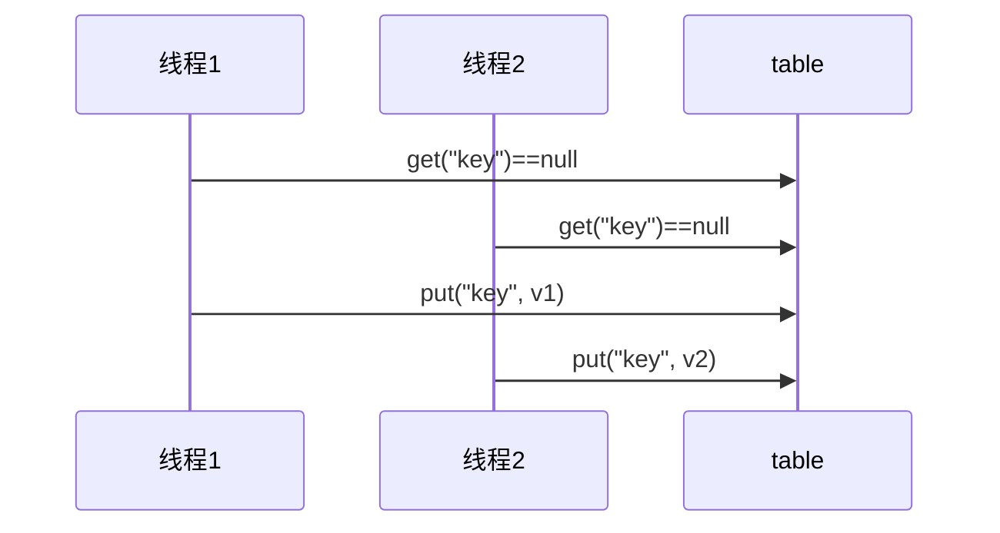
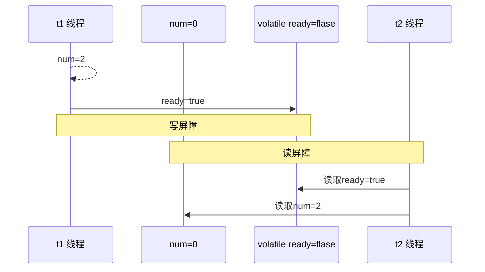
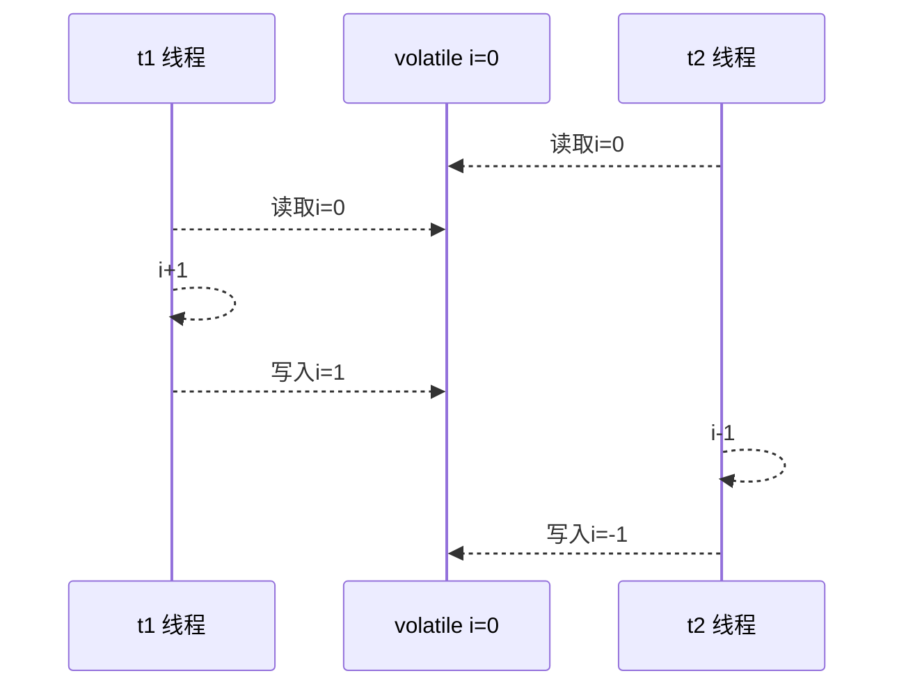
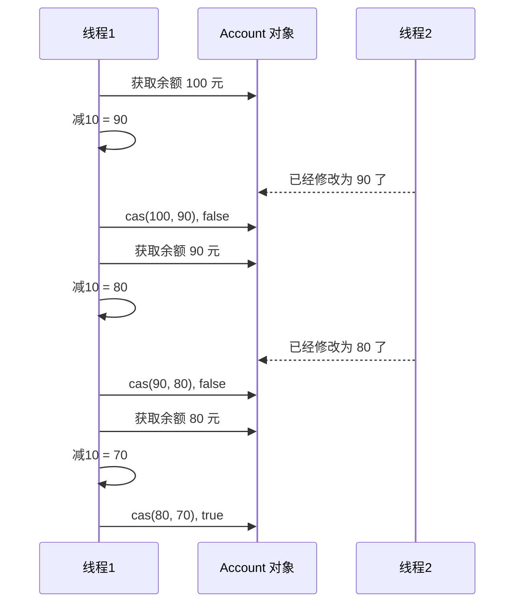

# 并发控制

## Java线程

### 创建和运行线程

#### 方法一，直接使用 Thread

```java
// 构造方法的参数是给线程指定名字，推荐给线程起个名字（也可以不含参数）
Thread t1 = new Thread("t1") {
 	@Override
 	// run 方法内实现了要执行的任务
 	public void run() {
 		System.out.println("hello thread");
 	}
};
// 启动线程
t1.start();
```

#### 方法二，使用 Runnable 配合 Thread

把【线程】和【任务】（要执行的代码）分开，Thread 代表线程，Runnable 可运行的任务（线程要执行的代码）Test2.java

```java
// 创建任务对象
Runnable task2 = new Runnable() {
 	@Override
 	public void run() {
 		System.out.println("hello thread");
 	}
};
// 参数1 是任务对象
// 参数2 是线程名字，推荐给线程起个名字（可选）
Thread t2 = new Thread(task2, "t2");
// 启动线程
t2.start();
```

**小结：**

方法1 是把线程和任务合并在了一起，方法2 是把线程和任务分开了，用 Runnable 更容易与线程池等高级 API 配合，用 Runnable 让任务类脱离了 Thread 继承体系，更灵活。

通过查看源码可以发现，方法二其实到底还是通过方法一执行的！

####  方法三，FutureTask 配合 Thread

FutureTask 能够接收 Callable 类型的参数，用来处理有返回结果的情况 t1

```java
public static void main(String[] args) throws InterruptedException, ExecutionException {
    FutureTask<Integer> task = new FutureTask<>(new Callable<Integer>() {
        @Override
        public Integer call() throws Exception {
            System.out.println("running");
            Thread.sleep(1000);
            return 100;
        }
    });
    Thread t1 = new Thread(task, "t1");
    t1.start();
    System.out.println(task.get());
}
```

Future就是对于具体的Runnable或者Callable任务的执行结果进行取消、查询是否完成、获取结果。必要时可以通过get方法获取执行结果，该方法会阻塞直到任务返回结果。

Future提供了三种功能： 　　

1. 判断任务是否完成； 　　
2. 能够中断任务； 　　
3. 能够获取任务执行结果。

### 线程运行原理

栈帧、多线程、上下文切换

### Thread的常见方法


#### start vs run

直接调用 `run()` 是在主线程中执行了 `run()`，没有启动新的线程；

使用 `start()` 是启动新的线程，通过新的线程间接执行 `run()`方法 中的代码。

#### sleep vs yield

##### sleep

1. 调用 sleep 会让当前线程从 Running 进入 Timed Waiting 状态（有时限的等待）
2. 其它线程可以使用 interrupt 方法打断正在睡眠的线程，那么被打断的线程这时就会抛出 `InterruptedException`异常【注意：这里打断的是正在休眠的线程，而不是其它状态的线程】
3. 睡眠结束后的线程未必会立刻得到执行（需要分配到cpu时间片）
4. 建议用 TimeUnit 的 `sleep()` 代替 Thread 的 `sleep()`来获得更好的可读性

##### yield

1. 调用 yield 会让当前线程从 Running 进入 Runnable 就绪状态，然后调度执行其它线程
2. 具体的实现依赖于操作系统的任务调度器（可能没有其它的线程正在执行，虽然调用了yield方法，但是也没有用）

##### 线程优先级

线程优先级会提示（hint）调度器优先调度该线程，但它仅仅是一个提示，调度器可以忽略它。如果 cpu 比较忙，那么优先级高的线程会获得更多的时间片，但 cpu 闲时，优先级几乎没作用

#### join

等待某个线程运行结束

代码如下：

```java
public class Main {
    static int r = 0;
    public static void main(String[] args) throws InterruptedException {
        test1();
    }
    private static void test1() throws InterruptedException {
        System.out.println("test1 开始");
        Thread t1 = new Thread(() -> {
            System.out.println("t1 开始");
            try {
                Thread.sleep(1000);
            }
            catch (InterruptedException e) {
                e.printStackTrace();
            }
            System.out.println("t1 结束");
            r = 10;
        }, "t1");
        t1.start();
        t1.join();	// 等待t1线程结束
        System.out.println("r=" + r);
        System.out.println("test1 结束");
    }
}
```

在主线程中调用`t1.join()`，则主线程会等待 t1 线程执行完之后再继续执行 test1


#### interrupt方法详解

##### 打断阻塞的线程（sleep、wait、join）

打断阻塞的线程，会清空打断状态（重置为false），以 sleep 为例

```java
private static void test1() throws InterruptedException {
    Thread t1 = new Thread(() -> {
        try {
            Thread.sleep(1000);	// wait, join
        }
        catch (InterruptedException e) {
            e.printStackTrace();
        }
    }, "t1");
    t1.start();
    t1.join(500);
    t1.interrupt();
    System.out.println("打断状态: " + t1.isInterrupted());
}
```

输出为

```java
打断状态: false
java.lang.InterruptedException: sleep interrupted
	at java.lang.Thread.sleep(Native Method)
	at Main.lambda$test1$0(Main.java:16)
	at java.lang.Thread.run(Thread.java:748)
```

##### 打断正常运行的线程

打断正常运行的线程, 线程并不会暂停，只是调用方法`Thread.currentThread().isInterrupted()`的返回值为true，可以通过判断`Thread.currentThread().isInterrupted()`的值来手动停止线程

```java
public static void main(String[] args) throws InterruptedException {
    Thread t1 = new Thread(() -> {
        while (true) {
            boolean interrupt = Thread.currentThread().isInterrupted();
            if (interrupt) {
                System.out.println("被打断了");
                break;
            }
        }
    }, "t1");
    t1.start();
    Thread.sleep(1000);
    System.out.println("interrupt");
    t1.interrupt();
}
```

##### 两阶段终止模式

Two Phase Termination，就是考虑在一个线程T1中如何优雅地终止另一个线程T2。这里的优雅指的是给T2一个料理后事的机会（如释放锁）。（`stop()`和`System.exit(int)`方法都不适用，过于暴力）

如下所示：那么线程的`isInterrupted()`方法可以取得线程的打断标记，如果线程在睡眠`sleep`期间被打断，打断标记是不会变的，为false，但是`sleep`期间被打断会抛出异常，我们据此手动设置打断标记为`true`；如果是在程序正常运行期间被打断的，那么打断标记就被自动设置为`true`。处理好这两种情况那我们就可以放心地来料理后事啦！


代码如下：

```java
private static void test1() throws InterruptedException {
    Thread t1 = new Thread(() -> {
        while (true) {
            Thread current = Thread.currentThread();
            if (current.isInterrupted()) {
                System.out.println("被打断");
                break;
            }
            try {
                Thread.sleep(1000);
            }
            catch (InterruptedException e) {
                e.printStackTrace();
                current.interrupt(); // 由于打断阻塞的线程，会清空打断状态，所以要重新设置
            }
        }
    }, "t1");
    t1.start();
    t1.join(500);
    t1.interrupt();
}
```

### 守护线程

默认情况下，java进程需要等待所有的线程结束后才会停止，但是有一种特殊的线程，叫做守护线程。在其他线程全部结束的时候，即使守护线程还未结束、代码未执行完，java进程也会停止。普通线程t1可以调用`t1.setDeamon(true)`方法变成守护线程

> 注意 垃圾回收器线程就是一种守护线程 
>
> Tomcat 中的 Acceptor 和 Poller 线程都是守护线程，所以 Tomcat 接收到 shutdown 命令后，不会等待它们处理完当前请求

## 共享模型

### 共享带来的问题

#### 问题分析

线程出现问题的根本原因是因为线程上下文切换，导致线程里的指令没有执行完就切换执行其它线程了，下面举一个例子

```Java
public class Main {
    static int count = 0;
    public static void main(String[] args) throws InterruptedException, ExecutionException {
        Thread t1 = new Thread(() -> {
            for (int i = 0; i < 50000; i++) {
                count++;
            }
        }, "t1");
        Thread t2 = new Thread(() -> {
            for (int i = 0; i < 50000; i++) {
                count--;
            }
        }, "t2");
        t1.start();
        t2.start();
        t1.join();
        t2.join();
        System.out.println(count);
    }
}
```

以上的结果可能是整数、负数、零。因为Java中对静态变量的自增、自减并不是原子操作，从字节码层面分析：

对静态变量`i`来说，`i++`和`i--`产生的字节码如下

```java
getstatic i 	// 获取静态变量i的值
iconst_1 		// 准备常量1
iadd 			// 自增
putstatic i 	// 将修改后的值存入静态变量i
    
getstatic i 	// 获取静态变量i的值
iconst_1 		// 准备常量1
isub 			// 自减
putstatic i 	// 将修改后的值存入静态变量i
```

#### 临界区

+ 一个程序运行多线程本身是没有问题的

+ 问题出现在多个线程共享资源的时候

  + 多个线程同时对共享资源进行读操作本身也没有问题
  + 问题出现在对对共享资源同时进行读写操作时就有问题了

+ 先定义一个叫做临界区的概念：一段代码内如果存在对共享资源的多线程读写操作，那么称这段代码为临界区，如下

```Java
static int counter = 0;
static void increment(){
    // 临界区
	counter++;
}
static void decrement(){
    // 临界区
	counter--;
}
```

#### 竞态条件

多个线程在临界区执行，那么由于代码的执行序列不同而导致结果无法预测，称为发生了**竞态条件**。

### synchronized解决方案

为了避免临界区中的竞态条件发生，由多种手段可以达到

- 阻塞式解决方案：synchronized ，Lock
- 非阻塞式解决方案：原子变量

现在讨论使用synchronized来进行解决，即俗称的**对象锁**，它采用互斥的方式让同一时刻至多只有一个线程持有对象锁，其他线程如果想获取这个锁就会阻塞住，这样就能保证拥有锁的线程可以安全的执行临界区内的代码，不用担心线程上下文切换

> 注意
>
> 虽然 java 中互斥和同步都可以采用 synchronized 关键字来完成，但它们还是有区别的： 
>
> + 互斥是保证临界区的竞态条件发生，同一时刻只能有一个线程执行临界区的代码
> + 同步是由于线程执行的先后、顺序不同、需要一个线程等待其它线程运行到某个点

#### synchronized

语法

```java
synchronized(/*对象*/) {
    // 临界区
}
```

解决

```Java
public class Main {
    static int count = 0;
    static final Object lock = new Object();
    public static void main(String[] args) throws InterruptedException, ExecutionException {
        Thread t1 = new Thread(() -> {
            for (int i = 0; i < 50000; i++) {
                synchronized (lock) {
                    count++;
                }
            }
        }, "t1");
        Thread t2 = new Thread(() -> {
            for (int i = 0; i < 50000; i++) {
                synchronized (lock) {
                    count--;
                }
            }
        }, "t2");
        t1.start();
        t2.start();
        t1.join();
        t2.join();
        System.out.println(count);
    }
}
```

#### synchronized原理

synchronized实际上利用对象保证了临界区代码的原子性，临界区内的代码在外界看来是不可分割的，不会被线程切换所打断


### 变量的线程安全分析

####  成员变量和静态变量

- 如果没有变量没有在线程间共享，那么变量是安全的
- 如果变量在线程间共享
  - 如果只有读操作，则线程安全
  - 如果有读写操作，则这段代码是临界区，需要考虑线程安全

#### 局部变量

- 局部变量【局部变量被初始化为基本数据类型】是安全的（作用于栈帧中，线程私有）
- 局部变量引用的对象未必是安全的
  - 如果局部变量引用的对象没有引用线程共享的对象，那么是线程安全的
  - 如果局部变量引用的对象引用了一个线程共享的对象，那么要考虑线程安全的

考虑下面代码：

```java
public class Test {
    public static void main(String[] args) {
        UnsafeTest unsafeTest = new UnsafeTest();
        for (int i =0;i<100;i++){
            new Thread(()->{
                unsafeTest.method1();
            },"线程"+i).start();
        }
    }
}
class UnsafeTest{
    ArrayList<String> arrayList = new ArrayList<>();
    public void method1(){
        for (int i = 0; i < 100; i++) {
            method2();
            method3();
        }
    }
    private void method2() {
        arrayList.add("1");
    }
    private void method3() {
        arrayList.remove(0);
    }
}
```

**分析：**

无论哪个线程中的 method2 和method3 引用的都是同一个对象中的 list 成员变量：一个 ArrayList ，在添加一个元素的时候，它可能会有两步来完成：

1. 第一步，在 arrayList[Size] 的位置存放此元素； 第二步增大 Size 的值。
2. 在单线程运行的情况下，如果 Size = 0，添加一个元素后，此元素在位置 0，而且 Size=1；而如果是在多线程情下，比如有两个线程，线程 A 先将元素存放在位置 0。但是此时 CPU 调线程A暂停，线程 B 得到运行的机会。线程B也向此 ArrayList 添加元素，因为此时 Size 仍等于 0 （注意哦，我们假设的是添加一个元素是要两个步骤哦，而线程A仅仅完成了步骤1），所以线程B也将元素存放在位置0。然后线程A和线程B都继续运行，都增加 Size 的值。 那好，现在我们来看看 ArrayList 的情况，元素实际上只有一个，存放在位置 0，而 Size 却等于 2。这就是“线程不安全”了。

**解决方法：**

可以将list修改成局部变量，那么就不会有上述问题了。

```Java
class safeTest{
    public void method1(){
        ArrayList<String> arrayList = new ArrayList<>();
        for (int i = 0; i < 100; i++) {
        	method2(arrayList);
        	method3(arrayList);
        }
    }
    private void method2(ArrayList arrayList) {
        arrayList.add("1");
    }
    private void method3(ArrayList arrayList) {
        arrayList.remove(0);
    }
}
```

### 常见的线程安全类

1. String
2. Integer
3. StringBuffer
4. Random
5. Vector
6. HashTable
7. java.util.concurrent 包下的类

这里说它们是线程安全的是指，多个线程调用它们同一个实例的某个方法时，是线程安全的。也可以理解为它们的每个方法是原子的。

```Java
Hashtable table = new Hashtable();
new Thread(()->{
 	table.put("key", "value1");
}).start();
new Thread(()->{
 	table.put("key", "value2");
}).start();
```

#### 线程安全类的方法组合

但注意它们多个方法的组合不是原子的，见下面分析

```java
Hashtable table = new Hashtable();
// 线程1，线程2
if( table.get("key") == null) {
 	table.put("key", value);
}
```



#### 不可变类的线程安全

`String`和`Integer`等类都是不可变的类，因为其类内部状态是不可改变的，因此它们的方法都是线程安全的。

### Monitor

#### 对象头

以 32 位虚拟机为例，普通对象的对象头结构如下，其中的Klass Word为指针，指向对应的Class对象；


数组对象：


其中 Mark Word 结构为


所以一个对象的结构如下：


#### Monitor原理

Monitor被翻译为监视器或者管程

每个java对象都可以关联一个Monitor，如果使用`synchronized`给对象上锁（重量级），该对象头的Mark Word中就被设置为指向Monitor对象的指针


- 刚开始时Monitor中的Owner为null
- 当Thread-2 执行synchronized(obj)就会将Monitor的所有者 Owner 设置为 Thread-2，上锁成功，Monitor中同一时刻只能有一个Owner
- 当Thread-2 占据锁时，如果线程Thread-3，Thread-4也来执行synchronized(obj)，就会进入 EntryList 中变成`BLOCKED`状态
- Thread-2 执行完同步代码块的内容，然后唤醒 EntryList 中等待的线程来竞争锁，竞争时是非公平的
- 图中 WaitSet 中的 Thread-0，Thread-1 是之前获得过锁，但条件不满足进入 WAITING 状态的线程，后面讲wait-notify 时会分析

> 注意：
>
> + synchronized 必须是进入同一个对象的 monitor 才有上述的效果
> + 不加 synchronized 的对象不会关联monitor，不遵从以上规则

####  synchronized原理

分析如下代码

```java
static final Object lock=new Object();
static int counter = 0;
public static void main(String[] args) {
    synchronized (lock) {
        counter++;
    }
}
```

反编译后的部分字节码如下

```java
 0 getstatic #2  	// 取得 lock 引用（synchronized开始了）
 3 dup    			// 复制操作数栈栈顶的值放入栈顶，即复制了一份 lock 的引用
 4 astore_1			// 操作数栈栈顶的值弹出，即将 lock 的引用存到局部变量表中 slot1
 5 monitorenter 	// 将 lock 对象的 MarkWord 置为指向 Monitor 指针
 6 getstatic #3 
 9 iconst_1
10 iadd
11 putstatic #3 
14 aload_1 			// 从局部变量表中取得 lock 的引用，放入操作数栈栈顶
15 monitorexit 		// 将 lock 对象的 MarkWord 重置，唤醒 EntryList
16 goto 24
// 下面是异常处理指令，可以看到，如果出现异常，也能自动地释放锁
19 astore_2			// e -> slot 2
20 aload_1			// <- lock引用
21 monitorexit		// 将 lock 对象的 MarkWord 重置，唤醒 EntryList
22 aload_2			// <- slot 2 (e)
23 athrow			// throw e
24 return
```

#### synchronized原理进阶

##### 轻量级锁

轻量级锁的使用场景是：如果一个对象虽然有多个线程要对它进行加锁，但是加锁的时间是错开的（也就是没有人可以竞争的），那么可以使用轻量级锁来进行优化。

轻量级锁对使用者是透明的，即语法仍然是`synchronized`

假设有两个方法同步块，利用同一个对象加锁

```Java
static final Object obj = new Object();
public static void method1() {
     synchronized( obj ) {
         // 同步块 A
         method2();
     }
}
public static void method2() {
     synchronized( obj ) {
         // 同步块 B
     }
}
```

1. 每次指向到synchronized代码块时，都会创建锁记录（Lock Record）对象，每个线程都会包括一个锁记录的结构，锁记录内部可以储存对象的Mark Word和对象引用 reference

   

2. 让锁记录中的Object reference指向对象，并且尝试用cas(compare and swap)替换Object对象的Mark Word ，将Mark Word 的值存入锁记录中

   

3. 如果cas替换成功（即对象头原本状态是01），那么对象的对象头的Mark Word储存的就是锁记录的地址和状态00，如下所示

   

4. 如果cas失败，有两种情况：

   + 如果是其它线程已经持有了该Object的轻量级锁，那么表示有竞争，将进入锁膨胀阶段
   + 如果是自己的线程已经执行了synchronized进行加锁，那么再添加一条 Lock Record 作为重入的计数，新添加的锁记录地址字段值置为 null

   

5. 当线程退出synchronized代码块的时候，**如果获取的是取值为 null 的锁记录 **，表示有重入，这时重置锁记录，表示重入计数减一（lock record的数量）

   

6. 当线程退出synchronized代码块的时候，如果获取的锁记录取值不为 null，那么使用cas将Mark Word的值恢复给对象

   + 成功则解锁成功
   + 失败，则说明轻量级锁进行了锁膨胀或已经升级为重量级锁，进入重量级锁解锁流程

##### 锁膨胀

如果在尝试加轻量级锁的过程中，cas操作无法成功，有一种情况就是其它线程已经为这个对象加上了轻量级锁，这时就要进行锁膨胀，将轻量级锁变成重量级锁。

1. 当 Thread-1 进行轻量级加锁时，Thread-0 已经对该对象加了轻量级锁（状态为00）

   

2. 这时 Thread-1 加轻量级锁失败，进入锁膨胀流程

   + 为对象申请 Monitor 锁，让 Object 指向重量级锁（Monitor）地址
   + 然后自己进入Monitor 的 EntryList 变成 BLOCKED 状态（轻量级锁没有阻塞这一说法）

   

3. 当Thread-0 退出synchronized同步块时，使用cas将Mark Word的值恢复给对象头，失败。这时会进入重量级锁的解锁过程，即按照Monitor的地址找到Monitor对象，将Owner设置为null，唤醒 EntryList 中的 Thread-1 线程

##### 自旋优化

重量级锁竞争的时候，还可以使用自旋来进行优化（适用于多核cpu），如果当前线程自旋成功（即在自旋的时候持锁的线程已经退出了同步块，释放了锁），那么当前线程就可以避免阻塞，不用进行上下文切换就获得了锁。

1. 自旋重试成功的情况

   

2. 自旋重试失败的情况，自旋了一定次数还是没有等到持锁的线程释放锁，就会进入阻塞

   

+ 自旋会占用 CPU 时间，单核 CPU 自旋就是浪费，多核 CPU 自旋才能发挥优势。
+ 在 Java 6 之后自旋锁是自适应的，比如对象刚刚的一次自旋操作成功过，那么认为这次自旋成功的可能性会高，就多自旋几次；反之，就少自旋甚至不自旋，总之，比较智能。
+ Java 7 之后不能控制是否开启自旋功能。

##### 偏向锁

轻量级锁在没有竞争时（就自己这个线程），每次重入仍需要执行CAS操作。

Java 6 中引入了偏向锁来做进一步优化：只有第一次使用CAS将线程ID设置到对象的Mask Word头，**之后这个入锁线程再进行重入锁时，发现这个线程ID是自己的就表示没有竞争，不用重新CAS**。以后只要不发生竞争，这个对象就归该线程所有。

例如：

```java
static final Object obj = new Object();
public static void m1() {
    synchronized(obj) {
        // 同步块 A
        m2();
    }
}
public static void m2() {
    synchronized(obj) {
        // 同步块 B
        m3();
    }
}
public static void m3() {
    synchronized(obj) {
        // 同步块 C
    }
}
```


###### 偏向状态


一个对象创建时：

+ 如果开启了偏向锁（默认是开启的），那么对象创建后，Mark Word 最后三位的值 101，并且这时它的Thread，epoch，age都是0，在加锁的时候进行设置这些的值。可以加 VM 参数来禁用偏向锁：`-XX:-UseBiasedLocking`
+ 偏向锁默认是延迟的，不会在程序启动时立刻生效，如果想避免延迟，可以加 VM 参数来禁用延迟：`-XX:BiasedLockingStartupDelay=0`来禁用延迟。
+ 如果没有开启偏向锁，那么对象创建后，Mark Word 最后三位的值 001，这时它的 hashcode，age 都是 0，第一次用到 hashcode 时才会赋值。
+ 注意：处于偏向锁的对象解锁后，线程 id 仍存储于对象头中。

######  撤销偏向锁 - hashcode方法

当调用对象的 hashcode 方法的时候就会撤销这个对象的偏向锁，因为使用偏向锁时没有位置存`hashcode`的值了

######  撤销偏向锁 - 其它线程使用对象

其他线程使用对象时，会导致偏向锁撤销变成轻量级锁。但注意，没有线程对同一个对象进行锁竞争（否则会变成重量级锁），也就是说不同线程使用对象的时间是错开的。

###### 撤销偏向锁 - 调用 wait/notify

会使对象的锁变成重量级锁，因为wait/notify方法只有重量级锁才支持

###### 批量重偏向

如果对象虽然被多个线程访问，但是没有竞争，这时偏向了线程T1的对象仍有机会重新偏向T2，重偏向会重置对象的 ThreadID。

当撤销偏向锁次数超过阈值（默认撤销20个对象偏向锁）后，jvm会这样觉得，我是不是偏向错了呢，于是会在给这些对象加锁时重新偏向至加锁线程。

###### 批量撤销

当撤销偏向锁次数超过阈值（默认40次）后，jvm会这样觉得，自己确实偏向错了，根本就不该偏向。于是整个类的所有对象都会变为不可偏向的，新建的对象也是不可偏向的。

##### 锁消除

若在代码中把锁加在了本来就是线程安全的代码块中，那么`JIT(即时编译器)`就会进行优化，撤销这个影响效率的锁

分析下面代码

```java
public class Test {
    static int x = 0;
    public void method1() throws Exception {
        x++;
    }
    public void method2() throws Exception {
        Object obj = new Object();
        synchronized(obj) {
            x++;
        }
    }
}
```

那么`method2`方法中的锁就会被优化消除掉。

### wait & notify

#### 原理


+ Owner 线程发现条件不满足，调用 wait 方法，即可进入 WaitSet 中变为 WAITING 状态
+ BLOCKED 和 WAITING 的线程都处于阻塞状态，不占用 CPU 时间片
+ BLOCKED 线程会在 Owner 线程释放锁时唤醒
+ WAITING 线程会在 Owner 线程调用 notify 或 notifyAll 时唤醒，但唤醒后并不意味着立刻获得锁，仍需进入 EntryList 重新竞争

#### API介绍

详见官方文档：

[https://docs.oracle.com/javase/8/docs/api/](https://docs.oracle.com/javase/8/docs/api/)

`obj.wait()`、`obj.notify()`、`obj.notifyAll()`

他们都是线程间进行协作的手段，都属于 `Object` 对象的方法。**必须获得此对象的锁**，才能调用这几个方法。

#### wait vs sleep

1. sleep 是 Thread 方法，而 wait 是 Object 的方法；
2. sleep 不需要强制和 synchronized 配合使用，但 wait 需要和 synchronized 一起用；
3. sleep 在睡眠的同时，不会释放对象锁，但 wait 在等待的时候会释放对象锁。
4. 状态都是 TIMED_WAITING

```java
synchronized(lock) {
    while(条件不成立) {
        lock.wait();
    }
    // 干活
}

// 另一个线程
synchronized(lock) {
    lock.notifyAll(); // 唤醒所有wait的线程，让他们进入EntryList中去竞争锁
}
```

#### 同步模式之保护性暂停

即 Guarded Suspension，用在一个线程等待另一个线程的执行结果，要点：

1. 有一个结果需要从一个线程传递到另一个线程，让他们关联同一个 GuardedObject
2. 如果有结果不断从一个线程到另一个线程那么可以使用消息队列（见生产者/消费者）
3. JDK 中，join 的实现、Future 的实现，采用的就是此模式
4. 因为要等待另一方的结果，因此归类到同步模式


#### 异步模式之生产者/消费者

要点

1. 与前面的保护性暂停中的 GuardObject 不同，不需要产生结果和消费结果的线程一一对应
2. 消费队列可以用来平衡生产和消费的线程资源
3. 生产者仅负责产生结果数据，不关心数据该如何处理，而消费者专心处理结果数据
4. 消息队列是有容量限制的，满时不会再加入数据，空时不会再消耗数据
5. JDK 中各种阻塞队列，采用的就是这种模式

“异步”的意思就是生产者产生消息之后消息没有被立刻消费，而“同步模式”中，消息在产生之后被立刻消费了。


### park & unpark

#### 基本使用

它们是 LockSupport 类中的方法

```Java
// 暂停当前线程
LockSupport.park();
// 恢复某个线程的运行
LockSupport.unpark(暂停的线程对象);
```

#### 特点

与 Object 的 wait & notify 相比

+ wait，notify 和 notifyAll 必须配合 Object Monitor 一起使用，而 park & unpark 不必
+ park & unpark 是以线程为单位来【阻塞】和【唤醒】线程，而 notify 只能随机唤醒一个等待线程，notifyAll 是唤醒所有等待线程，就不那么【精确】
+ park & unpark 可以先 unpark，而 wait & notify 不能先 notify
+ park & unpark 的设计原理核心是**许可**：park 是等待一个许可，unpark 是为某线程提供一个许可。

#### 原理

每个线程都有自己的一个 Parker 对象，由三部分组成 \_counter， \_cond 和 \_mutex，打个比喻：

1. 线程就像一个旅人，Parker 就像他随身携带的背包，条件变量 \_cond 就好比背包中的帐篷。\_counter 就好比背包中的备用干粮（0 为耗尽，1 为充足）
2. 调用 park 就是要看需不需要停下来歇息
   + 如果备用干粮耗尽，那么钻进帐篷歇息

   + 如果备用干粮充足，那么不需停留，继续前进
3. 调用 unpark，就好比令干粮充足
   + 如果这时线程还在帐篷，就唤醒让他继续前进

   + 如果这时线程还在运行，那么下次他调用 park 时，仅是消耗掉备用干粮，不需停留继续前进
     + 因为背包空间有限，多次调用 unpark 仅会补充一份备用干粮

##### 先调用 park

1. 当前线程调用 Unsafe.park() 方法
2. 检查 \_counter ，本情况为 0，这时，获得 \_mutex 互斥锁（\_mutex 对象有个等待队列 \_cond）
3. 线程进入 \_cond 条件变量阻塞
4. 设置 \_counter = 0


1. 调用 Unsafe.unpark(Thread-0) 方法，设置 \_counter 为 1
2. 唤醒 \_cond 条件变量中的 Thread-0
3. Thread-0 恢复运行
4. 设置 \_counter 为 0


##### 先调用 unpark

1. 调用 Unsafe.unpark(Thread-0) 方法，设置 \_counter 为 1
2. 当前线程调用 Unsafe.park() 方法
3. 检查 \_counter ，本情况为 1，这时线程无需阻塞，继续运行
4. 设置 \_counter 为 0


### 线程状态转换


1. **RUNNABLE <--> WAITING**

   线程用synchronized(obj)获取了对象锁后

   1. 调用obj.wait()方法时，t 线程从RUNNABLE --> WAITING
   2. 调用obj.notify()，obj.notifyAll()，t.interrupt()时
      1. 竞争锁成功，t 线程从WAITING --> RUNNABLE
      2. 竞争锁失败，t 线程从WAITING --> BLOCKED

2. **RUNNABLE <--> WAITING**

   1. 当前线程调用 LockSupport.park() 方法会让当前线程从 RUNNABLE --> WAITING
   2. 调用 LockSupport.unpark(目标线程) 或调用了线程 的 interrupt() ，会让目标线程从 WAITING --> RUNNABLE

3. **RUNNABLE <--> WAITING**

   1. 当前线程调用 t.join() 方法时，当前线程从 RUNNABLE --> WAITING 注意是当前线程在t 线程对象的监视器上等待
   2. t 线程运行结束，或调用了当前线程的 interrupt() 时，当前线程从 WAITING --> RUNNABLE

4. **RUNNABLE <--> TIMED_WAITING**

   t 线程用 synchronized(obj) 获取了对象锁后

   1. 调用 obj.wait(long n) 方法时，t 线程从 RUNNABLE --> TIMED_WAITING
   2. t 线程等待时间超过了 n 毫秒，或调用 obj.notify() ， obj.notifyAll() ， t.interrupt() 时
      1. 竞争锁成功，t 线程从 TIMED_WAITING --> RUNNABLE
      2. 竞争锁失败，t 线程从 TIMED_WAITING --> BLOCKED

5. **RUNNABLE <--> TIMED_WAITING**

   1. 当前线程调用 t.join(long n) 方法时，当前线程从 RUNNABLE --> TIMED_WAITING 注意是当前线程在t 线程对象的监视器上等待
   2. 当前线程等待时间超过了 n 毫秒，或t 线程运行结束，或调用了当前线程的 interrupt() 时，当前线程从 TIMED_WAITING --> RUNNABLE

6. **RUNNABLE <--> TIMED_WAITING**

   1. 当前线程调用 Thread.sleep(long n) ，当前线程从 RUNNABLE --> TIMED_WAITING
   2. 当前线程等待时间超过了 n 毫秒或调用了线程 的 interrupt() ，当前线程从 TIMED_WAITING --> RUNNABLE

7. **RUNNABLE <--> TIMED_WAITING**

   1. 当前线程调用 LockSupport.parkNanos(long nanos) 或 LockSupport.parkUntil(long millis) 时，当前线 程从 RUNNABLE --> TIMED_WAITING
   2. 调用 LockSupport.unpark(目标线程) 或调用了线程 的 interrupt() ，或是等待超时，会让目标线程从 TIMED_WAITING--> RUNNABLE

### 活跃性

活跃性相关的一系列问题都可以用 ReentrantLock 进行解决。

#### 死锁

有这样的情况：一个线程需要同时获取多把锁，这时就容易发生死锁。例如 t1 线程获得 A 对象锁，接下来想获取 B 对象的锁；t2 线程获得 B 对象锁，接下来想获取 A 对象的锁。

#### 活锁

活锁出现在两个线程互相改变对方的结束条件，最后谁也无法结束，举个例子：

```java
static volatile int count = 10;
new Thread(() -> {
    // 期望减到 0 退出循环
    while (count > 0) {
        sleep(0.2);
        count--;
    }
}, "t1").start();
new Thread(() -> {
    // 期望超过 20 退出循环
    while (count < 20) {
        sleep(0.2);
        count++;
    }
}, "t2").start();
```

#### 饥饿

一个线程由于优先级太低，始终得不到 CPU 调度执行，也不能够结束。

### ReentrantLock

相对于 synchronized 它具备如下特点

1. 可中断
2. 可以设置超时时间
3. 可以设置为公平锁
4. 支持多个条件变量，即对与不满足条件的线程可以放到不同的集合中等待

与 synchronized 一样，都支持可重入

基本语法

```java
// 获得锁
reentrantLock.lock();
try {
    // 临界区
} finally {
    // 释放锁
    reentrantLock.unlock();
}
```

#### 可重入

可重入是指同一个线程如果首次获得了这把锁，那么因为它是这把锁的拥有者，因此有权利再次获取这把锁

如果是不可重入锁，那么第二次获得锁时，自己也会被锁挡住

#### 可打断

```java
private static ReentrantLock lock = new ReentrantLock();
public static void main(String[] args) {
	new Thread(() -> {
        try {
            // 如果没有竞争，那么此方法就会获取lock对象锁
            // 如果有竞争就进入阻塞队列，但可以被其他线程用interrupt()方法打断
            System.out.println("尝试获得锁");
            lock.lockInterruptibly();
        } catch (InterruptedException e) {
            e.printStackTrace();
            System.out.println("没有获得锁，返回");
            return;
        }
        try {
            System.out.println("获得锁");
        } finally {
            lock.unlock();
        }
    }, "t1").start();
}
```

#### 锁超时

方法`reentrantLock.tryLock()`尝试获得锁

```java
private static ReentrantLock lock = new ReentrantLock();
public static void main(String[] args) {
    Thread t1 = new Thread(() -> {
        System.out.println("尝试获得锁");
        try {
            // 等待 1 秒
            if (!lock.tryLock(1, TimeUnit.SECONDS)) {
                System.out.println("获取不到锁");
                return;
            }
        }
        catch (InterruptedException e) {
            e.printStackTrace();
        }
        try {
            System.out.println("获得锁");
        } finally {
            lock.unlock();
        }
    }, "t1");
    t1.start();
}
```

##### 锁超时解决哲学家就餐问题

锁超时可解决哲学家就餐问题，利用`reentrantLock.tryLock()`方法尝试获得锁

```java
while (true) {
    // 尝试获得左手筷子
    if (left.tryLock()) {
        try {
            // 尝试获得右手筷子
            if (right.tryLock()) {
                try {
                    eat();
                } finally {
                    right.unlock();
                }
            }
        } finally {
            left.unlock(); //释放自己手里的筷子
        }
    }
}
```

#### 公平锁

synchronized 锁中，在 Entrylist 等待的锁在竞争时不是按照先到先得来获取锁的，所以说 synchronized 锁时不公平的

ReentranLock 锁默认是不公平的，但是可以通过设置实现公平锁。

本意是为了解决饥饿问题，但是公平锁一般没有必要，会降低并发度，使用 tryLock 也可以实现。

#### 条件变量

synchronized 中也有条件变量，就是 waitSet 休息室，当条件不满足时进入 waitSet 等待 

ReentrantLock 的条件变量比 synchronized 强大之处在于，它是支持多个条件变量的，这就好比

+ synchronized 是那些不满足条件的线程都在一间休息室等消息
+ 而 ReentrantLock 支持多间休息室，有专门等烟的休息室、专门等早餐的休息室，唤醒时也是按休息室来唤醒

使用流程：

1. await 前需要获得锁
2. await 执行后，会释放锁，进入 conditionObject 等待
3. await 的线程被唤醒（或打断、或超时）时重新竞争 lock 锁，执行唤醒操作的线程也必须先获得锁
4. 竞争 lock 锁成功后，从 await 后继续执行

```java
private static ReentrantLock lock = new ReentrantLock();
public static void main(String[] args) {
    // 创建新的条件变量（休息室）
    Condition condition1 = lock.newCondition();
    Condition condition2 = lock.newCondition();

    lock.lock();
    // 进入休息室等待
    try {
        condition1.await();
        // do something
        condition2.signal();
    } catch (InterruptedException e) {
        e.printStackTrace();
    } finally {
        lock.unlock();
    }
}
```

### 同步模式之顺序控制

#### 固定运行顺序

保证执行顺序是先 t2 后 t1，两种解决方案，代码如下：

##### wait & notify 版

```java
private static final Object lock = new Object();
static boolean t2run = false;
public static void main(String[] args) {
    Thread t1 = new Thread(() -> {
        synchronized (lock) {
            while (!t2run) {
                try {
                    lock.wait();
                } catch (InterruptedException e) {
                    e.printStackTrace();
                }
            }
            System.out.println("t1");
        }
    }, "t1");
    Thread t2 = new Thread(() -> {
        synchronized (lock) {
            System.out.println("t2");
            t2run = true;
            lock.notify();
        }
    }, "t2");
    t1.start();
    t2.start();
}
```

##### park & unpark 版

```java
Thread t1 = new Thread(() -> {
    LockSupport.park();
    System.out.println("t1");
}, "t1");
Thread t2 = new Thread(() -> {
    System.out.println("t2");
    LockSupport.unpark(t1);
}, "t2");
t1.start();
t2.start();
```

#### 交替输出

线程 1 输出 a 5 次，线程 2 输出 b 5 次，线程 3 输出 c 5 次。现在要求输出 abcabcabcabcabc，不同方案实现代码如下：

##### wait & notify 版

```java
public class Test {
    public static void main(String[] args) {
        WaitNotify wn = new WaitNotify(1, 5);
        new Thread(() -> wn.print("a", 1, 2)).start();
        new Thread(() -> wn.print("b", 2, 3)).start();
        new Thread(() -> wn.print("c", 3, 1)).start();
    }
}
class WaitNotify {
    private int flag; // 等待标记
    private int loopNumber;
    public WaitNotify(int flag, int loopNumber) {
        this.flag = flag;
        this.loopNumber = loopNumber;
    }
    public void print(String str, int waitFlag, int nextFlag) {
        for (int i = 0; i < loopNumber; i++) {
            synchronized (this) {
                while (flag != waitFlag) {
                    try {
                        this.wait();
                    } catch (InterruptedException e) {
                        e.printStackTrace();
                    }
                }
                System.out.print(str);
                flag = nextFlag;
                this.notifyAll();
            }
        }
    }
}
```

##### await & signal 版

```java
public class Test {
    public static void main(String[] args) throws InterruptedException {
        AwaitSignal awaitSignal = new AwaitSignal(5);
        Condition a = awaitSignal.newCondition();
        Condition b = awaitSignal.newCondition();
        Condition c = awaitSignal.newCondition();
        new Thread(() -> awaitSignal.print("a", a, b)).start();
        new Thread(() -> awaitSignal.print("b", b, c)).start();
        new Thread(() -> awaitSignal.print("c", c, a)).start();
        Thread.sleep(1000);
        awaitSignal.lock();
        try {
            a.signal();	//由于三个线程都进入等待，需要由主线程做唤醒操作
        } finally {
            awaitSignal.unlock();
        }
    }
}
class AwaitSignal extends ReentrantLock {
    private int loopNumber;
    public AwaitSignal(int loopNumber) {
        this.loopNumber = loopNumber;
    }
    public void print(String str, Condition cur, Condition next) {
        for (int i = 0; i < loopNumber; i++) {
            lock();
            try {
                cur.await();
                System.out.print(str);
                next.signal();
            } catch (InterruptedException e) {
                e.printStackTrace();
            }
            finally {
                unlock();
            }
        }
    }
}
```

##### park & unpark 版

```java
public class Test {
    static Thread t1;
    static Thread t2;
    static Thread t3;
    public static void main(String[] args) throws InterruptedException {
        ParkUnpark pu = new ParkUnpark(5);
        t1 = new Thread(() -> pu.print("a", t2));
        t2 = new Thread(() -> pu.print("b", t3));
        t3 = new Thread(() -> pu.print("c", t1));
        t1.start();
        t2.start();
        t3.start();
        LockSupport.unpark(t1);
    }
}
class ParkUnpark {
    private int loopNumber;
    public ParkUnpark(int loopNumber) {
        this.loopNumber = loopNumber;
    }
    public void print(String str, Thread next) {
        for (int i = 0; i < loopNumber; i++) {
            LockSupport.park();
            System.out.print(str);
            LockSupport.unpark(next);
        }
    }
}
```

### 小结

本章我们需要重点掌握的是

1. 分析多线程访问共享资源时，哪些代码片段属于临界区
2. 使用 synchronized 互斥解决临界区的线程安全问题
   1. 掌握 synchronized 锁对象语法
   2. 掌握 synchronzied 加载成员方法和静态方法语法
   3. 掌握 wait/notify 同步方法
3. 使用 lock 互斥解决临界区的线程安全问题 掌握 lock 的使用细节：可打断、锁超时、公平锁、条件变量
4. 学会分析变量的线程安全性、掌握常见线程安全类的使用
5. 了解线程活跃性问题：死锁、活锁、饥饿
6. 应用方面
   1. **互斥：使用 synchronized 或 Lock 达到共享资源互斥效果，实现原子性效果，保证线程安全。**
   2. **同步：使用 wait/notify 或 Lock 的条件变量来达到线程间通信效果。**
7. 原理方面
   1. monitor、synchronized 、wait/notify 原理
   2. synchronized 进阶原理
   3. park & unpark 原理
8. 模式方面
   1. 同步模式之保护性暂停
   2. 异步模式之生产者消费者
   3. 同步模式之顺序控制

## 共享模型之内存

### Java内存模型

JMM 即 Java Memory Model，它从java层面定义了主存、工作内存抽象概念，底层对应着 CPU 寄存器、缓存、硬件内存、CPU 指令优化等。JMM 体现在以下几个方面

1. 原子性 - 保证指令不会受到线程上下文切换的影响
2. 可见性 - 保证指令不会受 cpu 缓存的影响
3. 有序性 - 保证指令不会受 cpu 指令并行优化的影响

### 可见性

#### 退不出的循环

先来看一个现象，main 线程对 run 变量的修改对于 t 线程不可见，导致了 t 线程无法停止：

```java
public class Main {
    static boolean run = true;
    public static void main(String[] args) throws InterruptedException {
        Thread t = new Thread(() -> {
            while (run) {
                // running
            }
        });
        t.start();
        Thread.sleep(1000);
        System.out.println("run stop");
        run = false;  // 线程t不会如预想的停下来
    }
}
```

**原因如下**：

1. 初始状态，t 线程刚开始从主内存读取了 run 的值到工作内存


2. 因为 t 线程频繁地从主存中读取 run 的值，JIT 即时编译器会将 run 的值缓存至自己工作内存中的高速缓存中，减少对主存中 run 的访问，提高效率


3. 一秒之后，main 线程修改了 run 的值，并同步至主存，而 t 是从自己工作内存中的高速缓存中读取这个变量 的值，结果永远是旧值


#### 解决方法

**volatile**（表示易变关键字的意思），它可以用来修饰成员变量和静态成员变量，可以避免线程从自己的工作缓存中查找变量的值，必须到主存中获取它的值，线程操作 volatile 变量都是直接操作主存。

```java
public class Main {
    volatile static boolean run = true;
    public static void main(String[] args) throws InterruptedException {
        Thread t = new Thread(() -> {
            while (run) {
                // running
            }
        });
        t.start();
        Thread.sleep(1000);
        System.out.println("run stop");
        run = false;  // 线程t会停下来
    }
}
```

使用 synchronized 关键字也有相同的效果！在 Java 内存模型中，synchronized 规定，线程在加锁时，先清空工作内存 → 在主内存中拷贝最新变量的副本到工作内存 → 执行完代码 → 将更改后的共享变量的值刷新到主内存中 → 释放互斥锁。

```java
public class Main {
    static boolean run = true;
    final static Object lock = new Object();
    public static void main(String[] args) throws InterruptedException {
        Thread t = new Thread(() -> {
            while (true) {
                synchronized(lock) {
                    if (!run) {
                        break;
                    }                    
                }
                // running
            }
        });
        t.start();
        Thread.sleep(1000);
        System.out.println("run stop");
        synchronized(lock) {
        	run = false;  // 线程t会停下来
        }
    }
}
```

#### 可见性 vs 原子性

前面例子体现的实际就是可见性，它保证的是在多个线程之间一个线程对 volatile 变量的修改对另一个线程可见， 而不能保证原子性，仅用在**一个写线程，多个读线程**的情况。

上例从字节码理解是这样的：

```java
getstatic run // 线程 t 获取 run true
getstatic run // 线程 t 获取 run true
getstatic run // 线程 t 获取 run true
getstatic run // 线程 t 获取 run true
putstatic run // 线程 main 修改 run 为 false， 仅此一次
getstatic run // 线程 t 获取 run false 
```

比较一下线程安全中的例子：两个线程，一个 `i++` 一个 `i--`，只能保证看到最新值，不能解决指令交错（只保证读到的数据是最新值）。

```java
// 假设i的初始值为0
getstatic i // 线程2-获取静态变量i的值 线程内i=0
getstatic i // 线程1-获取静态变量i的值 线程内i=0
iconst_1 	// 线程1-准备常量1
iadd 		// 线程1-自增 线程内i=1
putstatic i // 线程1-将修改后的值存入静态变量i 静态变量i=1
iconst_1 	// 线程2-准备常量1
isub 		// 线程2-自减 线程内i=-1
putstatic i // 线程2-将修改后的值存入静态变量i 静态变量i=-1 
```

> **注意**
> synchronized 语句块既可以保证代码块的原子性，也同时保证代码块内变量的可见性。但缺点是 synchronized 是属于重量级操作，性能相对更低。
>
> 如果在前面示例的死循环中加入 System.out.println() 会发现即使不加 volatile 修饰符，线程 t 也能正确看到对 run 变量的修改了，这是因为 println 方法里面有 synchronized 修饰。

#### 模式之两阶段终止

除了使用 interrupt 方法，还可以使用 volatile 关键字来实现两阶段终止模式。

```java
private volatile boolean stop = false;
private Thread monitorThread;
// 启动监控线程
public void start() {
    monitorThread = new Thread(() -> {
        while (true) {
            Thread current = Thread.currentThread();
            if (stop) {
                System.out.println("料理后事");
                break;
            }
            try {
                Thread.sleep(1000);
                System.out.println("执行监控");
            }
            catch (InterruptedException e) {
            }
        }
    }, "monitor");
    monitorThread.start();
}
// 停止监控线程
public void stop() {
    stop = true;
    monitorThread.interrupt(); // 作用是打断线程的sleep状态，立即stop而不必等待这次sleep结束
}
```

#### 同步模式之Balking

定义：Balking（犹豫）模式用在一个线程发现另一个线程或本线程已经做了某一件相同的事，那么本线程就无需再做了，直接结束返回。（只执行一次）

以上面的代码为例，实现同步模式，可以用一个 boolean 成员变量来记录某个方法是否被执行过。第一次执行，boolean : false --> true。非第一次执行，boolean : true，则直接返回结束。（**注意**，这一部分代码需要用 synchronized 来保护，由于可能有多个线程来写，因此不能用 volatile）

### 有序性

#### 指令重排

JVM 会在不影响正确性的前提下，可以调整语句的执行顺序，分析下面代码：

```java
static int i;
static int j;
// 在某个线程内执行如下赋值操作
i = ...;
j = ...;
```

不论是先执行 i 还是先执行 j，对最终的结果不会产生影响。

这种特性称为**指令重排**，单线程下指令重排和组合可以实现指令级并行，但多线程下指令重排会影响正确性。

#### 诡异的结果

```java
int num = 0;
boolean ready = false; 
// 线程1 执行此方法
public void actor1(I_Result r) {
 	if(ready) {
 		r.r1 = num + num;
	} 
 	else {
 		r.r1 = 1;
 	}
}
// 线程2 执行此方法
public void actor2(I_Result r) {
 	num = 2;
 	ready = true;
}
```

I_Result 是一个对象，有一个属性 r1 用来保存结果，可能的结果有以下几种：

> 情况1：线程1 先执行，这时 ready = false，所以进入 else 分支结果为 1
>
> 情况2：线程2 先执行 num = 2，但没来得及执行 ready = true，线程1 执行，还是进入 else 分支，结果为1
>
> 情况3：线程2 执行到 ready = true，线程1 执行，这回进入 if 分支，结果为 4（因为 num 已经执行过了）
>
> 情况4：线程2 执行 ready = true（num 还没有执行），切换到线程1，进入 if 分支，相加为 0，再切回线程2 执行 num = 2，结果为 0

这种现象叫做指令重排，是 JIT 编译器在运行时的一些优化。

重排序也需要遵守一定规则：

1. 重排序操作不会对存在数据依赖关系的操作进行重排序。比如：a=1;b=a; 这个指令序列，由于第二个操作依赖于第一个操作，所以在编译时和处理器运行时这两个操作不会被重排序。
2. 重排序是为了优化性能，但是不管怎么重排序，单线程下程序的执行结果不能被改变。比如：a=1;b=2;c=a+b;这三个操作，第一步（a=1)和第二步(b=2)由于不存在数据依赖关系，所以可能会发生重排序，但是c=a+b这个操作是不会被重排序的，因为需要保证最终的结果一定是c=a+b=3。

#### 解决方法

重排序在单线程模式下是一定会保证最终结果的正确性，但是在多线程环境下，就会出现问题。

解决方法：volatile 修饰的变量，可以禁用指令重排。

### volatile原理

volatile 的底层实现原理是**内存屏障**，Memory Barrier（Memory Fence）

+ 对 volatile 变量的写指令后会加入写屏障
+ 对 volatile 变量的读指令前会加入读屏障

#### 如何保证可见性

+ 写屏障（sfence）保证在该屏障之前的，对共享变量的改动，都同步到主存当中

```java
public void actor2(I_Result r) {
	num = 2;
    ready = true; // ready是被 volatile 修饰的, 赋值带写屏障
    // 写屏障
}
```

+ 读屏障（lfence）保证在该屏障之后，对共享变量的读取，加载的是主存中最新数据

```java
public void actor1(I_Result r) {
 	// 读屏障
 	// ready 是被 volatil e修饰的, 读取值带读屏障
 	if(ready) {
 		r.r1 = num + num;
 	} else {
 		r.r1 = 1;
 	}
}
```



#### 如何保证有序性

+ 写屏障会确保指令重排序时，不会将写屏障之前的代码排在写屏障之后

```java
public void actor2(I_Result r) {
	num = 2;
    ready = true; // ready是被 volatile 修饰的, 赋值带写屏障
    // 写屏障
}
```

+ 读屏障会确保指令重排序时，不会将读屏障之后的代码排在读屏障之前

```java
public void actor1(I_Result r) {
 	// 读屏障
 	// ready 是被 volatil e修饰的, 读取值带读屏障
 	if(ready) {
 		r.r1 = num + num;
 	} else {
 		r.r1 = 1;
 	}
}
```

还是那句话，不能解决指令交错：

1. 写屏障仅仅是保证之后的读能够读到最新的结果，但不能保证其它线程的读跑到它前面去
2. 而有序性的保证也只是保证了本线程内相关代码不被重排序



### happens-before规则

happens-before 规定了对共享变量的写操作对其他线程的读操作可见，它是可见性与有序性的一套规则总结，抛开以下 happens-before 规则，JMM 并不能保证一个线程对共享变量的写，对其他线程对该共享变量的读可见。

下面说的变量都是指成员变量或静态成员变量：

1. 线程解锁 m 之前对变量的写，对于接下来对 m 加锁的其他线程对该变量的读可见

```java
static int x;
static Object m = new Object();

new Thread(()->{
    synchronized(m) {
        x = 10;
    }
},"t1").start();

new Thread(()->{
    synchronized(m) {
        System.out.println(x);
    }
},"t2").start();
```

2. 线程对 volatile 变量的写，对接下来其它线程对该变量的读可见

```java
volatile static int x;

new Thread(()->{
 	x = 10;
},"t1").start();

new Thread(()->{
 	System.out.println(x);
},"t2").start();
```

3. 线程 start 前对变量的写，对该线程开始后对该变量的读可见

```java
static int x;
x = 10;

new Thread(()->{
 	System.out.println(x);
},"t2").start();
```

4. 线程结束前对变量的写，对其它线程得知它结束后的读可见（比如其它线程调用 `t1.isAlive()` 或 `t1.join()` 等待它结束）

```java
static int x;

Thread t1 = new Thread(()->{
 	x = 10;
},"t1");

t1.start();
t1.join();
System.out.println(x);
```

5. 线程 t1 打断 t2（interrupt）前对变量的写，对于其他线程得知 t2 被打断后对变量的读可见（通过 `t2.interrupted` 或 `t2.isInterrupted`）

```java
static int x;
public static void main(String[] args) {
    Thread t2 = new Thread(()->{
        while(true) {
            if(Thread.currentThread().isInterrupted()) {
                System.out.println(x);
                break;
            }
        }
    },"t2");
    t2.start();
    
    new Thread(()->{
        sleep(1);
        x = 10;
        t2.interrupt();
    },"t1").start();
    
    while(!t2.isInterrupted()) {
        Thread.yield();
    }
    System.out.println(x);
}
```

6. 对变量默认值（0，false，null）的写，对其它线程对该变量的读可见
7. 具有传递性，如果 x hb-> y 并且 y hb-> z 那么有 x hb-> z （happens-before），配合 volatile 的防指令重排，有下面的例子：

```java
volatile static int x;
static int y;

new Thread(()->{
    y = 10;
    x = 20;
},"t1").start();

new Thread(()->{
    // x=20 对 t2 可见, 同时 y=10 也对 t2 可见
    System.out.println(x);
},"t2").start();
```

## 共享模型之无锁

管程即 monitor 是阻塞式的悲观锁实现并发控制，这章我们将通过非阻塞式的乐观锁的来实现并发控制。

举例：实现多线程银行取钱，可以用以下不加锁的代码来实现

```java
class AccountSafe {
    private AtomicInteger balance;

    public AccountCas(int balance) {
        this.balance = new AtomicInteger(balance);
    }

    public int getBalance() {
        return balance.get();
    }

    public void dec(int amount) {
        while (true) {
            int pre = getBalance();
            int next = pre - amount;
            if (balance.compareAndSet(pre, next)) {
                break;
            }
        }
    }
}
```

### CAS与volatile

#### cas

前面看到的 AtomicInteger 的解决方法，内部并没有用锁来保护共享变量的线程安全。

```java
public void dec(Integer amount) {
    // 核心代码
    // 需要不断尝试，直到成功为止
    while (true){
        // 比如拿到了旧值 1000
        int pre = getBalance();
        // 在这个基础上 1000-10 = 990
        int next = pre - amount;
        /*
             compareAndSet 正是做这个检查，在 set 前，先比较 prev 与当前值
             - 不一致了，next 作废，返回 false 表示失败
             比如，别的线程已经做了减法，当前值已经被减成了 990
             那么本线程的这次 990 就作废了，进入 while 下次循环重试
             - 一致，以 next 设置为新值，返回 true 表示成功
			 */
        if (atomicInteger.compareAndSet(pre,next)){
            break;
        }
    }
}
```

其中的关键是 compareAndSet，它的简称就是 CAS （也有 Compare And Swap 的说法），它必须是原子操作。



#### volatile

在上面代码中的 AtomicInteger，底层实现的保存值value属性使用了 volatile 修饰。获取共享变量时，为了保证该变量的可见性，需要使用 volatile 修饰。

它可以用来修饰成员变量和静态成员变量，可以避免线程从自己的工作缓存中查找变量的值，必须到主存中获取它的值，线程操作 volatile 变量都是直接操作主存。即一个线程对 volatile 变量的修改，对另一个线程可见。

> 注意：volatile 仅仅保证了共享变量的可见性，让其它线程能够看到最新值，但不能解决指令交错问题（不能保证原子性）

CAS 必须借助 volatile 才能读取到共享变量的最新值来实现【比较并交换】的效果

#### 为什么无锁效率高

1. 无锁情况下，即使重试失败，线程始终在高速运行，没有停歇，而 synchronized 会让线程在没有获得锁的时候，发生上下文切换，进入阻塞，代价比较大。
2. 但无锁情况下，因为线程要保持运行，需要额外 CPU 的支持。如果只有单核 CPU，线程想高速运行也无从谈起，虽然不会进入阻塞，但由于没有分到时间片，仍然会进入 ready 状态，还是会导致上下文切换。也就是说，线程数少于 CPU 核心数的时候，用 CAS 比较合适。

#### cas的特点

结合 CAS 和 volatile 可以实现无锁并发，适用于线程数少、多核 CPU 的场景下。

1. CAS 是基于乐观锁的思想：最乐观的估计，不怕别的线程来修改共享变量，就算改了也没关系，我吃亏点再重试呗。

2. synchronized 是基于悲观锁的思想：最悲观的估计，得防着其它线程来修改共享变量，我上了锁你们都别想改，我改完了解开锁，你们才有机会。

3. CAS 体现的是无锁并发、无阻塞并发

   + 因为没有使用 synchronized，所以线程不会陷入阻塞，这是效率提升的因素之一

   + 但如果竞争激烈（写操作多），可以想到重试必然频繁发生，反而效率会受影响

### 原子整数

java.util.concurrent（J.U.C）并发包提供了一些并发工具类，这里把它分成五类：

1. 使用原子的方式更新基本类型

   - AtomicInteger：整型原子类
   - AtomicLong：长整型原子类
   - AtomicBoolean ：布尔型原子类

   上面三个类提供的方法几乎相同，所以我们将以 AtomicInteger 为例子来介绍。

2. 原子引用

3. 原子数组

4. 字段更新器

5. 原子累加器

下面先讨论原子整数类，以 AtomicInteger 为例讨论它的 api 接口：通过观察源码可以发现，AtomicInteger 内部都是通过 cas 的原理来实现的。

```java
public static void main(String[] args) {
    AtomicInteger i = new AtomicInteger(0);
    System.out.println(i.incrementAndGet()); // ++i, 打印1, 结果i=1
    System.out.println(i.getAndIncrement()); // i++, 打印1, 结果i=2
    System.out.println(i.getAndAdd(5)); // 打印2, 结果i=7
    System.out.println(i.addAndGet(5)); // 打印12, 结果i=12
    // 减法类似
    // 更复杂的用法如下, 函数式编程接口, 其中函数中的操作能保证原子, 但函数需要无副作用
    System.out.println(i.getAndUpdate(x -> x * 10)); // 打印12, 结果i=120
    System.out.println(i.updateAndGet(x -> x / 10)); // 打印12, 结果i=12
}
```

### 原子引用

为什么需要原子引用？因为要保护的共享数据并不都是基本类型的，还有可能是别的类型，比如 BigDecamal 小数类型。

- AtomicReference：引用类型原子类
- AtomicStampedReference：原子更新带有版本号的引用类型。该类将整数值与引用关联起来，可用于解决原子的更新数据和数据的版本号，可以解决使用 CAS 进行原子更新时可能出现的 ABA 问题。
- AtomicMarkableReference ：原子更新带有标记的引用类型。该类将 boolean 标记与引用关联起来，也可以解决使用 CAS 进行原子更新时可能出现的 ABA 问题。

```java
class DecimalAccountCas {
    private AtomicReference<BigDecimal> balance;

    public DecimalAccountCas(BigDecimal balance) {
        this.balance = new AtomicReference<>(balance);
    }
    public BigDecimal getBalance() {
        return balance.get();
    }
    public void dec(BigDecimal amount) {
        while (true) {
            BigDecimal pre = getBalance();
            // 注意: 这里的balance返回的是一个新的对象，即 pre!=next
            BigDecimal next = pre.subtract(amount);
            if (balance.compareAndSet(pre, next)) {
                break;
            }
        }
    }
}
```


# JVM

## 类加载子系统

### 内存结构概述


### 类加载器子系统作用

类加载器子系统负责从文件系统或者网络中加载Class文件，class文件在文件开头有特定的文件标识。

ClassLoader只负责class文件的加载，至于它是否可以运行，则由Execution Engine决定。

加载的类信息存放于一块称为方法区的内存空间。除了类的信息外，方法区中还会存放运行时常量池信息，可能还包括字符串字面量和数字常量（这部分常量信息是Class文件中常量池部分的内存映射）


1. class file存在于本地硬盘上，可以理解为设计师画在纸上的模板，而最终这个模板在执行的时候是要加载到JVM当中来根据这个文件实例化出n个一模一样的实例。
2. class file加载到JVM中，被称为DNA元数据模板，放在方法区。
3. 在.class文件->JVM->最终成为元数据模板，此过程就要一个运输工具（类装载器Class Loader），扮演一个快递员的角色。


### 类的加载过程

例如下面一段简单的代码

```java
public class HelloLoader {
    public static void main(String[] args) {
        System.out.println("我已经被加载啦");
    }
}
```

它的加载过程如下：


完整的流程图如下所示：


#### 加载阶段 Loading

##### 加载

1. 通过一个类的全限定名获取定义此类的二进制字节流
2. 将这个字节流所代表的静态存储结构转化为**方法区**的运行时数据结构
3. **在内存中生成一个代表这个类的java.lang.Class对象**，作为方法区这个类的各种数据的访问入口

##### 补充：加载.class文件的方式

- 从本地系统中直接加载
- 通过网络获取，典型场景：Web Applet
- 从zip压缩包中读取，成为日后jar、war格式的基础
- 运行时计算生成，使用最多的是：动态代理技术
- 由其他文件生成，典型场景：JSP应用从专有数据库中提取.class文件，比较少见
- 从加密文件中获取，典型的防Class文件被反编译的保护措施

#### 链接阶段 Linking

##### 验证 Verify

+ 目的在于确保Class文件的字节流中包含信息符合当前虚拟机要求，保证被加载类的正确性，不会危害虚拟机自身安全。

+ 主要包括四种验证，文件格式验证，元数据验证，字节码验证，符号引用验证。

##### 准备 Prepare

+ 为类变量分配内存并且设置该类变量的默认初始值，即零值。（0/false/null）

+ **这里不包含用final修饰的static，因为final在编译的时候就会分配了，准备阶段会显式初始化**；

+ **这里不会为实例变量分配初始化**，类变量会分配在方法区中，而实例变量是会随着对象一起分配到Java堆中。

例如下面这段代码

```java
public class HelloApp {
    private static int a = 1;  // 准备阶段为a=0，在下个阶段(初始化阶段)的时候才是a=1
    public static void main(String[] args) {
        System.out.println(a);
    }
}
```

上面的变量 a 在准备阶段会赋初始值，但不是1，而是0

##### 解析 Resolve

+ 将常量池内的符号引用转换为直接引用的过程。
+ 事实上，解析操作往往会伴随着JVM在执行完初始化之后再执行。
+ 符号引用就是一组符号来描述所引用的目标。符号引用的字面量形式明确定义在《java虚拟机规范》的class文件格式中。直接引用就是直接指向目标的指针、相对偏移量或一个间接定位到目标的句柄。
+ 解析动作主要针对类或接口、字段、类方法、接口方法、方法类型等。对应常量池中的CONSTANT_Class_info、CONSTANT_Fieldref_info、CONSTANT_Methodref_info等

#### 初始化阶段 Initial

+ 初始化阶段就是执行类构造器方法\<clinit\>()的过程。

+ 此方法不需定义，是`javac`编译器自动收集类中的所有类变量的赋值动作和静态代码块中的语句合并而来。

  + 也就是说，当我们代码中包含static变量的时候，就会有\<clinit\>()方法，否则不会生成该方法

+ 构造器方法中指令按语句在源文件中出现的**顺序执行**。

  如下面的代码：

```java
public class ClinitClass {
    private static int num = 1;
    
    static {
        num = 2;
        number = 20;
    }
    
    private static int number = 10;//linking之prepare: 0 --> initial: 20 --> 10
    
    public static void main(String[] args) {
        System.out.ptintln(InitClass.num);// 2
        System.out.ptintln(InitClass.number);// 10
    }
}
```

  若在上面的代码块`static块`内加入下面两行代码，则会报如下错误：

```java
        System.out.ptintln(num);//不报错
        System.out.ptintln(number);//报错，非法的前向引
```

+ \<clinit\>()不同于类的构造器。（关联：构造器是虚拟机视角下的\<init\>()函数）

+ 若该类具有父类，JVM会保证子类的\<clinit\>()执行前，父类的\<clinit\>()已经执行完毕。

  + 任何一个类在声明后，都有生成一个构造器，默认是空参构造器

  看如下代码：

```java
public class ClinitTest1 {
    static class Father {
        public static int A = 1;
        static {
            A = 2;
        }
    }

    static class Son extends Father {
        public static int b = A;
    }

    public static void main(String[] args) {
        //先加载Father类(加载、链接、初始化)，再加载Son类
        System.out.println(Son.b);//2
    }
}
```

  输出结果为 2，也就是说首先加载`ClinitTest1`的时候，会找到main方法，然后执行Son的初始化，但是Son继承了Father，因此需要先执行Father的初始化（将A赋值为2）。通过反编译得到Father的加载过程，首先我们看到原来的值先被赋值成1，然后又被赋值成2，最后返回。

```java
iconst_1
putstatic ##2 <com/atguigu/java/chapter02/ClinitTest1$Father.A>
iconst_2
putstatic ##2 <com/atguigu/java/chapter02/ClinitTest1$Father.A>
return
```

+ 虚拟机必须保证一个类的\<clinit\>()方法在多线程下被同步加锁

  分析如下代码：

```java
public class DeadThreadTest {
    public static void main(String[] args) {
        Runnable r = () -> {
            System.out.println(Thread.currentThread().getName() + "开始");
            DeadThread dead = new DeadThread();
            System.out.println(Thread.currentThread().getName() + "结束");
        };
        
        Thread t1 = new Thread(r, "线程1");
        Thread t2 = new Thread(r, "线程2");
        
        t1.start();
        t2.start();
    }
}
class DeadThread {
    static {
        if (true) {
            System.out.println(Thread.currentThread().getName() + "初始化当前类");
            while(true) {

            }
        }
    }
}
```

  运行上面的代码，输出结果为

```java
线程2开始
线程1开始
线程2初始化当前类
```

  从结果可知，一个类只会被加载一次，只能够执行一次初始化，这也就是同步加锁的过程

### 类加载器分类

JVM支持两种类型的类加载器 。分别为引导类加载器（Bootstrap ClassLoader）和自定义类加载器（User-Defined ClassLoader）。

从概念上来讲，自定义类加载器一般指的是程序中由开发人员自定义的一类类加载器，但是Java虚拟机规范却没有这么定义，而是将所有派生于抽象类ClassLoader的类加载器都划分为自定义类加载器。

无论类加载器的类型如何划分，在程序中我们最常见的类加载器始终只有3个，如下所示：


我们通过一个类，获取它不同的加载器：

```java
public class ClassLoaderTest {
    public static void main(String[] args) {
        // 获取系统类加载器
        ClassLoader systemClassLoader = ClassLoader.getSystemClassLoader();
        System.out.println(systemClassLoader);

        // 获取其上层的：扩展类加载器
        ClassLoader extClassLoader = systemClassLoader.getParent();
       	System.out.println(extClassLoader);//sun.misc.Launcher$ExtClassLoader@1540e19d

        // 试图获取 引导类加载器
        ClassLoader bootstrapClassLoader = extClassLoader.getParent();
        System.out.println(bootstrapClassLoader);//null

        // 获取自定义加载器
        // 对于用户自定义类来说: 默认使用系统类加载器进行加载
        ClassLoader classLoader = ClassLoaderTest.class.getClassLoader();
        System.out.println(classLoader);//sun.misc.Launcher$AppClassLoader@18b4aac2

        // 获取String类型的加载器
        // 结果为null --> String类使用引导类加载器进行加载 --> Java的核心类库是使用引导类加载器进行加载的
        ClassLoader classLoader1 = String.class.getClassLoader();
        System.out.println(classLoader1);//null
    }
}
```

得到的结果，从结果可以看出 引导类加载器无法直接通过代码获取（因为是C/C++代码实现的），同时目前用户代码所使用的加载器为系统类加载器。同时我们通过获取String类型的加载器，发现是null，那么说明String类型是通过引导类加载器进行加载的，也就是说**Java的核心类库都是使用引导类加载器进行加载的**。

```
sun.misc.Launcher$AppClassLoader@18b4aac2
sun.misc.Launcher$ExtClassLoader@1540e19d
null
sun.misc.Launcher$AppClassLoader@18b4aac2
null 
```

#### 虚拟机自带的加载器

#####  启动类加载器（引导类加载器，Bootstrap ClassLoader）

- 这个类加载使用C/C++语言实现的，嵌套在JVM内部。
- 它用来加载Java的核心库（JAVA_HOME/jre/lib/rt.jar、resources.jar或sun.boot.class.path路径下的内容），用于提供JVM自身需要的类
- 并不继承自java.lang.ClassLoader，没有父加载器。
- 加载扩展类和应用程序类加载器，并指定为他们的父类加载器。
- 出于安全考虑，Bootstrap启动类加载器只加载包名为java、javax、sun等开头的类

#####  扩展类加载器（Extension ClassLoader）

- Java语言编写，由sun.misc.Launcher$ExtClassLoader实现。
- 派生于ClassLoader类
- 父类加载器为启动类加载器
- 从java.ext.dirs系统属性所指定的目录中加载类库，或从JDK的安装目录的jre/lib/ext子目录（扩展目录）下加载类库。如果用户创建的JAR放在此目录下，也会自动由扩展类加载器加载。

#####  应用程序类加载器（系统类加载器，AppClassLoader）

- java语言编写，由sun.misc.Launchers$AppClassLoader实现
- 派生于ClassLoader类
- 父类加载器为扩展类加载器
- 它负责加载环境变量classmate或系统属性java.class.path指定路径下的类库
- 该类加载是程序中默认的类加载器，一般来说，Java应用的类都是由它来完成加载
- 通过classLoader.getSystemclassLoader()方法可以获取到该类加载器

####  用户自定义类加载器

在Java的日常应用程序开发中，类的加载几乎是由上述3种类加载器相互配合执行的，在必要时，我们还可以自定义类加载器，来定制类的加载方式。 为什么要自定义类加载器？

- 隔离加载类
- 修改类加载的方式
- 扩展加载源
- 防止源码泄漏

用户自定义类加载器实现步骤：

- 开发人员可以通过继承抽象类java.lang.ClassLoader类的方式，实现自己的类加载器，以满足一些特殊的需求
- 在JDK1.2之前，在自定义类加载器时，总会去继承ClassLoader类并重写1oadClass()方法，从而实现自定义的类加载类，但是在JDK1.2之后已不再建议用户去覆盖loadclass()方法，而是建议把自定义的类加载逻辑写在findclass()方法中
- 在编写自定义类加载器时，如果没有太过于复杂的需求，可以直接继承URIClassLoader类，这样就可以避免自己去编写findclass()方法及其获取字节码流的方式，使自定义类加载器编写更加简洁。

#### 查看启动类加载器所能加载的目录

刚刚我们通过概念了解到了，启动类加载器只能够加载 java/lib 目录下的class，我们通过下面代码验证一下：

```java
public class ClassLoaderTest {
    public static void main(String[] args) throws IOException {
        System.out.println("*********启动类加载器************");
        // 获取BootstrapClassLoader 能够加载的API的路径
        URL[] urls = sun.misc.Launcher.getBootstrapClassPath().getURLs();
        for (URL url : urls) {
            System.out.println(url.toExternalForm());
        }
    }
}
```

结果如下：

```java
*********启动类加载器************
file:/E:/Program%20Files/Java/jdk1.8.0_131/jre/lib/resources.jar
file:/E:/Program%20Files/Java/jdk1.8.0_131/jre/lib/rt.jar
file:/E:/Program%20Files/Java/jdk1.8.0_131/jre/lib/sunrsasign.jar
file:/E:/Program%20Files/Java/jdk1.8.0_131/jre/lib/jsse.jar
file:/E:/Program%20Files/Java/jdk1.8.0_131/jre/lib/jce.jar
file:/E:/Program%20Files/Java/jdk1.8.0_131/jre/lib/charsets.jar
file:/E:/Program%20Files/Java/jdk1.8.0_131/jre/lib/jfr.jar
file:/E:/Program%20Files/Java/jdk1.8.0_131/jre/classes
```

### ClassLoader的使用说明

ClassLoader类，它是一个抽象类，其后所有的类加载器都继承自ClassLoader（不包括启动类加载器）


sun.misc.Launcher 它是一个java虚拟机的入口应用


获取ClassLoader的途径：


### 双亲委派机制

Java虚拟机对class文件采用的是**按需加载**的方式，也就是说当需要使用该类时才会将它的class文件加载到内存生成class对象。而且加载某个类的class文件时，Java虚拟机采用的是**双亲委派模式**，即把请求交由父加载类处理，它是一种任务委派模式。

#### 工作原理

+ 如果一个类加载器收到了类加载请求，它并不会自己先去加载，而是把这个请求委托给父类的加载器去执行；

+ 如果父类加载器还存在其父类加载器，则进一步向上委托，依次递归，请求最终将到达顶层的启动类加载器；

+ 如果父类加载器可以完成类加载任务，就成功返回，倘若父类加载器无法完成此加载任务，子加载器才会尝试自己去加载，这就是双亲委派模式。


#### 双亲委派机制举例

自定义一个包，包名叫java.lang，包下有一个叫String的类

```java
package java.lang;

public class String {
    // 在初始化阶段执行
    static {
        System.out.println("我是自定义的String类的静态代码块");
    }
}
```

然后在另一个类中执行如下代码，

```java
public class ClassLoaderTest {
    public static void main(String[] args) {
        java.lang.String = new java.lang.String();
        System.out.println("anything");
    }
}
```

执行结果如下：

```java
anything
```

也就是说自定义的String类没有被加载，这是因为系统类加载器AppClassLoader向上委托直到启动类加载器，在启动类加载器中成功加载了String类然后向下返回。

#### 沙箱安全机制

```java
package java.lang;

public class String {
    // 在初始化阶段执行
    static {
        System.out.println("我是自定义的String类的静态代码块");
    }
    
    public static void main(String[] args) {
        System.out.println("main method");
    }
}
```

自定义String类，但是在加载自定义String类的时候会率先使用启动类加载器加载，而启动类加载器在加载的过程中会先加载jdk自带的文件（rt.jar包中java\lang\String.class），报错信息说没有main方法，就是因为加载的是rt.jar包中的String类。这样可以保证对java核心源代码的保护，这就是沙箱安全机制。

#### 双亲委派机制的优势

通过上面的例子，我们可以知道，双亲委派机制可以

- 避免类的重复加载
- 保护程序安全，防止核心API被随意篡改
  - 自定义类：java.lang.String
  - 自定义类：java.lang.ShkStart（报错：阻止创建 java.lang开头的类；原因：包名为java、javax、sun等开头的类都由引导类加载器加载）

### 其他

#### 如何判断两个class对象是否相同

在JVM中表示两个class对象是否为同一个类存在两个`必要条件`：

- 类的完整类名必须一致，包括包名。
- 加载这个类的ClassLoader（指ClassLoader实例对象）必须相同。

换句话说，在JVM中，即使这两个类对象（class对象）来源同一个Class文件，被同一个虚拟机所加载，但只要加载它们的ClassLoader实例对象不同，那么这两个类对象也是不相等的。

JVM必须知道一个类型是由启动加载器加载的还是由用户类加载器加载的。如果一个类型是由用户类加载器加载的，那么JVM会将这个类加载器的一个引用作为类型信息的一部分保存在方法区中。当解析一个类型到另一个类型的引用的时候，JVM需要保证这两个类型的类加载器是相同的。

#### 类的主动使用和被动使用

Java程序对类的使用方式分为：王动使用和被动使用。 主动使用，又分为七种情况：

- 创建类的实例
- 访问某个类或接口的静态变量，或者对该静态变量赋值
- 调用类的静态方法
- 反射（比如：Class.forName("com.atguigu.Test")）
- 初始化一个类的子类
- Java虚拟机启动时被标明为启动类的类
- JDK7开始提供的动态语言支持：
- java.lang.invoke.MethodHandle实例的解析结果REF getStatic、REF putStatic、REF invokeStatic句柄对应的类没有初始化，则初始化

除了以上七种情况，其他使用Java类的方式都被看作是对类的被动使用，都不会导致类的**初始化**。

区别在于初始化是否执行\<clinit\>()

## 运行时数据区

### 概述


当我们通过前面的：类的加载 --> 验证 --> 准备 --> 解析 --> 初始化 这几个阶段完成后，就会用到执行引擎对我们的类进行使用，同时执行引擎会使用到运行时数据区。


内存是非常重要的系统资源，是硬盘和CPU的中间仓库及桥梁，承载着操作系统和应用程序的实时运行JVM内存布局规定了Java在运行过程中内存申请、分配、管理的策略，保证了JVM的高效稳定运行。不同的JVM对于内存的划分方式和管理机制存在着部分差异。

> 我们通过磁盘或者网络IO得到的数据，都需要先加载到内存中，然后CPU从内存中获取数据进行读取，也就是说内存充当了CPU和磁盘之间的桥梁

**运行时数据区完整图：**


Java虚拟机定义了若干种程序运行期间会使用到的运行时数据区，其中有一些会随着虚拟机启动而创建，随着虚拟机退出而销毁。另外一些则是与线程一一对应的，这些与线程对应的数据区域会随着线程开始和结束而创建和销毁。

如下图，灰色的为单独线程私有的，红色的为多个线程共享的。即：

- 每个线程：独立包括程序计数器、栈、本地栈。
- 线程间共享：堆、堆外内存（永久代或元空间、代码缓存）


### 线程

线程是一个程序里的运行单元。JVM允许一个应用有多个线程并行的执行。 在Hotspot JVM里，每个线程都与操作系统的本地线程直接映射。

- 当一个Java线程准备好执行以后，此时一个操作系统的本地线程也同时创建。Java线程执行终止后，本地线程也会回收。

操作系统负责所有线程的安排调度到任何一个可用的CPU上。一旦本地线程初始化成功，它就会调用Java线程中的run()方法。

#### JVM系统线程

+ 如果你使用console或者是任何一个调试工具，都能看到在后台有许多线程在运行。这些后台线程不包括调用public static void main(String[] args)的main线程以及所有这个main线程自己创建的线程。
+ 这些主要的后台系统线程在Hotspot JVM里主要是以下几个：

  - 虚拟机线程：这种线程的操作是需要JVM达到安全点才会出现。这些操作必须在不同的线程中发生的原因是他们都需要JVM达到安全点，这样堆才不会变化。这种线程的执行类型包括"stop-the-world"的垃圾收集，线程栈收集，线程挂起以及偏向锁撤销。
  - 周期任务线程：这种线程是时间周期事件的体现（比如中断），他们一般用于周期性操作的调度执行。
  - GC线程：这种线程对在JVM里不同种类的垃圾收集行为提供了支持。
  - 编译线程：这种线程在运行时会将字节码编译成到本地代码。
  - 信号调度线程：这种线程接收信号并发送给JVM，在它内部通过调用适当的方法进行处理。

### 程序计数器（PC寄存器）

#### 概述

JVM中的程序计数寄存器（Program Counter Register）中，Register的命名源于CPU的寄存器，寄存器存储指令相关的现场信息。CPU只有把数据装载到寄存器才能够运行。这里，并非是广义上所指的物理寄存器，或许将其翻译为PC计数器（或指令计数器）会更加贴切（也称为程序钩子），并且也不容易引起一些不必要的误会。JVM中的PC寄存器是对物理PC寄存器的一种抽象模拟。


它是一块很小的内存空间，几乎可以忽略不记。也是运行速度最快的存储区域。

在JVM规范中，每个线程都有它自己的程序计数器，是线程私有的，生命周期与线程的生命周期保持一致。

任何时间一个线程都只有一个方法在执行，也就是所谓的当前方法。程序计数器会存储当前线程正在执行的Java方法的JVM指令地址；或者，如果是在执行native方法，则是未指定值（undefned）。

它是程序控制流的指示器，分支、循环、跳转、异常处理、线程恢复等基础功能都需要依赖这个计数器来完成。字节码解释器工作时就是通过改变这个计数器的值来选取下一条需要执行的字节码指令。

它是唯一一个在Java虚拟机规范中没有规定任何outotMemoryError情况的区域。

#### 作用

1. 字节码解释器通过改变程序计数器来依次读取指令，从而实现代码的流程控制，如：顺序执行、选择、循环、异常处理。
2. 在多线程的情况下，程序计数器用于记录当前线程执行的位置，从而当线程被切换回来的时候能够知道该线程上次运行到哪儿了。


PC寄存器用来存储指向下一条指令的地址，也即将要执行的指令代码。由执行引擎读取下一条指令。

#### 演示

对如下代码：

```java
public class PCRegisterTest {
    public static void main(String[] args) {
        int i = 10;
        int j = 20;
        int k = i + j;
    }
}
```

然后将代码进行编译成字节码文件，然后反编译再次查看 ，发现在字节码的左边有一个行号标识，它其实就是指令地址，用于指向当前执行到哪里。

```
0: bipush        10
2: istore_1
3: bipush        20
5: istore_2
6: iload_1
7: iload_2
8: iadd
9: istore_3
10: return
```

通过PC寄存器，我们就可以知道当前程序执行到哪一步了


#### Q & A

**Q：使用PC寄存器存储字节码指令地址有什么用呢？**

**A：**因为CPU需要不停的切换各个线程，这时候切换回来以后，就得知道接着从哪开始继续执行。JVM的字节码解释器就需要通过改变PC寄存器的值来明确下一条应该执行什么样的字节码指令。

**Q： PC寄存器为什么被设定为私有的？**

**A：**我们都知道所谓的多线程在一个特定的时间段内只会执行其中某一个线程的方法，CPU会不停地做任务切换，这样必然导致经常中断或恢复，如何保证分毫无差呢？**为了能够准确地记录各个线程正在执行的当前字节码指令地址，最好的办法自然是为每一个线程都分配一个PC寄存器**，这样一来各个线程之间便可以进行独立计算，从而不会出现相互干扰的情况。

由于CPU时间片轮限制，众多线程在并发执行过程中，任何一个确定的时刻，一个处理器或者多核处理器中的一个内核，只会执行某个线程中的一条指令。这样必然导致经常中断或恢复，如何保证分毫无差呢？每个线程在创建后，都会产生自己的程序计数器和栈帧，程序计数器在各个线程之间互不影响。

### 虚拟机栈

#### 概述

由于跨平台性的设计，Java的指令都是根据栈来设计的。不同平台CPU架构不同，所以不能设计为基于寄存器的。 

优点是跨平台，指令集小，编译器容易实现，缺点是性能下降，实现同样的功能需要更多的指令。

有不少Java开发人员一提到Java内存结构，就会非常粗粒度地将JVM中的内存区理解为仅有Java堆（heap）和Java栈（stack），为什么？

首先栈是运行时的单位，而堆是存储的单位

- 栈解决程序的运行问题，即程序如何执行，或者说如何处理数据。
- 堆解决的是数据存储的问题，即数据怎么放，放哪里


#####  Java虚拟机栈是什么

Java虚拟机栈（Java Virtual Machine Stack），早期也叫Java栈。每个线程在创建时都会创建一个虚拟机栈，其内部保存一个个的栈帧（Stack Frame），对应着一次次的Java方法调用。

> 是线程私有的


#####  生命周期

生命周期和线程一致，也就是线程结束了，该虚拟机栈也销毁了

##### 作用

主管Java程序的运行，它保存方法的局部变量、部分结果，并参与方法的调用和返回。

> 局部变量，它是相比于成员变量来说的（或属性）
>
> 基本数据类型变量 VS 引用类型变量（类、数组、接口）

#####  栈的特点

栈是一种快速有效的分配存储方式，访问速度仅次于程序计数器。

JVM直接对Java栈的操作只有两个：

- 每个方法执行，伴随着**进栈**（入栈、压栈）
- 执行结束后的**出栈**工作

对于栈来说不存在垃圾回收问题（栈存在溢出的情况）


#####  开发中遇到哪些异常？

栈中可能出现的异常

Java 虚拟机规范允许Java栈的大小是动态的或者是固定不变的。

如果采用固定大小的Java虚拟机栈，那每一个线程的Java虚拟机栈容量可以在线程创建的时候独立选定。如果线程请求分配的栈容量超过Java虚拟机栈允许的最大容量，Java虚拟机将会抛出一个StackOverflowError 异常。

如果Java虚拟机栈可以动态扩展，并且在尝试扩展的时候无法申请到足够的内存，或者在创建新的线程时没有足够的内存去创建对应的虚拟机栈，那Java虚拟机将会抛出一个 OutOfMemoryError 异常。

```java
public class StackErrorTest {
    private static int count = 1;
    public static void main(String[] args) {
        System.out.println(count++);
        main(args);
    }
}
```

当栈深度达到9803的时候，就出现栈内存空间不足

#####  设置栈内存大小

我们可以使用参数 -Xss选项来设置线程的最大栈空间，栈的大小直接决定了函数调用的最大可达深度

```
-Xss size
-Xss1m
-Xss1k
```

#### 栈的存储单位

##### 栈中存储什么？

+ 每个线程都有自己的栈，栈中的数据都是以**栈帧（Stack Frame）**的格式存在。
+ 在这个线程上正在执行的每个方法都各自对应一个栈帧（Stack Frame）。（一一对应：方法执行 --> 进栈，方法执行结束 --> 出栈）
+ 栈帧是一个内存区块，是一个数据集，维系着方法执行过程中的各种数据信息。

##### 栈运行原理

+ JVM直接对Java栈的操作只有两个，就是对栈帧的**压栈**和**出栈**，遵循“先进后出”/“后进先出”原则。
+ 在一条活动线程中，一个时间点上，只会有一个活动的栈帧。即只有当前正在执行的方法的栈帧（栈顶栈帧）是有效的，这个栈帧被称为**当前栈帧（Current Frame）**，与当前栈帧相对应的方法就是**当前方法（Current Method）**，定义这个方法的类就是**当前类（Current Class）**。
+ 执行引擎运行的所有字节码指令只针对当前栈帧进行操作。
+ 如果在该方法中调用了其他方法，对应的新的栈帧会被创建出来，放在栈的顶端，成为新的当前帧。


通过下面简单的代码演示：

```java
public class StackFrameTest {
    public static void main(String[] args) {
        method01();
    }
    private static int method01() {
        System.out.println("方法1的开始");
        int i = method02();
        System.out.println("方法1的结束");
        return i;
    }
    private static int method02() {
        System.out.println("方法2的开始");
        int i = method03();;
        System.out.println("方法2的结束");
        return i;
    }
    private static int method03() {
        System.out.println("方法3的开始");
        int i = 30;
        System.out.println("方法3的结束");
        return i;
    }
}
```

执行结果为：

```
方法1的开始
方法2的开始
方法3的开始
方法3的结束
方法2的结束
方法1的结束
```

满足栈先进后出的概念

+ 不同线程中所包含的栈帧是不允许存在相互引用的，即不可能在一个栈帧之中引用另外一个线程的栈帧。
+ 如果当前方法调用了其他方法，方法返回之际，当前栈帧会传回此方法的执行结果给前一个栈帧，接着，虚拟机会丢弃当前栈帧，使得前一个栈帧重新成为当前栈帧。
+ Java方法有两种返回函数的方式，一种是正常的函数返回（包括经过处理的异常），使用return指令；另外一种是抛出异常（会抛给调用该函数的调用者去处理）。不管使用哪种方式，都会导致栈帧被弹出。

##### 栈帧的内部结构

每个栈帧中存储着：

- **局部变量表**（Local Variables）
- **操作数栈**（Operand Stack）（或表达式栈）
- 动态链接（Dynamic Linking）（或指向运行时常量池的方法引用）
- 方法返回地址（Return Address）（或方法正常退出或者异常退出的定义）
- 一些附加信息


每个并行线程下的栈都是私有的，因此每个线程都有自己各自的栈，并且每个栈里面都有很多栈帧，栈帧的大小主要由局部变量表 和 操作数栈决定的


#### 局部变量表

局部变量表：Local Variables，也被称为局部变量数组或本地变量表

定义为一个**数字数组**，主要用于存储方法参数和定义在方法体内的局部变量，这些数据类型包括各类基本数据类型、对象引用（reference），以及returnAddress类型。

由于局部变量表是建立在线程的栈上，是线程的私有数据，因此**不存在数据安全问题**

局部变量表所需的容量大小是在**编译期**确定下来的，并保存在方法的Code属性的maximum local variables数据项中。在方法运行期间是不会改变局部变量表的大小的。

**方法嵌套调用的次数由栈的大小决定**。一般来说，栈越大，方法嵌套调用次数越多。对一个函数而言，它的参数和局部变量越多，使得局部变量表膨胀，它的栈帧就越大，以满足方法调用所需传递的信息增大的需求。进而函数调用就会占用更多的栈空间，导致其嵌套调用次数就会减少。

**局部变量表中的变量只在当前方法调用中有效**。在方法执行时，虚拟机通过使用局部变量表完成参数值到参数变量列表的传递过程。当方法调用结束后，随着方法栈帧的销毁，局部变量表也会随之销毁。

##### 关于slot的理解

+ 参数值的存放总是在局部变量数组的index0开始，到数组长度-1的索引结束。

+ 局部变量表，最基本的存储单元是Slot（变量槽）

+ 局部变量表中存放编译期可知的各种基本数据类型（8种），引用类型（reference），returnAddress类型的变量。

+ 在局部变量表里，32位以内的类型只占用一个slot（包括returnAddress类型），64位的类型（long和double）占用两个slot。

  > byte、short、char 在存储前被转换为int，boolean也被转换为int，0表示false，非0表示true。
  >
  > long和double则占据两个slot。

+ JVM会为局部变量表中的每一个Slot都分配一个访问索引，通过这个索引即可成功访问到局部变量表中指定的局部变量

+ 当一个实例方法被调用的时候，它的方法参数和方法体内部定义的局部变量将会**按照顺序被复制**到局部变量表中的每一个 slot 上

+ 如果需要访问局部变量表中一个64bit的局部变量值时，只需要使用前一个索引即可。（比如：访问 long 或 double 类型变量）

+ 如果当前帧是由构造方法或者实例方法创建的，那么**该对象引用 this 将会存放在 index 为 0 的 slot 处**，其余的参数按照参数表顺序继续排列。


##### slot的重复利用

栈帧中的局部变量表中的槽位是可以重用的，如果一个局部变量过了其作用域，那么在其作用域之后申明的新的局部变就很有可能会复用过期局部变量的槽位，从而达到节省资源的目的。

```java
public class SlotTest {
    public void test() {
        int a = 0;
        {
            int b = 0;
            b = a + 1;
        }
        // 变量b只作用在大括号范围内
        // 变量c使用之前已经销毁的变量b占据的slot位置（即复用）
        int c = a + 1;
    }
}
```

##### 静态变量与局部变量的对比

+ 变量的分类：

  + 按数据类型分：基本数据类型、引用数据类型

  + 按类中声明的位置分：成员变量（类变量，实例变量）、局部变量

    > 类变量：linking的prepare阶段：给类变量默认赋值 --> initial阶段：给类变量显式赋值即静态代码块赋值
    > 实例变量：随着对象创建，会在堆空间中分配实例变量空间，并进行默认赋值
    > 局部变量：在使用前必须进行显式赋值，不然编译不通过。

+ 参数表分配完毕之后，再根据方法体内定义的变量的顺序和作用域分配。

+ 我们知道类变量表有两次初始化的机会，第一次是在**准备阶段**，执行系统初始化，对类变量设置零值，另一次则是在**初始化阶段**，赋予程序员在代码中定义的初始值。

+ 和类变量初始化不同的是，局部变量表不存在系统初始化的过程，这意味着一旦定义了局部变量则必须人为的初始化，否则无法使用。

```java
public void test() {
    int i;
    System.out.println(i);
}
// 这样的代码是错误的，没有赋值不能够使用
```

##### 补充说明

+ 在栈帧中，与性能调优关系最为密切的部分就是前面提到的局部变量表。在方法执行时，虚拟机使用局部变量表完成方法的传递。
+ 局部变量表中的变量也是重要的垃圾回收根节点，只要被局部变量表中直接或间接引用的对象（在堆中）都不会被回收。

#### 操作数栈

+ 栈：可以用数组或链表实现（Java中使用数组实现）。

+ 每一个独立的栈帧除了包含局部变量表以外，还包含一个后进先出（Last - In - First -Out）的**操作数栈**，也可以称之为**表达式栈**（Expression Stack）
+ 操作数栈，在方法执行过程中，根据字节码指令，往栈中写入数据或提取数据，即**入栈（push）和 出栈（pop）**（只要是栈，只能有这两个操作）
  + 某些字节码指令将值压入操作数栈，其余的字节码指令将操作数取出栈。使用它们后再把结果压入栈。
  + 比如：执行复制、交换、求和等操作


+ 操作数栈，主要用于保存计算过程的中间结果，同时作为计算过程中变量临时的存储空间。

+ 操作数栈就是JVM执行引擎的一个工作区，当一个方法刚开始执行的时候，一个新的栈帧也会随之被创建出来，**这个方法的操作数栈是空的**。

  > 这个时候数组是有长度的，因为数组一旦创建，那么就是不可变的

+ 每一个操作数栈都会拥有一个明确的栈深度用于存储数值，其所需的最大深度在编译期就定义好了，保存在方法的Code属性中，为maxstack的值。

+ 栈中的任何一个元素都是可以任意的Java数据类型

  + 32bit的类型占用一个栈单位深度
  + 64bit的类型占用两个栈单位深度

+ 操作数栈**并非采用访问索引的方式来进行数据访问**的，而是只能通过标准的入栈和出栈操作来完成一次数据访问

+ **如果被调用的方法带有返回值的话，其返回值将会被压入当前栈帧的操作数栈中**，并更新PC寄存器中下一条需要执行的字节码指令。

+ 操作数栈中元素的数据类型必须与字节码指令的序列严格匹配，这由编译器在编译器期间进行验证，同时在类加载过程中的类检验阶段的数据流分析阶段要再次验证。

+ 另外，我们说Java虚拟机的**解释引擎是基于栈的执行引擎**，其中的栈指的就是操作数栈。

#### 代码追踪

给定如下代码

```java
public void testAddOperation() {
    byte i = 15;
    int j = 8;
    int k = i + j;
}
```

使用javap 命令反编译class文件： javap -v 类名.class


> byte、short、char、boolean 内部都是使用int型来进行保存的
>
> 从上面的代码我们可以知道，我们都是通过bipush对操作数 15 和 8进行入栈操作
>
> 同时使用的是 iadd方法进行相加操作，i 代表的就是 int，也就是int类型的加法操作

**执行流程：**

首先执行第一条语句，PC寄存器指向的是0，也就是指令地址为0，然后使用`bipush`让操作数15入栈。

> 能用byte类型存储的数据则用bitpush
>
> byte若不行，则考虑short型，sitpush
>
> 再不行则考虑int型


执行完后，让PC + 1，指向下一行代码，下一行代码就是使用`istore`将操作数栈的元素存储到局部变量表1的位置，我们可以看到局部变量表的已经增加了一个元素。


> 为什么局部变量表不是从0开始的呢？
>
> 其实局部变量表也是从0开始的，但是因为0号位置存储的是this指针，所以说就直接省略了

然后PC+1，指向的是下一行。使用`bitpush`让操作数8也入栈，同时执行`istore`操作，存入局部变量表中


然后从局部变量表中，使用`iload`依次将数据加载到操作数栈中


然后将操作数栈中的两个元素执行相加操作（结果存放在栈顶），并使用`istore`存储到局部变量表3的位置


最后PC寄存器的位置指向10，也就是return方法，没有返回值则直接退出方法。

##### Q & A

**Q：分析 i++ 和 ++i 的区别**

**A：**考虑下面四种情况，对应字节码分析


完整字节码如下：

```java
 0 bipush 10
 2 istore_1
 3 iinc 1 by 1
 6 bipush 10
 8 istore_2
 9 iinc 2 by 1
12 bipush 10
14 istore_3
15 iload_3
16 iinc 3 by 1
19 istore 4
21 bipush 10
23 istore 5
25 iinc 5 by 1
28 iload 5
30 istore 6
32 bipush 10
34 istore 7
36 iload 7
38 iinc 7 by 1
41 istore 7
43 bipush 10
45 istore 8
47 iinc 8 by 1
50 iload 8
52 istore 8
54 bipush 10
56 istore 9
58 iload 9
60 iinc 9 by 1
63 iinc 9 by 1
66 iload 9
68 iadd
69 istore 9
71 return
```

输出结果为：

```java
i4:10
i6:11
i7:10
i8:11
i9:22
```

#### 栈顶缓存技术

栈顶缓存技术：Top Of Stack Cashing

前面提过，基于栈式架构的虚拟机所使用的零地址指令更加紧凑，但完成一项操作的时候必然需要使用更多的入栈和出栈指令，这同时也就意味着将需要更多的指令分派（instruction dispatch）次数和内存读/写次数。

由于操作数是存储在内存中的，因此频繁地执行内存读/写操作必然会影响执行速度。为了解决这个问题，HotSpot JVM的设计者们提出了栈顶缓存（Tos，Top-of-Stack Cashing）技术，**将栈顶元素全部缓存在物理CPU的寄存器中，以此降低对内存的读/写次数，提升执行引擎的执行效率**。

> 寄存器：指令更少，执行速度快

#### 动态链接（或指向运行时常量池的方法引用）

动态链接：Dynamic Linking（或指向运行时常量池的方法引用）


> 动态链接、方法返回地址、附加信息：（这三者）有些地方被称为帧数据区

每一个栈帧内部都包含一个指向**运行时常量池**中该栈帧所属方法的引用。包含这个引用的目的就是为了支持当前方法的代码能够实现动态链接（Dynamic Linking）。比如：invokedynamic指令

在Java源文件被编译到字节码文件中时，所有的变量和方法引用都作为符号引用（symbolic Reference）保存在class文件的常量池里。比如：描述一个方法调用了另外的其他方法时，就是通过常量池中指向方法的符号引用来表示的，那么**动态链接的作用就是为了将这些符号引用转换为调用方法的直接引用**。


> 为什么需要运行时常量池？
>
> 因为在不同的方法，都可能调用常量或者方法，所以只需要存储一份即可，节省了空间
>
> 常量池的作用：就是为了提供一些符号和常量，便于指令的识别

#### 方法的调用：解析与分派

在JVM中，将符号引用转换为调用方法的直接引用与方法的绑定机制相关

##### 链接

###### 静态链接

当一个字节码文件被装载进JVM内部时，如果被调用的**目标方法在编译期可知**，且运行期保持不变时，这种情况下将调用方法的符号引用转换为直接引用的过程称为静态链接。

###### 动态链接

如果**被调用的方法在编译期无法被确定下来**，也就是说，只能够在程序运行期将调用的方法的符号转换为直接引用，由于这种引用转换过程具备动态性，因此也被称之为动态链接。

##### 绑定机制

对应的方法的绑定机制为：早期绑定（Early Binding）和晚期绑定（Late Binding）。**绑定是一个字段、方法或者类在符号引用被替换为直接引用的过程，这仅仅发生一次**。

###### 早期绑定

早期绑定就是指被调用的目标方法如果在编译期可知，且运行期保持不变时，即可将这个方法与所属的类型进行绑定，这样一来，由于明确了被调用的目标方法究竟是哪一个，因此也就可以使用静态链接的方式将符号引用转换为直接引用。

###### 晚期绑定

如果被调用的方法在编译期无法被确定下来，只能够在程序运行期根据实际的类型绑定相关的方法，这种绑定方式也就被称之为晚期绑定。

通过下面代码演示：

```java
class Animal {
    public void eat() {
        System.out.println("动物进食");
    }
}
interface Huntable {
    void hunt();
}
class Dog extends Animal implements Huntable {
    @Override
    public void eat() {
        System.out.println("狗吃骨头");
    }
    @Override
    public void hunt() {
        System.out.println("捕食耗子，多管闲事");
    }
}
class Cat extends Animal implements Huntable {
    public Cat() {
        super(); //表现为：早期绑定
    }
    public Cat(String name) {
        this(); //表现为：早期绑定
    }
    @Override
    public void eat() { //表现为：早期绑定
        System.out.println("狗吃鱼");
    }
    @Override
    public void hunt() {
        System.out.println("捕食耗子，天经地义");
    }
}
public class AnimalTest {
    public void showAnimal(Animal animal) {
        animal.eat(); //表现为：晚期绑定
    }
    public void showHunt(Huntable h) {
        h.hunt(); //表现为：晚期绑定
    }
}
```

随着高级语言的横空出世，类似于Java一样的基于面向对象的编程语言如今越来越多，尽管这类编程语言在语法风格上存在一定的差别，但是它们彼此之间始终保持着一个共性，那就是都支持封装、继承和多态等面向对象特性，既然**这一类的编程语言具备多态特性，那么自然也就具备早期绑定和晚期绑定两种绑定方式**。

Java中任何一个普通的方法其实都具备虚函数的特征，它们相当于C++语言中的虚函数（C++中则需要使用关键字virtual来显式定义）。如果在Java程序中不希望某个方法拥有虚函数的特征时，则可以使用关键字final来标记这个方法。（Java默认是虚函数，即多态；使用final标记则不可被重写）

##### 虚方法与非虚方法

- 如果方法在编译期就确定了具体的调用版本，这个版本在运行时是不可变的。这样的方法称为非虚方法。
- 静态方法、私有方法、final 方法、实例构造器、父类方法（明确使用super.method()）都是非虚方法。（非常确定调用的是哪一个方法）
- 其他方法称为虚方法。（不确定调用的是哪一个方法）

> 子类对象的多态性的使用前提
>
> - 类的继承关系
> - 方法的重写

虚拟机中提供了以下几条方法调用指令：

######  普通调用指令

- **invokestatic：调用静态方法，解析阶段确定唯一方法版本**
- **invokespecial：调用\<init\>()方法、私有及父类方法，解析阶段确定唯一方法版本**
- invokevirtual：调用所有虚方法（final修饰的除外）
- invokeinterface：调用接口方法

###### 动态调用指令

- invokedynamic：动态解析出需要调用的方法，然后执行

前四条指令固化在虚拟机内部，方法的调用执行不可人为干预，而invokedynamic指令则支持由用户确定方法版本。**其中invokestatic指令和invokespecial指令调用的方法称为非虚方法，其余的（final 修饰的除外）称为虚方法**。

#####  invokedynamic指令

JVM字节码指令集一直比较稳定，一直到Java7中才增加了一个invokedynamic指令，这是Java为了实现动态类型语言支持而做的一种改进。

但是在Java7中并没有提供直接生成invokedynamic指令的方法，需要借助ASM这种底层字节码工具来产生invokedynamic指令。直到Java8的Lambda表达式的出现，invokedynamic指令的生成，在Java中才有了直接的生成方式。

Java7中增加的动态语言类型支持的本质是对Java虚拟机规范的修改，而不是对Java语言规则的修改，这一块相对来讲比较复杂，增加了虚拟机中的方法调用，最直接的受益者就是运行在Java平台的动态语言的编译器。

##### 动态类型语言和静态类型语言

动态类型语言和静态类型语言两者的区别就在于对类型的检查是在编译期还是在运行期，满足前者就是静态类型语言，反之是动态类型语言。

说的再直白一点就是，**静态类型语言是判断变量自身的类型信息；动态类型语言是判断变量值的类型信息，变量没有类型信息，变量值才有类型信息**，这是动态语言的一个重要特征。

> Java：String info = "shkstart"; (Java是静态类型语言的，会先编译就进行类型检查)
>
> JS：var name = "shkstart"; var name = 10; （运行时才进行检查）
>
> Python：info = 130.5（运行时才进行检查）

##### 方法重写的本质

###### Java 语言中方法重写的本质：

- 找到操作数栈顶的第一个元素所执行的对象的实际类型，记作C。
- 如果在类型C中找到与常量池中的描述符合简单名称都相符的方法，则进行访问权限校验，如果通过则返回这个方法的直接引用，查找过程结束；如果不通过，则返回java.lang.IllegalAccessError 异常。
- 否则，按照继承关系从下往上依次对C的各个父类进行第2步的搜索和验证过程。
- 如果始终没有找到合适的方法，则抛出java.lang.AbstractMethodsrror异常。

###### IllegalAccessError介绍

程序试图访问或修改一个属性或调用一个方法，这个属性或方法，你没有权限访问。一般的，这个会引起编译器异常。这个错误如果发生在运行时，就说明一个类发生了不兼容的改变。

##### 虚方法表

+ 在面向对象的编程中，会很频繁的使用到动态分派，如果在每次动态分派的过程中都要重新在类的方法元数据中搜索合适的目标的话就可能影响到执行效率。因此，为了提高性能，JVM采用在类的方法区建立一个虚方法表 （virtual method table）**（非虚方法不会出现在表中）来实现。使用索引表来代替查找**。
+ 每个类中都有一个虚方法表，表中存放着各个方法的实际入口。
+ 虚方法表是什么时候被创建的呢？虚方法表会在类加载的链接阶段被创建并开始初始化，类的变量初始值准备完成之后，JVM会把该类的方法表也初始化完毕。


如上图所示：如果类中重写了方法，那么调用的时候，就会直接在虚方法表中查找，否则将会直接连接到Object的方法中。

#### 方法返回地址

存放调用该方法的pc寄存器的值。一个方法的结束，有两种方式：

- 正常执行完成
- 出现未处理的异常，非正常退出

无论通过哪种方式退出，在方法退出后都返回到该方法被调用的位置。方法正常退出时，**调用者的pc计数器的值作为返回地址，即调用该方法的指令的下一条指令的地址**。而通过异常退出的，返回地址是要通过异常表来确定，栈帧中一般不会保存这部分信息。

当一个方法开始执行后，只有两种方式可以退出这个方法：

+ 执行引擎遇到任意一个方法返回的字节码指令（return），会有返回值传递给上层的方法调用者，简称**正常完成出口**；
  + 一个方法在正常调用完成之后，究竟需要使用哪一个返回指令，还需要根据方法返回值的实际数据类型而定。
  + 在字节码指令中，返回指令包含ireturn（当返回值是boolean，byte，char，short和int类型时使用），lreturn（Long类型），freturn（Float类型），dreturn（Double类型），areturn（引用类型）。另外还有一个return指令声明为void的方法，实例初始化方法，类和接口的初始化方法使用。

- 在方法执行过程中遇到异常（Exception），并且这个异常没有在方法内进行处理，也就是只要在本方法的异常表中没有搜索到匹配的异常处理器，就会导致方法退出，简称**异常完成出口**。

方法执行过程中，抛出异常时的异常处理，存储在一个异常处理表，方便在发生异常的时候找到处理异常的代码。


本质上，方法的退出就是当前栈帧出栈的过程。此时，需要恢复上层方法的局部变量表、操作数栈、将返回值压入调用者栈帧的操作数栈、设置PC寄存器值等，让调用者方法继续执行下去。

正常完成出口和异常完成出口的区别在于：通过异常完成出口退出的不会给他的上层调用者产生任何的返回值。

#### 附加信息

栈帧中还允许携带与Java虚拟机实现相关的一些附加信息。例如：对程序调试提供支持的信息。

#### 一些面试题

##### 举例栈溢出的情况？（StackOverflowError）

- 通过 -Xss 设置栈的大小

##### 调整栈大小，就能保证不出现溢出么？

+ 不能保证（比如递归），只能让StackOverflowError出现的更晚，不能保证不出现

##### 分配的栈内存越大越好么？

- 不是，一定时间内降低了OOM概率，但是会挤占其它的线程空间，因为整个空间是有限的。

##### 垃圾回收是否涉及到虚拟机栈？

- 不会（虚拟机栈有Error，无GC）

##### 方法中定义的局部变量是否线程安全？

- 具体问题具体分析

```java
/**
 * 面试题
 * 方法中定义局部变量是否线程安全？具体情况具体分析
 * 何为线程安全？
 *    如果只有一个线程才可以操作此数据，则必是线程安全的
 *    如果有多个线程操作，则此数据是共享数据，如果不考虑共享机制，则为线程不安全
 */
public class StringBuilderTest {
    // s1的声明方式是线程安全的
    public static void method01() {
        // 线程内部创建的，属于局部变量
        StringBuilder s1 = new StringBuilder();
        s1.append("a");
        s1.append("b");
    }
    // 这个也是线程不安全的，因为有返回值，有可能被其它的程序所调用
    public static StringBuilder method04() {
        StringBuilder stringBuilder = new StringBuilder();
        stringBuilder.append("a");
        stringBuilder.append("b");
        return stringBuilder;
    }
    // stringBuilder 是线程不安全的，是从参数传进来的，操作的是共享数据
    public static void method02(StringBuilder stringBuilder) {
        stringBuilder.append("a");
        stringBuilder.append("b");
    }
    // 同时并发的执行，会出现线程不安全的问题
    public static void method03() {
        StringBuilder stringBuilder = new StringBuilder();
        new Thread(() -> {
            stringBuilder.append("a");
            stringBuilder.append("b");
        }, "t1").start();
        method02(stringBuilder);
    }
    // StringBuilder是线程安全的，但是String也可能线程不安全的
    public static String method05() {
        StringBuilder stringBuilder = new StringBuilder();
        stringBuilder.append("a");
        stringBuilder.append("b");
        return stringBuilder.toString();
    }
}
```

总结一句话就是：如果对象是在内部产生，并在内部消亡，没有返回到外部，那么它就是线程安全的，反之则是线程不安全的。

运行时数据区，是否存在Error和GC？

| 运行时数据区 | 是否存在Error | 是否存在GC |
| ------------ | ------------- | ---------- |
| 程序计数器   | 否            | 否         |
| 虚拟机栈     | 是            | 否         |
| 本地方法栈   | 是            | 否         |
| 方法区       | 是（OOM）     | 是         |
| 堆           | 是            | 是         |

## 本地方法接口


### 什么是本地方法

简单地讲，一个Native Methodt是一个Java调用非Java代码的接囗。一个Native Method是这样一个Java方法：该方法的实现由非Java语言实现，比如C。这个特征并非Java所特有，很多其它的编程语言都有这一机制，比如在C++中，你可以用extern "C" 告知C++编译器去调用一个C的函数。

"A native method is a Java method whose implementation is provided by non-java code."（本地方法是一个非Java的方法，它的具体实现是非Java代码的实现）

在定义一个native method时，并不提供实现体（有些像定义一个Java interface），因为其实现体是由非java语言在外面实现的。

本地接口的作用是融合不同的编程语言为Java所用，它的初衷是融合C/C++程序。