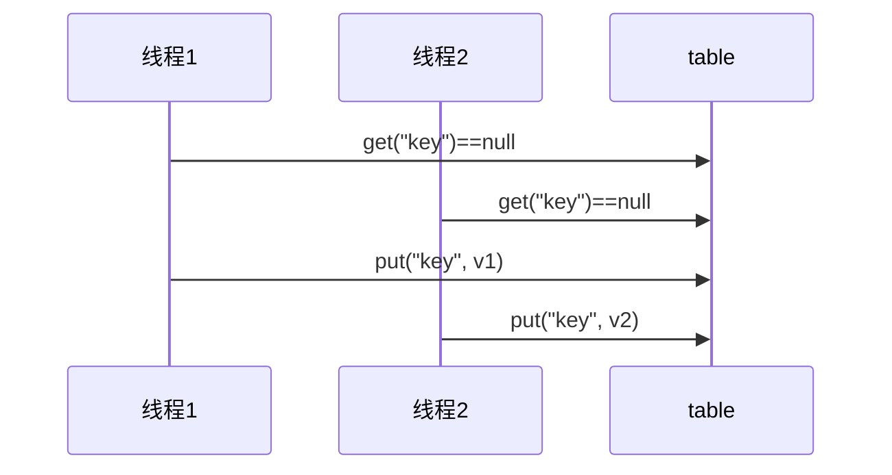
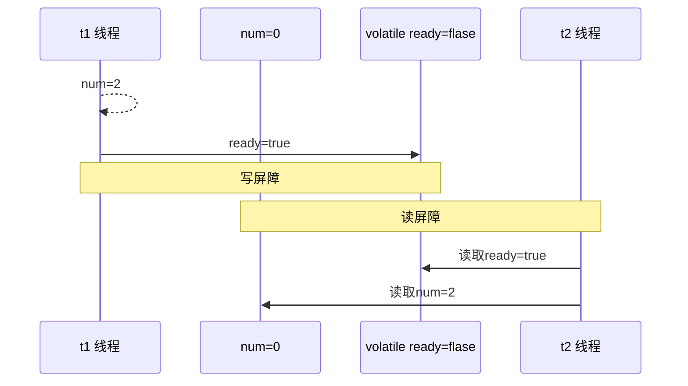
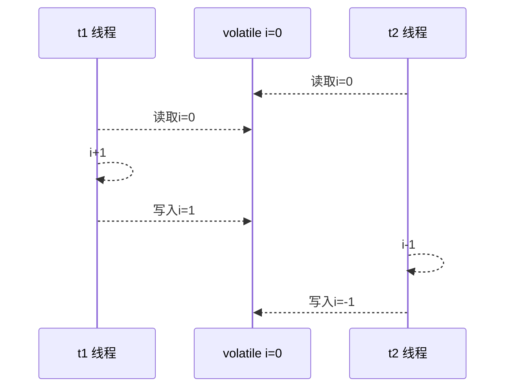
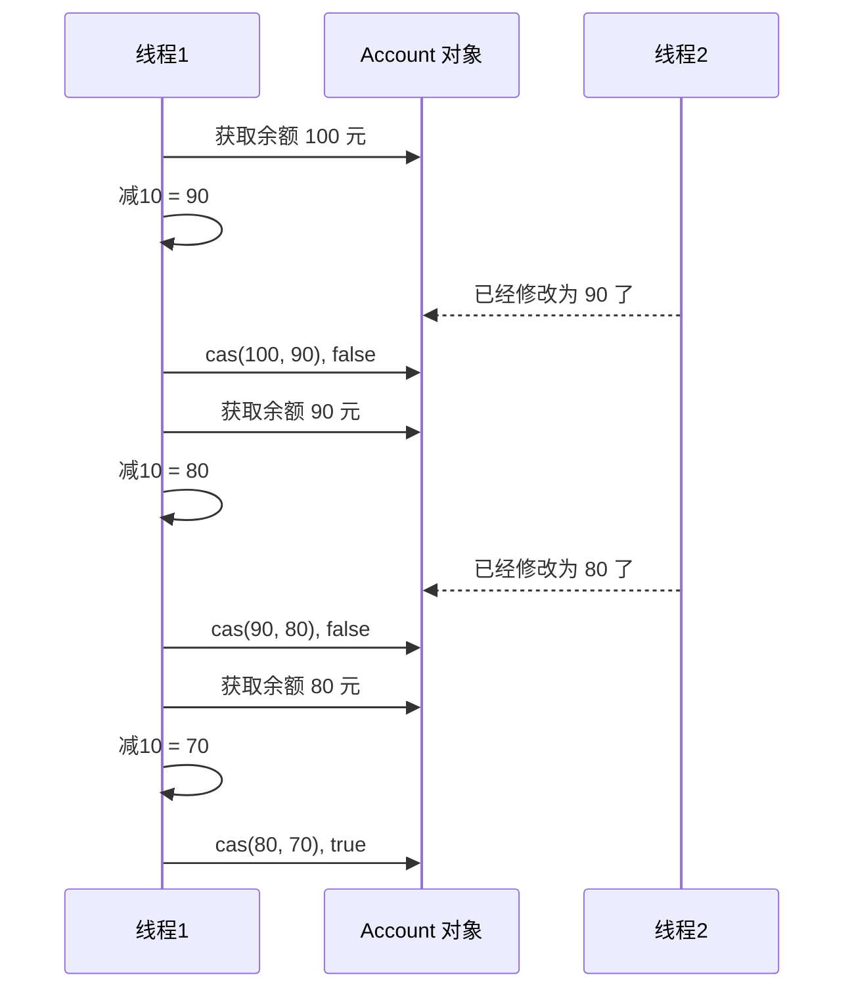
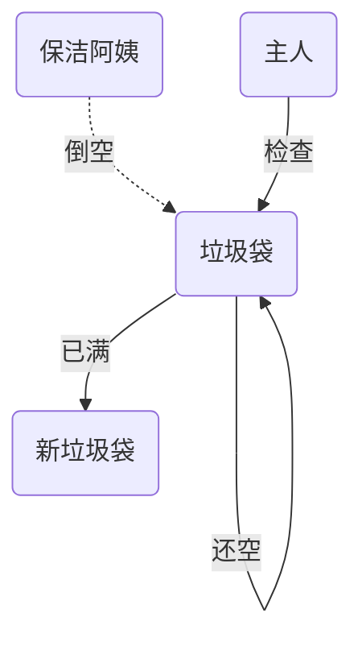
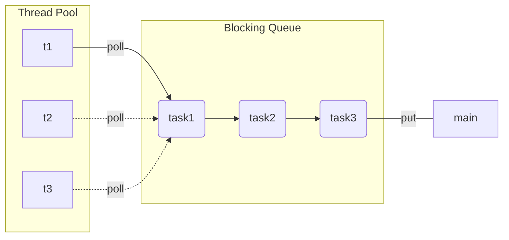

# 并发控制

## Java线程

### 创建和运行线程

#### 方法一，直接使用 Thread

```java
// 构造方法的参数是给线程指定名字，推荐给线程起个名字（也可以不含参数）
Thread t1 = new Thread("t1") {
 	@Override
 	// run 方法内实现了要执行的任务
 	public void run() {
 		System.out.println("hello thread");
 	}
};
// 启动线程
t1.start();
```

#### 方法二，使用 Runnable 配合 Thread

把【线程】和【任务】（要执行的代码）分开，Thread 代表线程，Runnable 可运行的任务（线程要执行的代码）Test2.java

```java
// 创建任务对象
Runnable task2 = new Runnable() {
 	@Override
 	public void run() {
 		System.out.println("hello thread");
 	}
};
// 参数1 是任务对象
// 参数2 是线程名字，推荐给线程起个名字（可选）
Thread t2 = new Thread(task2, "t2");
// 启动线程
t2.start();
```

**小结：**

方法1 是把线程和任务合并在了一起，方法2 是把线程和任务分开了，用 Runnable 更容易与线程池等高级 API 配合，用 Runnable 让任务类脱离了 Thread 继承体系，更灵活。

通过查看源码可以发现，方法二其实到底还是通过方法一执行的！

####  方法三，FutureTask 配合 Thread

FutureTask 能够接收 Callable 类型的参数，用来处理有返回结果的情况 t1

```java
public static void main(String[] args) throws InterruptedException, ExecutionException {
    FutureTask<Integer> task = new FutureTask<>(new Callable<Integer>() {
        @Override
        public Integer call() throws Exception {
            System.out.println("running");
            Thread.sleep(1000);
            return 100;
        }
    });
    Thread t1 = new Thread(task, "t1");
    t1.start();
    System.out.println(task.get());
}
```

Future就是对于具体的Runnable或者Callable任务的执行结果进行取消、查询是否完成、获取结果。必要时可以通过get方法获取执行结果，该方法会阻塞直到任务返回结果。

Future提供了三种功能： 　　

1. 判断任务是否完成； 　　
2. 能够中断任务； 　　
3. 能够获取任务执行结果。

### 线程运行原理

栈帧、多线程、上下文切换

### Thread的常见方法


#### start vs run

直接调用 `run()` 是在主线程中执行了 `run()`，没有启动新的线程；

使用 `start()` 是启动新的线程，通过新的线程间接执行 `run()`方法 中的代码。

#### sleep vs yield

##### sleep

1. 调用 sleep 会让当前线程从 Running 进入 Timed Waiting 状态（有时限的等待）
2. 其它线程可以使用 interrupt 方法打断正在睡眠的线程，那么被打断的线程这时就会抛出 `InterruptedException`异常【注意：这里打断的是正在休眠的线程，而不是其它状态的线程】
3. 睡眠结束后的线程未必会立刻得到执行（需要分配到cpu时间片）
4. 建议用 TimeUnit 的 `sleep()` 代替 Thread 的 `sleep()`来获得更好的可读性

##### yield

1. 调用 yield 会让当前线程从 Running 进入 Runnable 就绪状态，然后调度执行其它线程
2. 具体的实现依赖于操作系统的任务调度器（可能没有其它的线程正在执行，虽然调用了yield方法，但是也没有用）

##### 线程优先级

线程优先级会提示（hint）调度器优先调度该线程，但它仅仅是一个提示，调度器可以忽略它。如果 cpu 比较忙，那么优先级高的线程会获得更多的时间片，但 cpu 闲时，优先级几乎没作用

#### join

等待某个线程运行结束

代码如下：

```java
public class Main {
    static int r = 0;
    public static void main(String[] args) throws InterruptedException {
        test1();
    }
    private static void test1() throws InterruptedException {
        System.out.println("test1 开始");
        Thread t1 = new Thread(() -> {
            System.out.println("t1 开始");
            try {
                Thread.sleep(1000);
            }
            catch (InterruptedException e) {
                e.printStackTrace();
            }
            System.out.println("t1 结束");
            r = 10;
        }, "t1");
        t1.start();
        t1.join();	// 等待t1线程结束
        System.out.println("r=" + r);
        System.out.println("test1 结束");
    }
}
```

在主线程中调用`t1.join()`，则主线程会等待 t1 线程执行完之后再继续执行 test1


#### interrupt方法详解

##### 打断阻塞的线程（sleep、wait、join）

打断阻塞的线程，会清空打断状态（重置为false），以 sleep 为例

```java
private static void test1() throws InterruptedException {
    Thread t1 = new Thread(() -> {
        try {
            Thread.sleep(1000);	// wait, join
        }
        catch (InterruptedException e) {
            e.printStackTrace();
        }
    }, "t1");
    t1.start();
    t1.join(500);
    t1.interrupt();
    System.out.println("打断状态: " + t1.isInterrupted());
}
```

输出为

```java
打断状态: false
java.lang.InterruptedException: sleep interrupted
	at java.lang.Thread.sleep(Native Method)
	at Main.lambda$test1$0(Main.java:16)
	at java.lang.Thread.run(Thread.java:748)
```

##### 打断正常运行的线程

打断正常运行的线程, 线程并不会暂停，只是调用方法`Thread.currentThread().isInterrupted()`的返回值为true，可以通过判断`Thread.currentThread().isInterrupted()`的值来手动停止线程

```java
public static void main(String[] args) throws InterruptedException {
    Thread t1 = new Thread(() -> {
        while (true) {
            boolean interrupt = Thread.currentThread().isInterrupted();
            if (interrupt) {
                System.out.println("被打断了");
                break;
            }
        }
    }, "t1");
    t1.start();
    Thread.sleep(1000);
    System.out.println("interrupt");
    t1.interrupt();
}
```

##### 两阶段终止模式

Two Phase Termination，就是考虑在一个线程T1中如何优雅地终止另一个线程T2。这里的优雅指的是给T2一个料理后事的机会（如释放锁）。（`stop()`和`System.exit(int)`方法都不适用，过于暴力）

如下所示：那么线程的`isInterrupted()`方法可以取得线程的打断标记，如果线程在睡眠`sleep`期间被打断，打断标记是不会变的，为false，但是`sleep`期间被打断会抛出异常，我们据此手动设置打断标记为`true`；如果是在程序正常运行期间被打断的，那么打断标记就被自动设置为`true`。处理好这两种情况那我们就可以放心地来料理后事啦！


代码如下：

```java
private static void test1() throws InterruptedException {
    Thread t1 = new Thread(() -> {
        while (true) {
            Thread current = Thread.currentThread();
            if (current.isInterrupted()) {
                System.out.println("被打断");
                break;
            }
            try {
                Thread.sleep(1000);
            }
            catch (InterruptedException e) {
                e.printStackTrace();
                current.interrupt(); // 由于打断阻塞的线程，会清空打断状态，所以要重新设置
            }
        }
    }, "t1");
    t1.start();
    t1.join(500);
    t1.interrupt();
}
```

### 守护线程

默认情况下，java进程需要等待所有的线程结束后才会停止，但是有一种特殊的线程，叫做守护线程。在其他线程全部结束的时候，即使守护线程还未结束、代码未执行完，java进程也会停止。普通线程t1可以调用`t1.setDeamon(true)`方法变成守护线程

> 注意 垃圾回收器线程就是一种守护线程 
>
> Tomcat 中的 Acceptor 和 Poller 线程都是守护线程，所以 Tomcat 接收到 shutdown 命令后，不会等待它们处理完当前请求

## 共享模型

### 共享带来的问题

#### 问题分析

线程出现问题的根本原因是因为线程上下文切换，导致线程里的指令没有执行完就切换执行其它线程了，下面举一个例子

```Java
public class Main {
    static int count = 0;
    public static void main(String[] args) throws InterruptedException, ExecutionException {
        Thread t1 = new Thread(() -> {
            for (int i = 0; i < 50000; i++) {
                count++;
            }
        }, "t1");
        Thread t2 = new Thread(() -> {
            for (int i = 0; i < 50000; i++) {
                count--;
            }
        }, "t2");
        t1.start();
        t2.start();
        t1.join();
        t2.join();
        System.out.println(count);
    }
}
```

以上的结果可能是整数、负数、零。因为Java中对静态变量的自增、自减并不是原子操作，从字节码层面分析：

对静态变量`i`来说，`i++`和`i--`产生的字节码如下

```java
getstatic i 	// 获取静态变量i的值
iconst_1 		// 准备常量1
iadd 			// 自增
putstatic i 	// 将修改后的值存入静态变量i
    
getstatic i 	// 获取静态变量i的值
iconst_1 		// 准备常量1
isub 			// 自减
putstatic i 	// 将修改后的值存入静态变量i
```

#### 临界区

+ 一个程序运行多线程本身是没有问题的

+ 问题出现在多个线程共享资源的时候

  + 多个线程同时对共享资源进行读操作本身也没有问题
  + 问题出现在对对共享资源同时进行读写操作时就有问题了

+ 先定义一个叫做临界区的概念：一段代码内如果存在对共享资源的多线程读写操作，那么称这段代码为临界区，如下

```Java
static int counter = 0;
static void increment(){
    // 临界区
	counter++;
}
static void decrement(){
    // 临界区
	counter--;
}
```

#### 竞态条件

多个线程在临界区执行，那么由于代码的执行序列不同而导致结果无法预测，称为发生了**竞态条件**。

### synchronized解决方案

为了避免临界区中的竞态条件发生，由多种手段可以达到

- 阻塞式解决方案：synchronized ，Lock
- 非阻塞式解决方案：原子变量

现在讨论使用synchronized来进行解决，即俗称的**对象锁**，它采用互斥的方式让同一时刻至多只有一个线程持有对象锁，其他线程如果想获取这个锁就会阻塞住，这样就能保证拥有锁的线程可以安全的执行临界区内的代码，不用担心线程上下文切换

> 注意
>
> 虽然 java 中互斥和同步都可以采用 synchronized 关键字来完成，但它们还是有区别的： 
>
> + 互斥是保证临界区的竞态条件发生，同一时刻只能有一个线程执行临界区的代码
> + 同步是由于线程执行的先后、顺序不同、需要一个线程等待其它线程运行到某个点

#### synchronized

语法

```java
synchronized(/*对象*/) {
    // 临界区
}
```

解决

```Java
public class Main {
    static int count = 0;
    static final Object lock = new Object();
    public static void main(String[] args) throws InterruptedException, ExecutionException {
        Thread t1 = new Thread(() -> {
            for (int i = 0; i < 50000; i++) {
                synchronized (lock) {
                    count++;
                }
            }
        }, "t1");
        Thread t2 = new Thread(() -> {
            for (int i = 0; i < 50000; i++) {
                synchronized (lock) {
                    count--;
                }
            }
        }, "t2");
        t1.start();
        t2.start();
        t1.join();
        t2.join();
        System.out.println(count);
    }
}
```

#### synchronized原理

synchronized实际上利用对象保证了临界区代码的原子性，临界区内的代码在外界看来是不可分割的，不会被线程切换所打断


### 变量的线程安全分析

####  成员变量和静态变量

- 如果没有变量没有在线程间共享，那么变量是安全的
- 如果变量在线程间共享
  - 如果只有读操作，则线程安全
  - 如果有读写操作，则这段代码是临界区，需要考虑线程安全

#### 局部变量

- 局部变量【局部变量被初始化为基本数据类型】是安全的（作用于栈帧中，线程私有）
- 局部变量引用的对象未必是安全的
  - 如果局部变量引用的对象没有引用线程共享的对象，那么是线程安全的
  - 如果局部变量引用的对象引用了一个线程共享的对象，那么要考虑线程安全的

考虑下面代码：

```java
public class Test {
    public static void main(String[] args) {
        UnsafeTest unsafeTest = new UnsafeTest();
        for (int i =0;i<100;i++){
            new Thread(()->{
                unsafeTest.method1();
            },"线程"+i).start();
        }
    }
}
class UnsafeTest{
    ArrayList<String> arrayList = new ArrayList<>();
    public void method1(){
        for (int i = 0; i < 100; i++) {
            method2();
            method3();
        }
    }
    private void method2() {
        arrayList.add("1");
    }
    private void method3() {
        arrayList.remove(0);
    }
}
```

**分析：**

无论哪个线程中的 method2 和method3 引用的都是同一个对象中的 list 成员变量：一个 ArrayList ，在添加一个元素的时候，它可能会有两步来完成：

1. 第一步，在 arrayList[Size] 的位置存放此元素； 第二步增大 Size 的值。
2. 在单线程运行的情况下，如果 Size = 0，添加一个元素后，此元素在位置 0，而且 Size=1；而如果是在多线程情下，比如有两个线程，线程 A 先将元素存放在位置 0。但是此时 CPU 调线程A暂停，线程 B 得到运行的机会。线程B也向此 ArrayList 添加元素，因为此时 Size 仍等于 0 （注意哦，我们假设的是添加一个元素是要两个步骤哦，而线程A仅仅完成了步骤1），所以线程B也将元素存放在位置0。然后线程A和线程B都继续运行，都增加 Size 的值。 那好，现在我们来看看 ArrayList 的情况，元素实际上只有一个，存放在位置 0，而 Size 却等于 2。这就是“线程不安全”了。

**解决方法：**

可以将list修改成局部变量，那么就不会有上述问题了。

```Java
class safeTest{
    public void method1(){
        ArrayList<String> arrayList = new ArrayList<>();
        for (int i = 0; i < 100; i++) {
        	method2(arrayList);
        	method3(arrayList);
        }
    }
    private void method2(ArrayList arrayList) {
        arrayList.add("1");
    }
    private void method3(ArrayList arrayList) {
        arrayList.remove(0);
    }
}
```

### 常见的线程安全类

1. String
2. Integer
3. StringBuffer
4. Random
5. Vector
6. HashTable
7. java.util.concurrent 包下的类

这里说它们是线程安全的是指，多个线程调用它们同一个实例的某个方法时，是线程安全的。也可以理解为它们的每个方法是原子的。

```Java
Hashtable table = new Hashtable();
new Thread(()->{
 	table.put("key", "value1");
}).start();
new Thread(()->{
 	table.put("key", "value2");
}).start();
```

#### 线程安全类的方法组合

但注意它们多个方法的组合不是原子的，见下面分析

```java
Hashtable table = new Hashtable();
// 线程1，线程2
if( table.get("key") == null) {
 	table.put("key", value);
}
```



#### 不可变类的线程安全

`String`和`Integer`等类都是不可变的类，因为其类内部状态是不可改变的，因此它们的方法都是线程安全的。

### Monitor

#### 对象头

以 32 位虚拟机为例，普通对象的对象头结构如下，其中的Klass Word为指针，指向对应的Class对象；


数组对象：


其中 Mark Word 结构为


所以一个对象的结构如下：


#### Monitor原理

Monitor被翻译为监视器或者管程

每个java对象都可以关联一个Monitor，如果使用`synchronized`给对象上锁（重量级），该对象头的Mark Word中就被设置为指向Monitor对象的指针


- 刚开始时Monitor中的Owner为null
- 当Thread-2 执行synchronized(obj)就会将Monitor的所有者 Owner 设置为 Thread-2，上锁成功，Monitor中同一时刻只能有一个Owner
- 当Thread-2 占据锁时，如果线程Thread-3，Thread-4也来执行synchronized(obj)，就会进入 EntryList 中变成`BLOCKED`状态
- Thread-2 执行完同步代码块的内容，然后唤醒 EntryList 中等待的线程来竞争锁，竞争时是非公平的
- 图中 WaitSet 中的 Thread-0，Thread-1 是之前获得过锁，但条件不满足进入 WAITING 状态的线程，后面讲wait-notify 时会分析

> 注意：
>
> + synchronized 必须是进入同一个对象的 monitor 才有上述的效果
> + 不加 synchronized 的对象不会关联monitor，不遵从以上规则

####  synchronized原理

分析如下代码

```java
static final Object lock=new Object();
static int counter = 0;
public static void main(String[] args) {
    synchronized (lock) {
        counter++;
    }
}
```

反编译后的部分字节码如下

```java
 0 getstatic #2  	// 取得 lock 引用（synchronized开始了）
 3 dup    			// 复制操作数栈栈顶的值放入栈顶，即复制了一份 lock 的引用
 4 astore_1			// 操作数栈栈顶的值弹出，即将 lock 的引用存到局部变量表中 slot1
 5 monitorenter 	// 将 lock 对象的 MarkWord 置为指向 Monitor 指针
 6 getstatic #3 
 9 iconst_1
10 iadd
11 putstatic #3 
14 aload_1 			// 从局部变量表中取得 lock 的引用，放入操作数栈栈顶
15 monitorexit 		// 将 lock 对象的 MarkWord 重置，唤醒 EntryList
16 goto 24
// 下面是异常处理指令，可以看到，如果出现异常，也能自动地释放锁
19 astore_2			// e -> slot 2
20 aload_1			// <- lock引用
21 monitorexit		// 将 lock 对象的 MarkWord 重置，唤醒 EntryList
22 aload_2			// <- slot 2 (e)
23 athrow			// throw e
24 return
```

#### synchronized原理进阶

##### 轻量级锁

轻量级锁的使用场景是：如果一个对象虽然有多个线程要对它进行加锁，但是加锁的时间是错开的（也就是没有人可以竞争的），那么可以使用轻量级锁来进行优化。

轻量级锁对使用者是透明的，即语法仍然是`synchronized`

假设有两个方法同步块，利用同一个对象加锁

```Java
static final Object obj = new Object();
public static void method1() {
     synchronized( obj ) {
         // 同步块 A
         method2();
     }
}
public static void method2() {
     synchronized( obj ) {
         // 同步块 B
     }
}
```

1. 每次指向到synchronized代码块时，都会创建锁记录（Lock Record）对象，每个线程都会包括一个锁记录的结构，锁记录内部可以储存对象的Mark Word和对象引用 reference

   

2. 让锁记录中的Object reference指向对象，并且尝试用cas(compare and swap)替换Object对象的Mark Word ，将Mark Word 的值存入锁记录中

   

3. 如果cas替换成功（即对象头原本状态是01），那么对象的对象头的Mark Word储存的就是锁记录的地址和状态00，如下所示

   

4. 如果cas失败，有两种情况：

   + 如果是其它线程已经持有了该Object的轻量级锁，那么表示有竞争，将进入锁膨胀阶段
   + 如果是自己的线程已经执行了synchronized进行加锁，那么再添加一条 Lock Record 作为重入的计数，新添加的锁记录地址字段值置为 null

   

5. 当线程退出synchronized代码块的时候，**如果获取的是取值为 null 的锁记录 **，表示有重入，这时重置锁记录，表示重入计数减一（lock record的数量）

   

6. 当线程退出synchronized代码块的时候，如果获取的锁记录取值不为 null，那么使用cas将Mark Word的值恢复给对象

   + 成功则解锁成功
   + 失败，则说明轻量级锁进行了锁膨胀或已经升级为重量级锁，进入重量级锁解锁流程

##### 锁膨胀

如果在尝试加轻量级锁的过程中，cas操作无法成功，有一种情况就是其它线程已经为这个对象加上了轻量级锁，这时就要进行锁膨胀，将轻量级锁变成重量级锁。

1. 当 Thread-1 进行轻量级加锁时，Thread-0 已经对该对象加了轻量级锁（状态为00）

   

2. 这时 Thread-1 加轻量级锁失败，进入锁膨胀流程

   + 为对象申请 Monitor 锁，让 Object 指向重量级锁（Monitor）地址
   + 然后自己进入Monitor 的 EntryList 变成 BLOCKED 状态（轻量级锁没有阻塞这一说法）

   

3. 当Thread-0 退出synchronized同步块时，使用cas将Mark Word的值恢复给对象头，失败。这时会进入重量级锁的解锁过程，即按照Monitor的地址找到Monitor对象，将Owner设置为null，唤醒 EntryList 中的 Thread-1 线程

##### 自旋优化

重量级锁竞争的时候，还可以使用自旋来进行优化（适用于多核cpu），如果当前线程自旋成功（即在自旋的时候持锁的线程已经退出了同步块，释放了锁），那么当前线程就可以避免阻塞，不用进行上下文切换就获得了锁。

1. 自旋重试成功的情况

   

2. 自旋重试失败的情况，自旋了一定次数还是没有等到持锁的线程释放锁，就会进入阻塞

   

+ 自旋会占用 CPU 时间，单核 CPU 自旋就是浪费，多核 CPU 自旋才能发挥优势。
+ 在 Java 6 之后自旋锁是自适应的，比如对象刚刚的一次自旋操作成功过，那么认为这次自旋成功的可能性会高，就多自旋几次；反之，就少自旋甚至不自旋，总之，比较智能。
+ Java 7 之后不能控制是否开启自旋功能。

##### 偏向锁

轻量级锁在没有竞争时（就自己这个线程），每次重入仍需要执行CAS操作。

Java 6 中引入了偏向锁来做进一步优化：只有第一次使用CAS将线程ID设置到对象的Mask Word头，**之后这个入锁线程再进行重入锁时，发现这个线程ID是自己的就表示没有竞争，不用重新CAS**。以后只要不发生竞争，这个对象就归该线程所有。

例如：

```java
static final Object obj = new Object();
public static void m1() {
    synchronized(obj) {
        // 同步块 A
        m2();
    }
}
public static void m2() {
    synchronized(obj) {
        // 同步块 B
        m3();
    }
}
public static void m3() {
    synchronized(obj) {
        // 同步块 C
    }
}
```


###### 偏向状态


一个对象创建时：

+ 如果开启了偏向锁（默认是开启的），那么对象创建后，Mark Word 最后三位的值 101，并且这时它的Thread，epoch，age都是0，在加锁的时候进行设置这些的值。可以加 VM 参数来禁用偏向锁：`-XX:-UseBiasedLocking`
+ 偏向锁默认是延迟的，不会在程序启动时立刻生效，如果想避免延迟，可以加 VM 参数来禁用延迟：`-XX:BiasedLockingStartupDelay=0`来禁用延迟。
+ 如果没有开启偏向锁，那么对象创建后，Mark Word 最后三位的值 001，这时它的 hashcode，age 都是 0，第一次用到 hashcode 时才会赋值。
+ 注意：处于偏向锁的对象解锁后，线程 id 仍存储于对象头中。

######  撤销偏向锁 - hashcode方法

当调用对象的 hashcode 方法的时候就会撤销这个对象的偏向锁，因为使用偏向锁时没有位置存`hashcode`的值了

######  撤销偏向锁 - 其它线程使用对象

其他线程使用对象时，会导致偏向锁撤销变成轻量级锁。但注意，没有线程对同一个对象进行锁竞争（否则会变成重量级锁），也就是说不同线程使用对象的时间是错开的。

###### 撤销偏向锁 - 调用 wait/notify

会使对象的锁变成重量级锁，因为wait/notify方法只有重量级锁才支持

###### 批量重偏向

如果对象虽然被多个线程访问，但是没有竞争，这时偏向了线程T1的对象仍有机会重新偏向T2，重偏向会重置对象的 ThreadID。

当撤销偏向锁次数超过阈值（默认撤销20个对象偏向锁）后，jvm会这样觉得，我是不是偏向错了呢，于是会在给这些对象加锁时重新偏向至加锁线程。

###### 批量撤销

当撤销偏向锁次数超过阈值（默认40次）后，jvm会这样觉得，自己确实偏向错了，根本就不该偏向。于是整个类的所有对象都会变为不可偏向的，新建的对象也是不可偏向的。

##### 锁消除

若在代码中把锁加在了本来就是线程安全的代码块中，那么`JIT(即时编译器)`就会进行优化，撤销这个影响效率的锁

分析下面代码

```java
public class Test {
    static int x = 0;
    public void method1() throws Exception {
        x++;
    }
    public void method2() throws Exception {
        Object obj = new Object();
        synchronized(obj) {
            x++;
        }
    }
}
```

那么`method2`方法中的锁就会被优化消除掉。

### wait & notify

#### 原理


+ Owner 线程发现条件不满足，调用 wait 方法，即可进入 WaitSet 中变为 WAITING 状态
+ BLOCKED 和 WAITING 的线程都处于阻塞状态，不占用 CPU 时间片
+ BLOCKED 线程会在 Owner 线程释放锁时唤醒
+ WAITING 线程会在 Owner 线程调用 notify 或 notifyAll 时唤醒，但唤醒后并不意味着立刻获得锁，仍需进入 EntryList 重新竞争

#### API介绍

详见官方文档：

[https://docs.oracle.com/javase/8/docs/api/](https://docs.oracle.com/javase/8/docs/api/)

`obj.wait()`、`obj.notify()`、`obj.notifyAll()`

他们都是线程间进行协作的手段，都属于 `Object` 对象的方法。**必须获得此对象的锁**，才能调用这几个方法。

#### wait vs sleep

1. sleep 是 Thread 方法，而 wait 是 Object 的方法；
2. sleep 不需要强制和 synchronized 配合使用，但 wait 需要和 synchronized 一起用；
3. sleep 在睡眠的同时，不会释放对象锁，但 wait 在等待的时候会释放对象锁。
4. 状态都是 TIMED_WAITING

```java
synchronized(lock) {
    while(条件不成立) {
        lock.wait();
    }
    // 干活
}

// 另一个线程
synchronized(lock) {
    lock.notifyAll(); // 唤醒所有wait的线程，让他们进入EntryList中去竞争锁
}
```

#### 同步模式之保护性暂停

即 Guarded Suspension，用在一个线程等待另一个线程的执行结果，要点：

1. 有一个结果需要从一个线程传递到另一个线程，让他们关联同一个 GuardedObject
2. 如果有结果不断从一个线程到另一个线程那么可以使用消息队列（见生产者/消费者）
3. JDK 中，join 的实现、Future 的实现，采用的就是此模式
4. 因为要等待另一方的结果，因此归类到同步模式


#### 异步模式之生产者/消费者

要点

1. 与前面的保护性暂停中的 GuardObject 不同，不需要产生结果和消费结果的线程一一对应
2. 消费队列可以用来平衡生产和消费的线程资源
3. 生产者仅负责产生结果数据，不关心数据该如何处理，而消费者专心处理结果数据
4. 消息队列是有容量限制的，满时不会再加入数据，空时不会再消耗数据
5. JDK 中各种阻塞队列，采用的就是这种模式

“异步”的意思就是生产者产生消息之后消息没有被立刻消费，而“同步模式”中，消息在产生之后被立刻消费了。


### park & unpark

#### 基本使用

它们是 LockSupport 类中的方法

```Java
// 暂停当前线程
LockSupport.park();
// 恢复某个线程的运行
LockSupport.unpark(暂停的线程对象);
```

#### 特点

与 Object 的 wait & notify 相比

+ wait，notify 和 notifyAll 必须配合 Object Monitor 一起使用，而 park & unpark 不必
+ park & unpark 是以线程为单位来【阻塞】和【唤醒】线程，而 notify 只能随机唤醒一个等待线程，notifyAll 是唤醒所有等待线程，就不那么【精确】
+ park & unpark 可以先 unpark，而 wait & notify 不能先 notify
+ park & unpark 的设计原理核心是**许可**：park 是等待一个许可，unpark 是为某线程提供一个许可。

#### 原理

每个线程都有自己的一个 Parker 对象，由三部分组成 \_counter， \_cond 和 \_mutex，打个比喻：

1. 线程就像一个旅人，Parker 就像他随身携带的背包，条件变量 \_cond 就好比背包中的帐篷。\_counter 就好比背包中的备用干粮（0 为耗尽，1 为充足）
2. 调用 park 就是要看需不需要停下来歇息
   + 如果备用干粮耗尽，那么钻进帐篷歇息

   + 如果备用干粮充足，那么不需停留，继续前进
3. 调用 unpark，就好比令干粮充足
   + 如果这时线程还在帐篷，就唤醒让他继续前进

   + 如果这时线程还在运行，那么下次他调用 park 时，仅是消耗掉备用干粮，不需停留继续前进
     + 因为背包空间有限，多次调用 unpark 仅会补充一份备用干粮

##### 先调用 park

1. 当前线程调用 Unsafe.park() 方法
2. 检查 \_counter ，本情况为 0，这时，获得 \_mutex 互斥锁（\_mutex 对象有个等待队列 \_cond）
3. 线程进入 \_cond 条件变量阻塞
4. 设置 \_counter = 0


1. 调用 Unsafe.unpark(Thread-0) 方法，设置 \_counter 为 1
2. 唤醒 \_cond 条件变量中的 Thread-0
3. Thread-0 恢复运行
4. 设置 \_counter 为 0


##### 先调用 unpark

1. 调用 Unsafe.unpark(Thread-0) 方法，设置 \_counter 为 1
2. 当前线程调用 Unsafe.park() 方法
3. 检查 \_counter ，本情况为 1，这时线程无需阻塞，继续运行
4. 设置 \_counter 为 0


### 线程状态转换


1. **RUNNABLE <--> WAITING**

   线程用synchronized(obj)获取了对象锁后

   1. 调用obj.wait()方法时，t 线程从RUNNABLE --> WAITING
   2. 调用obj.notify()，obj.notifyAll()，t.interrupt()时
      1. 竞争锁成功，t 线程从WAITING --> RUNNABLE
      2. 竞争锁失败，t 线程从WAITING --> BLOCKED

2. **RUNNABLE <--> WAITING**

   1. 当前线程调用 LockSupport.park() 方法会让当前线程从 RUNNABLE --> WAITING
   2. 调用 LockSupport.unpark(目标线程) 或调用了线程 的 interrupt() ，会让目标线程从 WAITING --> RUNNABLE

3. **RUNNABLE <--> WAITING**

   1. 当前线程调用 t.join() 方法时，当前线程从 RUNNABLE --> WAITING 注意是当前线程在t 线程对象的监视器上等待
   2. t 线程运行结束，或调用了当前线程的 interrupt() 时，当前线程从 WAITING --> RUNNABLE

4. **RUNNABLE <--> TIMED_WAITING**

   t 线程用 synchronized(obj) 获取了对象锁后

   1. 调用 obj.wait(long n) 方法时，t 线程从 RUNNABLE --> TIMED_WAITING
   2. t 线程等待时间超过了 n 毫秒，或调用 obj.notify() ， obj.notifyAll() ， t.interrupt() 时
      1. 竞争锁成功，t 线程从 TIMED_WAITING --> RUNNABLE
      2. 竞争锁失败，t 线程从 TIMED_WAITING --> BLOCKED

5. **RUNNABLE <--> TIMED_WAITING**

   1. 当前线程调用 t.join(long n) 方法时，当前线程从 RUNNABLE --> TIMED_WAITING 注意是当前线程在t 线程对象的监视器上等待
   2. 当前线程等待时间超过了 n 毫秒，或t 线程运行结束，或调用了当前线程的 interrupt() 时，当前线程从 TIMED_WAITING --> RUNNABLE

6. **RUNNABLE <--> TIMED_WAITING**

   1. 当前线程调用 Thread.sleep(long n) ，当前线程从 RUNNABLE --> TIMED_WAITING
   2. 当前线程等待时间超过了 n 毫秒或调用了线程 的 interrupt() ，当前线程从 TIMED_WAITING --> RUNNABLE

7. **RUNNABLE <--> TIMED_WAITING**

   1. 当前线程调用 LockSupport.parkNanos(long nanos) 或 LockSupport.parkUntil(long millis) 时，当前线 程从 RUNNABLE --> TIMED_WAITING
   2. 调用 LockSupport.unpark(目标线程) 或调用了线程 的 interrupt() ，或是等待超时，会让目标线程从 TIMED_WAITING--> RUNNABLE

### 活跃性

活跃性相关的一系列问题都可以用 ReentrantLock 进行解决。

#### 死锁

有这样的情况：一个线程需要同时获取多把锁，这时就容易发生死锁。例如 t1 线程获得 A 对象锁，接下来想获取 B 对象的锁；t2 线程获得 B 对象锁，接下来想获取 A 对象的锁。

#### 活锁

活锁出现在两个线程互相改变对方的结束条件，最后谁也无法结束，举个例子：

```java
static volatile int count = 10;
new Thread(() -> {
    // 期望减到 0 退出循环
    while (count > 0) {
        sleep(0.2);
        count--;
    }
}, "t1").start();
new Thread(() -> {
    // 期望超过 20 退出循环
    while (count < 20) {
        sleep(0.2);
        count++;
    }
}, "t2").start();
```

#### 饥饿

一个线程由于优先级太低，始终得不到 CPU 调度执行，也不能够结束。

### ReentrantLock

相对于 synchronized 它具备如下特点

1. 可中断
2. 可以设置超时时间
3. 可以设置为公平锁
4. 支持多个条件变量，即对与不满足条件的线程可以放到不同的集合中等待

与 synchronized 一样，都支持可重入

基本语法

```java
// 获得锁
reentrantLock.lock();
try {
    // 临界区
} finally {
    // 释放锁
    reentrantLock.unlock();
}
```

#### 可重入

可重入是指同一个线程如果首次获得了这把锁，那么因为它是这把锁的拥有者，因此有权利再次获取这把锁

如果是不可重入锁，那么第二次获得锁时，自己也会被锁挡住

#### 可打断

```java
private static ReentrantLock lock = new ReentrantLock();
public static void main(String[] args) {
	new Thread(() -> {
        try {
            // 如果没有竞争，那么此方法就会获取lock对象锁
            // 如果有竞争就进入阻塞队列，但可以被其他线程用interrupt()方法打断
            System.out.println("尝试获得锁");
            lock.lockInterruptibly();
        } catch (InterruptedException e) {
            e.printStackTrace();
            System.out.println("没有获得锁，返回");
            return;
        }
        try {
            System.out.println("获得锁");
        } finally {
            lock.unlock();
        }
    }, "t1").start();
}
```

#### 锁超时

方法`reentrantLock.tryLock()`尝试获得锁

```java
private static ReentrantLock lock = new ReentrantLock();
public static void main(String[] args) {
    Thread t1 = new Thread(() -> {
        System.out.println("尝试获得锁");
        try {
            // 等待 1 秒
            if (!lock.tryLock(1, TimeUnit.SECONDS)) {
                System.out.println("获取不到锁");
                return;
            }
        }
        catch (InterruptedException e) {
            e.printStackTrace();
        }
        try {
            System.out.println("获得锁");
        } finally {
            lock.unlock();
        }
    }, "t1");
    t1.start();
}
```

##### 锁超时解决哲学家就餐问题

锁超时可解决哲学家就餐问题，利用`reentrantLock.tryLock()`方法尝试获得锁

```java
while (true) {
    // 尝试获得左手筷子
    if (left.tryLock()) {
        try {
            // 尝试获得右手筷子
            if (right.tryLock()) {
                try {
                    eat();
                } finally {
                    right.unlock();
                }
            }
        } finally {
            left.unlock(); //释放自己手里的筷子
        }
    }
}
```

#### 公平锁

synchronized 锁中，在 Entrylist 等待的锁在竞争时不是按照先到先得来获取锁的，所以说 synchronized 锁时不公平的

ReentranLock 锁默认是不公平的，但是可以通过设置实现公平锁。

本意是为了解决饥饿问题，但是公平锁一般没有必要，会降低并发度，使用 tryLock 也可以实现。

#### 条件变量

synchronized 中也有条件变量，就是 waitSet 休息室，当条件不满足时进入 waitSet 等待 

ReentrantLock 的条件变量比 synchronized 强大之处在于，它是支持多个条件变量的，这就好比

+ synchronized 是那些不满足条件的线程都在一间休息室等消息
+ 而 ReentrantLock 支持多间休息室，有专门等烟的休息室、专门等早餐的休息室，唤醒时也是按休息室来唤醒

使用流程：

1. await 前需要获得锁
2. await 执行后，会释放锁，进入 conditionObject 等待
3. await 的线程被唤醒（或打断、或超时）时重新竞争 lock 锁，执行唤醒操作的线程也必须先获得锁
4. 竞争 lock 锁成功后，从 await 后继续执行

```java
private static ReentrantLock lock = new ReentrantLock();
public static void main(String[] args) {
    // 创建新的条件变量（休息室）
    Condition condition1 = lock.newCondition();
    Condition condition2 = lock.newCondition();

    lock.lock();
    // 进入休息室等待
    try {
        condition1.await();
        // do something
        condition2.signal();
    } catch (InterruptedException e) {
        e.printStackTrace();
    } finally {
        lock.unlock();
    }
}
```

### 同步模式之顺序控制

#### 固定运行顺序

保证执行顺序是先 t2 后 t1，两种解决方案，代码如下：

##### wait & notify 版

```java
private static final Object lock = new Object();
static boolean t2run = false;
public static void main(String[] args) {
    Thread t1 = new Thread(() -> {
        synchronized (lock) {
            while (!t2run) {
                try {
                    lock.wait();
                } catch (InterruptedException e) {
                    e.printStackTrace();
                }
            }
            System.out.println("t1");
        }
    }, "t1");
    Thread t2 = new Thread(() -> {
        synchronized (lock) {
            System.out.println("t2");
            t2run = true;
            lock.notify();
        }
    }, "t2");
    t1.start();
    t2.start();
}
```

##### park & unpark 版

```java
Thread t1 = new Thread(() -> {
    LockSupport.park();
    System.out.println("t1");
}, "t1");
Thread t2 = new Thread(() -> {
    System.out.println("t2");
    LockSupport.unpark(t1);
}, "t2");
t1.start();
t2.start();
```

#### 交替输出

线程 1 输出 a 5 次，线程 2 输出 b 5 次，线程 3 输出 c 5 次。现在要求输出 abcabcabcabcabc，不同方案实现代码如下：

##### wait & notify 版

```java
public class Test {
    public static void main(String[] args) {
        WaitNotify wn = new WaitNotify(1, 5);
        new Thread(() -> wn.print("a", 1, 2)).start();
        new Thread(() -> wn.print("b", 2, 3)).start();
        new Thread(() -> wn.print("c", 3, 1)).start();
    }
}
class WaitNotify {
    private int flag; // 等待标记
    private int loopNumber;
    public WaitNotify(int flag, int loopNumber) {
        this.flag = flag;
        this.loopNumber = loopNumber;
    }
    public void print(String str, int waitFlag, int nextFlag) {
        for (int i = 0; i < loopNumber; i++) {
            synchronized (this) {
                while (flag != waitFlag) {
                    try {
                        this.wait();
                    } catch (InterruptedException e) {
                        e.printStackTrace();
                    }
                }
                System.out.print(str);
                flag = nextFlag;
                this.notifyAll();
            }
        }
    }
}
```

##### await & signal 版

```java
public class Test {
    public static void main(String[] args) throws InterruptedException {
        AwaitSignal awaitSignal = new AwaitSignal(5);
        Condition a = awaitSignal.newCondition();
        Condition b = awaitSignal.newCondition();
        Condition c = awaitSignal.newCondition();
        new Thread(() -> awaitSignal.print("a", a, b)).start();
        new Thread(() -> awaitSignal.print("b", b, c)).start();
        new Thread(() -> awaitSignal.print("c", c, a)).start();
        Thread.sleep(1000);
        awaitSignal.lock();
        try {
            a.signal();	//由于三个线程都进入等待，需要由主线程做唤醒操作
        } finally {
            awaitSignal.unlock();
        }
    }
}
class AwaitSignal extends ReentrantLock {
    private int loopNumber;
    public AwaitSignal(int loopNumber) {
        this.loopNumber = loopNumber;
    }
    public void print(String str, Condition cur, Condition next) {
        for (int i = 0; i < loopNumber; i++) {
            lock();
            try {
                cur.await();
                System.out.print(str);
                next.signal();
            } catch (InterruptedException e) {
                e.printStackTrace();
            }
            finally {
                unlock();
            }
        }
    }
}
```

##### park & unpark 版

```java
public class Test {
    static Thread t1;
    static Thread t2;
    static Thread t3;
    public static void main(String[] args) throws InterruptedException {
        ParkUnpark pu = new ParkUnpark(5);
        t1 = new Thread(() -> pu.print("a", t2));
        t2 = new Thread(() -> pu.print("b", t3));
        t3 = new Thread(() -> pu.print("c", t1));
        t1.start();
        t2.start();
        t3.start();
        LockSupport.unpark(t1);
    }
}
class ParkUnpark {
    private int loopNumber;
    public ParkUnpark(int loopNumber) {
        this.loopNumber = loopNumber;
    }
    public void print(String str, Thread next) {
        for (int i = 0; i < loopNumber; i++) {
            LockSupport.park();
            System.out.print(str);
            LockSupport.unpark(next);
        }
    }
}
```

### 小结

本章我们需要重点掌握的是

1. 分析多线程访问共享资源时，哪些代码片段属于临界区
2. 使用 synchronized 互斥解决临界区的线程安全问题
   1. 掌握 synchronized 锁对象语法
   2. 掌握 synchronzied 加载成员方法和静态方法语法
   3. 掌握 wait/notify 同步方法
3. 使用 lock 互斥解决临界区的线程安全问题 掌握 lock 的使用细节：可打断、锁超时、公平锁、条件变量
4. 学会分析变量的线程安全性、掌握常见线程安全类的使用
5. 了解线程活跃性问题：死锁、活锁、饥饿
6. 应用方面
   1. **互斥：使用 synchronized 或 Lock 达到共享资源互斥效果，实现原子性效果，保证线程安全。**
   2. **同步：使用 wait/notify 或 Lock 的条件变量来达到线程间通信效果。**
7. 原理方面
   1. monitor、synchronized 、wait/notify 原理
   2. synchronized 进阶原理
   3. park & unpark 原理
8. 模式方面
   1. 同步模式之保护性暂停
   2. 异步模式之生产者消费者
   3. 同步模式之顺序控制

## 共享模型之内存

### Java内存模型

JMM 即 Java Memory Model，它从java层面定义了主存、工作内存抽象概念，底层对应着 CPU 寄存器、缓存、硬件内存、CPU 指令优化等。JMM 体现在以下几个方面

1. 原子性 - 保证指令不会受到线程上下文切换的影响
2. 可见性 - 保证指令不会受 cpu 缓存的影响
3. 有序性 - 保证指令不会受 cpu 指令并行优化的影响

### 可见性

#### 退不出的循环

先来看一个现象，main 线程对 run 变量的修改对于 t 线程不可见，导致了 t 线程无法停止：

```java
public class Main {
    static boolean run = true;
    public static void main(String[] args) throws InterruptedException {
        Thread t = new Thread(() -> {
            while (run) {
                // running
            }
        });
        t.start();
        Thread.sleep(1000);
        System.out.println("run stop");
        run = false;  // 线程t不会如预想的停下来
    }
}
```

**原因如下**：

1. 初始状态，t 线程刚开始从主内存读取了 run 的值到工作内存


2. 因为 t 线程频繁地从主存中读取 run 的值，JIT 即时编译器会将 run 的值缓存至自己工作内存中的高速缓存中，减少对主存中 run 的访问，提高效率


3. 一秒之后，main 线程修改了 run 的值，并同步至主存，而 t 是从自己工作内存中的高速缓存中读取这个变量 的值，结果永远是旧值


#### 解决方法

**volatile**（表示易变关键字的意思），它可以用来修饰成员变量和静态成员变量，可以避免线程从自己的工作缓存中查找变量的值，必须到主存中获取它的值，线程操作 volatile 变量都是直接操作主存。

```java
public class Main {
    volatile static boolean run = true;
    public static void main(String[] args) throws InterruptedException {
        Thread t = new Thread(() -> {
            while (run) {
                // running
            }
        });
        t.start();
        Thread.sleep(1000);
        System.out.println("run stop");
        run = false;  // 线程t会停下来
    }
}
```

使用 synchronized 关键字也有相同的效果！在 Java 内存模型中，synchronized 规定，线程在加锁时，先清空工作内存 → 在主内存中拷贝最新变量的副本到工作内存 → 执行完代码 → 将更改后的共享变量的值刷新到主内存中 → 释放互斥锁。

```java
public class Main {
    static boolean run = true;
    final static Object lock = new Object();
    public static void main(String[] args) throws InterruptedException {
        Thread t = new Thread(() -> {
            while (true) {
                synchronized(lock) {
                    if (!run) {
                        break;
                    }                    
                }
                // running
            }
        });
        t.start();
        Thread.sleep(1000);
        System.out.println("run stop");
        synchronized(lock) {
        	run = false;  // 线程t会停下来
        }
    }
}
```

#### 可见性 vs 原子性

前面例子体现的实际就是可见性，它保证的是在多个线程之间一个线程对 volatile 变量的修改对另一个线程可见， 而不能保证原子性，仅用在**一个写线程，多个读线程**的情况。

上例从字节码理解是这样的：

```java
getstatic run // 线程 t 获取 run true
getstatic run // 线程 t 获取 run true
getstatic run // 线程 t 获取 run true
getstatic run // 线程 t 获取 run true
putstatic run // 线程 main 修改 run 为 false， 仅此一次
getstatic run // 线程 t 获取 run false 
```

比较一下线程安全中的例子：两个线程，一个 `i++` 一个 `i--`，只能保证看到最新值，不能解决指令交错（只保证读到的数据是最新值）。

```java
// 假设i的初始值为0
getstatic i // 线程2-获取静态变量i的值 线程内i=0
getstatic i // 线程1-获取静态变量i的值 线程内i=0
iconst_1 	// 线程1-准备常量1
iadd 		// 线程1-自增 线程内i=1
putstatic i // 线程1-将修改后的值存入静态变量i 静态变量i=1
iconst_1 	// 线程2-准备常量1
isub 		// 线程2-自减 线程内i=-1
putstatic i // 线程2-将修改后的值存入静态变量i 静态变量i=-1 
```

> **注意**
> synchronized 语句块既可以保证代码块的原子性，也同时保证代码块内变量的可见性。但缺点是 synchronized 是属于重量级操作，性能相对更低。
>
> 如果在前面示例的死循环中加入 System.out.println() 会发现即使不加 volatile 修饰符，线程 t 也能正确看到对 run 变量的修改了，这是因为 println 方法里面有 synchronized 修饰。

#### 模式之两阶段终止

除了使用 interrupt 方法，还可以使用 volatile 关键字来实现两阶段终止模式。

```java
private volatile boolean stop = false;
private Thread monitorThread;
// 启动监控线程
public void start() {
    monitorThread = new Thread(() -> {
        while (true) {
            Thread current = Thread.currentThread();
            if (stop) {
                System.out.println("料理后事");
                break;
            }
            try {
                Thread.sleep(1000);
                System.out.println("执行监控");
            }
            catch (InterruptedException e) {
            }
        }
    }, "monitor");
    monitorThread.start();
}
// 停止监控线程
public void stop() {
    stop = true;
    monitorThread.interrupt(); // 作用是打断线程的sleep状态，立即stop而不必等待这次sleep结束
}
```

#### 同步模式之Balking

定义：Balking（犹豫）模式用在一个线程发现另一个线程或本线程已经做了某一件相同的事，那么本线程就无需再做了，直接结束返回。（只执行一次）

以上面的代码为例，实现同步模式，可以用一个 boolean 成员变量来记录某个方法是否被执行过。第一次执行，boolean : false --> true。非第一次执行，boolean : true，则直接返回结束。（**注意**，这一部分代码需要用 synchronized 来保护，由于可能有多个线程来写，因此不能用 volatile）

### 有序性

#### 指令重排

JVM 会在不影响正确性的前提下，可以调整语句的执行顺序，分析下面代码：

```java
static int i;
static int j;
// 在某个线程内执行如下赋值操作
i = ...;
j = ...;
```

不论是先执行 i 还是先执行 j，对最终的结果不会产生影响。

这种特性称为**指令重排**，单线程下指令重排和组合可以实现指令级并行，但多线程下指令重排会影响正确性。

#### 诡异的结果

```java
int num = 0;
boolean ready = false; 
// 线程1 执行此方法
public void actor1(I_Result r) {
 	if(ready) {
 		r.r1 = num + num;
	} 
 	else {
 		r.r1 = 1;
 	}
}
// 线程2 执行此方法
public void actor2(I_Result r) {
 	num = 2;
 	ready = true;
}
```

I_Result 是一个对象，有一个属性 r1 用来保存结果，可能的结果有以下几种：

> 情况1：线程1 先执行，这时 ready = false，所以进入 else 分支结果为 1
>
> 情况2：线程2 先执行 num = 2，但没来得及执行 ready = true，线程1 执行，还是进入 else 分支，结果为1
>
> 情况3：线程2 执行到 ready = true，线程1 执行，这回进入 if 分支，结果为 4（因为 num 已经执行过了）
>
> 情况4：线程2 执行 ready = true（num 还没有执行），切换到线程1，进入 if 分支，相加为 0，再切回线程2 执行 num = 2，结果为 0

这种现象叫做指令重排，是 JIT 编译器在运行时的一些优化。

重排序也需要遵守一定规则：

1. 重排序操作不会对存在数据依赖关系的操作进行重排序。比如：a=1;b=a; 这个指令序列，由于第二个操作依赖于第一个操作，所以在编译时和处理器运行时这两个操作不会被重排序。
2. 重排序是为了优化性能，但是不管怎么重排序，单线程下程序的执行结果不能被改变。比如：a=1;b=2;c=a+b;这三个操作，第一步（a=1)和第二步(b=2)由于不存在数据依赖关系，所以可能会发生重排序，但是c=a+b这个操作是不会被重排序的，因为需要保证最终的结果一定是c=a+b=3。

#### 解决方法

重排序在单线程模式下是一定会保证最终结果的正确性，但是在多线程环境下，就会出现问题。

解决方法：volatile 修饰的变量，可以禁用指令重排。

### volatile原理

volatile 的底层实现原理是**内存屏障**，Memory Barrier（Memory Fence）

+ 对 volatile 变量的写指令后会加入写屏障
+ 对 volatile 变量的读指令前会加入读屏障

#### 如何保证可见性

+ 写屏障（sfence）保证在该屏障之前的，对共享变量的改动，都同步到主存当中

```java
public void actor2(I_Result r) {
	num = 2;
    ready = true; // ready是被 volatile 修饰的, 赋值带写屏障
    // 写屏障
}
```

+ 读屏障（lfence）保证在该屏障之后，对共享变量的读取，加载的是主存中最新数据

```java
public void actor1(I_Result r) {
 	// 读屏障
 	// ready 是被 volatil e修饰的, 读取值带读屏障
 	if(ready) {
 		r.r1 = num + num;
 	} else {
 		r.r1 = 1;
 	}
}
```



#### 如何保证有序性

+ 写屏障会确保指令重排序时，不会将写屏障之前的代码排在写屏障之后

```java
public void actor2(I_Result r) {
	num = 2;
    ready = true; // ready是被 volatile 修饰的, 赋值带写屏障
    // 写屏障
}
```

+ 读屏障会确保指令重排序时，不会将读屏障之后的代码排在读屏障之前

```java
public void actor1(I_Result r) {
 	// 读屏障
 	// ready 是被 volatil e修饰的, 读取值带读屏障
 	if(ready) {
 		r.r1 = num + num;
 	} else {
 		r.r1 = 1;
 	}
}
```

还是那句话，不能解决指令交错：

1. 写屏障仅仅是保证之后的读能够读到最新的结果，但不能保证其它线程的读跑到它前面去
2. 而有序性的保证也只是保证了本线程内相关代码不被重排序



### happens-before规则

happens-before 规定了对共享变量的写操作对其他线程的读操作可见，它是可见性与有序性的一套规则总结，抛开以下 happens-before 规则，JMM 并不能保证一个线程对共享变量的写，对其他线程对该共享变量的读可见。

下面说的变量都是指成员变量或静态成员变量：

1. 线程解锁 m 之前对变量的写，对于接下来对 m 加锁的其他线程对该变量的读可见

```java
static int x;
static Object m = new Object();

new Thread(()->{
    synchronized(m) {
        x = 10;
    }
},"t1").start();

new Thread(()->{
    synchronized(m) {
        System.out.println(x);
    }
},"t2").start();
```

2. 线程对 volatile 变量的写，对接下来其它线程对该变量的读可见

```java
volatile static int x;

new Thread(()->{
 	x = 10;
},"t1").start();

new Thread(()->{
 	System.out.println(x);
},"t2").start();
```

3. 线程 start 前对变量的写，对该线程开始后对该变量的读可见

```java
static int x;
x = 10;

new Thread(()->{
 	System.out.println(x);
},"t2").start();
```

4. 线程结束前对变量的写，对其它线程得知它结束后的读可见（比如其它线程调用 `t1.isAlive()` 或 `t1.join()` 等待它结束）

```java
static int x;

Thread t1 = new Thread(()->{
 	x = 10;
},"t1");

t1.start();
t1.join();
System.out.println(x);
```

5. 线程 t1 打断 t2（interrupt）前对变量的写，对于其他线程得知 t2 被打断后对变量的读可见（通过 `t2.interrupted` 或 `t2.isInterrupted`）

```java
static int x;
public static void main(String[] args) {
    Thread t2 = new Thread(()->{
        while(true) {
            if(Thread.currentThread().isInterrupted()) {
                System.out.println(x);
                break;
            }
        }
    },"t2");
    t2.start();
    
    new Thread(()->{
        sleep(1);
        x = 10;
        t2.interrupt();
    },"t1").start();
    
    while(!t2.isInterrupted()) {
        Thread.yield();
    }
    System.out.println(x);
}
```

6. 对变量默认值（0，false，null）的写，对其它线程对该变量的读可见
7. 具有传递性，如果 x hb-> y 并且 y hb-> z 那么有 x hb-> z （happens-before），配合 volatile 的防指令重排，有下面的例子：

```java
volatile static int x;
static int y;

new Thread(()->{
    y = 10;
    x = 20;
},"t1").start();

new Thread(()->{
    // x=20 对 t2 可见, 同时 y=10 也对 t2 可见
    System.out.println(x);
},"t2").start();
```

## 共享模型之无锁

管程即 monitor 是阻塞式的悲观锁实现并发控制，这章我们将通过非阻塞式的乐观锁的来实现并发控制。

举例：实现多线程银行取钱，可以用以下不加锁的代码来实现

```java
class AccountSafe {
    private AtomicInteger balance;

    public AccountCas(int balance) {
        this.balance = new AtomicInteger(balance);
    }

    public int getBalance() {
        return balance.get();
    }

    public void dec(int amount) {
        while (true) {
            int pre = getBalance();
            int next = pre - amount;
            if (balance.compareAndSet(pre, next)) {
                break;
            }
        }
    }
}
```

### CAS与volatile

#### cas

前面看到的 AtomicInteger 的解决方法，内部并没有用锁来保护共享变量的线程安全。

```java
public void dec(Integer amount) {
    // 核心代码
    // 需要不断尝试，直到成功为止
    while (true){
        // 比如拿到了旧值 1000
        int pre = getBalance();
        // 在这个基础上 1000-10 = 990
        int next = pre - amount;
        /*
             compareAndSet 正是做这个检查，在 set 前，先比较 prev 与当前值
             - 不一致了，next 作废，返回 false 表示失败
             比如，别的线程已经做了减法，当前值已经被减成了 990
             那么本线程的这次 990 就作废了，进入 while 下次循环重试
             - 一致，以 next 设置为新值，返回 true 表示成功
			 */
        if (atomicInteger.compareAndSet(pre,next)){
            break;
        }
    }
}
```

其中的关键是 compareAndSet，它的简称就是 CAS （也有 Compare And Swap 的说法），它必须是原子操作。



#### volatile

在上面代码中的 AtomicInteger，底层实现的保存值value属性使用了 volatile 修饰。获取共享变量时，为了保证该变量的可见性，需要使用 volatile 修饰。

它可以用来修饰成员变量和静态成员变量，可以避免线程从自己的工作缓存中查找变量的值，必须到主存中获取它的值，线程操作 volatile 变量都是直接操作主存。即一个线程对 volatile 变量的修改，对另一个线程可见。

> 注意：volatile 仅仅保证了共享变量的可见性，让其它线程能够看到最新值，但不能解决指令交错问题（不能保证原子性）

CAS 必须借助 volatile 才能读取到共享变量的最新值来实现【比较并交换】的效果

#### 为什么无锁效率高

1. 无锁情况下，即使重试失败，线程始终在高速运行，没有停歇，而 synchronized 会让线程在没有获得锁的时候，发生上下文切换，进入阻塞，代价比较大。
2. 但无锁情况下，因为线程要保持运行，需要额外 CPU 的支持。如果只有单核 CPU，线程想高速运行也无从谈起，虽然不会进入阻塞，但由于没有分到时间片，仍然会进入 ready 状态，还是会导致上下文切换。也就是说，线程数少于 CPU 核心数的时候，用 CAS 比较合适。

#### cas的特点

结合 CAS 和 volatile 可以实现无锁并发，适用于线程数少、多核 CPU 的场景下。

1. CAS 是基于乐观锁的思想：最乐观的估计，不怕别的线程来修改共享变量，就算改了也没关系，我吃亏点再重试呗。

2. synchronized 是基于悲观锁的思想：最悲观的估计，得防着其它线程来修改共享变量，我上了锁你们都别想改，我改完了解开锁，你们才有机会。

3. CAS 体现的是无锁并发、无阻塞并发

   + 因为没有使用 synchronized，所以线程不会陷入阻塞，这是效率提升的因素之一

   + 但如果竞争激烈（写操作多），可以想到重试必然频繁发生，反而效率会受影响

### 原子整数

java.util.concurrent（J.U.C）并发包提供了一些并发工具类，这里把它分成五类：

1. 使用原子的方式更新基本类型

   - AtomicInteger：整型原子类
   - AtomicLong：长整型原子类
   - AtomicBoolean ：布尔型原子类

   上面三个类提供的方法几乎相同，所以我们将以 AtomicInteger 为例子来介绍。

2. 原子引用

3. 原子数组

4. 字段更新器

5. 原子累加器

下面先讨论原子整数类，以 AtomicInteger 为例讨论它的 api 接口：通过观察源码可以发现，AtomicInteger 内部都是通过 cas 的原理来实现的。

```java
public static void main(String[] args) {
    AtomicInteger i = new AtomicInteger(0);
    System.out.println(i.incrementAndGet()); // ++i, 打印1, 结果i=1
    System.out.println(i.getAndIncrement()); // i++, 打印1, 结果i=2
    System.out.println(i.getAndAdd(5)); // 打印2, 结果i=7
    System.out.println(i.addAndGet(5)); // 打印12, 结果i=12
    // 减法类似
    // 更复杂的用法如下, 函数式编程接口, 其中函数中的操作能保证原子, 但函数需要无副作用
    System.out.println(i.getAndUpdate(x -> x * 10)); // 打印12, 结果i=120
    System.out.println(i.updateAndGet(x -> x / 10)); // 打印12, 结果i=12
}
```

### 原子引用

为什么需要原子引用？因为要保护的共享数据并不都是基本类型的，还有可能是别的类型，比如 BigDecamal 小数类型。

- AtomicReference：引用类型原子类
- AtomicStampedReference：原子更新带有版本号的引用类型。该类将整数值与引用关联起来，可用于解决原子的更新数据和数据的版本号，可以解决使用 CAS 进行原子更新时可能出现的 ABA 问题。
- AtomicMarkableReference ：原子更新带有标记的引用类型。该类将 boolean 标记与引用关联起来，也可以解决使用 CAS 进行原子更新时可能出现的 ABA 问题。

```java
class DecimalAccountCas {
    private AtomicReference<BigDecimal> balance;

    public DecimalAccountCas(BigDecimal balance) {
        this.balance = new AtomicReference<>(balance);
    }
    public BigDecimal getBalance() {
        return balance.get();
    }
    public void dec(BigDecimal amount) {
        while (true) {
            BigDecimal pre = getBalance();
            // 注意: 这里的balance返回的是一个新的对象，即 pre!=next
            BigDecimal next = pre.subtract(amount);
            if (balance.compareAndSet(pre, next)) {
                break;
            }
        }
    }
}
```

#### ABA问题及解决

ABA 问题：如下代码所示，虽在 other 方法中存在两个线程对共享变量进行了修改，但是修改之后又变成了原值，main 线程中对此是不可见的，这种操作这对业务代码并无影响。

```java
static AtomicReference<String> ref = new AtomicReference<>("A");
public static void main(String[] args) throws InterruptedException {
    log.debug("main start...");
    // 获取值 A
    // 这个共享变量被它线程修改
    String prev = ref.get();
    other();
    utils.sleep(1);
    // 尝试改为 C
    log.debug("change A->C {}", ref.compareAndSet(prev, "C"));
}
private static void other() {
    new Thread(() -> {
        log.debug("change A->B {}", ref.compareAndSet(ref.get(), "B"));
    }, "t1").start();
    utils.sleep(1);
    new Thread(() -> {
        // 注意：如果这里使用 log.debug("change B->A {}", ref.compareAndSet(ref.get(), new String("A")));
        // 那么此实验中的 log.debug("change A->C {}", ref.compareAndSet(prev, "C"));
        // 打印的就是false，因为new String("A") 返回的对象的引用和"A"返回的对象的引用时不同的！
        log.debug("change B->A {}", ref.compareAndSet(ref.get(), "A"));
    }, "t2").start();
}
```

主线程仅能判断出共享变量的值与最初值 A 是否相同，不能感知到这种从 A 改为 B 又改回 A 的情况，如果主线程希望：只要有其它线程【动过了】共享变量，那么自己的 cas 就算失败，这时，仅比较值是不够的，需要再加一个版本号（谁做了修改，谁就把版本号加一）。使用 AtomicStampedReference 来解决。

####  AtomicStampedReference

解决ABA问题

```java
static AtomicStampedReference<String> ref = new AtomicStampedReference<>("A",0);
public static void main(String[] args) throws InterruptedException {
    log.debug("main start...");
    // 获取值 A
    int stamp = ref.getStamp();//获取版本号
    log.info("{}",stamp);
    String prev = ref.getReference();
    other();
    utils.sleep(1);
    // 尝试改为 C
    log.debug("change A->C {}", ref.compareAndSet(prev, "C", stamp, stamp+1));
}

private static void other() {
    new Thread(() -> {
        int stamp = ref.getStamp();
        log.info("{}",stamp);
        log.debug("change A->B {}", ref.compareAndSet(ref.getReference(), "B",stamp,stamp+1));
    }, "t1").start();
    utils.sleep(1);
    new Thread(() -> {
        int stamp = ref.getStamp();
        log.info("{}",stamp);
        log.debug("change B->A {}", ref.compareAndSet(ref.getReference(), "A",stamp,stamp+1));
    }, "t2").start();
}
```

####  AtomicMarkableReference

AtomicStampedReference 可以给原子引用加上版本号，追踪原子引用整个的变化过程，如：A -> B -> A ->C，通过AtomicStampedReference，我们可以知道，引用变量中途被更改了几次。但是有时候，并不关心引用变量更改了几次，只是单纯的关心**是否更改过**，所以就有了 AtomicMarkableReference



## 共享模型之不可变

### 日期转换的问题

#### 问题提出

下面的代码在运行时，由于 SimpleDateFormat 不是线程安全的：

```java
SimpleDateFormat sdf = new SimpleDateFormat("yyyy-MM-dd");
for (int i = 0; i < 10; i++) {
    new Thread(() -> {
        try {
            log.debug("{}", sdf.parse("1951-04-21"));
        } catch (Exception e) {
            log.error("{}", e);
        }
    }).start();
}
```

有很大几率出现 `java.lang.NumberFormatException` 或者出现不正确的日期解析结果。

#### 思路-同步锁

使用 synchronized 加锁来解决线程安全问题，但会影响性能

```java
SimpleDateFormat sdf = new SimpleDateFormat("yyyy-MM-dd");
for (int i = 0; i < 10; i++) {
    new Thread(() -> {
        synchronized(sdf) {
            try {
                log.debug("{}", sdf.parse("1951-04-21"));
            } catch (Exception e) {
                log.error("{}", e);
            }
        }
    }).start();
}
```

#### 思路-不可变

如果一个对象在不能够修改其内部状态（属性），那么它就是线程安全的，因为不存在并发修改。这样的对象在 Java 中有很多，例如在 Java 8 后，提供了一个新的日期格式化类 DateTimeFormatter：

```java
DateTimeFormatter dtf = DateTimeFormatter.ofPattern("yyyy-MM-dd");
for (int i = 0; i < 10; i++) {
    new Thread(() -> {
        TemporalAccessor date = dtf.parse("2018-10-01");
        log.debug("{}", date);
    }).start();
}
```

### 不可变设计

另一个大家更熟悉的 String 类也是不可变的，以它为例说明不可变设计的要素。

```java
public final class String
    implements java.io.Serializable, Comparable<String>, CharSequence {
    /** The value is used for character storage. */
    private final char value[];

    /** Cache the hash code for the string */
    private int hash; // Default to 0

    // ...
}
```

#### final的使用

发现该类、类中所有属性都是 final 的：

+ 属性用 final 修饰保证了该属性是只读的，不能修改
+ 类用 final 修饰保证了该类中的方法不能被覆盖，防止子类无意间破坏不可变性。

#### 保护性拷贝

以 substring 为例

```java
public String substring(int beginIndex, int endIndex) {
    if (beginIndex < 0) {
        throw new StringIndexOutOfBoundsException(beginIndex);
    }
    if (endIndex > value.length) {
        throw new StringIndexOutOfBoundsException(endIndex);
    }
    int subLen = endIndex - beginIndex;
    if (subLen < 0) {
        throw new StringIndexOutOfBoundsException(subLen);
    }
    // 上面是一些校验，下面才是真正的创建新的String对象
    return ((beginIndex == 0) && (endIndex == value.length)) ? this
        : new String(value, beginIndex, subLen);
}
```

发现其内部是调用 String 的构造方法创建了一个新字符串，再进入这个构造看看，是否对 final char[] value 做出了修改：结果发现也没有，构造新字符串对象时，会生成新的 char[] value，对内容进行复制。这种通过创建副本对象来避免共享的手段称之为【保护性拷贝】

```java
public String(char value[], int offset, int count) {
    if (offset < 0) {
        throw new StringIndexOutOfBoundsException(offset);
    }
    if (count <= 0) {
        if (count < 0) {
            throw new StringIndexOutOfBoundsException(count);
        }
        if (offset <= value.length) {
            this.value = "".value;
            return;
        }
    }
    // Note: offset or count might be near -1>>>1.
    if (offset > value.length - count) {
        throw new StringIndexOutOfBoundsException(offset + count);
    }
    // 上面是一些安全性的校验，下面是给String对象的value赋值，新创建了一个数组来保存String对象的值
    this.value = Arrays.copyOfRange(value, offset, offset+count);
}
```

#### 享元模式

##### 简介

英文名称：Flyweight pattern

当需要重用数量有限的同一类对象时使用

##### 体现

###### 包装类

在 JDK 中 Boolean，Byte，Short，Integer，Long，Character 等包装类提供了 valueOf 方法，例如 Long 的 valueOf 会缓存 \-128\~127 之间的 Long 对象，在这个范围之间会重用对象，大于这个范围，才会新建 Long 对象：

```java
public static Long valueOf(long l) {
    final int offset = 128;
    if (l >= -128 && l <= 127) { // will cache
        return LongCache.cache[(int)l + offset];
    }
    return new Long(l);
}
```

> **注意**：
>
> Byte, Short, Long 缓存的范围都是 -128\~127
>
> Character 缓存的范围是 0\~127
>
> Integer 的默认范围是 -128~127，最小值不能变，但最大值可以通过调整虚拟机参数 `-Djava.lang.Integer.IntegerCache.high` 来改变 
>
> Boolean 缓存了 TRUE 和 FALSE

###### String串池

###### BigDecimal BigInteger

#### final原理

##### 设置final变量

理解了 volatile 原理，再对比 final 的实现就比较简单了

```java
public class TestFinal {
    final int a=20;
}
```

字节码

```java
0: aload_0
1: invokespecial #1 // Method java/lang/Object."<init>":()V
4: aload_0
5: bipush 20
7: putfield #2 // Field a:I
 <-- 写屏障
10: return
```

发现 final 变量的赋值也会通过 putfield 指令来完成，同样在这条指令之后也会加入写屏障，保证在其它线程读到它的值时不会出现为 0 的情况。

## 共享模型之工具

### 线程池

> 池化技术相比大家已经屡见不鲜了，线程池、数据库连接池、Http 连接池等等都是对这个思想的应用。池化技术的思想主要是为了减少每次获取资源的消耗，提高对资源的利用率。

线程池提供了一种限制和管理资源（包括执行一个任务）。每个线程池还维护一些基本统计信息，例如已完成任务的数量。

这里借用《Java 并发编程的艺术》提到的来说一下使用线程池的好处：

- 降低资源消耗。通过重复利用已创建的线程降低线程创建和销毁造成的消耗。
- 提高响应速度。当任务到达时，任务可以不需要的等到线程创建就能立即执行。
- 提高线程的可管理性。线程是稀缺资源，如果无限制的创建，不仅会消耗系统资源，还会降低系统的稳定性，使用线程池可以进行统一的分配，调优和监控。

#### 自定义线程池



步骤1：自定义拒绝策略接口（任务队列满时该如何做）

步骤2：自定义任务队列

步骤3：自定义线程池

步骤4：测试

#### ThreadPoolExecutor


##### 线程池状态

ThreadPoolExecutor 使用 int 的高 3 位来表示线程池状态，低 29 位表示线程数量

| 状态名     | 高3位 | 接收新任务 | 处理阻塞任务队列 | 说明                                      |
| ---------- | ----- | ---------- | ---------------- | ----------------------------------------- |
| RUNNING    | 111   | Y          | Y                |                                           |
| SHUTDOWN   | 000   | N          | Y                | 不会接收新任务，但会处理阻塞队列剩余任务  |
| STOP       | 001   | N          | N                | 会中断正在执行的任务，并抛弃阻塞队列任务  |
| TIDYING    | 010   | -          | -                | 任务全执行完毕，活动线程为 0 即将进入终结 |
| TERMINATED | 011   | -          | -                | 终结状态                                  |

从数字上比较（第一位是符号位），TERMINATED > TIDYING > STOP > SHUTDOWN > RUNNING

这些信息存储在一个原子变量 ctl 中，目的是将线程池状态与线程个数合二为一，这样就可以用一次 cas 原子操作进行赋值

```java
// c 为旧值， ctlOf 返回结果为新值
ctl.compareAndSet(c, ctlOf(targetState, workerCountOf(c))));
// rs 为高 3 位代表线程池状态， wc 为低 29 位代表线程个数，ctl 是合并它们
private static int ctlOf(int rs, int wc) { return rs | wc; }
```

##### 构造方法

下面看一下参数最多的 一个线程方法

```java
public ThreadPoolExecutor(int corePoolSize,
						int maximumPoolSize,
 						long keepAliveTime,
 						TimeUnit unit,
 						BlockingQueue<Runnable> workQueue,
 						ThreadFactory threadFactory,
						RejectedExecutionHandler handler)
```

+ corePoolSize，核心线程数目（最多保留的线程数）
+ maximumPoolSize，最大线程数目（核心线程数+救急线程数）
+ keepAliveTime，生存时间 - 针对救急线程（核心线程没有生存时间这个东西，核心线程会一直运行）
+ unit，时间单位 - 针对救急线程
+ workQueue，阻塞队列（核心线程用完了，新的任务就会在队列中排队等待）
+ threadFactory，线程工厂 - 可以为线程创建时起个好名字
+ handler，拒绝策略（阻塞队列满是，采用何种策略）

```mermaid
graph LR
subgraph 阻塞队列
size=2
t3(任务3)
t4(任务4)
end
subgraph 线程池 c=2,m=3
ct1(核心线程1)
ct2(核心线程2)
mt1(救急线程1)
ct1 --> t1(任务1)
ct2 --> t2(任务2)
mt1 --> t5(任务5)
end

style ct1 fill:#ccf,stroke:#f66,stroke-width:2px
style ct2 fill:#ccf,stroke:#f66,stroke-width:2px
style mt1 fill:#ccf,stroke:#f66,stroke-width:2px
```

1. 线程池中刚开始没有线程，当一个任务提交给线程池后，线程池会创建一个新线程来执行任务。
2. 当线程数达到 corePoolSize 且没有线程空闲，这时再加入任务，新加的任务会被加入workQueue 队列排队，直到有空闲的线程。
3. 如果队列选择了有界队列，那么任务超过了队列大小时，会创建 maximumPoolSize - corePoolSize 数目的线程来救急。
4. 如果线程数到达 maximumPoolSize 仍然有新任务，这时会执行拒绝策略。拒绝策略 jdk 提供了下面的前 4 种实现，其它著名框架也提供了实现
   + AbortPolicy让调用者抛出 RejectedExecutionException 异常，这是默认策略
   + CallerRunsPolicy 让调用者运行任务
   + DiscardPolicy 放弃本次任务
   + DiscardOldestPolicy 放弃队列中最早的任务，本任务取而代之
   + Dubbo 的实现，在抛出 RejectedExecutionException 异常之前会记录日志，并 dump 线程栈信息，方便定位问题
   + Netty 的实现，是创建一个新线程来执行任务
   + ActiveMQ 的实现，带超时等待（60s）尝试放入队列，类似我们之前自定义的拒绝策略
   + PinPoint 的实现，它使用了一个拒绝策略链，会逐一尝试策略链中每种拒绝策略
5. 当高峰过去后，超过 corePoolSize 的救急线程如果一段时间没有任务做，需要结束来节省资源，这个时间由 keepAliveTime 和 unit 来控制。


根据这个构造方法，JDK Executors 类中提供了众多工厂方法来创建各种用途的线程池

##### newFixedThreadPool

这个是 Executors 类提供的工厂方法来创建线程池，Executors 是 Executor 框架的工具类。

```java
public static ExecutorService newFixedThreadPool(int nThreads) {
    return new ThreadPoolExecutor(nThreads, nThreads,
                                  0L, TimeUnit.MILLISECONDS,
                                  new LinkedBlockingQueue<Runnable>());
}
```

特点：

+ 核心线程数 == 最大线程数（没有救急线程被创建），因此也无需超时时间
+ 阻塞队列是无界的，可以放任意数量的任务
+ 适用于任务量已知，相对耗时的任务

#### newCachedThreadPool

```java
public static ExecutorService newCachedThreadPool() {
	return new ThreadPoolExecutor(0, Integer.MAX_VALUE,
								  60L, TimeUnit.SECONDS,
 								  new SynchronousQueue<Runnable>());
}
```

特点：

+ 核心线程数是 0， 最大线程数是 Integer.MAX_VALUE，救急线程的空闲生存时间是 60s，意味着
  + 全部都是救急线程（60s 后可以回收）
  + 救急线程可以无限创建
+ 队列采用了 SynchronousQueue 实现特点是，它没有容量，没有线程来取是放不进去的（一手交钱，一手交货）
+ 整个线程池表现为线程数会根据任务量不断增长，没有上限，当任务执行完毕，空闲1分钟后释放线程。 适合任务数比较密集，但每个任务执行时间较短的情况

#### newSingleThreadExecutor

```java
public static ExecutorService newSingleThreadExecutor() {
	return new FinalizableDelegatedExecutorService
 		(new ThreadPoolExecutor(1, 1,
                                0L, TimeUnit.MILLISECONDS,
                                new LinkedBlockingQueue<Runnable>()));
}
```

使用场景：

望多个任务排队执行。线程数固定为 1，任务数多于 1 时，会放入无界队列排队。任务执行完毕，这唯一的线程也不会被释放。

区别：

+ 和自己创建单线程执行任务的区别：自己创建一个单线程串行执行任务，如果任务执行失败而终止那么没有任何补救措施，而线程池还会新建一个线程，保证池的正常工作
+ Executors.newSingleThreadExecutor() 线程个数始终为1，不能修改
  + FinalizableDelegatedExecutorService 应用的是装饰器模式，只对外暴露了 ExecutorService 接口，因此不能调用 ThreadPoolExecutor 中特有的方法
+ Executors.newFixedThreadPool(1) 初始时为1，以后还可以修改
  + 对外暴露的是 ThreadPoolExecutor 对象，可以强转后调用 setCorePoolSize 等方法进行修改

# JVM

## 类加载子系统

### 内存结构概述


### 类加载器子系统作用

类加载器子系统负责从文件系统或者网络中加载Class文件，class文件在文件开头有特定的文件标识。

ClassLoader只负责class文件的加载，至于它是否可以运行，则由Execution Engine决定。

加载的类信息存放于一块称为方法区的内存空间。除了类的信息外，方法区中还会存放运行时常量池信息，可能还包括字符串字面量和数字常量（这部分常量信息是Class文件中常量池部分的内存映射）


1. class file存在于本地硬盘上，可以理解为设计师画在纸上的模板，而最终这个模板在执行的时候是要加载到 JVM 当中来根据这个文件实例化出n个一模一样的实例。
2. class file加载到 JVM 中，被称为DNA元数据模板，放在方法区。
3. 在.class文件->JVM->最终成为元数据模板，此过程就要一个运输工具（类装载器Class Loader），扮演一个快递员的角色。


### 类的加载过程

例如下面一段简单的代码

```java
public class HelloLoader {
    public static void main(String[] args) {
        System.out.println("我已经被加载啦");
    }
}
```

它的加载过程如下：


完整的流程图如下所示：


#### 加载阶段 Loading

##### 加载

1. 通过一个类的全限定名获取定义此类的二进制字节流
2. 将这个字节流所代表的静态存储结构转化为**方法区**的运行时数据结构
3. **在内存中生成一个代表这个类的java.lang.Class对象**，作为方法区这个类的各种数据的访问入口

##### 补充：加载.class文件的方式

- 从本地系统中直接加载
- 通过网络获取，典型场景：Web Applet
- 从zip压缩包中读取，成为日后jar、war格式的基础
- 运行时计算生成，使用最多的是：动态代理技术
- 由其他文件生成，典型场景：JSP应用从专有数据库中提取.class文件，比较少见
- 从加密文件中获取，典型的防Class文件被反编译的保护措施

#### 链接阶段 Linking

##### 验证 Verify

+ 目的在于确保Class文件的字节流中包含信息符合当前虚拟机要求，保证被加载类的正确性，不会危害虚拟机自身安全。
+ 主要包括四种验证，文件格式验证，元数据验证，字节码验证，符号引用验证。

> 1.文件格式验证：
> （1）是否以魔数0xCAFEBABE开头。
> （2）主、次版本号是否在当前虚拟机处理范围之内。
> （3）常量池的常量中是否有不被支持的常量类型（检查常量tag标志）。
> （4）指向常量的各种索引值中是否有指向不存在的常量或不符合类型的常量。
> （5）CONSTANT_Utf8_info型的常量中是否有不符合UTF8编码的数据。
> （6）Class文件中各个部分及文件本身是否有被删除的或附加的其他信息。
> ......
> 2.元数据验证：
> （1）这个类是否有父类（除了java.lang.Object之外，所有类都应当有父类）。
> （2）这个类是否继承了不允许被继承的类（被final修饰的类）。
> （3）如果这个类不是抽象类，是否实现了其父类或接口之中所要求实现的所有方法。
> （4）类中的字段、方法是否与父类产生矛盾（例如覆盖了父类的final字段，或者出现不符合规则的方法重载，例如方法参数都一致，但返回值类型却不同等等）。
> ......
> 3.字节码验证：
> 主要目的是通过数据流和控制流分析，确定程序语义是合法的、符合逻辑的。这个阶段将对类的方法体进行校验分析，保证被校验类的方法在运行时不会产生危害虚拟机安全的事件，例如：
> （1）保证任意时刻操作数栈的数据类型与指令代码序列都能配合工作，例如不会出现类似这样的情况：在操作数栈放置了一个int类型的数据，使用时却按long类型来加载入本地变量表中。
> （2）保证跳转指令不会跳转到方法体以外的字节码指令上。
> （3）保证方法体中的类型转换是有效的，例如可以把一个子类对象赋值给父类数据类型，但是把父类对象赋值给子类数据类型，甚至把对象赋值给与它毫无继承关系、完全不相干的一个数据类型，则是危险不合法的。
> ......
> (Halting Problem:通过程序去校验程序逻辑是无法做到绝对准确的——不能通过程序准确的检查出程序是否能在有限时间之内结束运行。）
> 4.符号引用验证：
> 符号引用验证可以看作是类对自身以外（常量池中的各种符号引用）的信息进行匹配性校验，通常需要校验以下内容：
> （1）符号引用中通过字符串描述的全限定名是否能够找到对应的类。
> （2）在指定类中是否存在符合方法的字段描述符以及简单名称所描述的方法和字段。
> （3）符号引用中的类、字段、方法的访问性（private、protected、public、default）是否可被当前类访问。
> ......

##### 准备 Prepare

+ 为类变量分配内存并且设置该类变量的默认初始值，即零值。（0/false/null）

+ **这里不包含用final修饰的static，因为final在编译的时候就会分配了，准备阶段会显式初始化**；

+ **这里不会为实例变量分配初始化**，类变量会分配在方法区中，而实例变量是会随着对象一起分配到Java堆中。

例如下面这段代码

```java
public class HelloApp {
    private static int a = 1;  // 准备阶段为a=0，在下个阶段(初始化阶段)的时候才是a=1
    public static void main(String[] args) {
        System.out.println(a);
    }
}
```

上面的变量 a 在准备阶段会赋初始值，但不是1，而是0

##### 解析 Resolve

+ 将常量池内的符号引用转换为直接引用的过程。
+ 事实上，解析操作往往会伴随着JVM在执行完初始化之后再执行。
+ 符号引用就是一组符号来描述所引用的目标。符号引用的字面量形式明确定义在《java虚拟机规范》的class文件格式中。直接引用就是直接指向目标的指针、相对偏移量或一个间接定位到目标的句柄。
+ 解析动作主要针对类或接口、字段、类方法、接口方法、方法类型等。对应常量池中的CONSTANT_Class_info、CONSTANT_Fieldref_info、CONSTANT_Methodref_info等

#### 初始化阶段 Initial

+ 初始化阶段就是执行类构造器方法\<clinit\>()的过程。

+ 此方法不需定义，是`javac`编译器自动收集类中的所有类变量的赋值动作和静态代码块中的语句合并而来。

  + 也就是说，当我们代码中包含static变量的时候，就会有\<clinit\>()方法，否则不会生成该方法

+ 构造器方法中指令按语句在源文件中出现的**顺序执行**。

  如下面的代码：

```java
public class ClinitClass {
    private static int num = 1;
    
    static {
        num = 2;
        number = 20;
    }
    
    private static int number = 10;//linking之prepare: 0 --> initial: 20 --> 10
    
    public static void main(String[] args) {
        System.out.ptintln(ClinitClass.num);// 2
        System.out.ptintln(ClinitClass.number);// 10
    }
}
```

  若在上面的代码块`static块`内加入下面两行代码，则会报如下错误：

```java
        System.out.ptintln(num);//不报错
        System.out.ptintln(number);//报错，非法的前向引
```

+ \<clinit\>()不同于类的构造器。（关联：构造器是虚拟机视角下的\<init\>()函数）

+ 若该类具有父类，JVM会保证子类的\<clinit\>()执行前，父类的\<clinit\>()已经执行完毕。

  + 任何一个类在声明后，都有生成一个构造器，默认是空参构造器

  看如下代码：

```java
public class ClinitTest1 {
    static class Father {
        public static int A = 1;
        static {
            A = 2;
        }
    }

    static class Son extends Father {
        public static int b = A;
    }

    public static void main(String[] args) {
        //先加载Father类(加载、链接、初始化)，再加载Son类
        System.out.println(Son.b);//2
    }
}
```

  输出结果为 2，也就是说首先加载`ClinitTest1`的时候，会找到main方法，然后执行Son的初始化，但是Son继承了Father，因此需要先执行Father的初始化（将A赋值为2）。通过反编译得到Father的加载过程，首先我们看到原来的值先被赋值成1，然后又被赋值成2，最后返回。

```java
iconst_1
putstatic ##2 <com/atguigu/java/chapter02/ClinitTest1$Father.A>
iconst_2
putstatic ##2 <com/atguigu/java/chapter02/ClinitTest1$Father.A>
return
```

+ 虚拟机必须保证一个类的\<clinit\>()方法在多线程下被同步加锁

  分析如下代码：

```java
public class DeadThreadTest {
    public static void main(String[] args) {
        Runnable r = () -> {
            System.out.println(Thread.currentThread().getName() + "开始");
            DeadThread dead = new DeadThread();
            System.out.println(Thread.currentThread().getName() + "结束");
        };
        
        Thread t1 = new Thread(r, "线程1");
        Thread t2 = new Thread(r, "线程2");
        
        t1.start();
        t2.start();
    }
}
class DeadThread {
    static {
        if (true) {
            System.out.println(Thread.currentThread().getName() + "初始化当前类");
            while(true) {

            }
        }
    }
}
```

  运行上面的代码，输出结果为

```java
线程2开始
线程1开始
线程2初始化当前类
```

  从结果可知，一个类只会被加载一次，只能够执行一次初始化，这也就是同步加锁的过程

### 类加载器分类

JVM支持两种类型的类加载器 。分别为引导类加载器（Bootstrap ClassLoader）和自定义类加载器（User-Defined ClassLoader）。

从概念上来讲，自定义类加载器一般指的是程序中由开发人员自定义的一类类加载器，但是Java虚拟机规范却没有这么定义，而是将所有派生于抽象类ClassLoader的类加载器都划分为自定义类加载器。

无论类加载器的类型如何划分，在程序中我们最常见的类加载器始终只有3个，如下所示：


我们通过一个类，获取它不同的加载器：

```java
public class ClassLoaderTest {
    public static void main(String[] args) {
        // 获取系统类加载器
        ClassLoader systemClassLoader = ClassLoader.getSystemClassLoader();
        System.out.println(systemClassLoader);

        // 获取其上层的：扩展类加载器
        ClassLoader extClassLoader = systemClassLoader.getParent();
       	System.out.println(extClassLoader);//sun.misc.Launcher$ExtClassLoader@1540e19d

        // 试图获取 引导类加载器
        ClassLoader bootstrapClassLoader = extClassLoader.getParent();
        System.out.println(bootstrapClassLoader);//null

        // 获取自定义加载器
        // 对于用户自定义类来说: 默认使用系统类加载器进行加载
        ClassLoader classLoader = ClassLoaderTest.class.getClassLoader();
        System.out.println(classLoader);//sun.misc.Launcher$AppClassLoader@18b4aac2

        // 获取String类型的加载器
        // 结果为null --> String类使用引导类加载器进行加载 --> Java的核心类库是使用引导类加载器进行加载的
        ClassLoader classLoader1 = String.class.getClassLoader();
        System.out.println(classLoader1);//null
    }
}
```

得到的结果，从结果可以看出 引导类加载器无法直接通过代码获取（因为是C/C++代码实现的），同时目前用户代码所使用的加载器为系统类加载器。同时我们通过获取String类型的加载器，发现是null，那么说明String类型是通过引导类加载器进行加载的，也就是说**Java的核心类库都是使用引导类加载器进行加载的**。

```
sun.misc.Launcher$AppClassLoader@18b4aac2
sun.misc.Launcher$ExtClassLoader@1540e19d
null
sun.misc.Launcher$AppClassLoader@18b4aac2
null 
```

#### 虚拟机自带的加载器

#####  启动类加载器（引导类加载器，Bootstrap ClassLoader）

- 这个类加载使用C/C++语言实现的，嵌套在JVM内部。
- 它用来加载Java的核心库（JAVA_HOME/jre/lib/rt.jar、resources.jar或sun.boot.class.path路径下的内容），用于提供JVM自身需要的类
- 并不继承自java.lang.ClassLoader，没有父加载器。
- 加载扩展类和应用程序类加载器，并指定为他们的父类加载器。
- 出于安全考虑，Bootstrap启动类加载器只加载包名为java、javax、sun等开头的类

#####  扩展类加载器（Extension ClassLoader）

- Java语言编写，由sun.misc.Launcher$ExtClassLoader实现。
- 派生于ClassLoader类
- 父类加载器为启动类加载器
- 从java.ext.dirs系统属性所指定的目录中加载类库，或从JDK的安装目录的jre/lib/ext子目录（扩展目录）下加载类库。如果用户创建的JAR放在此目录下，也会自动由扩展类加载器加载。

#####  应用程序类加载器（系统类加载器，AppClassLoader）

- java语言编写，由sun.misc.Launchers$AppClassLoader实现
- 派生于ClassLoader类
- 父类加载器为扩展类加载器
- 它负责加载环境变量classmate或系统属性java.class.path指定路径下的类库
- 该类加载是程序中默认的类加载器，一般来说，Java应用的类都是由它来完成加载
- 通过classLoader.getSystemclassLoader()方法可以获取到该类加载器

####  用户自定义类加载器

在Java的日常应用程序开发中，类的加载几乎是由上述3种类加载器相互配合执行的，在必要时，我们还可以自定义类加载器，来定制类的加载方式。 为什么要自定义类加载器？

- 隔离加载类
- 修改类加载的方式
- 扩展加载源
- 防止源码泄漏

用户自定义类加载器实现步骤：

- 开发人员可以通过继承抽象类java.lang.ClassLoader类的方式，实现自己的类加载器，以满足一些特殊的需求
- 在JDK1.2之前，在自定义类加载器时，总会去继承ClassLoader类并重写loadClass()方法，从而实现自定义的类加载类，但是在JDK1.2之后已不再建议用户去覆盖loadclass()方法，而是建议把自定义的类加载逻辑写在findclass()方法中
- 在编写自定义类加载器时，如果没有太过于复杂的需求，可以直接继承URIClassLoader类，这样就可以避免自己去编写findclass()方法及其获取字节码流的方式，使自定义类加载器编写更加简洁。

#### 查看启动类加载器所能加载的目录

刚刚我们通过概念了解到了，启动类加载器只能够加载 java/lib 目录下的class，我们通过下面代码验证一下：

```java
public class ClassLoaderTest {
    public static void main(String[] args) throws IOException {
        System.out.println("*********启动类加载器************");
        // 获取BootstrapClassLoader 能够加载的API的路径
        URL[] urls = sun.misc.Launcher.getBootstrapClassPath().getURLs();
        for (URL url : urls) {
            System.out.println(url.toExternalForm());
        }
    }
}
```

结果如下：

```java
*********启动类加载器************
file:/E:/Program%20Files/Java/jdk1.8.0_131/jre/lib/resources.jar
file:/E:/Program%20Files/Java/jdk1.8.0_131/jre/lib/rt.jar
file:/E:/Program%20Files/Java/jdk1.8.0_131/jre/lib/sunrsasign.jar
file:/E:/Program%20Files/Java/jdk1.8.0_131/jre/lib/jsse.jar
file:/E:/Program%20Files/Java/jdk1.8.0_131/jre/lib/jce.jar
file:/E:/Program%20Files/Java/jdk1.8.0_131/jre/lib/charsets.jar
file:/E:/Program%20Files/Java/jdk1.8.0_131/jre/lib/jfr.jar
file:/E:/Program%20Files/Java/jdk1.8.0_131/jre/classes
```

### ClassLoader的使用说明

ClassLoader类，它是一个抽象类，其后所有的类加载器都继承自ClassLoader（不包括启动类加载器）


sun.misc.Launcher 它是一个java虚拟机的入口应用


获取ClassLoader的途径：


### 双亲委派机制

Java虚拟机对class文件采用的是**按需加载**的方式，也就是说当需要使用该类时才会将它的class文件加载到内存生成class对象。而且加载某个类的class文件时，Java虚拟机采用的是**双亲委派模式**，即把请求交由父加载类处理，它是一种任务委派模式。

#### 工作原理

+ 如果一个类加载器收到了类加载请求，它并不会自己先去加载，而是把这个请求委托给父类的加载器去执行；

+ 如果父类加载器还存在其父类加载器，则进一步向上委托，依次递归，请求最终将到达顶层的启动类加载器；

+ 如果父类加载器可以完成类加载任务，就成功返回，倘若父类加载器无法完成此加载任务，子加载器才会尝试自己去加载，这就是双亲委派模式。


#### 双亲委派机制举例

自定义一个包，包名叫java.lang，包下有一个叫String的类

```java
package java.lang;

public class String {
    // 在初始化阶段执行
    static {
        System.out.println("我是自定义的String类的静态代码块");
    }
}
```

然后在另一个类中执行如下代码，

```java
public class ClassLoaderTest {
    public static void main(String[] args) {
        java.lang.String = new java.lang.String();
        System.out.println("anything");
    }
}
```

执行结果如下：

```java
anything
```

也就是说自定义的String类没有被加载，这是因为系统类加载器AppClassLoader向上委托直到启动类加载器，在启动类加载器中成功加载了String类然后向下返回。

#### 沙箱安全机制

```java
package java.lang;

public class String {
    // 在初始化阶段执行
    static {
        System.out.println("我是自定义的String类的静态代码块");
    }
    
    public static void main(String[] args) {
        System.out.println("main method");
    }
}
```

自定义String类，但是在加载自定义String类的时候会率先使用启动类加载器加载，而启动类加载器在加载的过程中会先加载jdk自带的文件（rt.jar包中java\lang\String.class），报错信息说没有main方法，就是因为加载的是rt.jar包中的String类。这样可以保证对java核心源代码的保护，这就是沙箱安全机制。

#### 双亲委派机制的优势

通过上面的例子，我们可以知道，双亲委派机制可以

- 避免类的重复加载
- 保护程序安全，防止核心API被随意篡改
  - 自定义类：java.lang.String
  - 自定义类：java.lang.ShkStart（报错：阻止创建 java.lang开头的类；原因：包名为java、javax、sun等开头的类都由引导类加载器加载）

### 其他

#### 如何判断两个class对象是否相同

在JVM中表示两个class对象是否为同一个类存在两个`必要条件`：

- 类的完整类名必须一致，包括包名。
- 加载这个类的ClassLoader（指ClassLoader实例对象）必须相同。

换句话说，在JVM中，即使这两个类对象（class对象）来源同一个Class文件，被同一个虚拟机所加载，但只要加载它们的ClassLoader实例对象不同，那么这两个类对象也是不相等的。

JVM必须知道一个类型是由启动加载器加载的还是由用户类加载器加载的。如果一个类型是由用户类加载器加载的，那么JVM会将这个类加载器的一个引用作为类型信息的一部分保存在方法区中。当解析一个类型到另一个类型的引用的时候，JVM需要保证这两个类型的类加载器是相同的。

#### 类的主动使用和被动使用

Java程序对类的使用方式分为：主动使用和被动使用。 主动使用，又分为七种情况：

- 创建类的实例
- 访问某个类或接口的静态变量，或者对该静态变量赋值
- 调用类的静态方法
- 反射（比如：Class.forName("com.atguigu.Test")）
- 初始化一个类的子类
- Java虚拟机启动时被标明为启动类的类
- JDK7开始提供的动态语言支持：
- java.lang.invoke.MethodHandle实例的解析结果REF getStatic、REF putStatic、REF invokeStatic句柄对应的类没有初始化，则初始化

除了以上七种情况，其他使用Java类的方式都被看作是对类的被动使用，都不会导致类的**初始化**。

区别在于初始化是否执行\<clinit\>()

## 运行时数据区

### 概述


当我们通过前面的：类的加载 --> 验证 --> 准备 --> 解析 --> 初始化 这几个阶段完成后，就会用到执行引擎对我们的类进行使用，同时执行引擎会使用到运行时数据区。


内存是非常重要的系统资源，是硬盘和CPU的中间仓库及桥梁，承载着操作系统和应用程序的实时运行JVM内存布局规定了Java在运行过程中内存申请、分配、管理的策略，保证了JVM的高效稳定运行。不同的JVM对于内存的划分方式和管理机制存在着部分差异。

> 我们通过磁盘或者网络IO得到的数据，都需要先加载到内存中，然后CPU从内存中获取数据进行读取，也就是说内存充当了CPU和磁盘之间的桥梁

**运行时数据区完整图：**


Java虚拟机定义了若干种程序运行期间会使用到的运行时数据区，其中有一些会随着虚拟机启动而创建，随着虚拟机退出而销毁。另外一些则是与线程一一对应的，这些与线程对应的数据区域会随着线程开始和结束而创建和销毁。

如下图，灰色的为单独线程私有的，红色的为多个线程共享的。即：

- 每个线程：独立包括程序计数器、栈、本地栈。
- 线程间共享：堆、堆外内存（永久代或元空间、代码缓存）


### 线程

线程是一个程序里的运行单元。JVM允许一个应用有多个线程并行的执行。 在Hotspot JVM里，每个线程都与操作系统的本地线程直接映射。

- 当一个Java线程准备好执行以后，此时一个操作系统的本地线程也同时创建。Java线程执行终止后，本地线程也会回收。

操作系统负责所有线程的安排调度到任何一个可用的CPU上。一旦本地线程初始化成功，它就会调用Java线程中的run()方法。

#### JVM系统线程

+ 如果你使用console或者是任何一个调试工具，都能看到在后台有许多线程在运行。这些后台线程不包括调用public static void main(String[] args)的main线程以及所有这个main线程自己创建的线程。
+ 这些主要的后台系统线程在Hotspot JVM里主要是以下几个：

  - 虚拟机线程：这种线程的操作是需要JVM达到安全点才会出现。这些操作必须在不同的线程中发生的原因是他们都需要JVM达到安全点，这样堆才不会变化。这种线程的执行类型包括"stop-the-world"的垃圾收集，线程栈收集，线程挂起以及偏向锁撤销。
  - 周期任务线程：这种线程是时间周期事件的体现（比如中断），他们一般用于周期性操作的调度执行。
  - GC线程：这种线程对在JVM里不同种类的垃圾收集行为提供了支持。
  - 编译线程：这种线程在运行时会将字节码编译成到本地代码。
  - 信号调度线程：这种线程接收信号并发送给JVM，在它内部通过调用适当的方法进行处理。

### 程序计数器（PC寄存器）

#### 概述

JVM中的程序计数寄存器（Program Counter Register）中，Register的命名源于CPU的寄存器，寄存器存储指令相关的现场信息。CPU只有把数据装载到寄存器才能够运行。这里，并非是广义上所指的物理寄存器，或许将其翻译为PC计数器（或指令计数器）会更加贴切（也称为程序钩子），并且也不容易引起一些不必要的误会。JVM中的PC寄存器是对物理PC寄存器的一种抽象模拟。


它是一块很小的内存空间，几乎可以忽略不记。也是运行速度最快的存储区域。

在JVM规范中，每个线程都有它自己的程序计数器，是线程私有的，生命周期与线程的生命周期保持一致。

任何时间一个线程都只有一个方法在执行，也就是所谓的当前方法。程序计数器会存储当前线程正在执行的Java方法的JVM指令地址；或者，如果是在执行native方法，则是未指定值（undefned）。

它是程序控制流的指示器，分支、循环、跳转、异常处理、线程恢复等基础功能都需要依赖这个计数器来完成。字节码解释器工作时就是通过改变这个计数器的值来选取下一条需要执行的字节码指令。

它是唯一一个在Java虚拟机规范中没有规定任何outofMemoryError情况的区域。

#### 作用

1. 字节码解释器通过改变程序计数器来依次读取指令，从而实现代码的流程控制，如：顺序执行、选择、循环、异常处理。
2. 在多线程的情况下，程序计数器用于记录当前线程执行的位置，从而当线程被切换回来的时候能够知道该线程上次运行到哪儿了。


PC寄存器用来存储指向下一条指令的地址，也即将要执行的指令代码。由执行引擎读取下一条指令。

#### 演示

对如下代码：

```java
public class PCRegisterTest {
    public static void main(String[] args) {
        int i = 10;
        int j = 20;
        int k = i + j;
    }
}
```

然后将代码进行编译成字节码文件，然后反编译再次查看 ，发现在字节码的左边有一个行号标识，它其实就是指令地址，用于指向当前执行到哪里。

```
0: bipush        10
2: istore_1
3: bipush        20
5: istore_2
6: iload_1
7: iload_2
8: iadd
9: istore_3
10: return
```

通过PC寄存器，我们就可以知道当前程序执行到哪一步了


#### Q & A

**Q：使用PC寄存器存储字节码指令地址有什么用呢？**

**A：**因为CPU需要不停的切换各个线程，这时候切换回来以后，就得知道接着从哪开始继续执行。JVM的字节码解释器就需要通过改变PC寄存器的值来明确下一条应该执行什么样的字节码指令。

**Q： PC寄存器为什么被设定为私有的？**

**A：**我们都知道所谓的多线程在一个特定的时间段内只会执行其中某一个线程的方法，CPU会不停地做任务切换，这样必然导致经常中断或恢复，如何保证分毫无差呢？**为了能够准确地记录各个线程正在执行的当前字节码指令地址，最好的办法自然是为每一个线程都分配一个PC寄存器**，这样一来各个线程之间便可以进行独立计算，从而不会出现相互干扰的情况。

由于CPU时间片轮限制，众多线程在并发执行过程中，任何一个确定的时刻，一个处理器或者多核处理器中的一个内核，只会执行某个线程中的一条指令。这样必然导致经常中断或恢复，如何保证分毫无差呢？每个线程在创建后，都会产生自己的程序计数器和栈帧，程序计数器在各个线程之间互不影响。

### 虚拟机栈

#### 概述

由于跨平台性的设计，Java的指令都是根据栈来设计的。不同平台CPU架构不同，所以不能设计为基于寄存器的。 

优点是跨平台，指令集小，编译器容易实现，缺点是性能下降，实现同样的功能需要更多的指令。

有不少Java开发人员一提到Java内存结构，就会非常粗粒度地将JVM中的内存区理解为仅有Java堆（heap）和Java栈（stack），为什么？

首先栈是运行时的单位，而堆是存储的单位

- **栈解决程序的运行问题**，即程序如何执行，或者说如何处理数据。
- **堆解决的是数据存储的问题**，即数据怎么放，放哪里


#####  Java虚拟机栈是什么

Java虚拟机栈（Java Virtual Machine Stack），早期也叫Java栈。每个线程在创建时都会创建一个虚拟机栈，其内部保存一个个的栈帧（Stack Frame），对应着一次次的Java方法调用。

> 是线程私有的


#####  生命周期

生命周期和线程一致，也就是线程结束了，该虚拟机栈也销毁了

##### 作用

主管Java程序的运行，它保存方法的局部变量、部分结果，并参与方法的调用和返回。

> 局部变量，它是相比于成员变量来说的（或属性）
>
> 基本数据类型变量 VS 引用类型变量（类、数组、接口）

#####  栈的特点

栈是一种快速有效的分配存储方式，访问速度仅次于程序计数器。

JVM直接对Java栈的操作只有两个：

- 每个方法执行，伴随着**进栈**（入栈、压栈）
- 执行结束后的**出栈**工作

对于栈来说不存在垃圾回收问题（栈存在溢出的情况）


#####  开发中遇到哪些异常？

栈中可能出现的异常

Java 虚拟机规范允许Java栈的大小是动态的或者是固定不变的。

如果采用固定大小的Java虚拟机栈，那每一个线程的Java虚拟机栈容量可以在线程创建的时候独立选定。如果线程请求分配的栈容量超过Java虚拟机栈允许的最大容量，Java虚拟机将会抛出一个StackOverflowError 异常。

如果Java虚拟机栈可以动态扩展，并且在尝试扩展的时候无法申请到足够的内存，或者在创建新的线程时没有足够的内存去创建对应的虚拟机栈，那Java虚拟机将会抛出一个 OutOfMemoryError 异常。

```java
public class StackErrorTest {
    private static int count = 1;
    public static void main(String[] args) {
        System.out.println(count++);
        main(args);
    }
}
```

当栈深度达到9803的时候，就出现栈内存空间不足

#####  设置栈内存大小

我们可以使用参数 -Xss选项来设置线程的最大栈空间，栈的大小直接决定了函数调用的最大可达深度

```
-Xss size
-Xss1m
-Xss1k
```

#### 栈的存储单位

##### 栈中存储什么？

+ 每个线程都有自己的栈，栈中的数据都是以**栈帧（Stack Frame）**的格式存在。
+ 在这个线程上正在执行的每个方法都各自对应一个栈帧（Stack Frame）。（一一对应：方法执行 --> 进栈，方法执行结束 --> 出栈）
+ 栈帧是一个内存区块，是一个数据集，维系着方法执行过程中的各种数据信息。

##### 栈运行原理

+ JVM直接对Java栈的操作只有两个，就是对栈帧的**压栈**和**出栈**，遵循“先进后出”和“后进先出”原则。
+ 在一条活动线程中，一个时间点上，只会有一个活动的栈帧。即只有当前正在执行的方法的栈帧（栈顶栈帧）是有效的，这个栈帧被称为**当前栈帧（Current Frame）**，与当前栈帧相对应的方法就是**当前方法（Current Method）**，定义这个方法的类就是**当前类（Current Class）**。
+ 执行引擎运行的所有字节码指令只针对当前栈帧进行操作。
+ 如果在该方法中调用了其他方法，对应的新的栈帧会被创建出来，放在栈的顶端，成为新的当前帧。


通过下面简单的代码演示：

```java
public class StackFrameTest {
    public static void main(String[] args) {
        method01();
    }
    private static int method01() {
        System.out.println("方法1的开始");
        int i = method02();
        System.out.println("方法1的结束");
        return i;
    }
    private static int method02() {
        System.out.println("方法2的开始");
        int i = method03();;
        System.out.println("方法2的结束");
        return i;
    }
    private static int method03() {
        System.out.println("方法3的开始");
        int i = 30;
        System.out.println("方法3的结束");
        return i;
    }
}
```

执行结果为：

```
方法1的开始
方法2的开始
方法3的开始
方法3的结束
方法2的结束
方法1的结束
```

满足栈先进后出的概念

+ 不同线程中所包含的栈帧是不允许存在相互引用的，即不可能在一个栈帧之中引用另外一个线程的栈帧。
+ 如果当前方法调用了其他方法，方法返回之际，当前栈帧会传回此方法的执行结果给前一个栈帧，接着，虚拟机会丢弃当前栈帧，使得前一个栈帧重新成为当前栈帧。
+ Java方法有两种返回函数的方式，一种是正常的函数返回（包括经过处理的异常），使用return指令；另外一种是抛出异常（会抛给调用该函数的调用者去处理）。不管使用哪种方式，都会导致栈帧被弹出。

##### 栈帧的内部结构

每个栈帧中存储着：

- **局部变量表**（Local Variables）
- **操作数栈**（Operand Stack）（或表达式栈）
- 动态链接（Dynamic Linking）（或指向运行时常量池的方法引用）
- 方法返回地址（Return Address）（或方法正常退出或者异常退出的定义）
- 一些附加信息


每个并行线程下的栈都是私有的，因此每个线程都有自己各自的栈，并且每个栈里面都有很多栈帧，栈帧的大小主要由局部变量表 和 操作数栈决定的


#### 局部变量表

局部变量表：Local Variables，也被称为局部变量数组或本地变量表

定义为一个**数字数组**，主要用于存储方法参数和定义在方法体内的局部变量，这些数据类型包括各类基本数据类型、对象引用（reference），以及returnAddress类型。

由于局部变量表是建立在线程的栈上，是线程的私有数据，因此**不存在数据安全问题**

局部变量表所需的容量大小是在**编译期**确定下来的，并保存在方法的Code属性的maximum local variables数据项中。在方法运行期间是不会改变局部变量表的大小的。

**方法嵌套调用的次数由栈的大小决定**。一般来说，栈越大，方法嵌套调用次数越多。对一个函数而言，它的参数和局部变量越多，使得局部变量表膨胀，它的栈帧就越大，以满足方法调用所需传递的信息增大的需求。进而函数调用就会占用更多的栈空间，导致其嵌套调用次数就会减少。

**局部变量表中的变量只在当前方法调用中有效**。在方法执行时，虚拟机通过使用局部变量表完成参数值到参数变量列表的传递过程。当方法调用结束后，随着方法栈帧的销毁，局部变量表也会随之销毁。

##### 关于slot的理解

+ 参数值的存放总是在局部变量数组的index0开始，到数组长度-1的索引结束。

+ 局部变量表，最基本的存储单元是Slot（变量槽）

+ 局部变量表中存放编译期可知的各种基本数据类型（8种），引用类型（reference），returnAddress类型的变量。

+ 在局部变量表里，32位以内的类型只占用一个slot（包括returnAddress类型），64位的类型（long和double）占用两个slot。

  > byte、short、char 在存储前被转换为int，boolean也被转换为int，0表示false，非0表示true。
  >
  > long和double则占据两个slot。

+ JVM会为局部变量表中的每一个Slot都分配一个访问索引，通过这个索引即可成功访问到局部变量表中指定的局部变量

+ 当一个实例方法被调用的时候，它的方法参数和方法体内部定义的局部变量将会**按照顺序被复制**到局部变量表中的每一个 slot 上

+ 如果需要访问局部变量表中一个64bit的局部变量值时，只需要使用前一个索引即可。（比如：访问 long 或 double 类型变量）

+ 如果当前帧是由构造方法或者实例方法创建的，那么**该对象引用 this 将会存放在 index 为 0 的 slot 处**，其余的参数按照参数表顺序继续排列。


##### slot的重复利用

栈帧中的局部变量表中的槽位是可以重用的，如果一个局部变量过了其作用域，那么在其作用域之后申明的新的局部变就很有可能会复用过期局部变量的槽位，从而达到节省资源的目的。

```java
public class SlotTest {
    public void test() {
        int a = 0;
        {
            int b = 0;
            b = a + 1;
        }
        // 变量b只作用在大括号范围内
        // 变量c使用之前已经销毁的变量b占据的slot位置（即复用）
        int c = a + 1;
    }
}
```

##### 静态变量与局部变量的对比

+ 变量的分类：

  + 按数据类型分：基本数据类型、引用数据类型

  + 按类中声明的位置分：成员变量（类变量，实例变量）、局部变量

    > 类变量：linking的prepare阶段：给类变量默认赋值。initial阶段：给类变量显式赋值即静态代码块赋值
    > 实例变量：随着对象创建，会在堆空间中分配实例变量空间，并进行默认赋值
    > 局部变量：在使用前必须进行显式赋值，不然编译不通过。

+ 参数表分配完毕之后，再根据方法体内定义的变量的顺序和作用域分配。

+ 我们知道类变量表有两次初始化的机会，第一次是在**准备阶段**，执行系统初始化，对类变量设置零值，另一次则是在**初始化阶段**，赋予程序员在代码中定义的初始值。

+ 和类变量初始化不同的是，局部变量表不存在系统初始化的过程，这意味着一旦定义了局部变量则必须人为的初始化，否则无法使用。

```java
public void test() {
    int i;
    System.out.println(i);
}
// 这样的代码是错误的，没有赋值不能够使用
```

##### 补充说明

+ 在栈帧中，与性能调优关系最为密切的部分就是前面提到的局部变量表。在方法执行时，虚拟机使用局部变量表完成方法的传递。
+ 局部变量表中的变量也是重要的垃圾回收根节点，只要被局部变量表中直接或间接引用的对象（在堆中）都不会被回收。

#### 操作数栈

+ 栈：可以用数组或链表实现（Java中使用数组实现）。

+ 每一个独立的栈帧除了包含局部变量表以外，还包含一个后进先出（Last - In - First -Out）的**操作数栈**，也可以称之为**表达式栈**（Expression Stack）
+ 操作数栈，在方法执行过程中，根据字节码指令，往栈中写入数据或提取数据，即**入栈（push）和 出栈（pop）**（只要是栈，只能有这两个操作）
  + 某些字节码指令将值压入操作数栈，其余的字节码指令将操作数取出栈。使用它们后再把结果压入栈。
  + 比如：执行复制、交换、求和等操作


+ 操作数栈，主要用于保存计算过程的中间结果，同时作为计算过程中变量临时的存储空间。

+ 操作数栈就是JVM执行引擎的一个工作区，当一个方法刚开始执行的时候，一个新的栈帧也会随之被创建出来，**这个方法的操作数栈是空的**。

  > 这个时候数组是有长度的，因为数组一旦创建，那么就是不可变的

+ 每一个操作数栈都会拥有一个明确的栈深度用于存储数值，其所需的最大深度在编译期就定义好了，保存在方法的Code属性中，为maxstack的值。

+ 栈中的任何一个元素都是可以任意的Java数据类型

  + 32bit的类型占用一个栈单位深度
  + 64bit的类型占用两个栈单位深度

+ 操作数栈**并非采用访问索引的方式来进行数据访问**的，而是只能通过标准的入栈和出栈操作来完成一次数据访问

+ **如果被调用的方法带有返回值的话，其返回值将会被压入当前栈帧的操作数栈中**，并更新PC寄存器中下一条需要执行的字节码指令。

+ 操作数栈中元素的数据类型必须与字节码指令的序列严格匹配，这由编译器在编译器期间进行验证，同时在类加载过程中的类检验阶段的数据流分析阶段要再次验证。

+ 另外，我们说Java虚拟机的**解释引擎是基于栈的执行引擎**，其中的栈指的就是操作数栈。

#### 代码追踪

给定如下代码

```java
public void testAddOperation() {
    byte i = 15;
    int j = 8;
    int k = i + j;
}
```

使用javap 命令反编译class文件： javap -v 类名.class


> byte、short、char、boolean 内部都是使用int型来进行保存的
>
> 从上面的代码我们可以知道，我们都是通过bipush对操作数 15 和 8进行入栈操作
>
> 同时使用的是 iadd 方法进行相加操作，i 代表的就是 int，也就是int类型的加法操作

**执行流程：**

首先执行第一条语句，PC寄存器指向的是0，也就是指令地址为0，然后使用`bipush`让操作数15入栈。

> 能用byte类型存储的数据则用bitpush
>
> byte若不行，则考虑short型，sitpush
>
> 再不行则考虑int型


执行完后，让PC + 1，指向下一行代码，下一行代码就是使用`istore`将操作数栈的元素存储到局部变量表1的位置，我们可以看到局部变量表的已经增加了一个元素。


> 为什么局部变量表不是从0开始的呢？
>
> 其实局部变量表也是从0开始的，但是因为0号位置存储的是this指针，所以说就直接省略了

然后PC+1，指向的是下一行。使用`bitpush`让操作数8也入栈，同时执行`istore`操作，存入局部变量表中


然后从局部变量表中，使用`iload`依次将数据加载到操作数栈中


然后将操作数栈中的两个元素执行相加操作（结果存放在栈顶），并使用`istore`存储到局部变量表3的位置


最后PC寄存器的位置指向10，也就是return方法，没有返回值则直接退出方法。

##### Q & A

**Q：分析 i++ 和 ++i 的区别**

**A：**考虑下面四种情况，对应字节码分析


完整字节码如下：

```java
 0 bipush 10
 2 istore_1
 3 iinc 1 by 1
 6 bipush 10
 8 istore_2
 9 iinc 2 by 1
12 bipush 10
14 istore_3
15 iload_3
16 iinc 3 by 1
19 istore 4
21 bipush 10
23 istore 5
25 iinc 5 by 1
28 iload 5
30 istore 6
32 bipush 10
34 istore 7
36 iload 7
38 iinc 7 by 1
41 istore 7
43 bipush 10
45 istore 8
47 iinc 8 by 1
50 iload 8
52 istore 8
54 bipush 10
56 istore 9
58 iload 9
60 iinc 9 by 1
63 iinc 9 by 1
66 iload 9
68 iadd
69 istore 9
71 return
```

输出结果为：

```java
i4:10
i6:11
i7:10
i8:11
i9:22
```

#### 栈顶缓存技术

栈顶缓存技术：Top Of Stack Cashing

前面提过，基于栈式架构的虚拟机所使用的零地址指令更加紧凑，但完成一项操作的时候必然需要使用更多的入栈和出栈指令，这同时也就意味着将需要更多的指令分派（instruction dispatch）次数和内存读/写次数。

由于操作数是存储在内存中的，因此频繁地执行内存读/写操作必然会影响执行速度。为了解决这个问题，HotSpot JVM的设计者们提出了栈顶缓存（Tos，Top-of-Stack Cashing）技术，**将栈顶元素全部缓存在物理CPU的寄存器中，以此降低对内存的读/写次数，提升执行引擎的执行效率**。

> 寄存器：指令更少，执行速度快

#### 动态链接（或指向运行时常量池的方法引用）

动态链接：Dynamic Linking（或指向运行时常量池的方法引用）


> 动态链接、方法返回地址、附加信息：（这三者）有些地方被称为帧数据区

每一个栈帧内部都包含一个指向**运行时常量池**中该栈帧所属方法的引用。包含这个引用的目的就是为了支持当前方法的代码能够实现动态链接（Dynamic Linking）。比如：invokedynamic指令

在Java源文件被编译到字节码文件中时，所有的变量和方法引用都作为符号引用（symbolic Reference）保存在class文件的常量池里。比如：描述一个方法调用了另外的其他方法时，就是通过常量池中指向方法的符号引用来表示的，那么**动态链接的作用就是为了将这些符号引用转换为调用方法的直接引用**。


> 为什么需要运行时常量池？
>
> 因为在不同的方法，都可能调用常量或者方法，所以只需要存储一份即可，节省了空间
>
> 常量池的作用：就是为了提供一些符号和常量，便于指令的识别

#### 方法的调用：解析与分派

在JVM中，将符号引用转换为调用方法的直接引用与方法的绑定机制相关

##### 链接

###### 静态链接

当一个字节码文件被装载进JVM内部时，如果被调用的**目标方法在编译期可知**，且运行期保持不变时，这种情况下将调用方法的符号引用转换为直接引用的过程称为静态链接。

###### 动态链接

如果**被调用的方法在编译期无法被确定下来**，也就是说，只能够在程序运行期将调用的方法的符号转换为直接引用，由于这种引用转换过程具备动态性，因此也被称之为动态链接。

##### 绑定机制

对应的方法的绑定机制为：早期绑定（Early Binding）和晚期绑定（Late Binding）。**绑定是一个字段、方法或者类在符号引用被替换为直接引用的过程，这仅仅发生一次**。

###### 早期绑定

早期绑定就是指被调用的目标方法如果在编译期可知，且运行期保持不变时，即可将这个方法与所属的类型进行绑定，这样一来，由于明确了被调用的目标方法究竟是哪一个，因此也就可以使用静态链接的方式将符号引用转换为直接引用。

###### 晚期绑定

如果被调用的方法在编译期无法被确定下来，只能够在程序运行期根据实际的类型绑定相关的方法，这种绑定方式也就被称之为晚期绑定。

通过下面代码演示：

```java
class Animal {
    public void eat() {
        System.out.println("动物进食");
    }
}
interface Huntable {
    void hunt();
}
class Dog extends Animal implements Huntable {
    @Override
    public void eat() {
        System.out.println("狗吃骨头");
    }
    @Override
    public void hunt() {
        System.out.println("捕食耗子，多管闲事");
    }
}
class Cat extends Animal implements Huntable {
    public Cat() {
        super(); //表现为：早期绑定
    }
    public Cat(String name) {
        this(); //表现为：早期绑定
    }
    @Override
    public void eat() { //表现为：早期绑定
        System.out.println("狗吃鱼");
    }
    @Override
    public void hunt() {
        System.out.println("捕食耗子，天经地义");
    }
}
public class AnimalTest {
    public void showAnimal(Animal animal) {
        animal.eat(); //表现为：晚期绑定
    }
    public void showHunt(Huntable h) {
        h.hunt(); //表现为：晚期绑定
    }
}
```

随着高级语言的横空出世，类似于Java一样的基于面向对象的编程语言如今越来越多，尽管这类编程语言在语法风格上存在一定的差别，但是它们彼此之间始终保持着一个共性，那就是都支持封装、继承和多态等面向对象特性，既然**这一类的编程语言具备多态特性，那么自然也就具备早期绑定和晚期绑定两种绑定方式**。

Java中任何一个普通的方法其实都具备虚函数的特征，它们相当于C++语言中的虚函数（C++中则需要使用关键字virtual来显式定义）。如果在Java程序中不希望某个方法拥有虚函数的特征时，则可以使用关键字final来标记这个方法。（Java默认是虚函数，即多态；使用final标记则不可被重写）

##### 虚方法与非虚方法

- 如果方法在编译期就确定了具体的调用版本，这个版本在运行时是不可变的。这样的方法称为非虚方法。
- 静态方法、私有方法、final 方法、实例构造器、父类方法（明确使用super.method()）都是非虚方法。（非常确定调用的是哪一个方法）
- 其他方法称为虚方法。（不确定调用的是哪一个方法）

> 子类对象的多态性的使用前提
>
> - 类的继承关系
> - 方法的重写

虚拟机中提供了以下几条方法调用指令：

######  普通调用指令

- **invokestatic：调用静态方法，解析阶段确定唯一方法版本**
- **invokespecial：调用\<init\>()方法、私有及父类方法，解析阶段确定唯一方法版本**
- invokevirtual：调用所有虚方法（final修饰的除外）
- invokeinterface：调用接口方法

###### 动态调用指令

- invokedynamic：动态解析出需要调用的方法，然后执行

前四条指令固化在虚拟机内部，方法的调用执行不可人为干预，而invokedynamic指令则支持由用户确定方法版本。**其中invokestatic指令和invokespecial指令调用的方法称为非虚方法，其余的（final 修饰的除外）称为虚方法**。

#####  invokedynamic指令

JVM字节码指令集一直比较稳定，一直到Java7中才增加了一个invokedynamic指令，这是Java为了实现动态类型语言支持而做的一种改进。

但是在Java7中并没有提供直接生成invokedynamic指令的方法，需要借助ASM这种底层字节码工具来产生invokedynamic指令。直到Java8的Lambda表达式的出现，invokedynamic指令的生成，在Java中才有了直接的生成方式。

Java7中增加的动态语言类型支持的本质是对Java虚拟机规范的修改，而不是对Java语言规则的修改，这一块相对来讲比较复杂，增加了虚拟机中的方法调用，最直接的受益者就是运行在Java平台的动态语言的编译器。

##### 动态类型语言和静态类型语言

动态类型语言和静态类型语言两者的区别就在于对类型的检查是在编译期还是在运行期，满足前者就是静态类型语言，反之是动态类型语言。

说的再直白一点就是，**静态类型语言是判断变量自身的类型信息；动态类型语言是判断变量值的类型信息，变量没有类型信息，变量值才有类型信息**，这是动态语言的一个重要特征。

> Java：String info = "shkstart"; (Java是静态类型语言的，会先编译就进行类型检查)
>
> JS：var name = "shkstart"; var name = 10; （运行时才进行检查）
>
> Python：info = 130.5（运行时才进行检查）

##### 方法重写的本质

###### Java 语言中方法重写的本质：

- 找到操作数栈顶的第一个元素所执行的对象的实际类型，记作C。
- 如果在类型C中找到与常量池中的描述符合简单名称都相符的方法，则进行访问权限校验，如果通过则返回这个方法的直接引用，查找过程结束；如果不通过，则返回java.lang.IllegalAccessError 异常。
- 否则，按照继承关系从下往上依次对C的各个父类进行第2步的搜索和验证过程。
- 如果始终没有找到合适的方法，则抛出java.lang.AbstractMethodsrror异常。

###### IllegalAccessError介绍

程序试图访问或修改一个属性或调用一个方法，这个属性或方法，你没有权限访问。一般的，这个会引起编译器异常。这个错误如果发生在运行时，就说明一个类发生了不兼容的改变。

##### 虚方法表

+ 在面向对象的编程中，会很频繁的使用到动态分派，如果在每次动态分派的过程中都要重新在类的方法元数据中搜索合适的目标的话就可能影响到执行效率。因此，为了提高性能，JVM采用在类的方法区建立一个虚方法表 （virtual method table）（非虚方法不会出现在表中）来实现。使用索引表来代替查找。
+ 每个类中都有一个虚方法表，表中存放着各个方法的实际入口。
+ 虚方法表是什么时候被创建的呢？虚方法表会在类加载的链接阶段被创建并开始初始化，类的变量初始值准备完成之后，JVM会把该类的方法表也初始化完毕。


如上图所示：如果类中重写了方法，那么调用的时候，就会直接在虚方法表中查找，否则将会直接连接到Object的方法中。

#### 方法返回地址

存放调用该方法的pc寄存器的值。一个方法的结束，有两种方式：

- 正常执行完成
- 出现未处理的异常，非正常退出

无论通过哪种方式退出，在方法退出后都返回到该方法被调用的位置。方法正常退出时，**调用者的pc计数器的值作为返回地址，即调用该方法的指令的下一条指令的地址**。而通过异常退出的，返回地址是要通过异常表来确定，栈帧中一般不会保存这部分信息。

当一个方法开始执行后，只有两种方式可以退出这个方法：

+ 执行引擎遇到任意一个方法返回的字节码指令（return），会有返回值传递给上层的方法调用者，简称**正常完成出口**；
  + 一个方法在正常调用完成之后，究竟需要使用哪一个返回指令，还需要根据方法返回值的实际数据类型而定。
  + 在字节码指令中，返回指令包含ireturn（当返回值是boolean，byte，char，short和int类型时使用），lreturn（Long类型），freturn（Float类型），dreturn（Double类型），areturn（引用类型）。另外还有一个return指令声明为void的方法，实例初始化方法，类和接口的初始化方法使用。

- 在方法执行过程中遇到异常（Exception），并且这个异常没有在方法内进行处理，也就是只要在本方法的异常表中没有搜索到匹配的异常处理器，就会导致方法退出，简称**异常完成出口**。

方法执行过程中，抛出异常时的异常处理，存储在一个异常处理表，方便在发生异常的时候找到处理异常的代码。


本质上，方法的退出就是当前栈帧出栈的过程。此时，需要恢复上层方法的局部变量表、操作数栈、将返回值压入调用者栈帧的操作数栈、设置PC寄存器值等，让调用者方法继续执行下去。

正常完成出口和异常完成出口的区别在于：通过异常完成出口退出的不会给他的上层调用者产生任何的返回值。

#### 附加信息

栈帧中还允许携带与Java虚拟机实现相关的一些附加信息。例如：对程序调试提供支持的信息。

#### 一些面试题

##### 举例栈溢出的情况？（StackOverflowError）

- 通过 -Xss 设置栈的大小

##### 调整栈大小，就能保证不出现溢出么？

+ 不能保证（比如递归），只能让StackOverflowError出现的更晚，不能保证不出现

##### 分配的栈内存越大越好么？

- 不是，一定时间内降低了OOM概率，但是会挤占其它的线程空间，因为整个空间是有限的。

##### 垃圾回收是否涉及到虚拟机栈？

- 不会（虚拟机栈有Error，无GC）

##### 方法中定义的局部变量是否线程安全？

- 具体问题具体分析

```java
/**
 * 面试题
 * 方法中定义局部变量是否线程安全？具体情况具体分析
 * 何为线程安全？
 *    如果只有一个线程才可以操作此数据，则必是线程安全的
 *    如果有多个线程操作，则此数据是共享数据，如果不考虑共享机制，则为线程不安全
 */
public class StringBuilderTest {
    // s1的声明方式是线程安全的
    public static void method01() {
        // 线程内部创建的，属于局部变量
        StringBuilder s1 = new StringBuilder();
        s1.append("a");
        s1.append("b");
    }
    // 这个也是线程不安全的，因为有返回值，有可能被其它的程序所调用
    public static StringBuilder method04() {
        StringBuilder stringBuilder = new StringBuilder();
        stringBuilder.append("a");
        stringBuilder.append("b");
        return stringBuilder;
    }
    // stringBuilder 是线程不安全的，是从参数传进来的，操作的是共享数据
    public static void method02(StringBuilder stringBuilder) {
        stringBuilder.append("a");
        stringBuilder.append("b");
    }
    // 同时并发的执行，会出现线程不安全的问题
    public static void method03() {
        StringBuilder stringBuilder = new StringBuilder();
        new Thread(() -> {
            stringBuilder.append("a");
            stringBuilder.append("b");
        }, "t1").start();
        method02(stringBuilder);
    }
    // StringBuilder是线程安全的，但是String也可能线程不安全的
    public static String method05() {
        StringBuilder stringBuilder = new StringBuilder();
        stringBuilder.append("a");
        stringBuilder.append("b");
        return stringBuilder.toString();
    }
}
```

总结一句话就是：如果对象是在内部产生，并在内部消亡，没有返回到外部，那么它就是线程安全的，反之则是线程不安全的。

运行时数据区，是否存在Error和GC？

| 运行时数据区 | 是否存在Error | 是否存在GC |
| ------------ | ------------- | ---------- |
| 程序计数器   | 否            | 否         |
| 虚拟机栈     | 是            | 否         |
| 本地方法栈   | 是            | 否         |
| 方法区       | 是（OOM）     | 是         |
| 堆           | 是            | 是         |

### 本地方法栈

**Java虚拟机栈于管理Java方法的调用，而本地方法栈用于管理本地方法的调用。**

本地方法栈，也是线程私有的。

允许被实现成固定或者是可动态扩展的内存大小。（在内存溢出方面是相同的）

- 如果线程请求分配的栈容量超过本地方法栈允许的最大容量，Java虚拟机将会抛出一个StackOverflowError 异常。
- 如果本地方法栈可以动态扩展，并且在尝试扩展的时候无法申请到足够的内存，或者在创建新的线程时没有足够的内存去创建对应的本地方法栈，那么Java虚拟机将会抛出一个OutOfMemoryError异常。

本地方法是使用 C/C++ 语言实现的。

它的具体做法是Native Method Stack中登记native方法，在 Execution Engine 执行时加载本地方法库。


当某个线程调用一个本地方法时，它就进入了一个全新的并且不再受虚拟机限制的世界。它和虚拟机拥有同样的权限。

- 本地方法可以通过本地方法接口来访问虚拟机内部的运行时数据区。
- 它甚至可以直接使用本地处理器中的寄存器
- 直接从本地内存的堆中分配任意数量的内存。

并不是所有的JVM都支持本地方法。因为Java虚拟机规范并没有明确要求本地方法栈的使用语言、具体实现方式、数据结构等。如果JVM产品不打算支持native方法，也可以无需实现本地方法栈。

在Hotspot JVM中，直接将本地方法栈和虚拟机栈合二为一。

### 堆

#### 堆的核心概述

堆针对一个JVM进程来说是唯一的，也就是一个进程只有一个JVM，但是进程包含多个线程，他们是共享同一堆空间的。


一个JVM实例只存在一个堆内存，堆也是Java内存管理的核心区域。

Java堆区在JVM启动的时候即被创建，其空间大小也就确定了。是JVM管理的最大一块内存空间。

- 堆内存的大小是可以调节的。

《Java虚拟机规范》规定，堆可以处于物理上不连续的内存空间中，但在逻辑上它应该被视为连续的。

所有的线程共享Java堆，在这里还可以划分线程私有的缓冲区（Thread Local Allocation Buffer，TLAB）。

> -Xms10m：初始堆内存大小
>
> -Xmx10m：最大堆内存大小

下图就是使用：Java VisualVM查看堆空间的内容，通过 jdk\bin 提供的插件


《Java虚拟机规范》中对Java堆的描述是：所有的对象实例以及数组都应当在运行时分配在堆上。（The heap is the run-time data area from which memory for all class instances and arrays is allocated）

我要说的是：“几乎”所有的对象实例都在这里分配内存。——从实际使用角度看的。

- 因为还有一些对象是在栈上分配的

数组和对象可能永远不会存储在栈上，因为栈帧中保存引用，这个引用指向对象或者数组在堆中的位置。

在方法结束后，堆中的对象不会马上被移除，仅仅在垃圾收集的时候才会被移除。

- 也就是触发了GC的时候，才会进行回收
- 如果堆中对象马上被回收，那么用户线程就会收到影响，因为有stop the word

堆，是GC（Garbage Collection，垃圾收集器）执行垃圾回收的重点区域。

```java
public class SimpleHeap {
    public static void main(String[] args) {
        SimpleHeap s1 = new SimpleHeap();
        SimpleHeap s2 = new SimpleHeap();
    }
}
```


##### 堆内存细分

JDK 7及之前堆内存**逻辑上**分为三部分：新生区+养老区+永久区

- Young Generation Space 新生区 Young/New 又被划分为Eden区和Survivor区
- Tenure generation space 养老区 Old/Tenure
- Permanent Space永久区 Perm

JDK 8及之后堆内存**逻辑上**分为三部分：新生区+养老区+元空间

- Young Generation Space新生区 Young/New 又被划分为Eden区和Survivor区
- Tenure generation space 养老区 Old/Tenure
- Meta Space 元空间 Meta

约定：新生区 == 新生代 == 年轻代 、 养老区 == 老年区 == 老年代、 永久区 == 永久代

JDK 7堆空间内部结构如下


堆空间包括新生代和老年代，而永久代属于方法区


#### 设置堆内存大小与OOM

Java堆区用于存储Java对象实例，那么堆的大小在JVM启动时就已经设定好了，大家可以通过选项"-Xmx"和"-Xms"来进行设置。

- "-Xms"用于表示堆区的起始内存，等价于-XX:InitialHeapSize
- "-Xmx"则用于表示堆区的最大内存，等价于-XX:MaxHeapSize

一旦堆区中的内存大小超过"-Xmx"所指定的最大内存时，将会抛出OutOfMemoryError异常。

通常会将-Xms和-Xmx两个参数配置相同的值，其目的是为了能够在Java垃圾回收机制清理完堆区后不需要重新分隔计算堆区的大小，从而提高性能。

默认情况下

- 初始内存大小：物理电脑内存大小 / 64
- 最大内存大小：物理电脑内存大小 / 4

```java
/**
 * -Xms 用来设置堆空间（年轻代+老年代）的初始内存大小
 *  -X：是jvm运行参数
 *  ms：memory start
 * -Xmx：用来设置堆空间（年轻代+老年代）的最大内存大小
 */
public class HeapSpaceInitial {
    public static void main(String[] args) {
        // 返回Java虚拟机中的堆内存总量
        long initialMemory = Runtime.getRuntime().totalMemory() / 1024 / 1024;
        // 返回Java虚拟机试图使用的最大堆内存
        long maxMemory = Runtime.getRuntime().maxMemory() / 1024 / 1024;
        System.out.println("-Xms:" + initialMemory + "M");
        System.out.println("-Xmx:" + maxMemory + "M");
    }
}
```

输出结果为

```
-Xms:245M
-Xmx:3614M
```

如何查看堆内存的内存分配情况

+ 方式一

> 1.使用 `jps` 命令查看相应进程id
>
> 2.使用命令 `jstat -gc 进程id` 查看堆内存的分配情况


+ 方式二

> 使用VM参数 `-XX:+PrintGCDetails`


##### OOM举例


写一个简单的OOM例子

```java
public class OOMTest {
    public static void main(String[] args) {
        List<Integer> list = new ArrayList<>();
        while(true) {
            list.add(999999999);
        }
    }
}
```

然后设置启动参数

```
-Xms10m -Xmx10m
```

运行后，就出现OOM了，那么我们可以通过 jvisualvm 这个工具查看具体是什么参数造成的OOM


#### 年轻代与老年代

存储在JVM中的Java对象可以被划分为两类：

- 一类是生命周期较短的瞬时对象，这类对象的创建和消亡都非常迅速（生命周期短的，及时回收即可）
- 另外一类对象的生命周期却非常长，在某些极端的情况下还能够与JVM的生命周期保持一致

Java堆区进一步细分的话，可以划分为年轻代（YoungGen）和老年代（oldGen）

其中年轻代又可以划分为Eden空间、Survivor0空间和Survivor1空间（有时也叫做from区、to区）


下面这参数开发中一般不会调：


- Eden : From : to -> 8 : 1 : 1
- 新生代 : 老年代 - > 1 : 2

配置新生代与老年代在堆结构的占比：

- 默认-XX:NewRatio=2，表示新生代占1，老年代占2，新生代占整个堆的1/3
- 可以修改-XX:NewRatio=4，表示新生代占1，老年代占4，新生代占整个堆的1/5

在HotSpot中，Eden空间和另外两个Survivor空间缺省所占的比例是8 : 1 : 1当然开发人员可以通过选项"-XX:SurvivorRatio"（默认值是8）调整这个空间比例。比如 -XX:SurvivorRatio=8，表示比例为8 : 1 : 1

> 当发现在整个项目中，生命周期长的对象偏多，那么就可以通过调整老年代的大小，来进行调优

几乎所有的Java对象都是在Eden区被new出来的。绝大部分的Java对象的销毁都在新生代进行了。（有些大的对象在Eden区无法存储时候，将直接进入老年代）

> IBM公司的专门研究表明，新生代中80%的对象都是“朝生夕死”的。

可以使用选项"-Xmn"设置新生代最大内存大小。（一般不设置）

> 这个参数一般使用默认值就可以了。


生命周期超过15的，将进入老年代。

#### 图解对象分配过程

##### 概述

为新对象分配内存是一件非常严谨和复杂的任务，JVM的设计者们不仅需要考虑内存如何分配、在哪里分配等问题，并且由于内存分配算法与内存回收算法密切相关，所以还需要考虑GC执行完内存回收后是否会在内存空间中产生内存碎片。

1. new的对象先放伊甸园区。此区有大小限制。
2. 当伊甸园的空间填满时，程序又需要创建对象，JVM的垃圾回收器将对伊甸园区进行垃圾回收（Minor GC），将伊甸园区中的不再被其他对象所引用的对象进行销毁。再加载新的对象放到伊甸园区。
3. 然后将伊甸园中的剩余对象移动到幸存者0区。
4. 如果再次触发垃圾回收，此时上次幸存下来的放到幸存者0区的，如果没有回收，就会放到幸存者1区。
5. 如果再次经历垃圾回收，此时会重新放回幸存者0区，接着再去幸存者1区。
6. 啥时候能去养老区呢？可以设置次数。默认是15次。
   + 可以设置参数：`-XX:MaxTenuringThreshold=N`
7. 在养老区，相对悠闲。当养老区内存不足时，再次触发GC：Major GC，进行养老区的内存清理
8. 若养老区执行了Major GC之后，发现依然无法进行对象的保存，就会产生OOM异常。

##### 图解过程

我们创建的对象，一般都是存放在Eden区的，当Eden区满了后，就会触发GC操作，一般被称为 YGC / Minor GC 操作


当我们进行一次垃圾收集后，红色的将会被回收，而绿色的还会被占用着，存放在 Survivor0 / From 区。同时我们给每个对象设置了一个年龄计数器，一次回收后就是1。

同时Eden区继续存放对象，当Eden区再次存满的时候，又会触发一个Mino rGC操作，此时GC将会把 Eden 和 Survivor0 / From 中的对象进行一次回收，把存活的对象放到 Survivor1 / To 区，同时让年龄 + 1

（两个Survivor区也分别叫做from区和to区，但具体不确定哪个是from，哪个是to，根据当前哪个Survivor是空的而随时变化，即：谁空谁是to，往to放东西）


我们继续不断的进行对象生成和垃圾回收，当 Survivor 中的对象的年龄达到 15 的时候，将会触发一次 Promotion 晋升的操作，也就是将年轻代中的对象晋升到老年代中


##### 思考：幸存者区满了后？

特别注意，在幸存者区满了后，不会触发Minor GC操作，只有在 Eden 区满了的时候，才会触发 Minor GC，同时对 Eden 区和 Survivor 进行GC操作。

如果 Survivor 区满了，将会触发一些特殊的规则，也就是可能直接晋升老年代。

总结：

+ 针对幸存者 s0，s1 区的总结：复制之后有交换，谁空谁是 to
+ 关于垃圾回收：频繁在新生区收集，很少在老年代收集，几乎不在永久代 / 元空间进行收集

##### 对象分配的特殊情况


在 Eden 区进行 Minor GC 后，Eden 区一定是空的，如果这时 Eden 区还放不下新对象，则说明是超大对象，直接放到老年区。

##### 代码演示对象分配过程

不断地创建大对象

```java
/**
 * 代码演示对象创建过程
 * -Xms600m -Xmx600m
 */
public class HeapInstanceTest {
    byte [] buffer = new byte[new Random().nextInt(1024 * 200)];
    public static void main(String[] args) throws InterruptedException {
        ArrayList<HeapInstanceTest> list = new ArrayList<>();
        while (true) {
            list.add(new HeapInstanceTest());
            Thread.sleep(10);
        }
    }
}
```

然后设置JVM参数

```
-Xms600m -Xmx600m
```

然后cmd输入下面命令，打开Java VisualVM图形化界面

```
jvisualvm
```

然后执行上面代码，通过 VisualGC 进行动态化查看


最终，在老年代和新生代都满了之后，就出现OOM

```java
Exception in thread "main" java.lang.OutOfMemoryError: Java heap space
	at com.atguigu.java.chapter08.HeapInstanceTest.<init>(HeapInstanceTest.java:13)
	at com.atguigu.java.chapter08.HeapInstanceTest.main(HeapInstanceTest.java:17)
```

##### 常用调优工具

+ JDK命令行
+ Eclipse：Memory Analyzer Tool
+ Jconsole
+ VisualVM（实时监控 推荐~）
+ Jprofiler（推荐~）
+ Java Flight Recorder（实时监控）
+ GCViewer
+ GC Easy

##### 总结

- 针对幸存者s0，s1区的总结：复制之后有交换，谁空谁是to
- 关于垃圾回收：频繁在新生区收集，很少在老年代收集，几乎不再永久代 / 元空间进行收集
- 新生代采用复制算法的目的：是为了减少内碎片

#### Minor GC、Major GC、Full GC

JVM在进行GC时，并非每次都对上面三个内存区域（新生代、老年代；方法区）一起回收的，大部分时候回收的都是指新生代。针对Hotspot VM的实现，它里面的GC按照回收区域又分为两大种类型：一种是部分收集（Partial GC），一种是整堆收集（Full GC）

部分收集：不是完整收集整个Java堆的垃圾收集。其中又分为：

- 新生代收集（Minor GC / Young GC）：只是新生代（Eden / S0, S1）的垃圾收集
- 老年代收集（Major GC / Old GC）：只是老年代的垃圾收集。
  - 目前，只有CMS GC会有单独收集老年代的行为。
  - 注意，很多时候Major GC会和Full GC混淆使用，需要具体分辨是老年代回收还是整堆回收。
- 混合收集（Mixed GC）：收集整个新生代以及部分老年代的垃圾收集。
  - 目前，只有G1 GC会有这种行为

整堆收集（Full GC）：收集整个java堆和方法区的垃圾收集。

##### Minor GC

当年轻代空间不足时，就会触发Minor GC，这里的年轻代满指的是Eden代满，Survivor区满不会引发GC。（每次Minor GC会清理年轻代的内存。）

因为Java对象**大多都具备朝生夕灭**的特性，所以Minor GC非常频繁，一般回收速度也比较快。这一定义既清晰又易于理解。

Minor GC会引发STW，暂停其它用户的线程，等垃圾回收结束，用户线程才恢复运行。

> STW : stop-the-world


##### Major GC

指发生在老年代的GC，对象从老年代消失时，我们说"Major GC"或"Full GC"发生了

出现了Major GC，经常会伴随至少一次的Minor GC（但非绝对的，在Parallel Scavenge收集器的收集策略里就有直接进行Major GC的策略选择过程）

- 也就是在老年代空间不足时，会先尝试触发Minor GC。如果之后空间还不足，则触发Major GC

Major GC的速度一般会比Minor GC慢10倍以上，STW的时间更长，如果Major GC后，内存还不足，就报OOM了

##### Full GC

触发Full GC执行的情况有如下五种：

- 调用System.gc()时，系统建议执行Full GC，但是不必然执行
- 老年代空间不足
- 方法区空间不足
- 通过Minor GC后进入老年代的平均大小大于老年代的可用内存
- 由Eden区、Survivor0（From）区向Survivor1（To）区复制时，对象大小大于 To 区可用内存，则把该对象转存到老年代，且老年代的可用内存小于该对象大小

说明：Full GC 是开发或调优中尽量要避免的，这样暂时时间会短一些。

触发OOM的时候，一定是进行了一次Full GC，因为只有在老年代空间不足时候，才会抛出OOM异常

#### 堆空间分代思想

为什么要把Java堆分代？不分代就不能正常工作了吗？经研究，不同对象的生命周期不同。70%-99%的对象是临时对象。

> 新生代：有Eden、两块大小相同的Survivor（又称为from/to，S0/S1）构成，to总为空。
>
> 老年代：存放新生代中经历多次GC仍然存活的对象。


其实不分代完全可以，分代的唯一理由就是**优化GC性能**。如果没有分代，那所有的对象都在一块，就如同把一个学校的人都关在一个教室。GC的时候要找到哪些对象没用，这样就会对堆的所有区域进行扫描。而很多对象都是朝生夕死的，如果分代的话，把新创建的对象放到某一地方，当GC的时候先把这块存储“朝生夕死”对象的区域进行回收，这样就会腾出很大的空间出来。


#### 内存分配策略

如果对象在Eden出生并经过第一次Minor GC后仍然存活，并且能被Survivor容纳的话，将被移动到Survivor空间中，并将对象年龄设为1。对象在Survivor区中每熬过一次Minor GC，年龄就增加1岁，当它的年龄增加到一定程度（默认为15岁，其实每个JVM、每个GC都有所不同）时，就会被晋升到老年代。

对象晋升老年代的年龄阈值，可以通过选项-XX:MaxTenuringThreshold来设置

针对不同年龄段的对象分配原则如下所示：

- 优先分配到Eden
  - 开发中比较长的字符串或者数组，会直接存在老年代，但是因为新创建的对象都是朝生夕死的，所以这个大对象可能也很快被回收，但是因为老年代触发Major GC的次数比Minor GC要更少，因此可能回收起来就会比较慢
- 大对象直接分配到老年代
  - 尽量避免程序中出现过多的大对象
- 长期存活的对象分配到老年代
- 动态对象年龄判断
  - 如果Survivor区中相同年龄的所有对象大小的总和大于Survivor空间的一半，年龄大于或等于该年龄的对象可以直接进入老年代，无须等到 MaxTenuringThreshold 中要求的年龄。

空间分配担保： -XX:HandlePromotionFailure

- 也就是经过Minor GC后（极端情况），所有的对象都存活，因为Survivor比较小，所以就需要将Survivor无法容纳的对象，存放到老年代中。

#### 为对象分配内存：TLAB

Q：堆空间都是共享的么？

A：不一定，因为还有TLAB这个概念，在堆中划分出一块区域，为每个线程所独占。

##### 为什么有TLAB？

TLAB：Thread Local Allocation Buffer，也就是为每个线程单独分配了一个缓冲区。

堆区是线程共享区域，任何线程都可以访问到堆区中的共享数据。

由于对象实例的创建在JVM中非常频繁，因此在并发环境下从堆区中划分内存空间是线程不安全的。

为避免多个线程操作同一地址，需要使用加锁等机制，进而影响分配速度。

##### 什么是TLAB？

从内存模型而不是垃圾收集的角度，对Eden区域继续进行划分，JVM为每个线程**分配了一个私有缓存区域**，它包含在Eden空间内。

多线程同时分配内存时，使用TLAB可以避免一系列的非线程安全问题，同时还能够提升内存分配的吞吐量，因此我们可以将这种内存分配方式称之为**快速分配策略**。

所有OpenJDK衍生出来的JVM都提供了TLAB的设计。


尽管不是所有的对象实例都能够在TLAB中成功分配内存，但**JVM确实是将TLAB作为内存分配的首选**。

在程序中，开发人员可以通过选项 `-XX:UseTLAB` 设置是否开启TLAB空间。（默认开启）

默认情况下，TLAB空间的内存非常小，**仅占有整个Eden空间的1%**，当然我们可以通过选项 `-XX:TLABWasteTargetPercent` 设置TLAB空间所占用Eden空间的百分比大小。

一旦对象在TLAB空间分配内存失败时，JVM就会尝试着通过**使用加锁机制**确保数据操作的原子性，从而直接在Eden空间中分配内存。

##### TLAB对象分配过程

对象首先是通过TLAB开辟空间，如果不能放入，那么需要通过Eden来进行分配


#### 小结堆空间的参数设置

官网说明

[https://docs.oracle.com/javase/8/docs/technotes/tools/unix/java.html](https://docs.oracle.com/javase/8/docs/technotes/tools/unix/java.html)

- -XX：+PrintFlagsInitial：打印查看所有的参数的默认初始值
- -XX：+PrintFlagsFinal：打印查看所有的参数的最终值（可能会存在修改，不再是初始值）
- -Xms：初始堆空间内存（默认为物理内存的1/64）
- -Xmx：最大堆空间内存（默认为物理内存的1/4）
- -Xmn：设置新生代的大小。（初始值及最大值）
- -XX:NewRatio：配置新生代与老年代在堆结构的占比
- -XX:SurvivorRatio：设置新生代中Eden和S0/S1空间的比例
- -XX:MaxTenuringThreshold：设置新生代垃圾的最大年龄
- -XX:+PrintGCDetails：输出详细的GC处理日志
  - 打印GC简要信息：(1) -XX:+PrintGC  (2) -verbose:gc
- -XX:HandlePromotionFalilure：是否设置空间分配担保

在发生Minor GC之前，虚拟机会**检查老年代最大可用的连续空间是否大于新生代所有对象的总空间**。

- 如果大于，则此次Minor GC是安全的
- 如果小于，则虚拟机会查看-XX:HandlePromotionFailure设置值是否允担保失败。
  - 如果HandlePromotionFailure=true，那么会继续**检查老年代最大可用连续空间是否大于历次晋升到老年代的对象的平均大小**。
  - 如果大于，则尝试进行一次Minor GC，但这次Minor GC依然是有风险的；
  - 如果小于，则改为进行一次Full GC。
  - 如果HandlePromotionFailure=false，则改为进行一次Full Gc。

在JDK6 Update24之后（JDK 7），HandlePromotionFailure参数不会再影响到虚拟机的空间分配担保策略，观察openJDK中的源码变化，虽然源码中还定义了HandlePromotionFailure参数，但是在代码中已经不会再使用它。JDK6 Update24之后的规则变为只要**老年代的连续空间大于新生代对象总大小**或者**历次晋升的平均大小**就会进行Minor GC，否则将进行Full GC。

#### 堆是分配对象的唯一选择吗

##### 逃逸分析

在《深入理解Java虚拟机》中关于Java堆内存有这样一段描述：

随着JIT编译期的发展与**逃逸分析技术**逐渐成熟，**栈上分配、标量替换优化技术**将会导致一些微妙的变化，所有的对象都分配到堆上也渐渐变得不那么“绝对”了。

在Java虚拟机中，对象是在Java堆中分配内存的，这是一个普遍的常识。但是，有一种特殊情况，那就是**如果经过逃逸分析（Escape Analysis）后发现，一个对象并没有逃逸出方法的话，那么就可能被优化成栈上分配**。这样就无需在堆上分配内存，也无须进行垃圾回收了。这也是最常见的堆外存储技术。

此外，前面提到的基于openJDk深度定制的TaoBaoVM，其中创新的GCIH（GC invisible heap）技术实现off-heap，将生命周期较长的Java对象从heap中移至heap外，并且GC不能管理GCIH内部的Java对象，以此达到降低GC的回收频率和提升GC的回收效率的目的。

如何将堆上的对象分配到栈，需要使用**逃逸分析**手段。

这是一种可以有效减少Java程序中同步负载和内存堆分配压力的跨函数全局数据流分析算法。通过逃逸分析，Java Hotspot编译器能够分析出一个新的对象的引用的使用范围从而决定是否要将这个对象分配到堆上。逃逸分析的基本行为就是分析对象动态作用域：

- 当一个对象在方法中被定义后，对象只在方法内部使用，则认为没有发生逃逸。
- 当一个对象在方法中被定义后，它被外部方法所引用，则认为发生逃逸。例如作为调用参数传递到其他地方中。

###### 逃逸分析举例

没有发生逃逸的对象，则可以分配到栈上，随着方法执行的结束，栈空间就被移除，每个栈里面包含了很多栈帧，也就是发生逃逸分析。

```java
public void my_method() {
    V v = new V();
    // use v
    // ....
    v = null;
}
```

针对下面代码

```java
public static StringBuffer createStringBuffer(String s1, String s2) {
    StringBuffer sb = new StringBuffer();
    sb.append(s1);
    sb.append(s2);
    return sb;
}
```

如果想要StringBuffer sb不发生逃逸，可以这样写

```java
public static String createStringBuffer(String s1, String s2) {
    StringBuffer sb = new StringBuffer();
    sb.append(s1);
    sb.append(s2);
    return sb.toString();
}
```

完整代码分析如下：

```java
/**
 * 逃逸分析
 * 如何快速的判断是否发生了逃逸分析，就看new的对象实体是否在方法外被调用。
 */
public class EscapeAnalysis {

    public EscapeAnalysis obj;

    /**
     * 方法返回EscapeAnalysis对象，发生逃逸
     * @return
     */
    public EscapeAnalysis getInstance() {
        return obj == null ? new EscapeAnalysis():obj;
    }

    /**
     * 为成员属性赋值，发生逃逸
     */
    public void setObj() {
        this.obj = new EscapeAnalysis();
    }

    /**
     * 对象的作用于仅在当前方法中有效，没有发生逃逸
     */
    public void useEscapeAnalysis() {
        EscapeAnalysis e = new EscapeAnalysis();
    }

    /**
     * 引用成员变量的值，发生逃逸
     */
    public void useEscapeAnalysis2() {
        EscapeAnalysis e = getInstance();
        // getInstance().XXX  同样会发生逃逸
    }
}
```

###### 参数设置

在 JDK 7 版本之后，HotSpot中默认就已经开启了逃逸分析

如果使用的是较早的版本，开发人员则可以通过：

- 选项 `-XX:+DoEscapeAnalysis` 显式开启逃逸分析
- 通过选项 `-XX:+PrintEscapeAnalysis` 查看逃逸分析的筛选结果

###### 结论

开发中能使用局部变量的，就不要使用在方法外定义。

使用逃逸分析，编译器可以对代码做如下优化：

- **栈上分配**：将堆分配转化为栈分配。如果一个对象在子程序中被分配，要使指向该对象的指针永远不会发生逃逸，对象可能是栈上分配的候选，而不是堆上分配
- **同步省略**：如果一个对象被发现只有一个线程被访问到，那么对于这个对象的操作可以不考虑同步。
- **分离对象或标量替换**：有的对象可能不需要作为一个连续的内存结构存在也可以被访问到，那么对象的部分（或全部）可以不存储在内存，而是存储在CPU寄存器中。

##### 栈上分配

JIT编译器在编译期间根据逃逸分析的结果，发现如果一个对象并没有逃逸出方法的话，就可能被优化成栈上分配。分配完成后，继续在调用栈内执行，最后线程结束，栈空间被回收，局部变量对象也被回收，这样就无须进行垃圾回收（GC）了。

常见的栈上分配的场景

> 在逃逸分析中，已经说明了发生逃逸的情况，分别是给成员变量赋值、方法返回值、实例引用传递，这三种情况不能栈上分配。

##### 同步省略

线程同步的代价是相当高的，同步的后果是降低并发性和性能。

在动态编译同步块的时候，JIT编译器可以借助逃逸分析来**判断同步块所使用的锁对象是否只能够被一个线程访问而没有被发布到其他线程**。如果没有，那么JIT编译器在编译这个同步块的时候就会取消对这部分代码的同步。这样就能大大提高并发性和性能。这个取消同步的过程就叫同步省略，也叫**锁消除**。

如以下代码：

```java
public void f() {
    Object hollis = new Object();
    synchronized(hollis) {
        System.out.println(hollis);
    }
}
```

代码中对hollis这个对象加锁，但是hollis对象的生命周期只在f()方法中，并不会被其他线程所访问到，所以在JIT编译阶段就会被优化掉。优化成：

```java
public void f() {
    Object hollis = new Object();
	System.out.println(hollis);
}
```

##### 分离对象和标量替换

**标量（Scalar）**是指一个无法再分解成更小的数据的数据。Java中的原始数据类型就是标量。

相对的，那些还可以分解的数据叫做**聚合量（Aggregate）**，Java中的对象就是聚合量，因为他可以分解成其他聚合量和标量。

在JIT阶段，如果经过逃逸分析，发现一个对象不会被外界访问的话，那么经过JIT优化，就会把这个对象拆解成若干个其中包含的若干个成员变量来代替。这个过程就是**标量替换**。

```java
public static void main(String args[]) {
    alloc();
}
class Point {
    private int x;
    private int y;
}
private static void alloc() {
    Point point = new Point(1,2);
    System.out.println("point.x" + point.x + ";point.y" + point.y);
}
```

以上代码，经过标量替换后，就会变成

```java
private static void alloc() {
    int x = 1;
    int y = 2;
    System.out.println("point.x = " + x + "; point.y=" + y);
}
```

可以看到，Point这个聚合量经过逃逸分析后，发现他并没有逃逸，就被替换成两个标量了。那么标量替换有什么好处呢？就是可以大大减少堆内存的占用。因为一旦不需要创建对象了，那么就不再需要分配堆内存了。

标量替换为栈上分配提供了很好的基础。

标量替换参数设置：

```
-XX:(+/-)EliminateAllocations  开启标量替换（默认打开），允许将对象打散分配到栈上
```

##### 逃逸分析的不足

关于逃逸分析的论文在1999年就已经发表了，但直到JDK1.6才有实现，而且这项技术到如今也并不是十分成熟。

其根本原因就是**无法保证逃逸分析的性能消耗一定能高于他的消耗。虽然经过逃逸分析可以做标量替换、栈上分配、和锁消除。但是逃逸分析自身也是需要进行一系列复杂的分析的，这其实也是一个相对耗时的过程。 一个极端的例子，就是经过逃逸分析之后，发现没有一个对象是不逃逸的。那这个逃逸分析的过程就白白浪费掉了。**

虽然这项技术并不十分成熟，但是它也是即时编译器优化技术中一个十分重要的手段。注意到有一些观点，认为通过逃逸分析，JVM会在栈上分配那些不会逃逸的对象，这在理论上是可行的，但是取决于JvM设计者的选择。据我所知，Oracle Hotspot JVM中并未这么做，这一点在逃逸分析相关的文档里已经说明，所以可以明确所有的对象实例都是创建在堆上。

目前很多书籍还是基于JDK7以前的版本，JDK已经发生了很大变化，intern字符串的缓存和静态变量曾经都被分配在永久代上，而永久代已经被元数据区取代。但是，intern字符串缓存和静态变量并不是被转移到元数据区，而是直接在堆上分配，所以这一点同样符合前面一点的结论：对象实例都是分配在堆上。

#### 小结

年轻代是对象的诞生、成长、消亡的区域，一个对象在这里产生、应用，最后被垃圾回收器收集、结束生命。

老年代放置长生命周期的对象，通常都是从Survivor区域筛选拷贝过来的Java对象。当然，也有特殊情况，我们知道普通的对象会被分配在TLAB上；如果对象较大，JVM会试图直接分配在Eden其他位置上；如果对象太大，完全无法在新生代找到足够长的连续空闲空间，JVM就会直接分配到老年代。当GC只发生在年轻代中，回收年轻代对象的行为被称为Minor Gc。

当GC发生在老年代时则被称为Major Gc或者Full GC。一般的，Minor Gc的发生频率要比Major GC高很多，即老年代中垃圾回收发生的频率将大大低于年轻代。

### 方法区


ThreadLocal：如何保证多个线程在并发环境下的安全性？典型应用就是数据库连接管理，以及会话管理

#### 栈、堆、方法区的交互方式


+ Person：存放在元空间，也可以说方法区
+ person：存放在Java栈的局部变量表中
+ new Person()：存放在Java堆中

#### 方法区的理解

《Java虚拟机规范》中明确说明：“尽管所有的方法区在逻辑上是属于堆的一部分，但一些简单的实现可能不会选择去进行垃圾收集或者进行压缩。”但对于HotSpotJVM而言，方法区还有一个别名叫做Non-Heap（非堆），目的就是要和堆分开。

所以，方法区看作是一块独立于Java堆的内存空间。


方法区主要存放的是类，而堆中主要存放的是实例化的对象

- 方法区（Method Area）与Java堆一样，是各个线程共享的内存区域。
- 方法区在JVM启动的时候被创建，并且它的实际的物理内存空间中和Java堆区一样都可以是不连续的。
- 方法区的大小，跟堆空间一样，可以选择固定大小或者可扩展。
- 方法区的大小决定了系统可以保存多少个类，如果系统定义了太多的类，导致方法区溢出，虚拟机同样会抛出内存溢出错误：java.lang.OutOfMemoryError : PermGen space 或者java.lang.OutOfMemoryError : Metaspace
  - 加载大量的第三方的jar包
  - Tomcat部署的工程过多（30~50个）
  - 大量动态的生成反射类
- 关闭JVM就会释放这个区域的内存。

##### Hotspot中方法区的演进

在jdk7及以前，习惯上把方法区，称为永久代。jdk8开始，使用元空间取代了永久代。

- JDK 1.8后，元空间存放在堆外内存中

本质上，方法区和永久代并不等价。仅是对hotspot而言的。《Java虚拟机规范》对如何实现方法区，不做统一要求。例如：BEA JRockit / IBM J9 中不存在永久代的概念。

> 现在来看，当年使用永久代，不是好的idea。导致Java程序更容易OOM（超过 -XX:MaxPermsize上限）


而到了JDK8，终于完全废弃了永久代的概念，改用与JRockit、J9一样在本地内存中实现的元空间（Metaspace）来代替


元空间的本质和永久代类似，都是对JVM规范中方法区的实现。不过元空间与永久代最大的区别在于：**元空间不在虚拟机设置的内存中，而是使用本地内存。**

永久代、元空间二者并不只是名字变了，内部结构也调整了

根据《Java虚拟机规范》的规定，如果方法区无法满足新的内存分配需求时，将抛出OOM异常

#### 设置方法区大小与OOM

方法区的大小不必是固定的，JVM可以根据应用的需要动态调整。

##### JDK 7及以前：

+ 通过-XX:PermSize来设置永久代初始分配空间。默认值是20.75M
+ -XX:MaxPermSize来设定永久代最大可分配空间。32位机器默认是64M，64位机器默认是82M。
+ 当JVM加载的类信息容量超过了这个值，会报异常OutOfMemoryError:PermGen space。


##### JDK 8及以后：

+ 元数据区大小可以使用参数 -XX:MetaspaceSize 和 -XX:MaxMetaspaceSize指定

+ 默认值依赖于平台。Windows下，-XX:MetaspaceSize 是21M，-XX:MaxMetaspaceSize 的值是-1，即没有限制。

+ 与永久代不同，如果不指定大小，默认情况下，虚拟机会耗尽所有的可用系统内存。如果元数据区发生溢出，虚拟机一样会抛出异常OutOfMemoryError:Metaspace

+ -XX:MetaspaceSize：设置初始的元空间大小。对于一个64位的服务器端JVM来说，其默认的-XX:MetaspaceSize值为21MB。这就是初始的高水位线，一旦触及这个水位线，Full GC将会被触发并卸载没用的类（即这些类对应的类加载器不再存活）然后这个高水位线将会重置。新的高水位线的值取决于GC后释放了多少元空间。如果释放的空间不足，那么在不超过MaxMetaspaceSize时，适当提高该值。如果释放空间过多，则适当降低该值。

+ 如果初始化的高水位线设置过低，上述高水位线调整情况会发生很多次。通过垃圾回收器的日志可以观察到Full GC多次调用。为了避免频繁地GC，建议将-XX:MetaspaceSize设置为一个相对较高的值。

##### 如何解决OOM

- 要解决OOM异常或heap space的异常，一般的手段是首先通过内存映像分析工具（如Eclipse Memory Analyzer）对dump出来的堆转储快照进行分析，重点是确认内存中的对象是否是必要的，也就是要先分清楚到底是出现了内存泄漏（Memory Leak）还是内存溢出（Memory Overflow）
  - 内存泄漏就是有大量的引用指向某些对象，但是这些对象以后不会使用了，但是因为它们还和GC ROOT有关联，所以导致以后这些对象也不会被回收，这就是内存泄漏的问题
- 如果是内存泄漏，可进一步通过工具查看泄漏对象到GC Roots的引用链。于是就能找到泄漏对象是通过怎样的路径与GC Roots相关联并导致垃圾收集器无法自动回收它们的。掌握了泄漏对象的类型信息，以及GC Roots引用链的信息，就可以比较准确地定位出泄漏代码的位置。
- 如果不存在内存泄漏，换句话说就是内存中的对象确实都还必须存活着，那就应当检查虚拟机的堆参数（-Xmx与-Xms），与机器物理内存对比看是否还可以调大，从代码上检查是否存在某些对象生命周期过长、持有状态时间过长的情况，尝试减少程序运行期的内存消耗。

#### 方法区的内部结构


《深入理解Java虚拟机》书中对方法区（Method Area）存储内容描述如下：它用于存储已被虚拟机加载的类型信息、常量、静态变量、即时编译器编译后的代码缓存等。


##### 类型信息

对每个加载的类型（类class、接口interface、枚举enum、注解annotation），JVM必须在方法区中存储以下类型信息：

- 这个类型的完整有效名称（全名=包名.类名）
- 这个类型直接父类的完整有效名（对于interface或是java.lang.object，都没有父类）
- 这个类型的修饰符（public，abstract，final的某个子集）
- 这个类型直接接口的一个有序列表

##### 域（Field）信息

JVM必须在方法区中保存类型的所有域的相关信息以及域的声明顺序。

域的相关信息包括：域名称、域类型、域修饰符（public，private，protected，static，final，volatile，transient的某个子集）

##### 方法（Method）信息

JVM必须保存所有方法的以下信息，同域信息一样包括声明顺序：

- 方法名称
- 方法的返回类型（或void）
- 方法参数的数量和类型（按顺序）
- 方法的修饰符（public，private，protected，static，final，synchronized，native，abstract的一个子集）
- 方法的字节码（bytecodes）、操作数栈、局部变量表及大小（abstract和native方法除外）
- 异常表（abstract和native方法除外）
  + 每个异常处理的开始位置、结束位置、代码处理在程序计数器中的偏移地址、被捕获的异常类的常量池索引

##### non-final的类变量

静态变量和类关联在一起，随着类的加载而加载，他们成为类数据在逻辑上的一部分

类变量被类的所有实例共享，即使没有类实例时你也可以访问它

```java
public class MethodAreaTest {
    public static void main(String[] args) {
        Order order = new Order();
        order.hello();
        System.out.println(order.count);
    }
}
class Order {
    public static int count = 1;
    public static final int number = 2;
    public static void hello() {
        System.out.println("hello!");
    }
}
```

如上代码所示，即使我们把order设置为null，也不会出现空指针异常

##### 全局常量

全局常量就是使用 static final 进行修饰

被声明为 final 的类变量的处理方法则不同，每个全局常量在编译的时候就会被分配了。

##### 运行时常量池 vs 常量池


- 方法区，内部包含了运行时常量池
- 字节码文件，内部包含了常量池
- 要弄清楚方法区，需要理解清楚ClassFile，因为加载类的信息都在方法区。
- 要弄清楚方法区的运行时常量池，需要理解清楚ClassFile中的常量池。

##### 常量池


一个有效的字节码文件中除了包含类的版本信息、字段、方法以及接口等描述符信息外，还包含一项信息就是常量池表（Constant Pool Table），包括各种字面量和对类型、域和方法的符号引用。

###### 为什么需要常量池

一个java源文件中的类、接口，编译后产生一个字节码文件。而Java中的字节码需要数据支持，通常这种数据会很大以至于不能直接存到字节码里，换另一种方式，可以存到常量池，这个字节码包含了指向常量池的引用。在动态链接的时候会用到运行时常量池，之前有介绍。

比如，以下的代码

```java
public class SimpleClass {
    public void sayHello() {
        System.out.println("hello");
    }
}
```


虽然上述代码只有194字节，但是里面却使用了String、System、PrintStream及Object等结构。这里的代码量其实很少了，如果代码多的话，引用的结构将会更多，这里就需要用到常量池了。

###### 常量池中有什么

+ 数量值
+ 字符串值
+ 类引用
+ 字段引用
+ 方法引用

###### 小结

常量池，可以看做是一张表，虚拟机指令根据这张常量表找到要执行的类名、方法名、参数类型、字面量等类型

##### 运行时常量池

运行时常量池（Runtime Constant Pool）是方法区的一部分。

常量池表（Constant Pool Table）是Class文件的一部分，用于存放编译期生成的各种字面量与符号引用，**这部分内容将在类加载后存放到方法区的运行时常量池中**。

运行时常量池，在加载类和接口到虚拟机后，就会创建对应的运行时常量池。

JVM为每个已加载的类型（类或接口）都维护一个常量池。池中的数据项像数组项一样，是通过**索引访问**的。

运行时常量池中包含多种不同的常量，包括编译期就已经明确的数值字面量，也包括到运行期解析后才能够获得的方法或者字段引用。此时不再是常量池中的符号地址了，这里换为真实地址。

运行时常量池，相对于Class文件常量池的另一重要特征是：**具备动态性**。

> String.intern()

运行时常量池类似于传统编程语言中的符号表（symbol table），但是它所包含的数据却比符号表要更加丰富一些。

当创建类或接口的运行时常量池时，如果构造运行时常量池所需的内存空间超过了方法区所能提供的最大值，则JVM会抛 OutOfMemoryError 异常。

#### 方法区使用举例

如下代码：

```java
public class MethodAreaDemo {
    public static void main(String args[]) {
        int x = 500;
        int y = 100;
        int a = x / y;
        int b = 50;
        System.out.println(a + b);
    }
}
```

字节码执行过程为


首先现将操作数500放入到操作数栈中


然后存储到局部变量表中


然后重复一次，把100放入局部变量表中，最后再将变量表中的 500 和 100 取出，进行操作


将 500 和 100 进行一个除法运算，在把结果入栈


再之后就是输出流，需要调用运行时常量池的常量


最后调用 invokevirtual（虚方法调用），然后返回


返回时


程序计数器始终计算的都是当前代码运行的位置，目的是为了方便记录方法调用后能够正常返回，或者是进行了CPU切换后，也能回来到原来的代码进行执行。

#### 方法区的演进细节

首先明确：只有Hotspot才有永久代。BEA JRockit、IBMJ9等来说，是不存在永久代的概念的。原则上如何实现方法区属于虚拟机实现细节，不受《Java虚拟机规范》管束，并不要求统一

Hotspot中方法区的变化：

| JDK1.6及以前 | 有永久代，静态变量存储在永久代上                             |
| ------------ | ------------------------------------------------------------ |
| JDK1.7       | 有永久代，但已经逐步 “去永久代”，字符串常量池，静态变量移除，保存在堆中 |
| JDK1.8       | 无永久代，类型信息，字段，方法，常量保存在本地内存的元空间，但字符串常量池、静态变量仍然在堆中。 |


JDK 7的时候，还是使用虚拟机内存


JDK 8的时候，元空间就只受本地内存影响了


##### 为什么永久代要被元空间替换

JRockit是和HotSpot融合后的结果，因为JRockit没有永久代，所以他们不需要配置永久代。

随着Java8的到来，HotSpot VM中再也见不到永久代了。但是这并不意味着类的元数据信息也消失了。这些数据被移到了一个与堆不相连的本地内存区域，这个区域叫做元空间（Metaspace）。

由于类的元数据分配在本地内存中，元空间的最大可分配空间就是系统可用内存空间，这项改动是很有必要的，原因有：

- **为永久代设置空间大小是很难确定的**。

  在某些场景下，如果动态加载类过多，容易产生Perm区的OOM。比如某个实际Web工程中，因为功能点比较多，在运行过程中，要不断动态加载很多类，经常出现致命错误。

  而元空间和永久代之间最大的区别在于：元空间并不在虚拟机中，而是使用本地内存。 因此，默认情况下，元空间的大小仅受本地内存限制。

- **对永久代进行调优是很困难的**。

  - 主要是为了降低Full GC

##### StringTable为什么要调整

JDK 7中将StringTable放到了堆空间中。因为永久代的回收效率很低，在Full GC的时候才会触发。而Full GC是老年代的空间不足、永久代不足时才会触发。

这就导致StringTable回收效率不高。而我们开发中会有大量的字符串被创建，回收效率低，导致永久代内存不足。放到堆里，能及时回收内存。

##### 静态变量存放在哪里

静态引用对应的对象实体始终都存在堆空间

可以使用 jhsdb.exe，在jdk 9的时候才引入的

```java
public class StaticObjTest {
    static class Test {
        static ObjectHolder staticObj = new ObjectHolder();
        ObjectHolder instanceObj = new ObjectHolder();

        void foo() {
            ObjectHolder localObj = new ObjectHolder();
            System.out.println("done");
        }
    }

    private static class ObjectHolder {
    }
}
```

staticObj 随着Test的类型信息存放在方法区，instanceObj 随着Test的对象实例存放在Java堆（作为成员变量），localObj 则是存放在foo()方法栈帧的局部变量表中。

从《Java虚拟机规范》所定义的概念模型来看，所有Class相关的信息都应该存放在方法区之中，但方法区该如何实现，《Java虚拟机规范》并未做出规定，这就成了一件允许不同虚拟机自己灵活把握的事情。JDK 7及其以后版本的HotSpot虚拟机选择把静态变量与类型在Java语言一端的映射class对象存放在一起，存储于Java堆之中，从我们的实验中也明确验证了这一点。


测试发现：三个对象的数据在内存中的地址都落在Eden区范围内，所以结论：**只要是对象实例必然会在Java堆中分配**。

#### 方法区的垃圾回收

有些人认为方法区（如HotSpot虚拟机中的元空间或者永久代）是没有垃圾收集行为的，其实不然。《Java虚拟机规范》对方法区的约束是非常宽松的，提到过可以不要求虚拟机在方法区中实现垃圾收集。事实上也确实有未实现或未能完整实现方法区类型卸载的收集器存在（如JDK 11时期的ZGC收集器就不支持类卸载）。

 一般来说这个区域的回收效果比较难令人满意，尤其是类型的卸载，条件相当苛刻。但是这部分区域的回收有时又确实是必要的。以前Sun公司的Bug列表中，曾出现过的若干个严重的Bug就是由于低版本的HotSpot虚拟机对此区域未完全回收而导致内存泄漏。

方法区的垃圾收集主要回收两部分内容：**常量池中废弃的常量和不再使用的类型**。

先来说说方法区内常量池之中主要存放的两大类常量：字面量和符号引用。字面量比较接近Java语言层次的常量概念，如文本字符串、被声明为final的常量值等。而符号引用则属于编译原理方面的概念，包括下面三类常量：

- 类和接口的全限定名
- 字段的名称和描述符
- 方法的名称和描述符

HotSpot虚拟机对常量池的回收策略是很明确的，**只要常量池中的常量没有被任何地方引用，就可以被回收**。

回收废弃常量与回收Java堆中的对象非常类似。（关于常量的回收比较简单，重点是类的回收）

判定一个常量是否“废弃”还是相对简单，而要判定一个类型是否属于“不再被使用的类”的条件就比较苛刻了。需要同时满足下面三个条件：

- 该类所有的实例都已经被回收，也就是Java堆中不存在该类及其任何派生子类的实例。
- 加载该类的类加载器已经被回收，这个条件除非是经过精心设计的可替换类加载器的场景，如OSGi、JSP的重加载等，否则通常是很难达成的。
- 该类对应的java.lang.Class对象没有在任何地方被引用，无法在任何地方通过反射访问该类的方法。

Java虚拟机被允许对满足上述三个条件的无用类进行回收，这里说的仅仅是“被允许”，而并不是和对象一样，没有引用了就必然会回收。关于是否要对类型进行回收，HotSpot虚拟机提供了 `-Xnoclassgc` 参数进行控制，还可以使用 `-verbose:class` 以及 `-XX:+TraceClass-Loading`、`-XX：+TraceClassUnLoading` 查看类加载和卸载信息

在大量使用反射、动态代理、CGLib等字节码框架，动态生成JSP以及OSGi这类频繁自定义类加载器的场景中，通常都需要Java虚拟机具备类型卸载的能力，以保证不会对方法区造成过大的内存压力。

#### 小结


### 对象的实例化内存布局与访问定位

#### 对象的实例化

##### 面试题

- 对象在JVM中是怎么存储的？
- 对象头信息里面有哪些东西？
- Java对象头有什么？

从对象创建的方式和步骤开始说：


##### 创建对象的方式

- new：最常见的方式、单例类中调用getInstance的静态类方法，XXXBuilder / XXXFactory的静态方法
- Class 的 newInstance() 方法：反射的方式，权限必须是public，在JDK9里面被标记为过时的方法，因为只能调用空参构造器
- Constructor的newInstance(XXX)：反射的方式，可以调用空参、带参的构造器，权限没有要求
- 使用clone()：不调用任何的构造器，要求当前的类需要实现Cloneable接口，实现clone()
- 使用序列化：序列化一般用于Socket的网络传输，从文件、网络中获取一个对象的二进制流
- 第三方库 Objenesis

##### 创建对象的步骤

###### 判断对象对应的类是否加载、链接、初始化

虚拟机遇到一条new指令，首先去检查这个指令的参数能否在Metaspace的常量池中定位到一个类的符号引用，并且检查这个符号引用代表的类是否已经被加载，解析和初始化（即判断类元信息是否存在）。如果没有，那么在双亲委派模式下，使用当前类加载器以 ClassLoader + 包名 + 类名为key进行查找对应的 .class文件，如果没有找到文件，则抛出ClassNotFoundException异常，如果找到，则进行类加载，并生成对应的Class对象。

###### 为对象分配内存

首先计算对象占用空间的大小，接着在堆中划分一块内存给新对象。如果实例成员变量是引用类型，仅分配引用类型空间即可，即4个字节大小。

- 如果内存规整：指针碰撞
- 如果内存不规整
  - 虚拟表需要维护一个列表
  - 空闲列表分配

如果内存是规整的，那么虚拟机将采用的是指针碰撞法（Bump The Pointer）来为对象分配内存。

**指针碰撞法**：意思是所有用过的内存在一边，空闲的内存放另外一边，中间放着一个指针作为分界点的指示器，分配内存就仅仅是把指针向空闲那边挪动一段与对象大小相等的距离罢了。如果垃圾收集器选择的是Serial ，ParNew这种基于压缩算法的，虚拟机采用这种分配方式。一般使用带Compact（整理）过程的收集器时，使用指针碰撞。

如果内存不是规整的，已使用的内存和未使用的内存相互交错，那么虚拟机将采用的是空闲列表来为对象分配内存。意思是虚拟机维护了一个列表，记录上哪些内存块是可用的，在分配的时候从列表中找到一块足够大的空间划分给对象实例，并更新列表上的内容。这种分配方式成为了 “空闲列表（Free List）”

选择哪种分配方式由Java堆是否规整所决定，而Java堆是否规整又由所采用的垃圾收集器是否带有压缩整理功能决定。

###### 处理并发安全问题

- 采用CAS配上失败重试保证更新的原子性
- 每个线程预先分配TLAB - 通过设置 `-XX:(+/-)UseTLAB` 参数来设置（区域加锁机制）
  - 在Eden区给每个线程分配一块区域

###### 初始化分配到的空间

给对象属性赋值的操作

- 属性的默认初始化
- 显式初始化
- 代码块中的初始化
- 构造器初始化
- 所有属性设置默认值，保证对象实例字段在不赋值可以直接使用

###### 设置对象的对象头

将对象的所属类（即类的元数据信息）、对象的HashCode和对象的GC信息、锁信息等数据存储在对象的对象头中。这个过程的具体设置方式取决于JVM实现。

###### 执行init方法进行初始化

在Java程序的视角看来，初始化才正式开始。初始化成员变量，执行实例化代码块，调用类的构造方法，并把堆内对象的首地址赋值给引用变量。

因此一般来说（由字节码中跟随invokespecial指令所决定），new指令之后会接着就是执行方法，把对象按照程序员的意愿进行初始化，这样一个真正可用的对象才算完成创建出来。

##### 对象实例化的过程

- 加载类元信息
- 为对象分配内存
- 处理并发问题
- 属性的默认初始化（零值初始化）
- 设置对象头信息
- 属性的显示初始化、代码块中初始化、构造器中初始化

#### 对象的内存布局


结合代码来分析：

```java
public class Customer {
    public static void main(String[] args) {
        Customer cust = new Customer();
    }
    
    int id = 1001;
    String name;
    Account acct;
    {
        name = "匿名客户";
    }
    public Customer() {
        acct = new Account();
    }
}

class Account {
}
```


#### 对象的访问定位


##### 图示

JVM是如何通过栈帧中的对象引用访问到其内部的对象实例呢？


##### 对象访问的两种方式

###### 句柄访问


句柄访问就是在栈的局部变量表中，记录的对象的引用，然后在堆空间中开辟了一块空间，也就是句柄池

优点：reference 中存储稳定句柄地址，对象被移动（垃圾收集时移动对象很普遍）时只会改变句柄中实例数据指针即可，reference本身不需要被修改

###### 直接指针


直接指针是局部变量表中的引用，直接指向堆中的实例，在对象实例中有类型指针，指向的是方法区中的对象类型数据。Hotspot采用这种方式。

## 本地方法接口


### 什么是本地方法

简单地讲，一个Native Method是一个Java调用非Java代码的接囗。一个Native Method是这样一个Java方法：该方法的实现由非Java语言实现，比如C。这个特征并非Java所特有，很多其它的编程语言都有这一机制，比如在C++中，你可以用extern "C" 告知C++编译器去调用一个C的函数。

"A native method is a Java method whose implementation is provided by non-java code."（本地方法是一个非Java的方法，它的具体实现是非Java代码的实现）

在定义一个native method时，并不提供实现体（有些像定义一个Java interface），因为其实现体是由非java语言在外面实现的。

本地接口的作用是融合不同的编程语言为Java所用，它的初衷是融合C/C++程序。

举例说明native方法的使用：

```java
public class Natives {
    public native void Native1(int x);
    native static public long Native2();
    native synchronized private float Native3(Object o);
    native void Natives(int[] ary) throws Exception;
}
```

> 需要注意的是：标识符native可以与其它java标识符连用，但是abstract除外

### 为什么使用Native Method

Java使用起来非常方便，然而有些层次的任务用Java实现起来不容易，或者我们对程序的效率很在意时，问题就来了。

#### 与Java环境外交互

**有时Java应用需要与Java外面的环境交互，这是本地方法存在的主要原因**。你可以想想Java需要与一些底层系统，如操作系统或某些硬件交换信息时的情况。本地方法正是这样一种交流机制：它为我们提供了一个非常简洁的接口，而且我们无需去了解Java应用之外的繁琐的细节。

#### 与操作系统的交互

JVM支持着Java语言本身和运行时库，它是Java程序赖以生存的平台，它由一个解释器（解释字节码）和一些连接到本地代码的库组成。然而不管怎样，它毕竟不是一个完整的系统，它经常依赖于一底层系统的支持。这些底层系统常常是强大的操作系统。**通过使用本地方法，我们得以用Java实现了jre的与底层系统的交互，甚至JVM的一些部分就是用c写的**。还有，如果我们要使用一些Java语言本身没有提供封装的操作系统的特性时，我们也需要使用本地方法。

#### Sun's Java

**Sun的解释器是用C实现的，这使得它能像一些普通的C一样与外部交互**。jre大部分是用Java实现的，它也通过一些本地方法与外界交互。例如：类java.lang.Thread的setpriority（）方法是用Java实现的，但是它实现调用的是该类里的本地方法setpriorityo（）。这个本地方法是用C实现的，并被植入JVM内部，在Windows 95的平台上，这个本地方法最终将调用Win32 setpriority（）ApI。这是一个本地方法的具体实现由JVM直接提供，更多的情况是本地方法由外部的动态链接库（external dynamic link library）提供，然后被JVw调用。

### 现状

目前该方法使用的越来越少了，除非是与硬件有关的应用，比如通过Java程序驱动打印机或者Java系统管理生产设备，在企业级应用中已经比较少见。因为现在的异构领域间的通信很发达，比如可以使用Socket通信，也可以使用Web Service等等，不多做介绍。

## 直接内存

### 概述

不是虚拟机运行时数据区的一部分，也不是《Java虚拟机规范》中定义的内存区域。

直接内存是在Java堆外的、直接向系统申请的内存区间。

来源于NIO，通过存在堆中的DirectByteBuffer操作Native内存

| IO              | NIO(New IO / Non-blocking IO) |
| --------------- | ----------------------------- |
| byte[] / char[] | buffer                        |
| stream          | channel                       |

通常，访问直接内存的速度会优于Java堆。即读写性能高。

- 因此出于性能考虑，读写频繁的场合可能会考虑使用直接内存。
- Java的NIO库允许Java程序使用直接内存，用于数据缓冲区

使用下面代码，直接分配本地内存空间

```java
int BUFFER = 1024*1024*1024; // 1GB
ByteBuffer byteBuffer = ByteBuffer.allocateDirect(BUFFER);
```

### 非直接缓冲区和缓冲区

传统采用BIO的架构，需要从用户态切换成内核态


NIO的方式使用了缓存区的概念


### 存在的问题

也可能导致OutOfMemoryError: Direct buffer memory异常

由于直接内存在Java堆外，因此它的大小不会直接受限于-Xmx指定的最大堆大小，但是系统内存是有限的，Java堆和直接内存的总和依然受限于操作系统能给出的最大内存。

缺点

- 分配回收成本较高
- 不受JVM内存回收管理

直接内存大小可以通过MaxDirectMemorySize设置

如果不指定，默认与堆的最大值Xmx参数值一致


## 执行引擎

### 执行引擎概述

执行引擎属于JVM的下层，里面包括解释器、即时编译器、垃圾回收器。


执行引擎是Java虚拟机核心的组成部分之一。

“虚拟机”是一个相对于“物理机”的概念，这两种机器都有代码执行能力，其区别是物理机的执行引擎是直接建立在处理器、缓存、指令集和操作系统层面上的，而虚拟机的执行引擎则是由软件自行实现的，因此可以不受物理条件制约地定制指令集与执行引擎的结构体系，**能够执行那些不被硬件直接支持的指令集格式**。

JVM的主要任务是负责**装载字节码到其内部**，但字节码并不能够直接运行在操作系统之上，因为字节码指令并非等价于本地机器指令，它内部包含的仅仅只是一些能够被JVM所识别的字节码指令、符号表，以及其他辅助信息。

那么，如果想要让一个Java程序运行起来，执行引擎（Execution Engine）的任务就是将字节码指令解释/编译为对应平台上的本地机器指令才可以。简单来说，JVM中的执行引擎充当了将高级语言翻译为机器语言的译者。


Java程序 -> 字节码文件：前端编译		JVM内使用JIT：后端编译

#### 执行引擎的工作流程

- 执行引擎在执行的过程中究竟需要执行什么样的字节码指令完全依赖于PC寄存器。
- 每当执行完一项指令操作后，PC寄存器就会更新下一条需要被执行的指令地址。
- 当然方法在执行的过程中，执行引擎有可能会通过存储在局部变量表中的对象引用准确定位到存储在Java堆区中的对象实例信息，以及通过对象头中的元数据指针定位到目标对象的类型信息。


从外观上来看，所有的Java虚拟机的执行引擎输入，输出都是一致的：输入的是字节码二进制流，处理过程是字节码解析执行的等效过程，输出的是执行过程。

### Java代码编译和执行过程

大部分的程序代码转换成物理机的目标代码或虚拟机能执行的指令集之前，都需要经过上图中的各个步骤

- 前面橙色部分是生成字节码文件的过程（前端编译），和JVM无关
- 后面蓝色和绿色才是JVM需要考虑的过程，绿色是解释过程，蓝色是编译过程（后端编译）。


Java代码编译是由Java源码编译器（前端编译）来完成，流程图如下所示：


Java字节码的执行是由JVM执行引擎来完成，流程图如下所示：


**Q**：什么是解释器？（Interpreter）

**A**：当Java虚拟机启动时会根据预定义的规范对字节码采用逐行解释的方式执行，将每条字节码文件中的内容“翻译”为对应平台的本地机器指令执行。

**Q**：什么是JIT编译器？

**A**：JIT（Just In Time Compiler）编译器：就是虚拟机将源代码直接编译成和本地机器平台相关的机器语言。

**Q**：为什么Java是半编译半解释型语言？

**A**：JDK1.0时代，将Java语言定位为“解释执行”还是比较准确的。再后来，Java也发展出可以直接生成本地代码的编译器。现在JVM在执行Java代码的时候，通常都会将解释执行与编译执行二者结合起来进行。

翻译成本地代码后，就可以做一个缓存操作，存储在方法区中。

下面用一个总的图，来说说解释器和JIT编译器


#### 字节码

字节码是一种中间状态（中间码）的二进制代码（文件），它比机器码更抽象，需要直译器转译后才能成为机器码

字节码主要为了实现特定软件运行和软件环境、与硬件环境无关。

字节码的实现方式是通过编译器和虚拟机器。编译器将源码编译成字节码，特定平台上的虚拟机器将字节码转译为可以直接执行的指令。

- 字节码典型的应用为：Java bytecode

### 解释器

JVM设计者们的初衷仅仅只是单纯地为了满足Java程序实现跨平台特性，因此避免采用静态编译的方式直接生成本地机器指令，从而诞生了实现解释器在运行时采用逐行解释字节码执行程序的想法。

解释器真正意义上所承担的角色就是一个运行时“翻译者”，将字节码文件中的内容“翻译”为对应平台的本地机器指令执行。

当一条字节码指令被解释执行完成后，接着再根据PC寄存器中记录的下一条需要被执行的字节码指令执行解释操作。

#### 解释器分类

在Java的发展历史里，一共有两套解释执行器，即古老的**字节码解释器**、现在普遍使用的**模板解释器**。

+ 字节码解释器在执行时通过纯软件代码模拟字节码的执行，效率非常低下。

+ 而模板解释器将每一条字节码和一个模板函数相关联，模板函数中直接产生这条字节码执行时的机器码，从而很大程度上提高了解释器的性能。

在HotSpot VM中，解释器主要由 Interpreter 模块和 Code 模块构成。

- Interpreter模块：实现了解释器的核心功能
- Code模块：用于管理HotSpot VM在运行时生成的本地机器指令

#### 现状

由于解释器在设计和实现上非常简单，因此除了Java语言之外，还有许多高级语言同样也是基于解释器执行的，比如Python、Perl、Ruby等。但是在今天，基于解释器执行已经沦落为低效的代名词，并且时常被一些C/C++程序员所调侃。

为了解决这个问题，JVM平台支持一种叫做即时编译的技术。即时编译的目的是避免函数被解释执行，而是将整个函数体编译成为机器码，每次函数执行时，只执行编译后的机器码即可，这种方式可以使执行效率大幅度提升。

不过无论如何，基于解释器的执行模式仍然为中间语言的发展做出了不可磨灭的贡献。

### JIT编译器

#### Java代码的执行分类

第一种是将源代码编译成字节码文件，然后在运行时通过解释器将字节码文件转为机器码执行。

第二种是编译执行（直接编译成机器码）。现代虚拟机为了提高执行效率，会使用即时编译技术（JIT，Just In Time）将方法编译成机器码后再执行。

HotSpot VM是目前市面上高性能虚拟机的代表作之一，它**采用解释器与即时编译器并存的架构**。在Java虚拟机运行时，解释器和即时编译器能够相互协作，各自取长补短，尽力去选择最合适的方式来权衡编译本地代码的时间和直接解释执行代码的时间。

在今天，Java程序的运行性能早已脱胎换骨，已经达到了可以和 C/C++ 程序一较高下的地步。

#### 问题来了

有些开发人员会感觉到诧异，既然HotSpot VM中已经内置JIT编译器了，那么为什么还需要再使用解释器来“拖累”程序的执行性能呢？比如JRockit VM内部就不包含解释器，字节码全部都依靠即时编译器编译后执行。

- JRockit虚拟机是砍掉了解释器，也就是只采即时编译器。这是因为JRockit只部署在服务器上，一般已经有时间让他进行指令编译的过程了，对于响应来说要求不高，等即时编译器的编译完成后，就会提供更好的性能。

首先明确： 当程序启动后，解释器可以马上发挥作用，省去编译的时间，立即执行（响应速度快）。 编译器要想发挥作用，把代码编译成本地代码，需要一定的执行时间。但编译为本地代码后，执行效率高。

所以： 尽管JRockit VM中程序的执行性能会非常高效，但程序在启动时必然需要花费更长的时间来进行编译。对于服务端应用来说，启动时间并非是关注重点，但对于那些看中启动时间的应用场景而言，或许就需要采用解释器与即时编译器并存的架构来换取一个平衡点。

在此模式下，当Java虚拟器启动时，解释器可以首先发挥作用，而不必等待即时编译器全部编译完成后再执行，这样可以省去许多不必要的编译时间。随着时间的推移，编译器发挥作用，把越来越多的代码编译成本地代码，获得更高的执行效率。

同时，解释执行在编译器进行激进优化不成立的时候，作为编译器的“逃生门”。

#### Hotspot JVM的执行方式

当虚拟机启动的时候，**解释器可以首先发挥作用**，而不必等待即时编译器全部编译完成再执行，这样可以**省去许多不必要的编译时间**。并且随着程序运行时间的推移，即时编译器逐渐发挥作用，根据热点探测功能，将有价值的字节码编译为本地机器指令，以换取更高的程序执行效率。

#### 概念解释

- Java 语言的“编译期”其实是一段“不确定”的操作过程，因为它可能是指一个**前端编译器**（其实叫“编译器的前端”更准确一些）把 .java文件转变成 .class文件的过程；
- 也可能是指虚拟机的**后端运行期编译器**（JIT编译器，Just In Time Compiler），把字节码转变成机器码的过程。
- 还可能是指使用**静态提前编译器**（AOT编译器，Ahead Of Time Compiler）直接把 .java文件编译成本地机器代码的过程。

前端编译器：Sun的Javac、Eclipse JDT中的增量式编译器（ECJ）。

JIT 编译器：HotSpot VM的C1、C2编译器。

AOT 编译器：GNU Compiler for the Java（GCJ）、Excelsior JET。

## StringTable

### String的基本特性

- String：字符串，使用一对 ”” 引起来表示
  - String s1 = "strawberry"; // 字面量的定义方式
  - String s2 = new String("strawberry");
- String声明为final的，不可被继承
- String实现了Serializable接口：表示字符串是支持序列化的。实现了Comparable接口：表示string可以比较大小
- String在JDK 8及以前内部定义了final char[] value数组用于存储字符串数据。JDK 9时改为 byte[] 数组

#### 为什么JDK 9中改变了结构

String类的当前实现将字符存储在char数组中，每个字符使用两个字节(16位)。从许多不同的应用程序收集的数据表明，字符串是堆使用的主要组成部分，而且，大多数字符串对象只包含拉丁字符。这些字符只需要一个字节的存储空间，因此这些字符串对象的内部char数组中有一半的空间将不会使用。

我们建议改变字符串的内部表示class从 UTF-16 字符数组到 byte[] 数组加上一个encoding-flag字段。新的String类将根据字符串的内容存储编码为ISO-8859-1/Latin-1(每个字符一个字节)或UTF-16(每个字符两个字节)的字符，编码标志将指示使用哪种编码。

结论：String再也不用 char[] 来存储了，改成了 byte[] 加上编码标记，节约了一些空间。

```java
// 之前
private final char value[];
// 之后
private final byte[] value
```

同时基于 String 的数据结构，例如 StringBuffer 和 StringBuilder 也同样做了修改。

#### String的不可变性

String：代表不可变的字符序列。简称：不可变性。

+ 当对字符串重新赋值时，需要重写指定内存区域赋值，不能使用原有的 value 进行赋值。
+ 当对现有的字符串进行连接操作时，也需要重新指定内存区域赋值，不能使用原有的 value 进行赋值。
+ 当调用 String 的 replace() 方法修改指定字符或字符串时，也需要重新指定内存区域赋值，不能使用原有的 value 进行赋值。

通过字面量的方式（区别于new）给一个字符串赋值，此时的字符串值声明在字符串常量池中。

#### 面试题

```java
public class StringExer {
    String str = new String("good");
    char [] ch = {'t','e','s','t'};

    public void change(String str, char ch []) {
        str = "test ok";
        ch[0] = 'b';
    }

    public static void main(String[] args) {
        StringExer ex = new StringExer();
        ex.change(ex.str, ex.ch);
        System.out.println(ex.str);
        System.out.println(ex.ch);
    }
}
```

输出结果：

 ```
good
best
 ```

#### 注意

**字符串常量池是不会存储相同内容的字符串的**。

String的String Pool是一个固定大小的Hashtable，默认值大小长度是1009。如果放进String Pool的string非常多，就会造成Hash冲突严重（拉链法解决），从而导致链表会很长，而链表长了后直接会造成的影响就是当调用String.intern时性能会大幅下降。

使用 `-XX:StringTableSize` 可设置StringTable的长度。

在JDK 6中StringTable是固定的，就是1009的长度，所以如果常量池中的字符串过多就会导致效率下降很快。StringTableSize设置没有要求。

在JDK 7中，StringTable的长度默认值是60013。JDK 8开始，StringTableSize可以设置的最小值为1009。

### String的内存分配

在Java语言中有8种基本数据类型和一种比较特殊的类型String。这些类型为了使它们在运行过程中速度更快、更节省内存，都提供了一种常量池的概念。

常量池就类似一个Java系统级别提供的缓存。8种基本数据类型的常量池都是系统协调的，String类型的常量池比较特殊。它的主要使用方法有两种：

+ 直接使用双引号声明出来的String对象会直接存储在常量池中。
  + 比如：String info = "strawberry";

+ 如果不是用双引号声明的String对象，可以使用string提供的intern()方法。

Java 6及以前，字符串常量池存放在永久代。

Java 7中 Oracle的工程师对字符串池的逻辑做了很大的改变，即将字符串常量池的位置调整到Java堆内。

> 所有的字符串都保存在堆（Heap）中，和其他普通对象一样，这样在进行调优应用时仅需要调整堆大小就可以了。
>
> 字符串常量池概念原本使用得比较多，但是这个改动使得我们有足够的理由重新考虑在Java 7中使用String.intern()。

Java8元空间，字符串常量在堆。


#### 为什么StringTable从永久代调整到堆中

在JDK 7中，intern字符串不再在Java堆的永久生成中分配，而是在Java堆的主要部分（称为年轻代和老年代）中分配，与应用程序创建的其他对象一起分配。此更改将导致驻留在主Java堆中的数据更多，驻留在永久代中的数据更少，因此可能需要调整堆大小。由于这一变化，大多数应用程序在堆使用方面只会看到相对较小的差异，但加载大量类或大量使用字符串的较大应用会出现这种差异。intern()方法会看到更显著的差异。

- 永久代的默认permSize比较小
- 永久代垃圾回收频率低

### String的基本操作

Java语言规范里要求完全相同的字符串字面量，应该包含同样的Unicode字符序列（包含同一份码点序列的常量），并且必须是指向同一个String类实例。

### 字符串拼接操作

- 常量与常量的拼接结果在常量池，原理是编译期优化
- 常量池中不会存在相同内容的变量
- 只要其中有一个是变量，结果就在堆中（常量池外）。变量拼接的原理是StringBuilder。
- 如果拼接的结果调用intern()方法，若常量池中没有该字符串对象，则主动将该字符串对象放入池中，并返回此对象地址，若常量池中有该字符串对象，则直接返回地址。

分析下面代码来理解：

```java
public void test1() {
    String s1 = "a" + "b" + "c";  // 得到 abc，放到常量池
    String s2 = "abc"; // abc存放在常量池，直接将常量池的地址返回
    
    System.out.println(s1 == s2); // true，因为存放在字符串常量池
    System.out.println(s1.equals(s2)); // true
}

public void test2() {
    String s1 = "JavaEE";
    String s2 = "hadoop";
    String s3 = "JavaEEhadoop";
    String s4 = "JavaEE" + "hadoop";
    // 如果拼接符号的前后出现了变量，则相当于在堆空间中new String()，具体的内容为拼接的结果: JavaEEhadoop
    String s5 = s1 + "hadoop";
    String s6 = "JavaEE" + s2;
    String s7 = s1 + s2;

    System.out.println(s3 == s4); // true
    System.out.println(s3 == s5); // false
    System.out.println(s3 == s6); // false
    System.out.println(s3 == s7); // false
    System.out.println(s5 == s6); // false
    System.out.println(s5 == s7); // false
    System.out.println(s6 == s7); // false
	/** 
	 * intern(): 判断字符串常量池中是否存在JavaEEhadoop值，如果存在则返回常量池中该对象的地址
	 * 否则就在常量池中创建一份JavaEEhadoop，并返回此对象的地址
	 */
    String s8 = s6.intern();
    System.out.println(s3 == s8); // true
}
```

#### 底层原理

拼接操作的底层其实使用了StringBuilder


s1 + s2的执行细节：

1. StringBuilder s = new StringBuilder();
2. s.append(s1);
3. s.append(s2);
4. s.toString();  -->  约等于new String("ab");

补充：在JDK 5之后，使用的是StringBuilder，在JDK 5之前使用的是StringBuffer

注意，左右两边如果是变量的话，就需要new StringBuilder进行拼接，但是如果使用 final 修饰，则是从常量池中获取。所以说拼接符号左右两边都是字符串常量或常量引用，则仍然使用编译器优化。也就是说被 final 修饰的变量，将会变成常量，类和方法将不能被继承。

+ 在开发中，能够使用 final 的时候，建议使用上

```java
public void test3() {
    String s1 = "a";
    String s2 = "b";
    String s3 = "ab";
    String s4 = s1 + s2;
    System.out.println(s3 == s4); // false
}

public void test4() {
    final String s1 = "a";
    final String s2 = "b";
    String s3 = "ab";
    String s4 = s1 + s2;
    System.out.println(s3 == s4); // true
}
```

#### 拼接操作和StringBuilder.append性能对比

```java
public static void method1() {
    String src = "";
    for (int i = 0; i < 100000; i++) {
        src += "a"; // 每次循环都会创建一个StringBuilder对象
    }
}

public static void method2() {
    StringBuilder sb = new StringBuilder();
    for (int i = 0; i < 100000; i++) {
        sb.append("a");
    }
}
```

方法1耗费的时间：4005ms，方法2消耗时间：7ms

结论：

- 通过StringBuilder的append()方式添加字符串的效率，要远远高于String的字符串拼接方法

好处：

- StringBuilder的append的方式，自始至终只创建一个StringBuilder的对象
- 对于字符串拼接的方式，每次都要新建一个StringBuilder对象和调用toString来创建String对象
- 内存中由于创建了较多的StringBuilder和String对象，内存占用过大，如果进行GC那么将会耗费更多的时间

改进的空间：

- 我们使用的是StringBuilder的空参构造器，默认的字符串容量是16，然后将原来的字符串拷贝到新的字符串中， 我们也可以默认初始化更大的长度，减少扩容的次数
- 因此在实际开发中，我们能够确定，前前后后需要添加的字符串不高于某个限定值highLevel，那么建议使用构造器初始化阈值：`StringBuilder s = new StringBuilder(highLevel); //new char[highLevel]` 

### intern()的使用

intern是一个native方法，调用的是底层C的方法

字符串池最初是空的，由String类私有地维护。在调用intern方法时，如果池中已经包含了由equals(object)方法确定的与该字符串对象相等的字符串，则返回池中的字符串。否则，将该字符串对象添加到池中，并返回对该字符串对象的引用。

当且仅当 `s.equals(t)` 是true的时候，`s.intern() == t.intern()` 结果是true。

如果不是用双引号声明的String对象，可以使用String提供的intern方法：intern方法会从字符串常量池中查询当前字符串是否存在，若不存在就会将当前字符串放入常量池中。

比如：

```java
String myInfo = new string("strawberry").intern();
```

也就是说，如果在任意字符串上调用String.intern()方法，那么其返回结果所指向的那个类实例，必须和直接以常量形式出现的字符串实例完全相同。因此，下列表达式的值必定是true：

```java
("a" + "b" + "c").intern() == "abc";
```

通俗点讲，Interned String就是确保字符串在内存里只有一份拷贝，这样可以节约内存空间，加快字符串操作任务的执行速度。注意，这个值会被存放在字符串内部池（String Intern Pool）。

### 面试题

#### new String("ab")会创建几个对象

```java
/**
 * new String("ab") 会创建几个对象？ 看字节码就知道是2个对象
 */
public class StringNewTest {
    public static void main(String[] args) {
        String str = new String("ab");
    }
}
```

我们转换成字节码来查看：

```
 0 new #2 <java/lang/String>		// new
 3 dup
 4 ldc #3 <ab>
 6 invokespecial #4 <java/lang/String.<init>>	// 字符串常量池
 9 astore_1
10 return
```

这里面就是两个对象

- 一个对象是：new关键字在堆空间中创建
- 另一个对象：字符串常量池中的对象，字节码指令：`ldc` 

####  new String("a") + new String("b") 会创建几个对象

```java
/**
 * new String("a") + new String("b") 会创建几个对象？ 看字节码就知道是6个对象
 */
public class StringNewTest {
    public static void main(String[] args) {
        String str = new String("a") + new String("b");
    }
}
```

字节码文件为：

```
 0 new #2 <java/lang/StringBuilder>		// new
 3 dup
 4 invokespecial #3 <java/lang/StringBuilder.<init>>
 7 new #4 <java/lang/String>			// new
10 dup
11 ldc #5 <a>							// 字符串常量池
13 invokespecial #6 <java/lang/String.<init>>
16 invokevirtual #7 <java/lang/StringBuilder.append>
19 new #4 <java/lang/String>			// new
22 dup
23 ldc #8 <b>							// 字符串常量池
25 invokespecial #6 <java/lang/String.<init>>
28 invokevirtual #7 <java/lang/StringBuilder.append>
31 invokevirtual #9 <java/lang/StringBuilder.toString>		// 调用toString方法，new
34 astore_1
35 return
```

我们创建了6个对象

- 对象1：new StringBuilder()
- 对象2：new String("a")
- 对象3：常量池的 "a"
- 对象4：new String("b")
- 对象5：常量池的 "b"
- 对象6：toString中会创建一个 new String("ab")
  - 调用toString方法，不会在常量池中生成 "ab"

#### intern的使用：JDK6和JDK7/8

##### JDK 6中

```java
String s = new String("1");  // 在常量池中已经有了
s.intern(); // 将该对象放入到常量池。但是调用此方法没有太多的区别，因为已经存在了"1"
String s2 = "1";
System.out.println(s == s2); // false

String s3 = new String("1") + new String("1");
s3.intern();
String s4 = "11";
System.out.println(s3 == s4); // false
```

为什么前半部分对象不一样呢？

- 一个是new创建的对象，一个是常量池中的对象，显然不是同一个

如果是下面这样的，那么就是true：

```java
String s = new String("1");
s = s.intern();
String s2 = "1";
System.out.println(s == s2); // true
```

而对于下半部分的代码来说，因为 s3 变量记录的地址是 new String("11")，这段代码执行完以后，字符串常量池中不存在 "11"，这是 JDK 6的关系，然后执行 s3.intern() 后，就会在字符串常量池中生成 "11"，最后 s4 用的就是字符串常量池中 "11" 的地址。


##### JDK 7/8

```java
String s = new String("1");
s.intern();
String s2 = "1";
System.out.println(s == s2); // false

String s3 = new String("1") + new String("1");
// 执行完上一行代码后，字符串常量池中还不存在"11"
s3.intern();
String s4 = "11";
System.out.println(s3 == s4); // true
```

> 为什么最后输出的JDK 6中 s3 == s4 为false，而JDK 7/8中为true呢？
>
> 这是因为在JDK 6，在字符串常量池中创建了一个新的对象 "11"，也就是有了新的地址， s4 = 新地址
>
> 而在JDK 7中，并没有在字符串常量池中创建一个新对象，而是直接存放堆空间中已有的"11"的引用，即指向堆中的"11"，也就是 s3


##### 扩展

```java
String s3 = new String("1") + new String("1");
String s4 = "11";  // 在字符串常量池中生成的字符串
s3.intern();  // 然后s3就会从字符串常量池中找，发现有了，就什么事情都不做
System.out.println(s3 == s4);
```

将 s4 的位置向上移动一行，发现变化就会很大，最后得到的是 false。

#### 总结

总结 String 的 intern() 的使用：

JDK1.6中，将这个字符串对象尝试放入串池：

- 如果串池中有，则不会放入。返回已有的串池中的对象的地址。
- 如果没有，会把此**对象复制一份**，放入串池，并返回串池中的对象地址。

JDK1.7起，将这个字符串对象尝试放入串池：

- 如果串池中有，则不会放入。返回已有的串池中的对象的地址。
- 如果没有，则会把**对象的引用地址复制一份**，放入串池，并返回串池中的引用地址。

##### 练习


- 在JDK 6中，在字符串常量池中创建一个字符串 “ab”
- 在JDK 8中，在字符串常量池中没有创建 “ab”，而是将堆中的地址复制到串池中。

所以上述结果，在JDK 6中是：

```
true
false
```

在JDK 7/8中是

```
true
true
```

针对下面这题，在JDK 6和7/8中表现的是一样的：


### G1中的去重操作

注意这里说的重复，指的是在堆中的数据，而不是常量池中的，因为常量池中的本身就不会重复

#### 背景

对许多Java应用（有大的也有小的）做的测试得出以下结果：

- 堆存活数据集合里面String对象占了25%
- 堆存活数据集合里面重复的String对象有13.5%
- String对象的平均长度是45

许多大规模的Java应用的瓶颈在于内存，测试表明，在这些类型的应用里面，Java堆中存活的数据集合差不多25%是String对象。更进一步，这里面差不多一半String对象是重复的，重复的意思是说：String1.equals(String2) = true。堆上存在重复的String对象必然是一种内存的浪费。这个项目将在G1垃圾收集器中实现自动持续对重复的String对象进行去重，这样就能避免浪费内存。

#### 实现

- 当垃圾收集器工作的时候，会访问堆上存活的对象。对每一个访问的对象都会检查是否是候选的要去重的String对象。
- 如果是，把这个对象的一个引用插入到队列中等待后续的处理。一个去重的线程在后台运行，处理这个队列。处理队列的一个元素意味着从队列删除这个元素，然后尝试去重它引用的String对象。
- 使用一个hashtable来记录所有的被String对象使用的不重复的char数组。当去重的时候，会查这个hashtable，来看堆上是否已经存在一个一模一样的char数组。
- 如果存在，String对象会被调整引用那个数组，释放对原来的数组的引用，最终会被垃圾收集器回收掉。
- 如果查找失败，char数组会被插入到hashtable，这样以后的时候就可以共享这个数组了。

#### 命令行选项

+ UseStringDeduplication（bool）：开启String去重。默认是不开启的，需要手动开启。
+ PrintStringDeduplicationStatistics（bool）：打印详细的去重统计信息
+ StringDeduplicationAgeThreshold（uintx）：达到这个年龄的String对象被认为是去重的候选对象

## 垃圾回收

### 概述

这次我们主要关注的是黄色部分，内存的分配与回收


### 相关算法

### 相关概念

### 垃圾回收器
