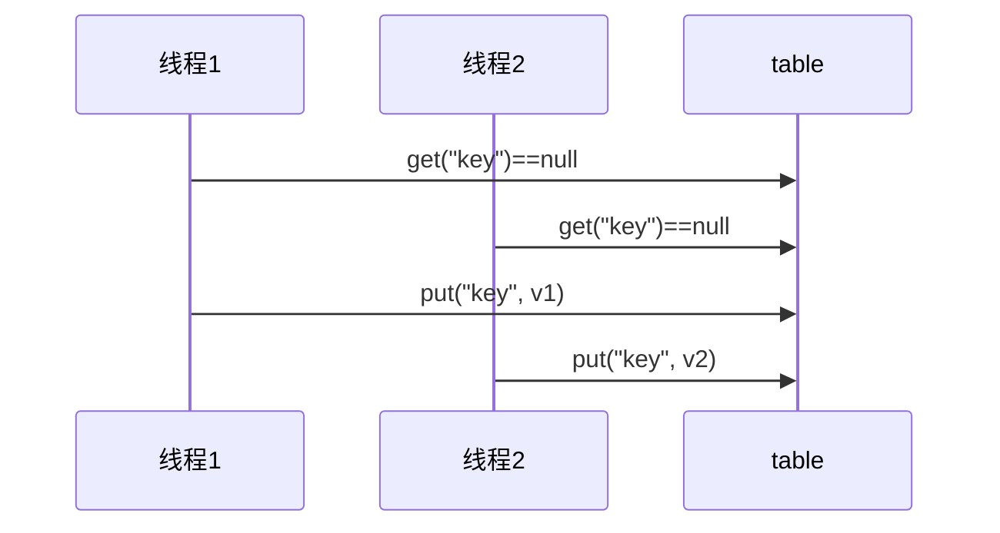
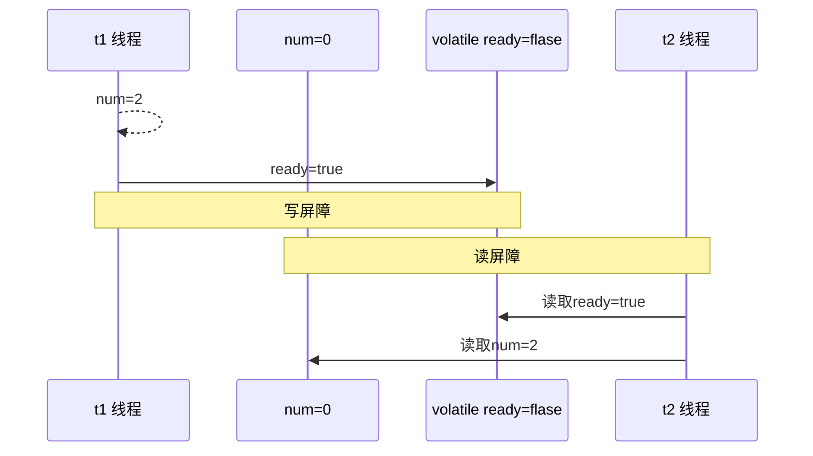
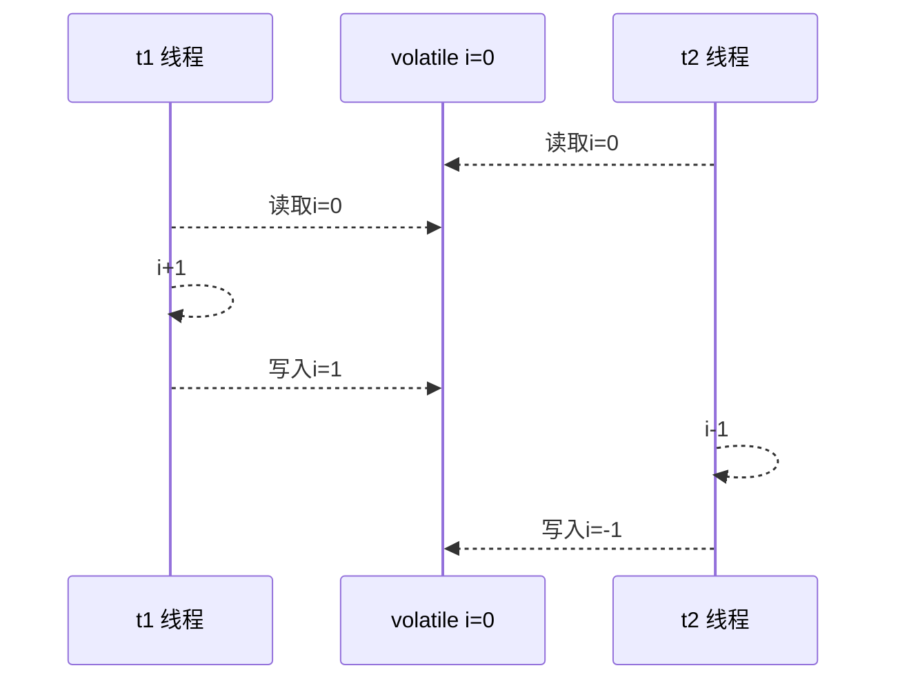
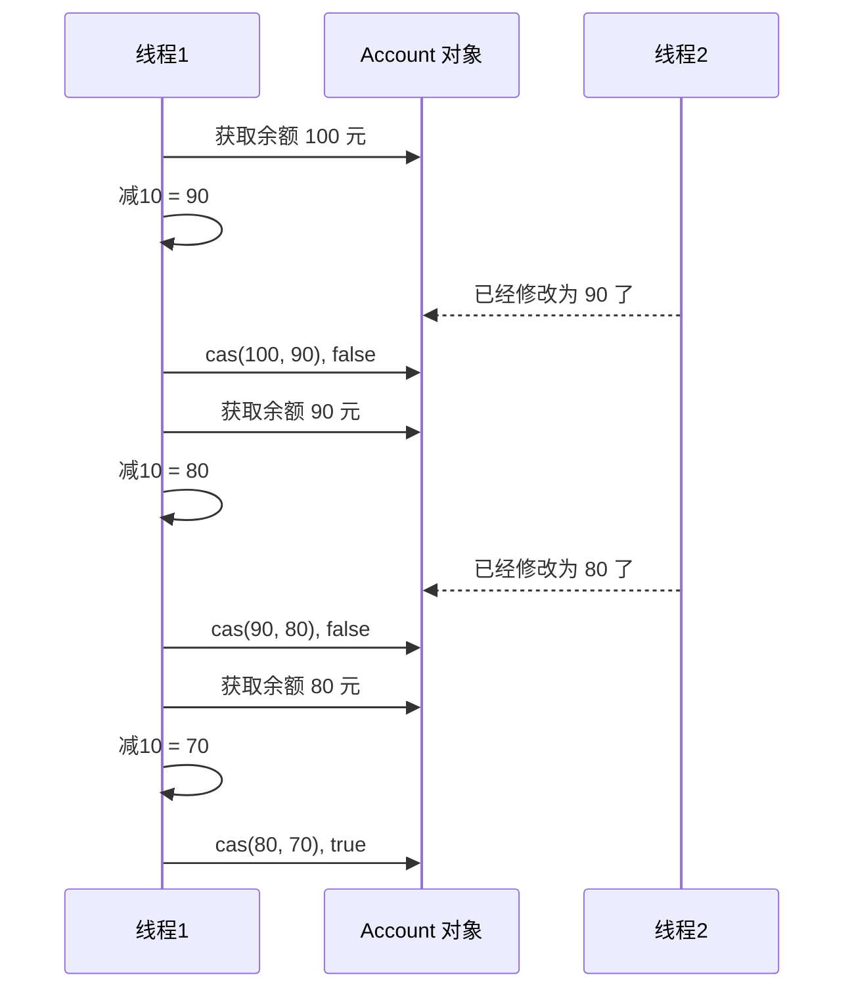
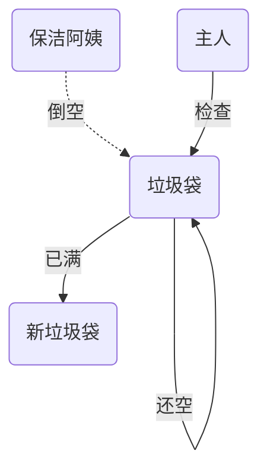
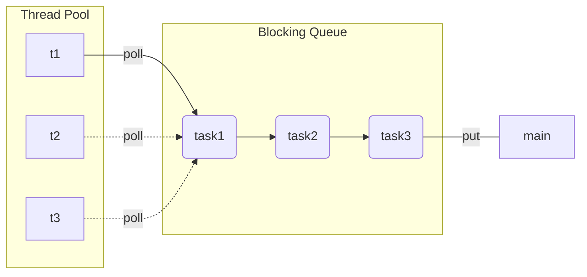

# Java线程

## 创建和运行线程

### 方法一，直接使用 Thread

```java
// 构造方法的参数是给线程指定名字，推荐给线程起个名字（也可以不含参数）
Thread t1 = new Thread("t1") {
 	@Override
 	// run 方法内实现了要执行的任务
 	public void run() {
 		System.out.println("hello thread");
 	}
};
// 启动线程
t1.start();
```

### 方法二，使用 Runnable 配合 Thread

把【线程】和【任务】（要执行的代码）分开，Thread 代表线程，Runnable 可运行的任务（线程要执行的代码）Test2.java

```java
// 创建任务对象
Runnable task2 = new Runnable() {
 	@Override
 	public void run() {
 		System.out.println("hello thread");
 	}
};
// 参数1 是任务对象
// 参数2 是线程名字，推荐给线程起个名字（可选）
Thread t2 = new Thread(task2, "t2");
// 启动线程
t2.start();
```

**小结：**

方法1 是把线程和任务合并在了一起，方法2 是把线程和任务分开了，用 Runnable 更容易与线程池等高级 API 配合，用 Runnable 让任务类脱离了 Thread 继承体系，更灵活。

通过查看源码可以发现，方法二其实到底还是通过方法一执行的！

###  方法三，FutureTask 配合 Thread

FutureTask 能够接收 Callable 类型的参数，用来处理有返回结果的情况 t1

```java
public static void main(String[] args) throws InterruptedException, ExecutionException {
    FutureTask<Integer> task = new FutureTask<>(new Callable<Integer>() {
        @Override
        public Integer call() throws Exception {
            System.out.println("running");
            Thread.sleep(1000);
            return 100;
        }
    });
    Thread t1 = new Thread(task, "t1");
    t1.start();
    System.out.println(task.get());
}
```

Future就是对于具体的Runnable或者Callable任务的执行结果进行取消、查询是否完成、获取结果。必要时可以通过get方法获取执行结果，该方法会阻塞直到任务返回结果。

Future提供了三种功能： 　　

1. 判断任务是否完成； 　　
2. 能够中断任务； 　　
3. 能够获取任务执行结果。

## 线程运行原理

栈帧、多线程、上下文切换

## Thread的常见方法


### start vs run

直接调用 `run()` 是在主线程中执行了 `run()`，没有启动新的线程；

使用 `start()` 是启动新的线程，通过新的线程间接执行 `run()`方法 中的代码。

### sleep vs yield

#### sleep

1. 调用 sleep 会让当前线程从 Running 进入 Timed Waiting 状态（有时限的等待）
2. 其它线程可以使用 interrupt 方法打断正在睡眠的线程，那么被打断的线程这时就会抛出 `InterruptedException`异常【注意：这里打断的是正在休眠的线程，而不是其它状态的线程】
3. 睡眠结束后的线程未必会立刻得到执行（需要分配到cpu时间片）
4. 建议用 TimeUnit 的 `sleep()` 代替 Thread 的 `sleep()`来获得更好的可读性

#### yield

1. 调用 yield 会让当前线程从 Running 进入 Runnable 就绪状态，然后调度执行其它线程
2. 具体的实现依赖于操作系统的任务调度器（可能没有其它的线程正在执行，虽然调用了yield方法，但是也没有用）

#### 线程优先级

线程优先级会提示（hint）调度器优先调度该线程，但它仅仅是一个提示，调度器可以忽略它。如果 cpu 比较忙，那么优先级高的线程会获得更多的时间片，但 cpu 闲时，优先级几乎没作用

### join

等待某个线程运行结束

代码如下：

```java
public class Main {
    static int r = 0;
    public static void main(String[] args) throws InterruptedException {
        test1();
    }
    private static void test1() throws InterruptedException {
        System.out.println("test1 开始");
        Thread t1 = new Thread(() -> {
            System.out.println("t1 开始");
            try {
                Thread.sleep(1000);
            }
            catch (InterruptedException e) {
                e.printStackTrace();
            }
            System.out.println("t1 结束");
            r = 10;
        }, "t1");
        t1.start();
        t1.join();	// 等待t1线程结束
        System.out.println("r=" + r);
        System.out.println("test1 结束");
    }
}
```

在主线程中调用`t1.join()`，则主线程会等待 t1 线程执行完之后再继续执行 test1


### interrupt方法详解

#### 打断阻塞的线程（sleep、wait、join）

打断阻塞的线程，会清空打断状态（重置为false），以 sleep 为例

```java
private static void test1() throws InterruptedException {
    Thread t1 = new Thread(() -> {
        try {
            Thread.sleep(1000);	// wait, join
        }
        catch (InterruptedException e) {
            e.printStackTrace();
        }
    }, "t1");
    t1.start();
    t1.join(500);
    t1.interrupt();
    System.out.println("打断状态: " + t1.isInterrupted());
}
```

输出为

```java
打断状态: false
java.lang.InterruptedException: sleep interrupted
	at java.lang.Thread.sleep(Native Method)
	at Main.lambda$test1$0(Main.java:16)
	at java.lang.Thread.run(Thread.java:748)
```

#### 打断正常运行的线程

打断正常运行的线程, 线程并不会暂停，只是调用方法`Thread.currentThread().isInterrupted()`的返回值为true，可以通过判断`Thread.currentThread().isInterrupted()`的值来手动停止线程

```java
public static void main(String[] args) throws InterruptedException {
    Thread t1 = new Thread(() -> {
        while (true) {
            boolean interrupt = Thread.currentThread().isInterrupted();
            if (interrupt) {
                System.out.println("被打断了");
                break;
            }
        }
    }, "t1");
    t1.start();
    Thread.sleep(1000);
    System.out.println("interrupt");
    t1.interrupt();
}
```

#### 两阶段终止模式

Two Phase Termination，就是考虑在一个线程T1中如何优雅地终止另一个线程T2。这里的优雅指的是给T2一个料理后事的机会（如释放锁）。（`stop()`和`System.exit(int)`方法都不适用，过于暴力）

如下所示：那么线程的`isInterrupted()`方法可以取得线程的打断标记，如果线程在睡眠`sleep`期间被打断，打断标记是不会变的，为false，但是`sleep`期间被打断会抛出异常，我们据此手动设置打断标记为`true`；如果是在程序正常运行期间被打断的，那么打断标记就被自动设置为`true`。处理好这两种情况那我们就可以放心地来料理后事啦！


代码如下：

```java
private static void test1() throws InterruptedException {
    Thread t1 = new Thread(() -> {
        while (true) {
            Thread current = Thread.currentThread();
            if (current.isInterrupted()) {
                System.out.println("被打断");
                break;
            }
            try {
                Thread.sleep(1000);
            }
            catch (InterruptedException e) {
                e.printStackTrace();
                current.interrupt(); // 由于打断阻塞的线程，会清空打断状态，所以要重新设置
            }
        }
    }, "t1");
    t1.start();
    t1.join(500);
    t1.interrupt();
}
```

## 守护线程

默认情况下，java进程需要等待所有的线程结束后才会停止，但是有一种特殊的线程，叫做守护线程。在其他线程全部结束的时候，即使守护线程还未结束、代码未执行完，java进程也会停止。普通线程t1可以调用`t1.setDeamon(true)`方法变成守护线程

> 注意 垃圾回收器线程就是一种守护线程 
>
> Tomcat 中的 Acceptor 和 Poller 线程都是守护线程，所以 Tomcat 接收到 shutdown 命令后，不会等待它们处理完当前请求

# 共享模型

## 共享带来的问题

### 问题分析

线程出现问题的根本原因是因为线程上下文切换，导致线程里的指令没有执行完就切换执行其它线程了，下面举一个例子

```Java
public class Main {
    static int count = 0;
    public static void main(String[] args) throws InterruptedException, ExecutionException {
        Thread t1 = new Thread(() -> {
            for (int i = 0; i < 50000; i++) {
                count++;
            }
        }, "t1");
        Thread t2 = new Thread(() -> {
            for (int i = 0; i < 50000; i++) {
                count--;
            }
        }, "t2");
        t1.start();
        t2.start();
        t1.join();
        t2.join();
        System.out.println(count);
    }
}
```

以上的结果可能是整数、负数、零。因为Java中对静态变量的自增、自减并不是原子操作，从字节码层面分析：

对静态变量`i`来说，`i++`和`i--`产生的字节码如下

```java
getstatic i 	// 获取静态变量i的值
iconst_1 		// 准备常量1
iadd 			// 自增
putstatic i 	// 将修改后的值存入静态变量i
    
getstatic i 	// 获取静态变量i的值
iconst_1 		// 准备常量1
isub 			// 自减
putstatic i 	// 将修改后的值存入静态变量i
```

### 临界区

+ 一个程序运行多线程本身是没有问题的

+ 问题出现在多个线程共享资源的时候

  + 多个线程同时对共享资源进行读操作本身也没有问题
  + 问题出现在对对共享资源同时进行读写操作时就有问题了

+ 先定义一个叫做临界区的概念：一段代码内如果存在对共享资源的多线程读写操作，那么称这段代码为临界区，如下

```Java
static int counter = 0;
static void increment(){
    // 临界区
	counter++;
}
static void decrement(){
    // 临界区
	counter--;
}
```

### 竞态条件

多个线程在临界区执行，那么由于代码的执行序列不同而导致结果无法预测，称为发生了**竞态条件**。

## synchronized解决方案

为了避免临界区中的竞态条件发生，由多种手段可以达到

- 阻塞式解决方案：synchronized ，Lock
- 非阻塞式解决方案：原子变量

现在讨论使用synchronized来进行解决，即俗称的**对象锁**，它采用互斥的方式让同一时刻至多只有一个线程持有对象锁，其他线程如果想获取这个锁就会阻塞住，这样就能保证拥有锁的线程可以安全的执行临界区内的代码，不用担心线程上下文切换

> 注意
>
> 虽然 java 中互斥和同步都可以采用 synchronized 关键字来完成，但它们还是有区别的： 
>
> + 互斥是保证临界区的竞态条件发生，同一时刻只能有一个线程执行临界区的代码
> + 同步是由于线程执行的先后、顺序不同、需要一个线程等待其它线程运行到某个点

### synchronized

语法

```java
synchronized(/*对象*/) {
    // 临界区
}
```

解决

```Java
public class Main {
    static int count = 0;
    static final Object lock = new Object();
    public static void main(String[] args) throws InterruptedException, ExecutionException {
        Thread t1 = new Thread(() -> {
            for (int i = 0; i < 50000; i++) {
                synchronized (lock) {
                    count++;
                }
            }
        }, "t1");
        Thread t2 = new Thread(() -> {
            for (int i = 0; i < 50000; i++) {
                synchronized (lock) {
                    count--;
                }
            }
        }, "t2");
        t1.start();
        t2.start();
        t1.join();
        t2.join();
        System.out.println(count);
    }
}
```

### synchronized原理

synchronized实际上利用对象保证了临界区代码的原子性，临界区内的代码在外界看来是不可分割的，不会被线程切换所打断


## 变量的线程安全分析

###  成员变量和静态变量

- 如果没有变量没有在线程间共享，那么变量是安全的
- 如果变量在线程间共享
  - 如果只有读操作，则线程安全
  - 如果有读写操作，则这段代码是临界区，需要考虑线程安全

### 局部变量

- 局部变量【局部变量被初始化为基本数据类型】是安全的（作用于栈帧中，线程私有）
- 局部变量引用的对象未必是安全的
  - 如果局部变量引用的对象没有引用线程共享的对象，那么是线程安全的
  - 如果局部变量引用的对象引用了一个线程共享的对象，那么要考虑线程安全的

考虑下面代码：

```java
public class Test {
    public static void main(String[] args) {
        UnsafeTest unsafeTest = new UnsafeTest();
        for (int i =0;i<100;i++){
            new Thread(()->{
                unsafeTest.method1();
            },"线程"+i).start();
        }
    }
}
class UnsafeTest{
    ArrayList<String> arrayList = new ArrayList<>();
    public void method1(){
        for (int i = 0; i < 100; i++) {
            method2();
            method3();
        }
    }
    private void method2() {
        arrayList.add("1");
    }
    private void method3() {
        arrayList.remove(0);
    }
}
```

**分析：**

无论哪个线程中的 method2 和method3 引用的都是同一个对象中的 list 成员变量：一个 ArrayList ，在添加一个元素的时候，它可能会有两步来完成：

1. 第一步，在 arrayList[Size] 的位置存放此元素； 第二步增大 Size 的值。
2. 在单线程运行的情况下，如果 Size = 0，添加一个元素后，此元素在位置 0，而且 Size=1；而如果是在多线程情下，比如有两个线程，线程 A 先将元素存放在位置 0。但是此时 CPU 调线程A暂停，线程 B 得到运行的机会。线程B也向此 ArrayList 添加元素，因为此时 Size 仍等于 0 （注意哦，我们假设的是添加一个元素是要两个步骤哦，而线程A仅仅完成了步骤1），所以线程B也将元素存放在位置0。然后线程A和线程B都继续运行，都增加 Size 的值。 那好，现在我们来看看 ArrayList 的情况，元素实际上只有一个，存放在位置 0，而 Size 却等于 2。这就是“线程不安全”了。

**解决方法：**

可以将list修改成局部变量，那么就不会有上述问题了。

```Java
class safeTest{
    public void method1(){
        ArrayList<String> arrayList = new ArrayList<>();
        for (int i = 0; i < 100; i++) {
        	method2(arrayList);
        	method3(arrayList);
        }
    }
    private void method2(ArrayList arrayList) {
        arrayList.add("1");
    }
    private void method3(ArrayList arrayList) {
        arrayList.remove(0);
    }
}
```

## 常见的线程安全类

1. String
2. Integer
3. StringBuffer
4. Random
5. Vector
6. HashTable
7. java.util.concurrent 包下的类

这里说它们是线程安全的是指，多个线程调用它们同一个实例的某个方法时，是线程安全的。也可以理解为它们的每个方法是原子的。

```Java
Hashtable table = new Hashtable();
new Thread(()->{
 	table.put("key", "value1");
}).start();
new Thread(()->{
 	table.put("key", "value2");
}).start();
```

### 线程安全类的方法组合

但注意它们多个方法的组合不是原子的，见下面分析

```java
Hashtable table = new Hashtable();
// 线程1，线程2
if( table.get("key") == null) {
 	table.put("key", value);
}
```



### 不可变类的线程安全

`String`和`Integer`等类都是不可变的类，因为其类内部状态是不可改变的，因此它们的方法都是线程安全的。

## Monitor

### 对象头

以 32 位虚拟机为例，普通对象的对象头结构如下，其中的Klass Word为指针，指向对应的Class对象；


数组对象：


其中 Mark Word 结构为


所以一个对象的结构如下：


### Monitor原理

Monitor被翻译为监视器或者管程

每个java对象都可以关联一个Monitor，如果使用`synchronized`给对象上锁（重量级），该对象头的Mark Word中就被设置为指向Monitor对象的指针


- 刚开始时Monitor中的Owner为null
- 当Thread-2 执行synchronized(obj)就会将Monitor的所有者 Owner 设置为 Thread-2，上锁成功，Monitor中同一时刻只能有一个Owner
- 当Thread-2 占据锁时，如果线程Thread-3，Thread-4也来执行synchronized(obj)，就会进入 EntryList 中变成`BLOCKED`状态
- Thread-2 执行完同步代码块的内容，然后唤醒 EntryList 中等待的线程来竞争锁，竞争时是非公平的
- 图中 WaitSet 中的 Thread-0，Thread-1 是之前获得过锁，但条件不满足进入 WAITING 状态的线程，后面讲wait-notify 时会分析

> 注意：
>
> + synchronized 必须是进入同一个对象的 monitor 才有上述的效果
> + 不加 synchronized 的对象不会关联monitor，不遵从以上规则

###  synchronized原理

分析如下代码

```java
static final Object lock=new Object();
static int counter = 0;
public static void main(String[] args) {
    synchronized (lock) {
        counter++;
    }
}
```

反编译后的部分字节码如下

```java
 0 getstatic #2  	// 取得 lock 引用（synchronized开始了）
 3 dup    			// 复制操作数栈栈顶的值放入栈顶，即复制了一份 lock 的引用
 4 astore_1			// 操作数栈栈顶的值弹出，即将 lock 的引用存到局部变量表中 slot1
 5 monitorenter 	// 将 lock 对象的 MarkWord 置为指向 Monitor 指针
 6 getstatic #3 
 9 iconst_1
10 iadd
11 putstatic #3 
14 aload_1 			// 从局部变量表中取得 lock 的引用，放入操作数栈栈顶
15 monitorexit 		// 将 lock 对象的 MarkWord 重置，唤醒 EntryList
16 goto 24
// 下面是异常处理指令，可以看到，如果出现异常，也能自动地释放锁
19 astore_2			// e -> slot 2
20 aload_1			// <- lock引用
21 monitorexit		// 将 lock 对象的 MarkWord 重置，唤醒 EntryList
22 aload_2			// <- slot 2 (e)
23 athrow			// throw e
24 return
```

### synchronized原理进阶

#### 轻量级锁

轻量级锁的使用场景是：如果一个对象虽然有多个线程要对它进行加锁，但是加锁的时间是错开的（也就是没有人可以竞争的），那么可以使用轻量级锁来进行优化。

轻量级锁对使用者是透明的，即语法仍然是`synchronized`

假设有两个方法同步块，利用同一个对象加锁

```Java
static final Object obj = new Object();
public static void method1() {
     synchronized( obj ) {
         // 同步块 A
         method2();
     }
}
public static void method2() {
     synchronized( obj ) {
         // 同步块 B
     }
}
```

1. 每次指向到synchronized代码块时，都会创建锁记录（Lock Record）对象，每个线程都会包括一个锁记录的结构，锁记录内部可以储存对象的Mark Word和对象引用 reference

   

2. 让锁记录中的Object reference指向对象，并且尝试用cas(compare and swap)替换Object对象的Mark Word ，将Mark Word 的值存入锁记录中

   

3. 如果cas替换成功（即对象头原本状态是01），那么对象的对象头的Mark Word储存的就是锁记录的地址和状态00，如下所示

   

4. 如果cas失败，有两种情况：

   + 如果是其它线程已经持有了该Object的轻量级锁，那么表示有竞争，将进入锁膨胀阶段
   + 如果是自己的线程已经执行了synchronized进行加锁，那么再添加一条 Lock Record 作为重入的计数，新添加的锁记录地址字段值置为 null

   

5. 当线程退出synchronized代码块的时候，**如果获取的是取值为 null 的锁记录 **，表示有重入，这时重置锁记录，表示重入计数减一（lock record的数量）

   

6. 当线程退出synchronized代码块的时候，如果获取的锁记录取值不为 null，那么使用cas将Mark Word的值恢复给对象

   + 成功则解锁成功
   + 失败，则说明轻量级锁进行了锁膨胀或已经升级为重量级锁，进入重量级锁解锁流程

#### 锁膨胀

如果在尝试加轻量级锁的过程中，cas操作无法成功，有一种情况就是其它线程已经为这个对象加上了轻量级锁，这时就要进行锁膨胀，将轻量级锁变成重量级锁。

1. 当 Thread-1 进行轻量级加锁时，Thread-0 已经对该对象加了轻量级锁（状态为00）

   

2. 这时 Thread-1 加轻量级锁失败，进入锁膨胀流程

   + 为对象申请 Monitor 锁，让 Object 指向重量级锁（Monitor）地址
   + 然后自己进入Monitor 的 EntryList 变成 BLOCKED 状态（轻量级锁没有阻塞这一说法）

   

3. 当Thread-0 退出synchronized同步块时，使用cas将Mark Word的值恢复给对象头，失败。这时会进入重量级锁的解锁过程，即按照Monitor的地址找到Monitor对象，将Owner设置为null，唤醒 EntryList 中的 Thread-1 线程

#### 自旋优化

重量级锁竞争的时候，还可以使用自旋来进行优化（适用于多核cpu），如果当前线程自旋成功（即在自旋的时候持锁的线程已经退出了同步块，释放了锁），那么当前线程就可以避免阻塞，不用进行上下文切换就获得了锁。

1. 自旋重试成功的情况

   

2. 自旋重试失败的情况，自旋了一定次数还是没有等到持锁的线程释放锁，就会进入阻塞

   

+ 自旋会占用 CPU 时间，单核 CPU 自旋就是浪费，多核 CPU 自旋才能发挥优势。
+ 在 Java 6 之后自旋锁是自适应的，比如对象刚刚的一次自旋操作成功过，那么认为这次自旋成功的可能性会高，就多自旋几次；反之，就少自旋甚至不自旋，总之，比较智能。
+ Java 7 之后不能控制是否开启自旋功能。

#### 偏向锁

轻量级锁在没有竞争时（就自己这个线程），每次重入仍需要执行CAS操作。

Java 6 中引入了偏向锁来做进一步优化：只有第一次使用CAS将线程ID设置到对象的Mask Word头，**之后这个入锁线程再进行重入锁时，发现这个线程ID是自己的就表示没有竞争，不用重新CAS**。以后只要不发生竞争，这个对象就归该线程所有。

例如：

```java
static final Object obj = new Object();
public static void m1() {
    synchronized(obj) {
        // 同步块 A
        m2();
    }
}
public static void m2() {
    synchronized(obj) {
        // 同步块 B
        m3();
    }
}
public static void m3() {
    synchronized(obj) {
        // 同步块 C
    }
}
```


##### 偏向状态


一个对象创建时：

+ 如果开启了偏向锁（默认是开启的），那么对象创建后，Mark Word 最后三位的值 101，并且这时它的Thread，epoch，age都是0，在加锁的时候进行设置这些的值。可以加 VM 参数来禁用偏向锁：`-XX:-UseBiasedLocking`
+ 偏向锁默认是延迟的，不会在程序启动时立刻生效，如果想避免延迟，可以加 VM 参数来禁用延迟：`-XX:BiasedLockingStartupDelay=0`来禁用延迟。
+ 如果没有开启偏向锁，那么对象创建后，Mark Word 最后三位的值 001，这时它的 hashcode，age 都是 0，第一次用到 hashcode 时才会赋值。
+ 注意：处于偏向锁的对象解锁后，线程 id 仍存储于对象头中。

#####  撤销偏向锁 - hashcode方法

当调用对象的 hashcode 方法的时候就会撤销这个对象的偏向锁，因为使用偏向锁时没有位置存`hashcode`的值了

#####  撤销偏向锁 - 其它线程使用对象

其他线程使用对象时，会导致偏向锁撤销变成轻量级锁。但注意，没有线程对同一个对象进行锁竞争（否则会变成重量级锁），也就是说不同线程使用对象的时间是错开的。

##### 撤销偏向锁 - 调用 wait/notify

会使对象的锁变成重量级锁，因为wait/notify方法只有重量级锁才支持

##### 批量重偏向

如果对象虽然被多个线程访问，但是没有竞争，这时偏向了线程T1的对象仍有机会重新偏向T2，重偏向会重置对象的 ThreadID。

当撤销偏向锁次数超过阈值（默认撤销20个对象偏向锁）后，jvm会这样觉得，我是不是偏向错了呢，于是会在给这些对象加锁时重新偏向至加锁线程。

##### 批量撤销

当撤销偏向锁次数超过阈值（默认40次）后，jvm会这样觉得，自己确实偏向错了，根本就不该偏向。于是整个类的所有对象都会变为不可偏向的，新建的对象也是不可偏向的。

#### 锁消除

若在代码中把锁加在了本来就是线程安全的代码块中，那么`JIT(即时编译器)`就会进行优化，撤销这个影响效率的锁

分析下面代码

```java
public class Test {
    static int x = 0;
    public void method1() throws Exception {
        x++;
    }
    public void method2() throws Exception {
        Object obj = new Object();
        synchronized(obj) {
            x++;
        }
    }
}
```

那么`method2`方法中的锁就会被优化消除掉。

## wait & notify

### 原理


+ Owner 线程发现条件不满足，调用 wait 方法，即可进入 WaitSet 中变为 WAITING 状态
+ BLOCKED 和 WAITING 的线程都处于阻塞状态，不占用 CPU 时间片
+ BLOCKED 线程会在 Owner 线程释放锁时唤醒
+ WAITING 线程会在 Owner 线程调用 notify 或 notifyAll 时唤醒，但唤醒后并不意味着立刻获得锁，仍需进入 EntryList 重新竞争

### API介绍

详见官方文档：

[https://docs.oracle.com/javase/8/docs/api/](https://docs.oracle.com/javase/8/docs/api/)

`obj.wait()`、`obj.notify()`、`obj.notifyAll()`

他们都是线程间进行协作的手段，都属于 `Object` 对象的方法。**必须获得此对象的锁**，才能调用这几个方法。

### wait vs sleep

1. sleep 是 Thread 方法，而 wait 是 Object 的方法；
2. sleep 不需要强制和 synchronized 配合使用，但 wait 需要和 synchronized 一起用；
3. sleep 在睡眠的同时，不会释放对象锁，但 wait 在等待的时候会释放对象锁。
4. 状态都是 TIMED_WAITING

```java
synchronized(lock) {
    while(条件不成立) {
        lock.wait();
    }
    // 干活
}

// 另一个线程
synchronized(lock) {
    lock.notifyAll(); // 唤醒所有wait的线程，让他们进入EntryList中去竞争锁
}
```

### 同步模式之保护性暂停

即 Guarded Suspension，用在一个线程等待另一个线程的执行结果，要点：

1. 有一个结果需要从一个线程传递到另一个线程，让他们关联同一个 GuardedObject
2. 如果有结果不断从一个线程到另一个线程那么可以使用消息队列（见生产者/消费者）
3. JDK 中，join 的实现、Future 的实现，采用的就是此模式
4. 因为要等待另一方的结果，因此归类到同步模式


### 异步模式之生产者/消费者

要点

1. 与前面的保护性暂停中的 GuardObject 不同，不需要产生结果和消费结果的线程一一对应
2. 消费队列可以用来平衡生产和消费的线程资源
3. 生产者仅负责产生结果数据，不关心数据该如何处理，而消费者专心处理结果数据
4. 消息队列是有容量限制的，满时不会再加入数据，空时不会再消耗数据
5. JDK 中各种阻塞队列，采用的就是这种模式

“异步”的意思就是生产者产生消息之后消息没有被立刻消费，而“同步模式”中，消息在产生之后被立刻消费了。


## park & unpark

### 基本使用

它们是 LockSupport 类中的方法

```Java
// 暂停当前线程
LockSupport.park();
// 恢复某个线程的运行
LockSupport.unpark(暂停的线程对象);
```

### 特点

与 Object 的 wait & notify 相比

+ wait，notify 和 notifyAll 必须配合 Object Monitor 一起使用，而 park & unpark 不必
+ park & unpark 是以线程为单位来【阻塞】和【唤醒】线程，而 notify 只能随机唤醒一个等待线程，notifyAll 是唤醒所有等待线程，就不那么【精确】
+ park & unpark 可以先 unpark，而 wait & notify 不能先 notify
+ park & unpark 的设计原理核心是**许可**：park 是等待一个许可，unpark 是为某线程提供一个许可。

### 原理

每个线程都有自己的一个 Parker 对象，由三部分组成 \_counter， \_cond 和 \_mutex，打个比喻：

1. 线程就像一个旅人，Parker 就像他随身携带的背包，条件变量 \_cond 就好比背包中的帐篷。\_counter 就好比背包中的备用干粮（0 为耗尽，1 为充足）
2. 调用 park 就是要看需不需要停下来歇息
   + 如果备用干粮耗尽，那么钻进帐篷歇息

   + 如果备用干粮充足，那么不需停留，继续前进
3. 调用 unpark，就好比令干粮充足
   + 如果这时线程还在帐篷，就唤醒让他继续前进

   + 如果这时线程还在运行，那么下次他调用 park 时，仅是消耗掉备用干粮，不需停留继续前进
     + 因为背包空间有限，多次调用 unpark 仅会补充一份备用干粮

#### 先调用 park

1. 当前线程调用 Unsafe.park() 方法
2. 检查 \_counter ，本情况为 0，这时，获得 \_mutex 互斥锁（\_mutex 对象有个等待队列 \_cond）
3. 线程进入 \_cond 条件变量阻塞
4. 设置 \_counter = 0


1. 调用 Unsafe.unpark(Thread-0) 方法，设置 \_counter 为 1
2. 唤醒 \_cond 条件变量中的 Thread-0
3. Thread-0 恢复运行
4. 设置 \_counter 为 0


#### 先调用 unpark

1. 调用 Unsafe.unpark(Thread-0) 方法，设置 \_counter 为 1
2. 当前线程调用 Unsafe.park() 方法
3. 检查 \_counter ，本情况为 1，这时线程无需阻塞，继续运行
4. 设置 \_counter 为 0


## 线程状态转换


1. **RUNNABLE <--> WAITING**

   线程用synchronized(obj)获取了对象锁后

   1. 调用obj.wait()方法时，t 线程从RUNNABLE --> WAITING
   2. 调用obj.notify()，obj.notifyAll()，t.interrupt()时
      1. 竞争锁成功，t 线程从WAITING --> RUNNABLE
      2. 竞争锁失败，t 线程从WAITING --> BLOCKED

2. **RUNNABLE <--> WAITING**

   1. 当前线程调用 LockSupport.park() 方法会让当前线程从 RUNNABLE --> WAITING
   2. 调用 LockSupport.unpark(目标线程) 或调用了线程 的 interrupt() ，会让目标线程从 WAITING --> RUNNABLE

3. **RUNNABLE <--> WAITING**

   1. 当前线程调用 t.join() 方法时，当前线程从 RUNNABLE --> WAITING 注意是当前线程在t 线程对象的监视器上等待
   2. t 线程运行结束，或调用了当前线程的 interrupt() 时，当前线程从 WAITING --> RUNNABLE

4. **RUNNABLE <--> TIMED_WAITING**

   t 线程用 synchronized(obj) 获取了对象锁后

   1. 调用 obj.wait(long n) 方法时，t 线程从 RUNNABLE --> TIMED_WAITING
   2. t 线程等待时间超过了 n 毫秒，或调用 obj.notify() ， obj.notifyAll() ， t.interrupt() 时
      1. 竞争锁成功，t 线程从 TIMED_WAITING --> RUNNABLE
      2. 竞争锁失败，t 线程从 TIMED_WAITING --> BLOCKED

5. **RUNNABLE <--> TIMED_WAITING**

   1. 当前线程调用 t.join(long n) 方法时，当前线程从 RUNNABLE --> TIMED_WAITING 注意是当前线程在t 线程对象的监视器上等待
   2. 当前线程等待时间超过了 n 毫秒，或t 线程运行结束，或调用了当前线程的 interrupt() 时，当前线程从 TIMED_WAITING --> RUNNABLE

6. **RUNNABLE <--> TIMED_WAITING**

   1. 当前线程调用 Thread.sleep(long n) ，当前线程从 RUNNABLE --> TIMED_WAITING
   2. 当前线程等待时间超过了 n 毫秒或调用了线程 的 interrupt() ，当前线程从 TIMED_WAITING --> RUNNABLE

7. **RUNNABLE <--> TIMED_WAITING**

   1. 当前线程调用 LockSupport.parkNanos(long nanos) 或 LockSupport.parkUntil(long millis) 时，当前线 程从 RUNNABLE --> TIMED_WAITING
   2. 调用 LockSupport.unpark(目标线程) 或调用了线程 的 interrupt() ，或是等待超时，会让目标线程从 TIMED_WAITING--> RUNNABLE

## 活跃性

活跃性相关的一系列问题都可以用 ReentrantLock 进行解决。

### 死锁

有这样的情况：一个线程需要同时获取多把锁，这时就容易发生死锁。例如 t1 线程获得 A 对象锁，接下来想获取 B 对象的锁；t2 线程获得 B 对象锁，接下来想获取 A 对象的锁。

### 活锁

活锁出现在两个线程互相改变对方的结束条件，最后谁也无法结束，举个例子：

```java
static volatile int count = 10;
new Thread(() -> {
    // 期望减到 0 退出循环
    while (count > 0) {
        sleep(0.2);
        count--;
    }
}, "t1").start();
new Thread(() -> {
    // 期望超过 20 退出循环
    while (count < 20) {
        sleep(0.2);
        count++;
    }
}, "t2").start();
```

### 饥饿

一个线程由于优先级太低，始终得不到 CPU 调度执行，也不能够结束。

## ReentrantLock

相对于 synchronized 它具备如下特点

1. 可中断
2. 可以设置超时时间
3. 可以设置为公平锁
4. 支持多个条件变量，即对与不满足条件的线程可以放到不同的集合中等待

与 synchronized 一样，都支持可重入

基本语法

```java
// 获得锁
reentrantLock.lock();
try {
    // 临界区
} finally {
    // 释放锁
    reentrantLock.unlock();
}
```

### 可重入

可重入是指同一个线程如果首次获得了这把锁，那么因为它是这把锁的拥有者，因此有权利再次获取这把锁

如果是不可重入锁，那么第二次获得锁时，自己也会被锁挡住

### 可打断

```java
private static ReentrantLock lock = new ReentrantLock();
public static void main(String[] args) {
	new Thread(() -> {
        try {
            // 如果没有竞争，那么此方法就会获取lock对象锁
            // 如果有竞争就进入阻塞队列，但可以被其他线程用interrupt()方法打断
            System.out.println("尝试获得锁");
            lock.lockInterruptibly();
        } catch (InterruptedException e) {
            e.printStackTrace();
            System.out.println("没有获得锁，返回");
            return;
        }
        try {
            System.out.println("获得锁");
        } finally {
            lock.unlock();
        }
    }, "t1").start();
}
```

### 锁超时

方法`reentrantLock.tryLock()`尝试获得锁

```java
private static ReentrantLock lock = new ReentrantLock();
public static void main(String[] args) {
    Thread t1 = new Thread(() -> {
        System.out.println("尝试获得锁");
        try {
            // 等待 1 秒
            if (!lock.tryLock(1, TimeUnit.SECONDS)) {
                System.out.println("获取不到锁");
                return;
            }
        }
        catch (InterruptedException e) {
            e.printStackTrace();
        }
        try {
            System.out.println("获得锁");
        } finally {
            lock.unlock();
        }
    }, "t1");
    t1.start();
}
```

#### 锁超时解决哲学家就餐问题

锁超时可解决哲学家就餐问题，利用`reentrantLock.tryLock()`方法尝试获得锁

```java
while (true) {
    // 尝试获得左手筷子
    if (left.tryLock()) {
        try {
            // 尝试获得右手筷子
            if (right.tryLock()) {
                try {
                    eat();
                } finally {
                    right.unlock();
                }
            }
        } finally {
            left.unlock(); //释放自己手里的筷子
        }
    }
}
```

### 公平锁

synchronized 锁中，在 Entrylist 等待的锁在竞争时不是按照先到先得来获取锁的，所以说 synchronized 锁时不公平的

ReentranLock 锁默认是不公平的，但是可以通过设置实现公平锁。

本意是为了解决饥饿问题，但是公平锁一般没有必要，会降低并发度，使用 tryLock 也可以实现。

### 条件变量

synchronized 中也有条件变量，就是 waitSet 休息室，当条件不满足时进入 waitSet 等待 

ReentrantLock 的条件变量比 synchronized 强大之处在于，它是支持多个条件变量的，这就好比

+ synchronized 是那些不满足条件的线程都在一间休息室等消息
+ 而 ReentrantLock 支持多间休息室，有专门等烟的休息室、专门等早餐的休息室，唤醒时也是按休息室来唤醒

使用流程：

1. await 前需要获得锁
2. await 执行后，会释放锁，进入 conditionObject 等待
3. await 的线程被唤醒（或打断、或超时）时重新竞争 lock 锁，执行唤醒操作的线程也必须先获得锁
4. 竞争 lock 锁成功后，从 await 后继续执行

```java
private static ReentrantLock lock = new ReentrantLock();
public static void main(String[] args) {
    // 创建新的条件变量（休息室）
    Condition condition1 = lock.newCondition();
    Condition condition2 = lock.newCondition();

    lock.lock();
    // 进入休息室等待
    try {
        condition1.await();
        // do something
        condition2.signal();
    } catch (InterruptedException e) {
        e.printStackTrace();
    } finally {
        lock.unlock();
    }
}
```

## 同步模式之顺序控制

### 固定运行顺序

保证执行顺序是先 t2 后 t1，两种解决方案，代码如下：

#### wait & notify 版

```java
private static final Object lock = new Object();
static boolean t2run = false;
public static void main(String[] args) {
    Thread t1 = new Thread(() -> {
        synchronized (lock) {
            while (!t2run) {
                try {
                    lock.wait();
                } catch (InterruptedException e) {
                    e.printStackTrace();
                }
            }
            System.out.println("t1");
        }
    }, "t1");
    Thread t2 = new Thread(() -> {
        synchronized (lock) {
            System.out.println("t2");
            t2run = true;
            lock.notify();
        }
    }, "t2");
    t1.start();
    t2.start();
}
```

#### park & unpark 版

```java
Thread t1 = new Thread(() -> {
    LockSupport.park();
    System.out.println("t1");
}, "t1");
Thread t2 = new Thread(() -> {
    System.out.println("t2");
    LockSupport.unpark(t1);
}, "t2");
t1.start();
t2.start();
```

### 交替输出

线程 1 输出 a 5 次，线程 2 输出 b 5 次，线程 3 输出 c 5 次。现在要求输出 abcabcabcabcabc，不同方案实现代码如下：

#### wait & notify 版

```java
public class Test {
    public static void main(String[] args) {
        WaitNotify wn = new WaitNotify(1, 5);
        new Thread(() -> wn.print("a", 1, 2)).start();
        new Thread(() -> wn.print("b", 2, 3)).start();
        new Thread(() -> wn.print("c", 3, 1)).start();
    }
}
class WaitNotify {
    private int flag; // 等待标记
    private int loopNumber;
    public WaitNotify(int flag, int loopNumber) {
        this.flag = flag;
        this.loopNumber = loopNumber;
    }
    public void print(String str, int waitFlag, int nextFlag) {
        for (int i = 0; i < loopNumber; i++) {
            synchronized (this) {
                while (flag != waitFlag) {
                    try {
                        this.wait();
                    } catch (InterruptedException e) {
                        e.printStackTrace();
                    }
                }
                System.out.print(str);
                flag = nextFlag;
                this.notifyAll();
            }
        }
    }
}
```

#### await & signal 版

```java
public class Test {
    public static void main(String[] args) throws InterruptedException {
        AwaitSignal awaitSignal = new AwaitSignal(5);
        Condition a = awaitSignal.newCondition();
        Condition b = awaitSignal.newCondition();
        Condition c = awaitSignal.newCondition();
        new Thread(() -> awaitSignal.print("a", a, b)).start();
        new Thread(() -> awaitSignal.print("b", b, c)).start();
        new Thread(() -> awaitSignal.print("c", c, a)).start();
        Thread.sleep(1000);
        awaitSignal.lock();
        try {
            a.signal();	//由于三个线程都进入等待，需要由主线程做唤醒操作
        } finally {
            awaitSignal.unlock();
        }
    }
}
class AwaitSignal extends ReentrantLock {
    private int loopNumber;
    public AwaitSignal(int loopNumber) {
        this.loopNumber = loopNumber;
    }
    public void print(String str, Condition cur, Condition next) {
        for (int i = 0; i < loopNumber; i++) {
            lock();
            try {
                cur.await();
                System.out.print(str);
                next.signal();
            } catch (InterruptedException e) {
                e.printStackTrace();
            }
            finally {
                unlock();
            }
        }
    }
}
```

#### park & unpark 版

```java
public class Test {
    static Thread t1;
    static Thread t2;
    static Thread t3;
    public static void main(String[] args) throws InterruptedException {
        ParkUnpark pu = new ParkUnpark(5);
        t1 = new Thread(() -> pu.print("a", t2));
        t2 = new Thread(() -> pu.print("b", t3));
        t3 = new Thread(() -> pu.print("c", t1));
        t1.start();
        t2.start();
        t3.start();
        LockSupport.unpark(t1);
    }
}
class ParkUnpark {
    private int loopNumber;
    public ParkUnpark(int loopNumber) {
        this.loopNumber = loopNumber;
    }
    public void print(String str, Thread next) {
        for (int i = 0; i < loopNumber; i++) {
            LockSupport.park();
            System.out.print(str);
            LockSupport.unpark(next);
        }
    }
}
```

## 小结

本章我们需要重点掌握的是

1. 分析多线程访问共享资源时，哪些代码片段属于临界区
2. 使用 synchronized 互斥解决临界区的线程安全问题
   1. 掌握 synchronized 锁对象语法
   2. 掌握 synchronzied 加载成员方法和静态方法语法
   3. 掌握 wait/notify 同步方法
3. 使用 lock 互斥解决临界区的线程安全问题 掌握 lock 的使用细节：可打断、锁超时、公平锁、条件变量
4. 学会分析变量的线程安全性、掌握常见线程安全类的使用
5. 了解线程活跃性问题：死锁、活锁、饥饿
6. 应用方面
   1. **互斥：使用 synchronized 或 Lock 达到共享资源互斥效果，实现原子性效果，保证线程安全。**
   2. **同步：使用 wait/notify 或 Lock 的条件变量来达到线程间通信效果。**
7. 原理方面
   1. monitor、synchronized 、wait/notify 原理
   2. synchronized 进阶原理
   3. park & unpark 原理
8. 模式方面
   1. 同步模式之保护性暂停
   2. 异步模式之生产者消费者
   3. 同步模式之顺序控制

# 共享模型之内存

## Java内存模型

JMM 即 Java Memory Model，它从java层面定义了主存、工作内存抽象概念，底层对应着 CPU 寄存器、缓存、硬件内存、CPU 指令优化等。JMM 体现在以下几个方面

1. 原子性 - 保证指令不会受到线程上下文切换的影响
2. 可见性 - 保证指令不会受 cpu 缓存的影响
3. 有序性 - 保证指令不会受 cpu 指令并行优化的影响

## 可见性

### 退不出的循环

先来看一个现象，main 线程对 run 变量的修改对于 t 线程不可见，导致了 t 线程无法停止：

```java
public class Main {
    static boolean run = true;
    public static void main(String[] args) throws InterruptedException {
        Thread t = new Thread(() -> {
            while (run) {
                // running
            }
        });
        t.start();
        Thread.sleep(1000);
        System.out.println("run stop");
        run = false;  // 线程t不会如预想的停下来
    }
}
```

**原因如下**：

1. 初始状态，t 线程刚开始从主内存读取了 run 的值到工作内存


2. 因为 t 线程频繁地从主存中读取 run 的值，JIT 即时编译器会将 run 的值缓存至自己工作内存中的高速缓存中，减少对主存中 run 的访问，提高效率


3. 一秒之后，main 线程修改了 run 的值，并同步至主存，而 t 是从自己工作内存中的高速缓存中读取这个变量 的值，结果永远是旧值


### 解决方法

**volatile**（表示易变关键字的意思），它可以用来修饰成员变量和静态成员变量，可以避免线程从自己的工作缓存中查找变量的值，必须到主存中获取它的值，线程操作 volatile 变量都是直接操作主存。

```java
public class Main {
    volatile static boolean run = true;
    public static void main(String[] args) throws InterruptedException {
        Thread t = new Thread(() -> {
            while (run) {
                // running
            }
        });
        t.start();
        Thread.sleep(1000);
        System.out.println("run stop");
        run = false;  // 线程t会停下来
    }
}
```

使用 synchronized 关键字也有相同的效果！在 Java 内存模型中，synchronized 规定，线程在加锁时，先清空工作内存 → 在主内存中拷贝最新变量的副本到工作内存 → 执行完代码 → 将更改后的共享变量的值刷新到主内存中 → 释放互斥锁。

```java
public class Main {
    static boolean run = true;
    final static Object lock = new Object();
    public static void main(String[] args) throws InterruptedException {
        Thread t = new Thread(() -> {
            while (true) {
                synchronized(lock) {
                    if (!run) {
                        break;
                    }                    
                }
                // running
            }
        });
        t.start();
        Thread.sleep(1000);
        System.out.println("run stop");
        synchronized(lock) {
        	run = false;  // 线程t会停下来
        }
    }
}
```

### 可见性 vs 原子性

前面例子体现的实际就是可见性，它保证的是在多个线程之间一个线程对 volatile 变量的修改对另一个线程可见， 而不能保证原子性，仅用在**一个写线程，多个读线程**的情况。

上例从字节码理解是这样的：

```java
getstatic run // 线程 t 获取 run true
getstatic run // 线程 t 获取 run true
getstatic run // 线程 t 获取 run true
getstatic run // 线程 t 获取 run true
putstatic run // 线程 main 修改 run 为 false， 仅此一次
getstatic run // 线程 t 获取 run false 
```

比较一下线程安全中的例子：两个线程，一个 `i++` 一个 `i--`，只能保证看到最新值，不能解决指令交错（只保证读到的数据是最新值）。

```java
// 假设i的初始值为0
getstatic i // 线程2-获取静态变量i的值 线程内i=0
getstatic i // 线程1-获取静态变量i的值 线程内i=0
iconst_1 	// 线程1-准备常量1
iadd 		// 线程1-自增 线程内i=1
putstatic i // 线程1-将修改后的值存入静态变量i 静态变量i=1
iconst_1 	// 线程2-准备常量1
isub 		// 线程2-自减 线程内i=-1
putstatic i // 线程2-将修改后的值存入静态变量i 静态变量i=-1 
```

> **注意**
> synchronized 语句块既可以保证代码块的原子性，也同时保证代码块内变量的可见性。但缺点是 synchronized 是属于重量级操作，性能相对更低。
>
> 如果在前面示例的死循环中加入 System.out.println() 会发现即使不加 volatile 修饰符，线程 t 也能正确看到对 run 变量的修改了，这是因为 println 方法里面有 synchronized 修饰。

### 模式之两阶段终止

除了使用 interrupt 方法，还可以使用 volatile 关键字来实现两阶段终止模式。

```java
private volatile boolean stop = false;
private Thread monitorThread;
// 启动监控线程
public void start() {
    monitorThread = new Thread(() -> {
        while (true) {
            Thread current = Thread.currentThread();
            if (stop) {
                System.out.println("料理后事");
                break;
            }
            try {
                Thread.sleep(1000);
                System.out.println("执行监控");
            }
            catch (InterruptedException e) {
            }
        }
    }, "monitor");
    monitorThread.start();
}
// 停止监控线程
public void stop() {
    stop = true;
    monitorThread.interrupt(); // 作用是打断线程的sleep状态，立即stop而不必等待这次sleep结束
}
```

### 同步模式之Balking

定义：Balking（犹豫）模式用在一个线程发现另一个线程或本线程已经做了某一件相同的事，那么本线程就无需再做了，直接结束返回。（只执行一次）

以上面的代码为例，实现同步模式，可以用一个 boolean 成员变量来记录某个方法是否被执行过。第一次执行，boolean : false --> true。非第一次执行，boolean : true，则直接返回结束。（**注意**，这一部分代码需要用 synchronized 来保护，由于可能有多个线程来写，因此不能用 volatile）

## 有序性

### 指令重排

JVM 会在不影响正确性的前提下，可以调整语句的执行顺序，分析下面代码：

```java
static int i;
static int j;
// 在某个线程内执行如下赋值操作
i = ...;
j = ...;
```

不论是先执行 i 还是先执行 j，对最终的结果不会产生影响。

这种特性称为**指令重排**，单线程下指令重排和组合可以实现指令级并行，但多线程下指令重排会影响正确性。

### 诡异的结果

```java
int num = 0;
boolean ready = false; 
// 线程1 执行此方法
public void actor1(I_Result r) {
 	if(ready) {
 		r.r1 = num + num;
	} 
 	else {
 		r.r1 = 1;
 	}
}
// 线程2 执行此方法
public void actor2(I_Result r) {
 	num = 2;
 	ready = true;
}
```

I_Result 是一个对象，有一个属性 r1 用来保存结果，可能的结果有以下几种：

> 情况1：线程1 先执行，这时 ready = false，所以进入 else 分支结果为 1
>
> 情况2：线程2 先执行 num = 2，但没来得及执行 ready = true，线程1 执行，还是进入 else 分支，结果为1
>
> 情况3：线程2 执行到 ready = true，线程1 执行，这回进入 if 分支，结果为 4（因为 num 已经执行过了）
>
> 情况4：线程2 执行 ready = true（num 还没有执行），切换到线程1，进入 if 分支，相加为 0，再切回线程2 执行 num = 2，结果为 0

这种现象叫做指令重排，是 JIT 编译器在运行时的一些优化。

重排序也需要遵守一定规则：

1. 重排序操作不会对存在数据依赖关系的操作进行重排序。比如：a=1;b=a; 这个指令序列，由于第二个操作依赖于第一个操作，所以在编译时和处理器运行时这两个操作不会被重排序。
2. 重排序是为了优化性能，但是不管怎么重排序，单线程下程序的执行结果不能被改变。比如：a=1;b=2;c=a+b;这三个操作，第一步（a=1)和第二步(b=2)由于不存在数据依赖关系，所以可能会发生重排序，但是c=a+b这个操作是不会被重排序的，因为需要保证最终的结果一定是c=a+b=3。

### 解决方法

重排序在单线程模式下是一定会保证最终结果的正确性，但是在多线程环境下，就会出现问题。

解决方法：volatile 修饰的变量，可以禁用指令重排。

## volatile原理

volatile 的底层实现原理是**内存屏障**，Memory Barrier（Memory Fence）

+ 对 volatile 变量的写指令后会加入写屏障
+ 对 volatile 变量的读指令前会加入读屏障

### 如何保证可见性

+ 写屏障（sfence）保证在该屏障之前的，对共享变量的改动，都同步到主存当中

```java
public void actor2(I_Result r) {
	num = 2;
    ready = true; // ready是被 volatile 修饰的, 赋值带写屏障
    // 写屏障
}
```

+ 读屏障（lfence）保证在该屏障之后，对共享变量的读取，加载的是主存中最新数据

```java
public void actor1(I_Result r) {
 	// 读屏障
 	// ready 是被 volatil e修饰的, 读取值带读屏障
 	if(ready) {
 		r.r1 = num + num;
 	} else {
 		r.r1 = 1;
 	}
}
```



### 如何保证有序性

+ 写屏障会确保指令重排序时，不会将写屏障之前的代码排在写屏障之后

```java
public void actor2(I_Result r) {
	num = 2;
    ready = true; // ready是被 volatile 修饰的, 赋值带写屏障
    // 写屏障
}
```

+ 读屏障会确保指令重排序时，不会将读屏障之后的代码排在读屏障之前

```java
public void actor1(I_Result r) {
 	// 读屏障
 	// ready 是被 volatil e修饰的, 读取值带读屏障
 	if(ready) {
 		r.r1 = num + num;
 	} else {
 		r.r1 = 1;
 	}
}
```

还是那句话，不能解决指令交错：

1. 写屏障仅仅是保证之后的读能够读到最新的结果，但不能保证其它线程的读跑到它前面去
2. 而有序性的保证也只是保证了本线程内相关代码不被重排序



## happens-before规则

happens-before 规定了对共享变量的写操作对其他线程的读操作可见，它是可见性与有序性的一套规则总结，抛开以下 happens-before 规则，JMM 并不能保证一个线程对共享变量的写，对其他线程对该共享变量的读可见。

下面说的变量都是指成员变量或静态成员变量：

1. 线程解锁 m 之前对变量的写，对于接下来对 m 加锁的其他线程对该变量的读可见

```java
static int x;
static Object m = new Object();

new Thread(()->{
    synchronized(m) {
        x = 10;
    }
},"t1").start();

new Thread(()->{
    synchronized(m) {
        System.out.println(x);
    }
},"t2").start();
```

2. 线程对 volatile 变量的写，对接下来其它线程对该变量的读可见

```java
volatile static int x;

new Thread(()->{
 	x = 10;
},"t1").start();

new Thread(()->{
 	System.out.println(x);
},"t2").start();
```

3. 线程 start 前对变量的写，对该线程开始后对该变量的读可见

```java
static int x;
x = 10;

new Thread(()->{
 	System.out.println(x);
},"t2").start();
```

4. 线程结束前对变量的写，对其它线程得知它结束后的读可见（比如其它线程调用 `t1.isAlive()` 或 `t1.join()` 等待它结束）

```java
static int x;

Thread t1 = new Thread(()->{
 	x = 10;
},"t1");

t1.start();
t1.join();
System.out.println(x);
```

5. 线程 t1 打断 t2（interrupt）前对变量的写，对于其他线程得知 t2 被打断后对变量的读可见（通过 `t2.interrupted` 或 `t2.isInterrupted`）

```java
static int x;
public static void main(String[] args) {
    Thread t2 = new Thread(()->{
        while(true) {
            if(Thread.currentThread().isInterrupted()) {
                System.out.println(x);
                break;
            }
        }
    },"t2");
    t2.start();
    
    new Thread(()->{
        sleep(1);
        x = 10;
        t2.interrupt();
    },"t1").start();
    
    while(!t2.isInterrupted()) {
        Thread.yield();
    }
    System.out.println(x);
}
```

6. 对变量默认值（0，false，null）的写，对其它线程对该变量的读可见
7. 具有传递性，如果 x hb-> y 并且 y hb-> z 那么有 x hb-> z （happens-before），配合 volatile 的防指令重排，有下面的例子：

```java
volatile static int x;
static int y;

new Thread(()->{
    y = 10;
    x = 20;
},"t1").start();

new Thread(()->{
    // x=20 对 t2 可见, 同时 y=10 也对 t2 可见
    System.out.println(x);
},"t2").start();
```

# 共享模型之无锁

管程即 monitor 是阻塞式的悲观锁实现并发控制，这章我们将通过非阻塞式的乐观锁的来实现并发控制。

举例：实现多线程银行取钱，可以用以下不加锁的代码来实现

```java
class AccountSafe {
    private AtomicInteger balance;

    public AccountCas(int balance) {
        this.balance = new AtomicInteger(balance);
    }

    public int getBalance() {
        return balance.get();
    }

    public void dec(int amount) {
        while (true) {
            int pre = getBalance();
            int next = pre - amount;
            if (balance.compareAndSet(pre, next)) {
                break;
            }
        }
    }
}
```

## CAS与volatile

### cas

前面看到的 AtomicInteger 的解决方法，内部并没有用锁来保护共享变量的线程安全。

```java
public void dec(Integer amount) {
    // 核心代码
    // 需要不断尝试，直到成功为止
    while (true){
        // 比如拿到了旧值 1000
        int pre = getBalance();
        // 在这个基础上 1000-10 = 990
        int next = pre - amount;
        /*
             compareAndSet 正是做这个检查，在 set 前，先比较 prev 与当前值
             - 不一致了，next 作废，返回 false 表示失败
             比如，别的线程已经做了减法，当前值已经被减成了 990
             那么本线程的这次 990 就作废了，进入 while 下次循环重试
             - 一致，以 next 设置为新值，返回 true 表示成功
			 */
        if (atomicInteger.compareAndSet(pre,next)){
            break;
        }
    }
}
```

其中的关键是 compareAndSet，它的简称就是 CAS （也有 Compare And Swap 的说法），它必须是原子操作。



### volatile

在上面代码中的 AtomicInteger，底层实现的保存值value属性使用了 volatile 修饰。获取共享变量时，为了保证该变量的可见性，需要使用 volatile 修饰。

它可以用来修饰成员变量和静态成员变量，可以避免线程从自己的工作缓存中查找变量的值，必须到主存中获取它的值，线程操作 volatile 变量都是直接操作主存。即一个线程对 volatile 变量的修改，对另一个线程可见。

> 注意：volatile 仅仅保证了共享变量的可见性，让其它线程能够看到最新值，但不能解决指令交错问题（不能保证原子性）

CAS 必须借助 volatile 才能读取到共享变量的最新值来实现【比较并交换】的效果

### 为什么无锁效率高

1. 无锁情况下，即使重试失败，线程始终在高速运行，没有停歇，而 synchronized 会让线程在没有获得锁的时候，发生上下文切换，进入阻塞，代价比较大。
2. 但无锁情况下，因为线程要保持运行，需要额外 CPU 的支持。如果只有单核 CPU，线程想高速运行也无从谈起，虽然不会进入阻塞，但由于没有分到时间片，仍然会进入 ready 状态，还是会导致上下文切换。也就是说，线程数少于 CPU 核心数的时候，用 CAS 比较合适。

### cas的特点

结合 CAS 和 volatile 可以实现无锁并发，适用于线程数少、多核 CPU 的场景下。

1. CAS 是基于乐观锁的思想：最乐观的估计，不怕别的线程来修改共享变量，就算改了也没关系，我吃亏点再重试呗。

2. synchronized 是基于悲观锁的思想：最悲观的估计，得防着其它线程来修改共享变量，我上了锁你们都别想改，我改完了解开锁，你们才有机会。

3. CAS 体现的是无锁并发、无阻塞并发

   + 因为没有使用 synchronized，所以线程不会陷入阻塞，这是效率提升的因素之一

   + 但如果竞争激烈（写操作多），可以想到重试必然频繁发生，反而效率会受影响

## 原子整数

java.util.concurrent（J.U.C）并发包提供了一些并发工具类，这里把它分成五类：

1. 使用原子的方式更新基本类型

   - AtomicInteger：整型原子类
   - AtomicLong：长整型原子类
   - AtomicBoolean ：布尔型原子类

   上面三个类提供的方法几乎相同，所以我们将以 AtomicInteger 为例子来介绍。

2. 原子引用

3. 原子数组

4. 字段更新器

5. 原子累加器

下面先讨论原子整数类，以 AtomicInteger 为例讨论它的 api 接口：通过观察源码可以发现，AtomicInteger 内部都是通过 cas 的原理来实现的。

```java
public static void main(String[] args) {
    AtomicInteger i = new AtomicInteger(0);
    System.out.println(i.incrementAndGet()); // ++i, 打印1, 结果i=1
    System.out.println(i.getAndIncrement()); // i++, 打印1, 结果i=2
    System.out.println(i.getAndAdd(5)); // 打印2, 结果i=7
    System.out.println(i.addAndGet(5)); // 打印12, 结果i=12
    // 减法类似
    // 更复杂的用法如下, 函数式编程接口, 其中函数中的操作能保证原子, 但函数需要无副作用
    System.out.println(i.getAndUpdate(x -> x * 10)); // 打印12, 结果i=120
    System.out.println(i.updateAndGet(x -> x / 10)); // 打印12, 结果i=12
}
```

## 原子引用

为什么需要原子引用？因为要保护的共享数据并不都是基本类型的，还有可能是别的类型，比如 BigDecamal 小数类型。

- AtomicReference：引用类型原子类
- AtomicStampedReference：原子更新带有版本号的引用类型。该类将整数值与引用关联起来，可用于解决原子的更新数据和数据的版本号，可以解决使用 CAS 进行原子更新时可能出现的 ABA 问题。
- AtomicMarkableReference ：原子更新带有标记的引用类型。该类将 boolean 标记与引用关联起来，也可以解决使用 CAS 进行原子更新时可能出现的 ABA 问题。

```java
class DecimalAccountCas {
    private AtomicReference<BigDecimal> balance;

    public DecimalAccountCas(BigDecimal balance) {
        this.balance = new AtomicReference<>(balance);
    }
    public BigDecimal getBalance() {
        return balance.get();
    }
    public void dec(BigDecimal amount) {
        while (true) {
            BigDecimal pre = getBalance();
            // 注意: 这里的balance返回的是一个新的对象，即 pre!=next
            BigDecimal next = pre.subtract(amount);
            if (balance.compareAndSet(pre, next)) {
                break;
            }
        }
    }
}
```

### ABA问题及解决

ABA 问题：如下代码所示，虽在 other 方法中存在两个线程对共享变量进行了修改，但是修改之后又变成了原值，main 线程中对此是不可见的，这种操作这对业务代码并无影响。

```java
static AtomicReference<String> ref = new AtomicReference<>("A");
public static void main(String[] args) throws InterruptedException {
    log.debug("main start...");
    // 获取值 A
    // 这个共享变量被它线程修改
    String prev = ref.get();
    other();
    utils.sleep(1);
    // 尝试改为 C
    log.debug("change A->C {}", ref.compareAndSet(prev, "C"));
}
private static void other() {
    new Thread(() -> {
        log.debug("change A->B {}", ref.compareAndSet(ref.get(), "B"));
    }, "t1").start();
    utils.sleep(1);
    new Thread(() -> {
        // 注意：如果这里使用 log.debug("change B->A {}", ref.compareAndSet(ref.get(), new String("A")));
        // 那么此实验中的 log.debug("change A->C {}", ref.compareAndSet(prev, "C"));
        // 打印的就是false，因为new String("A") 返回的对象的引用和"A"返回的对象的引用时不同的！
        log.debug("change B->A {}", ref.compareAndSet(ref.get(), "A"));
    }, "t2").start();
}
```

主线程仅能判断出共享变量的值与最初值 A 是否相同，不能感知到这种从 A 改为 B 又改回 A 的情况，如果主线程希望：只要有其它线程【动过了】共享变量，那么自己的 cas 就算失败，这时，仅比较值是不够的，需要再加一个版本号（谁做了修改，谁就把版本号加一）。使用 AtomicStampedReference 来解决。

###  AtomicStampedReference

解决ABA问题

```java
static AtomicStampedReference<String> ref = new AtomicStampedReference<>("A",0);
public static void main(String[] args) throws InterruptedException {
    log.debug("main start...");
    // 获取值 A
    int stamp = ref.getStamp();//获取版本号
    log.info("{}",stamp);
    String prev = ref.getReference();
    other();
    utils.sleep(1);
    // 尝试改为 C
    log.debug("change A->C {}", ref.compareAndSet(prev, "C", stamp, stamp+1));
}

private static void other() {
    new Thread(() -> {
        int stamp = ref.getStamp();
        log.info("{}",stamp);
        log.debug("change A->B {}", ref.compareAndSet(ref.getReference(), "B",stamp,stamp+1));
    }, "t1").start();
    utils.sleep(1);
    new Thread(() -> {
        int stamp = ref.getStamp();
        log.info("{}",stamp);
        log.debug("change B->A {}", ref.compareAndSet(ref.getReference(), "A",stamp,stamp+1));
    }, "t2").start();
}
```

###  AtomicMarkableReference

AtomicStampedReference 可以给原子引用加上版本号，追踪原子引用整个的变化过程，如：A -> B -> A ->C，通过AtomicStampedReference，我们可以知道，引用变量中途被更改了几次。但是有时候，并不关心引用变量更改了几次，只是单纯的关心**是否更改过**，所以就有了 AtomicMarkableReference



# 共享模型之不可变

## 日期转换的问题

### 问题提出

下面的代码在运行时，由于 SimpleDateFormat 不是线程安全的：

```java
SimpleDateFormat sdf = new SimpleDateFormat("yyyy-MM-dd");
for (int i = 0; i < 10; i++) {
    new Thread(() -> {
        try {
            log.debug("{}", sdf.parse("1951-04-21"));
        } catch (Exception e) {
            log.error("{}", e);
        }
    }).start();
}
```

有很大几率出现 `java.lang.NumberFormatException` 或者出现不正确的日期解析结果。

### 思路-同步锁

使用 synchronized 加锁来解决线程安全问题，但会影响性能

```java
SimpleDateFormat sdf = new SimpleDateFormat("yyyy-MM-dd");
for (int i = 0; i < 10; i++) {
    new Thread(() -> {
        synchronized(sdf) {
            try {
                log.debug("{}", sdf.parse("1951-04-21"));
            } catch (Exception e) {
                log.error("{}", e);
            }
        }
    }).start();
}
```

### 思路-不可变

如果一个对象在不能够修改其内部状态（属性），那么它就是线程安全的，因为不存在并发修改。这样的对象在 Java 中有很多，例如在 Java 8 后，提供了一个新的日期格式化类 DateTimeFormatter：

```java
DateTimeFormatter dtf = DateTimeFormatter.ofPattern("yyyy-MM-dd");
for (int i = 0; i < 10; i++) {
    new Thread(() -> {
        TemporalAccessor date = dtf.parse("2018-10-01");
        log.debug("{}", date);
    }).start();
}
```

## 不可变设计

另一个大家更熟悉的 String 类也是不可变的，以它为例说明不可变设计的要素。

```java
public final class String
    implements java.io.Serializable, Comparable<String>, CharSequence {
    /** The value is used for character storage. */
    private final char value[];

    /** Cache the hash code for the string */
    private int hash; // Default to 0

    // ...
}
```

### final的使用

发现该类、类中所有属性都是 final 的：

+ 属性用 final 修饰保证了该属性是只读的，不能修改
+ 类用 final 修饰保证了该类中的方法不能被覆盖，防止子类无意间破坏不可变性。

### 保护性拷贝

以 substring 为例

```java
public String substring(int beginIndex, int endIndex) {
    if (beginIndex < 0) {
        throw new StringIndexOutOfBoundsException(beginIndex);
    }
    if (endIndex > value.length) {
        throw new StringIndexOutOfBoundsException(endIndex);
    }
    int subLen = endIndex - beginIndex;
    if (subLen < 0) {
        throw new StringIndexOutOfBoundsException(subLen);
    }
    // 上面是一些校验，下面才是真正的创建新的String对象
    return ((beginIndex == 0) && (endIndex == value.length)) ? this
        : new String(value, beginIndex, subLen);
}
```

发现其内部是调用 String 的构造方法创建了一个新字符串，再进入这个构造看看，是否对 final char[] value 做出了修改：结果发现也没有，构造新字符串对象时，会生成新的 char[] value，对内容进行复制。这种通过创建副本对象来避免共享的手段称之为【保护性拷贝】

```java
public String(char value[], int offset, int count) {
    if (offset < 0) {
        throw new StringIndexOutOfBoundsException(offset);
    }
    if (count <= 0) {
        if (count < 0) {
            throw new StringIndexOutOfBoundsException(count);
        }
        if (offset <= value.length) {
            this.value = "".value;
            return;
        }
    }
    // Note: offset or count might be near -1>>>1.
    if (offset > value.length - count) {
        throw new StringIndexOutOfBoundsException(offset + count);
    }
    // 上面是一些安全性的校验，下面是给String对象的value赋值，新创建了一个数组来保存String对象的值
    this.value = Arrays.copyOfRange(value, offset, offset+count);
}
```

### 享元模式

#### 简介

英文名称：Flyweight pattern

当需要重用数量有限的同一类对象时使用

#### 体现

##### 包装类

在 JDK 中 Boolean，Byte，Short，Integer，Long，Character 等包装类提供了 valueOf 方法，例如 Long 的 valueOf 会缓存 \-128\~127 之间的 Long 对象，在这个范围之间会重用对象，大于这个范围，才会新建 Long 对象：

```java
public static Long valueOf(long l) {
    final int offset = 128;
    if (l >= -128 && l <= 127) { // will cache
        return LongCache.cache[(int)l + offset];
    }
    return new Long(l);
}
```

> **注意**：
>
> Byte, Short, Long 缓存的范围都是 -128\~127
>
> Character 缓存的范围是 0\~127
>
> Integer 的默认范围是 -128~127，最小值不能变，但最大值可以通过调整虚拟机参数 `-Djava.lang.Integer.IntegerCache.high` 来改变 
>
> Boolean 缓存了 TRUE 和 FALSE

##### String串池

##### BigDecimal BigInteger

### final原理

#### 设置final变量

理解了 volatile 原理，再对比 final 的实现就比较简单了

```java
public class TestFinal {
    final int a=20;
}
```

字节码

```java
0: aload_0
1: invokespecial #1 // Method java/lang/Object."<init>":()V
4: aload_0
5: bipush 20
7: putfield #2 // Field a:I
 <-- 写屏障
10: return
```

发现 final 变量的赋值也会通过 putfield 指令来完成，同样在这条指令之后也会加入写屏障，保证在其它线程读到它的值时不会出现为 0 的情况。

# 共享模型之工具

## 线程池

> 池化技术相比大家已经屡见不鲜了，线程池、数据库连接池、Http 连接池等等都是对这个思想的应用。池化技术的思想主要是为了减少每次获取资源的消耗，提高对资源的利用率。

线程池提供了一种限制和管理资源（包括执行一个任务）。每个线程池还维护一些基本统计信息，例如已完成任务的数量。

这里借用《Java 并发编程的艺术》提到的来说一下使用线程池的好处：

- 降低资源消耗。通过重复利用已创建的线程降低线程创建和销毁造成的消耗。
- 提高响应速度。当任务到达时，任务可以不需要的等到线程创建就能立即执行。
- 提高线程的可管理性。线程是稀缺资源，如果无限制的创建，不仅会消耗系统资源，还会降低系统的稳定性，使用线程池可以进行统一的分配，调优和监控。

### 自定义线程池



步骤1：自定义拒绝策略接口（任务队列满时该如何做）

步骤2：自定义任务队列

步骤3：自定义线程池

步骤4：测试

### ThreadPoolExecutor


#### 线程池状态

ThreadPoolExecutor 使用 int 的高 3 位来表示线程池状态，低 29 位表示线程数量

| 状态名     | 高3位 | 接收新任务 | 处理阻塞任务队列 | 说明                                      |
| ---------- | ----- | ---------- | ---------------- | ----------------------------------------- |
| RUNNING    | 111   | Y          | Y                |                                           |
| SHUTDOWN   | 000   | N          | Y                | 不会接收新任务，但会处理阻塞队列剩余任务  |
| STOP       | 001   | N          | N                | 会中断正在执行的任务，并抛弃阻塞队列任务  |
| TIDYING    | 010   | -          | -                | 任务全执行完毕，活动线程为 0 即将进入终结 |
| TERMINATED | 011   | -          | -                | 终结状态                                  |

从数字上比较（第一位是符号位），TERMINATED > TIDYING > STOP > SHUTDOWN > RUNNING

这些信息存储在一个原子变量 ctl 中，目的是将线程池状态与线程个数合二为一，这样就可以用一次 cas 原子操作进行赋值

```java
// c 为旧值， ctlOf 返回结果为新值
ctl.compareAndSet(c, ctlOf(targetState, workerCountOf(c))));
// rs 为高 3 位代表线程池状态， wc 为低 29 位代表线程个数，ctl 是合并它们
private static int ctlOf(int rs, int wc) { return rs | wc; }
```

#### 构造方法

下面看一下参数最多的 一个线程方法

```java
public ThreadPoolExecutor(int corePoolSize,
						int maximumPoolSize,
 						long keepAliveTime,
 						TimeUnit unit,
 						BlockingQueue<Runnable> workQueue,
 						ThreadFactory threadFactory,
						RejectedExecutionHandler handler)
```

+ corePoolSize，核心线程数目（最多保留的线程数）
+ maximumPoolSize，最大线程数目（核心线程数+救急线程数）
+ keepAliveTime，生存时间 - 针对救急线程（核心线程没有生存时间这个东西，核心线程会一直运行）
+ unit，时间单位 - 针对救急线程
+ workQueue，阻塞队列（核心线程用完了，新的任务就会在队列中排队等待）
+ threadFactory，线程工厂 - 可以为线程创建时起个好名字
+ handler，拒绝策略（阻塞队列满是，采用何种策略）

```mermaid
graph LR
subgraph 阻塞队列
size=2
t3(任务3)
t4(任务4)
end
subgraph 线程池 c=2,m=3
ct1(核心线程1)
ct2(核心线程2)
mt1(救急线程1)
ct1 --> t1(任务1)
ct2 --> t2(任务2)
mt1 --> t5(任务5)
end

style ct1 fill:#ccf,stroke:#f66,stroke-width:2px
style ct2 fill:#ccf,stroke:#f66,stroke-width:2px
style mt1 fill:#ccf,stroke:#f66,stroke-width:2px
```

1. 线程池中刚开始没有线程，当一个任务提交给线程池后，线程池会创建一个新线程来执行任务。
2. 当线程数达到 corePoolSize 且没有线程空闲，这时再加入任务，新加的任务会被加入workQueue 队列排队，直到有空闲的线程。
3. 如果队列选择了有界队列，那么任务超过了队列大小时，会创建 maximumPoolSize - corePoolSize 数目的线程来救急。
4. 如果线程数到达 maximumPoolSize 仍然有新任务，这时会执行拒绝策略。拒绝策略 jdk 提供了下面的前 4 种实现，其它著名框架也提供了实现
   + AbortPolicy让调用者抛出 RejectedExecutionException 异常，这是默认策略
   + CallerRunsPolicy 让调用者运行任务
   + DiscardPolicy 放弃本次任务
   + DiscardOldestPolicy 放弃队列中最早的任务，本任务取而代之
   + Dubbo 的实现，在抛出 RejectedExecutionException 异常之前会记录日志，并 dump 线程栈信息，方便定位问题
   + Netty 的实现，是创建一个新线程来执行任务
   + ActiveMQ 的实现，带超时等待（60s）尝试放入队列，类似我们之前自定义的拒绝策略
   + PinPoint 的实现，它使用了一个拒绝策略链，会逐一尝试策略链中每种拒绝策略
5. 当高峰过去后，超过 corePoolSize 的救急线程如果一段时间没有任务做，需要结束来节省资源，这个时间由 keepAliveTime 和 unit 来控制。


根据这个构造方法，JDK Executors 类中提供了众多工厂方法来创建各种用途的线程池

#### newFixedThreadPool

这个是 Executors 类提供的工厂方法来创建线程池，Executors 是 Executor 框架的工具类。

```java
public static ExecutorService newFixedThreadPool(int nThreads) {
    return new ThreadPoolExecutor(nThreads, nThreads,
                                  0L, TimeUnit.MILLISECONDS,
                                  new LinkedBlockingQueue<Runnable>());
}
```

特点：

+ 核心线程数 == 最大线程数（没有救急线程被创建），因此也无需超时时间
+ 阻塞队列是无界的，可以放任意数量的任务
+ 适用于任务量已知，相对耗时的任务

### newCachedThreadPool

```java
public static ExecutorService newCachedThreadPool() {
	return new ThreadPoolExecutor(0, Integer.MAX_VALUE,
								  60L, TimeUnit.SECONDS,
 								  new SynchronousQueue<Runnable>());
}
```

特点：

+ 核心线程数是 0， 最大线程数是 Integer.MAX_VALUE，救急线程的空闲生存时间是 60s，意味着
  + 全部都是救急线程（60s 后可以回收）
  + 救急线程可以无限创建
+ 队列采用了 SynchronousQueue 实现特点是，它没有容量，没有线程来取是放不进去的（一手交钱，一手交货）
+ 整个线程池表现为线程数会根据任务量不断增长，没有上限，当任务执行完毕，空闲1分钟后释放线程。 适合任务数比较密集，但每个任务执行时间较短的情况

### newSingleThreadExecutor

```java
public static ExecutorService newSingleThreadExecutor() {
	return new FinalizableDelegatedExecutorService
 		(new ThreadPoolExecutor(1, 1,
                                0L, TimeUnit.MILLISECONDS,
                                new LinkedBlockingQueue<Runnable>()));
}
```

使用场景：

望多个任务排队执行。线程数固定为 1，任务数多于 1 时，会放入无界队列排队。任务执行完毕，这唯一的线程也不会被释放。

区别：

+ 和自己创建单线程执行任务的区别：自己创建一个单线程串行执行任务，如果任务执行失败而终止那么没有任何补救措施，而线程池还会新建一个线程，保证池的正常工作
+ Executors.newSingleThreadExecutor() 线程个数始终为1，不能修改
  + FinalizableDelegatedExecutorService 应用的是装饰器模式，只对外暴露了 ExecutorService 接口，因此不能调用 ThreadPoolExecutor 中特有的方法
+ Executors.newFixedThreadPool(1) 初始时为1，以后还可以修改
  + 对外暴露的是 ThreadPoolExecutor 对象，可以强转后调用 setCorePoolSize 等方法进行修改